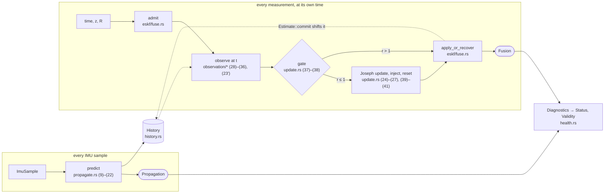
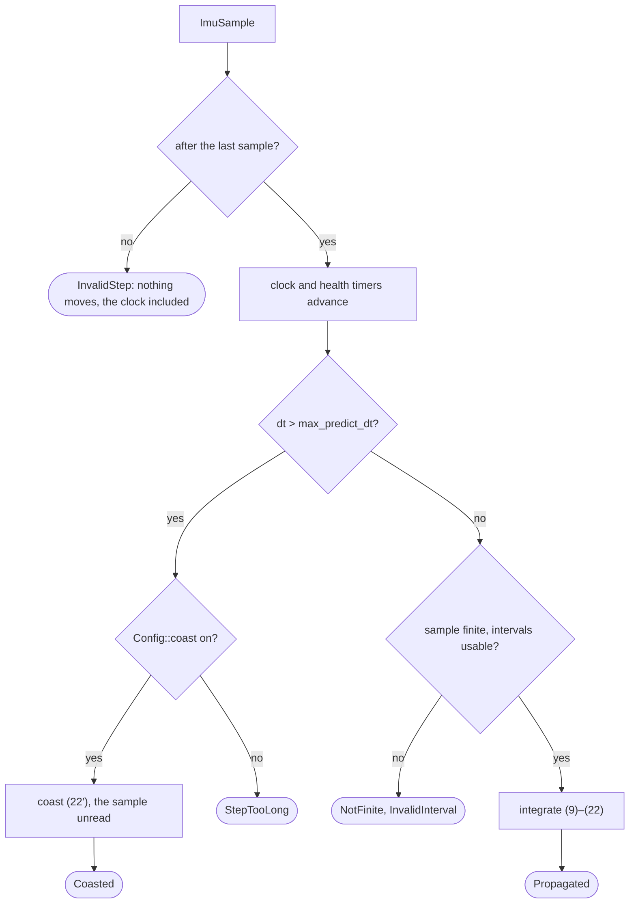

# Design

How `fusion-nav` is built and where its numbers come from. The documents, by question:
[README.md](README.md) is how to use the filter, [GOALS.md](GOALS.md) why it exists, this one how
it is built, [EQUATIONS.md](EQUATIONS.md) what it computes, and [GLOSSARY.md](GLOSSARY.md) what
the words mean.

> **Status:** every equation of `EQUATIONS.md` is built except two. Three-axis magnetometer
> fusion, (31)–(33), is out of scope. (5′)'s in-motion leveling term is measured and reported
> but not subtracted. Not built: #59.

## Architecture

Two paths carry a started filter. The IMU drives one on every sample. Each measurement drives
the other, fused against the state *at the time it was taken*. Both end in a typed outcome and
feed the health the estimate carries. The mathematics sits in the code, not behind an
abstraction: each step cites its equation, and the
[equation-to-code mapping](EQUATIONS.md#equation-to-code-mapping) names the function for each.



Each `fuse_*` refuses what cannot be fused before forming anything: a time outside the history,
a value that is not finite, a noise that is not positive. It adopts outright the first
measurement of a quantity the start never established. The gate runs before the gain, so a
rejection computes nothing it could commit. `apply_or_recover` is the one place every source
recovers through: it commits an accepted update, records a rejection, or adopts the measurement
when its source has been locked out past `Config::recovery`. Every correction it commits shifts
`History` through `Estimate::commit`.

Sensor drivers and hardware are outside the crate. The application supplies each measurement
with its time and its uncertainty.

### Module map

| module | holds |
| ------ | ----- |
| `src/eskf.rs` | `Eskf`, the whole public filter: its fields, `state`, the floor of (42′) every covariance passes through, and `Status` |
| `src/eskf/` | `Eskf`'s methods by topic, one `impl Eskf` each: `start` (`initialize*`), `site` (origin, declination, barometric reference), `predict`, `fuse` (the shared update path, GNSS and barometer), `heading`, `hold` (the standstill, and the position hold `predict` runs while unaided), `adopt` (`reset_*_to`, and the writers an adoption or a recovery commits), `validity`; `estimate`, the state and its history; `fixtures`, what the modules' tests share |
| `src/init.rs` | initialization types (`StaticSample`, `StaticWindow`, `Alignment`, `Coarse`, `InitError`) and the pure functions the `initialize*` methods commit |
| `src/propagate.rs` | `ImuSample`; equations (9)–(22), the coast of (22′), and `error_dynamics`, the `A` that (23′) carries `H` through |
| `src/history.rs` | the recent past of the nominal state, which a measurement is fused against at the time it was taken, equation (23′) |
| `src/update.rs` | the update every observation shares: (23)–(27) in Joseph form, the gate of (37)–(38), the injection and reset of (39)–(41) |
| `src/observation/` | one module per sensor forming `y`, `H` and `R_m`: `gnss.rs` (28)–(29) at the antenna, `baro.rs` (30), `mag.rs` (34)–(35) and (36′), `heading.rs` (36), (35′) and (35″); and `hold.rs`, the assumed (28″) and (29″) |
| `src/math.rs` | the primitives the equations share: `skew`, `exp_quat`, `wrap_pi`, and the symmetry enforcement of (42) |
| `src/state.rs` | `State`, `Covariance`, and `ErrorState`, whose order defines the covariance layout `[δp δv δθ δβa δβg]` |
| `src/health.rs` | `Propagation`, `Fusion`, `Status`, `Validity`, per-source diagnostics |
| `src/config.rs` | tuning; each default's doc comment says where its number came from or that it is a placeholder, and [Defaults and their evidence](#defaults-and-their-evidence) holds the measurements |
| `src/units.rs`, `src/frames.rs` | typed quantities and the sealed `Ned` / `Enu` / `Body` frame markers |
| `src/geodetic.rs` | `Geodetic` and `LocalOrigin`: the navigation origin the filter holds and the tangent plane about it, equations (43)–(44) |
| `src/magnetic.rs` | The WMM declination table `tools/declination.py` generates, and its lookup, behind the `magnetic-model` feature |
| `src/display.rs` | `Fixed`, which prints an `f32` without core's float formatting and so without a panic path |
| `src/lib.rs` | the crate root: `no_std` and the lint gates, and the prelude, the one list of public types, minus three names too generic to glob-import |

## Error-State Kalman Filter

The filter estimates the small error in a nominal state rather than the state itself, so attitude
can be a quaternion in the nominal state and three angles in the error: four quaternion components
are never treated as independent Kalman states, and the unit norm holds by construction.

| | position | velocity | attitude | accelerometer bias | gyroscope bias | total |
| --- | --- | --- | --- | --- | --- | --- |
| nominal state | 3 | 3 | 4, a quaternion | 3 | 3 | 16 |
| error state | 3, `δp` | 3, `δv` | 3, `δθ` | 3, `δβa` | 3, `δβg` | 15 |

`ErrorState`'s order is the covariance's. The barometric offset of (30′) sits beside it, never in
it, so the public 15 × 15 stays the navigation state's:

```text
          δp     δv     δθ     δβa    δβg          b
        ┌──────┬──────┬──────┬──────┬──────┐    ┌──────┐
  rows  │ 0–2  │ 3–5  │ 6–8  │ 9–11 │12–14 │    │ P_xb │  Offset: a column and a
        └──────┴──────┴──────┴──────┴──────┘    │ P_bb │  variance, propagated
         Covariance, 15 × 15, 900 bytes in f32  └──────┘  with P, updated in blocks
```

See [state definitions](EQUATIONS.md#state-definitions).

## State Propagation

The IMU drives propagation, the only path that runs on every sample. The gyroscope moves the
attitude; the accelerometer is rotated through it into the navigation frame, gravity is added, and
the result integrates into velocity and position, (12)–(15). The covariance is propagated
alongside on the linearized error-state dynamics.

What `predict` does with a sample, in the order it decides:



The step is a first-order discretization, good only over a short interval. One IMU sample
cannot describe a long gap, hence `Config::max_predict_dt`. A longer step is coasted by (22′):
position on the estimated velocity, `P` grown by `Config::coast`'s densities, so the covariance
prices the assumption. The timers advance either way, because the time passed.

`NotFinite` has to be refused at this boundary because nothing downstream can report it. A
non-finite rate reaches the quaternion through (15), which composes it unchecked, then the
covariance, where one NaN stays for the rest of the flight. The variant's doc comment says what
the two production estimators do here, and which of them checks.

See [nominal state propagation](EQUATIONS.md#nominal-state-propagation) and
[covariance propagation](EQUATIONS.md#covariance-propagation).

## Measurement Updates

Each source is its own update against its own gate, never part of one combined measurement. A
sensor that goes bad takes out the quantity it observes and nothing else. Health is per source
for the same reason.

See [observation models](EQUATIONS.md#observation-models) for the measurement Jacobians.

### Time and history

A measurement is fused at the `Timestamp` it carries. `observe` forms `y` against `History`'s
nominal state at that time and carries `H` to today's error through the error dynamics, (23′).
The correction lands on the current state. So the `Fusion` a call returns is the gate's verdict
on that measurement, not a promise of one later, as PX4's delayed horizon would make it
([measurement latency](GOALS.md#measurement-latency)).

`History` holds 32 entries 10 ms apart. Every correction shifts it through `Estimate::commit`.
`Estimate` holds the state and its history behind private fields, so its three writers (`commit`,
`step` for a propagation, `restart` for a start) are the only ones the compiler allows. A time
older than `LATENCY_HORIZON` is refused as `OutOfHorizon`; one slightly ahead of the state is
carried forward on the estimated velocity.

### GNSS Position

The filter owns the navigation origin, so it converts the fix itself: fix and estimate are then
relative to the same point by construction. `fuse_gnss_geodetic` takes latitude and longitude.
`fuse_gnss_position` is for positions that were never geodetic (a local RTK base, motion
capture), and is right only if the caller's origin is the filter's.

A fix is two measurements: (28)'s north–east rows under a `Gate<2>`, then its down row under a
`Gate<1>`. Each has its own `Fusion` in the returned `GnssFusion` and its own `SourceHealth`. A
receiver's height is the half that wanders and that another source disputes; one joint test
turns every such dispute into lost horizontal aiding ([measured](#gates)). PX4 runs GNSS
position and height as separate aid sources and ArduPilot gates them apart; `Gates` carries the
citations.

The first fix places the origin: under the estimate where there is one, or at the fix itself
after a start not at rest, where the fix is adopted rather than fused. See
[geodetic origin](EQUATIONS.md#geodetic-origin).

### GNSS Velocity

Velocity matters most between position fixes. Its error grows fast from accelerometer and
attitude error, and a velocity measurement constrains it directly rather than waiting for the
position error it would become.

At the antenna, (29′), rotation moves the antenna relative to the IMU. The observation therefore
reads the angular rate, and through it attitude and gyroscope bias: `H` has entries in `δθ` and
`δβg`, not only `δv`. PX4 corrects the measurement for the arm instead and leaves `H` alone;
[the decision](GOALS.md#sensor-offsets-as-per-call-arguments) has the comparison.

### Barometric Altitude

The barometer observes height when GNSS does not, and faster when it does.

Its reference is set by a window at rest, or read from the estimate at the first altitude after a
start that sets none. From then on it is estimated: an offset beside the 15-state covariance,
correlated with height, corrected whenever barometer and GNSS height disagree. It walks, so slow
drift (weather, ground effect, warm-up) is followed instead of becoming height error. `State` and
`Covariance` do not carry it. See
[barometric reference as an estimated offset](GOALS.md#barometric-reference-as-an-estimated-offset)
and [equation (30′)](EQUATIONS.md#barometric-offset).

### Heading

Gravity pins roll and pitch and says nothing about yaw. Without a heading source, yaw follows the
gyroscope bias wherever it goes. Three sources supply one, each through the scalar update of (36)
in `observation/heading.rs` under its own gate:

* a magnetometer, the source most vehicles carry;
* a dual-antenna GNSS receiver, (35′), a true heading no magnetic field can disturb;
* the course constraint (35″), for a vehicle that points where it goes. It ties the nose to the
  *estimated* velocity rather than to a GNSS velocity already fused, so a cross-track error is
  not counted twice.

See [heading from GNSS](EQUATIONS.md#heading-from-gnss).

#### The magnetometer

Fusion is **heading only**. The field is reduced to one scalar heading, leaving roll and pitch to
gravity, which determines them well. A magnetic disturbance then corrupts one state rather than
three, and the gate tests a one-dimensional quantity.

Three-axis field fusion, (31)–(33), is documented and not built. The filter carries no field or
magnetometer-bias states, so hard- and soft-iron calibration is the application's job. An
uncalibrated magnetometer gives a heading bias the filter cannot detect.

The filter *can* price the other half of the error. Reducing the field to a heading rotates it by
the attitude estimate, so a tilt error turns the heading by `tan δ` times as much: twice the tilt,
at the dip the corpus carries. The caller never sees that rotation, so its variance cannot
describe it; the filter adds it, (36′). It goes into `R`, not `H`. The heading becomes less
trusted without looking like an observation of the tilt that spoiled it, which a scalar carrying
3° of noise must not be allowed to correct.

See [magnetometer, heading only](EQUATIONS.md#magnetometer-heading-only).

### Holding tilt without aiding

Two observations make their `z` from an assumption, and both reuse a GNSS model rather than
adding one: (28″) is (28)'s horizontal rows against an anchor, (29″) is (29) against zero.

* **The position hold** has no caller. `predict` runs it after a committed step, once no GNSS
  position or velocity has been judged within `dead_reckoning_after` and the tilt σ has passed 3°,
  which is why it lives beside `fuse_stationary` in `eskf/hold.rs` and not in `fuse.rs`. Its
  verdicts reach `Diagnostics::position_hold` as any source's do, and the replay harness reads
  them back after each step, there being no call to hang a row on.
* **The standstill** is `fuse_stationary`, an ordinary `fuse_*` the application calls.

Neither counts toward `Status`, neither is adopted, and the hold keeps horizontal position and
velocity invalid, each until a measurement of it is accepted or adopted. See [holding tilt without aiding](EQUATIONS.md#holding-tilt-without-aiding),
and [the decision](GOALS.md#holding-tilt-without-aiding) for what it was measured against.

## Innovation Gating

Each source has its own gate, a chi-square test in the observation's degrees of freedom. One
mechanism covers GNSS glitches, barometer transients and magnetic interference. Rejections are
counted and exposed as typed outcomes, because a filter that silently discards everything looks like one that works.
See [innovation gating](EQUATIONS.md#innovation-gating).

### Measurement rejection

If the filter itself is wrong, correct measurements look inconsistent, all are rejected, and it
dead-reckons while looking confident: [gate lockout](EQUATIONS.md#gate-lockout). So
health is per source and carried on the estimate, and recovery is per source too: adoption, one
switch each in `Config::recovery`. The user-facing side is [README.md](README.md#health-reporting);
the reasoning is GOALS.md's
[rejection handling](GOALS.md#rejection-handling-recover-by-default-opt-out-per-source) and
[per-quantity validity](GOALS.md#per-quantity-validity-not-one-ladder).

## Embedded Design

`fusion-nav` is intended for the microcontrollers flight controllers run on. The implementation therefore favors:

* fixed-size matrices
* compile-time dimensions
* stack allocation
* no dynamic allocation
* deterministic execution time
* `no_std`
* no panics, [checked in CI](README.md#the-library-cannot-panic)
* explicit numerical types
* minimal dependencies

The only dependency is [`nalgebra`](https://crates.io/crates/nalgebra), `no_std` with its `libm`
feature, for fixed-size matrices and the quaternion. It fixes the MSRV at 1.89. It stays behind
the API: `nalgebra` is 0.x, every minor version a semver break, and a public `Vector3` would make
its upgrade this crate's. Vectors and the covariance cross as arrays, which convert to any
version's types. A quaternion crosses as a `Quaternion` with named fields, since libraries
disagree on the order of four numbers. [`defmt`](https://crates.io/crates/defmt) is the one
optional dependency, behind an off-by-default feature of the same name.

The covariance is 900 bytes in `f32`, and a Joseph update needs several temporaries its size. So
the working set is kilobytes, set by how temporaries are reused. It is measured, not estimated:
[validation/cost.md](validation/cost.md) publishes it per function, and what decided each form
[follows](#measured-cost-by-function). `state()` is small and `Copy` and `Status` carries no
payload, so reading either in a control loop costs nothing. Timing detail lives in
`diagnostics()`, off the hot path.

### Measured cost, by function

What the code costs now (sizes, stack frames and flash on both thumb targets) is
[validation/cost.md](validation/cost.md), rendered from the pins in `data/footprint.txt` and
checked in CI. This section holds what decided each function's form: the form taken against those
rejected, measured on builds that no longer exist, and figures nothing pins (host timings,
operation counts, flash measured by hand). A doc comment links here and keeps the one sentence of
why. Execution time and stack high-water on hardware are #41's, and land on the page.

#### Stack frames

Measured with `-Zemit-stack-sizes` at `opt-level = 3` by `tools/footprint.sh`, whose header says
how; `--all` prints every function's. A frame moves by tens of bytes with codegen that touches
nothing in it (adding `update::<1>` moved `reparameterize`'s share without a line of it changing).
So the figure that carries a decision is the *difference* against the rejected form. Figures are
`thumbv6m`'s, with `thumbv7em`'s in parentheses where measured too. A pair set against each other
was measured together, at the commit named where the code has moved since.

| function | against the rejected form |
| --- | --- |
| `update::<3>` | the offset of (30′) in blocks costs 968 over the fifteen-state update; the augmented 16 × 16 written out cost 4168 more (a 1024-byte matrix per 900-byte temporary, plus a copy in and out); (24′)'s second Cholesky factor costs 272 (64) |
| `update::<1>` | the second factor costs 320 (64) |
| `reparameterize` (in `update`) | the full `G P Gᵀ` cost 864 more of `update`'s frame |
| `fuse_gnss_velocity` → `update::<3>` | the crate's deepest path; `apply_or_recover` out of line sits beside `update` rather than above it. Inlined, it cost `fuse_gnss_velocity`'s frame 984 (2384 against 1400, a434a30); walked through the call graph at 9e3fcca, it costs `fuse_gnss_position`'s 1024 and moves the peak to a geodetic fix, 12272 against 11408 |
| `predict` → `hold_if_unaided` | run by `predict` after the step returns, with the step out of line in `propagate_or_coast`, so the hold's update sits beside propagation's frame rather than above it. Called inside `commit_step` instead, the chain went `predict` 2160, `commit_step` 984, `hold_if_unaided` 2304, `update::<2>` 7344: 14712 on `thumbv7em`, the crate's peak by 3.4 KB. Beside it, `predict`'s chain was 10584 (#210, measured together). The hold commits through `apply_or_recover` out of line: inlined `apply` was most of its 2304 |
| `Eskf::observe::<3>` | `Observation::delayed` 752 and `error_dynamics` 400 beneath it; inlined into `fuse_gnss_velocity` it put the high-water mark at 10800 against 9520 (a434a30), and walked at 9e3fcca at 11760 against 11408 |
| `Eskf::fuse_heading` | one frame for every heading source, its largest instance the magnetometer's; read by hand, the course's path through it peaked at 7872 against 7624 with `fuse_mag_heading` doing the work in a frame of its own (eaf3b81) |
| `Eskf::adopt_position`, `adopt_velocity` | inlined, +976 on `fuse_gnss_position` and +952 on `fuse_gnss_velocity`; out of line they follow `update` rather than stacking on it |
| `propagate_covariance` | the largest frame propagation reaches. Inlined into its one caller, the same three temporaries sit in `predict` |
| `project` | through `coast` the arming query's chain measured 9 KB, over `update::<3>` |
| `enforce_symmetry::<15>` | the equation form, `(P + Pᵀ)/2`, is 1884 (1820): two 15 × 15 temporaries under `predict`, where the sweep needs almost none |
| `init::initial_covariance` | a diagonal-only `P₀` inlined to 80 |
| `Eskf::initialize_coarse` | it holds a `StaticWindow` of one sample and the `Startup` worked out from it, both on its own frame |
| `History::clear` | rebuilding the ring put a 1552-byte temporary in `Eskf::apply_alignment` |
| `StaticWindow::halve` | a copy of the blocks is 512 bytes |

Walked through the call graph (`tools/footprint.py`, `chain.`), no path but an update moves the
crate's peak: `predict`, the arming query (`predicted_validity` over `project` over
`propagate_covariance`) and the starts all reach less. The path and its figures are on
[validation/cost.md](validation/cost.md#stack); the peak is comfortable on the STM32H7 class
above and more than the whole RAM of an 8 KB Cortex-M0 part.

The block-wise forms that would cut it are each written as the equation reads until #41's figures
say a target needs them:

* (22), where (20)'s identity and zero blocks make most of `F P Fᵀ` known;
* a coast, whose `F` is a four-term polynomial in `Δt`, since `ω = 0` makes the error dynamics
  nilpotent;
* a runtime `M` for `update` in place of a type parameter.

#### Sizes

`P` is passed by reference for its size, and `Covariance::to_rows` is a copy of it on the
caller's stack. `StaticWindow` is one size at any rate and length because it folds each sample in,
where a buffered 2 s window at 400 Hz is 800 `StaticSample`s of 80 bytes, 64 KB.

#### Flash

A measurement dimension is what costs flash, not a source: `update::<1>`, which the barometer
needs, cost 4.1 % of `.text` when it landed (b0bf1d5), and the magnetic heading of (34)–(36),
sharing it, 1204 bytes, 2.4 % (8799bd6). Measured by hand, and not pinned: the `magnetic-model`
table is 1408 bytes of `.rodata` and its lookup 1204 of `.text` (1704), about 2.6 KB, at
`opt-level = "s"`. The same lookup in `f64` linked 4496 bytes of `.text` in software doubles,
against 1096 for the `f32` one measured with it (14a668b).

#### Host timings

`cargo bench -p bench` times `predict`, every `fuse_*` and a start on an aided filter, each call
asserted fused before it is timed. Nothing gates on these: their use is a before-and-after on one
machine. Each timed measurement arrives a period after its source's last: at the same instant,
(24′) prices it at its ceiling and the update carries nothing, which the benchmarks refuse. On an
Apple M3 Max at the commit that added them, `predict` is 0.71 µs, a GNSS position 2.0 µs (2.2 µs as
latitude and longitude), a GNSS velocity 1.2 µs, each one-dimensional update 0.99 to 1.04 µs,
`StaticWindow::push` 34 ns and `initialize` 0.37 µs.

#### Arithmetic

| operation | cost |
| --- | --- |
| (22) as written, per IMU sample (up to 400 Hz) | of order 6750 multiplications and three 900-byte temporaries; a dense `Q` would add 900 bytes and 225 additions to add twelve numbers |
| `project` | ten runs of (22) at the default 1 s horizon, up to 64 |
| a coast | up to 64 runs landing on one step; 12 for a 1.2 s gap |
| `StaticWindow::push`, `f64` | 32 additions, 9 multiplications, 2 comparisons, a subtraction, 18 widenings (the barometer's share only on a fresh reading) |
| `StaticWindow::push`, `f32` | 27 operations: 7 divisions, 6 multiplications, 5 additions, 4 comparisons, 2 maxima, 2 square roots, a conversion |
| each `WindowNoise::BLOCK` closed | 7 additions, 6 multiplications and a division more, per sensor |

The window's counts are from the `thumbv6m` disassembly, less the merge a doubling adds. On a
core with no FPU each is a library call, paid only until the window commits.

## Defaults and their evidence

A default justified by data carries its deciding figure in its doc comment, in one sentence, and
links here for the rest: per-log breakdowns, tables, alternatives measured and rejected. Where
`GOALS.md` records a decision, the evidence sits with it instead. Each heading is the item's
name, so a comment's link names its subject. A figure is a measurement of the corpus and
scenarios as they stood when it was taken; where the corpus has grown since, the text says which
logs it covered.

### `ImuNoise`

**Bias walks.** Converting both estimators' per-step σ to a density is worth this much. Read
unconverted as a density, the accelerometer-bias walk is 33 times PX4's in σ, and on `2c42096b`,
grounded for two hours, where only `tilt · g + b_a` is observed, `σ_ba` grows to 0.63 m s⁻², the
bias estimate walks to 0.56 and drags tilt from 0.95° to a peak of 5.2°, against EKF2's 1.08°.
Converted, the ten-minute mean tilt holds between 0.89° and 1.11°, and the 2.5° peak is a 3.5 g
knock at 4757 s. PX4's own pair gives 2.4°. A ceiling on `σ_ba` at PX4's 0.35 gives 3.3° and a
clamp on the bias at its 0.4 gives 4.4°, and neither is reached once the walk is converted.

**White noise at ten times PX4's density**, because replay measured the factor being spent.
`accel_white` at 0.3× breaks the one thing each real source can say, and the simulator does not
need the factor:

* `2c42096b`, a real airframe vibrating on the ground, reads a tilt peak of 4.6° against 2.5°
  (EKF2 never leaves 1.08°), still 4.5° under PX4's `R` floors: the vibration needs it.
* `a299e722` ends `Degraded`, rejecting 493 velocity solutions against 283. PX4's floors cure it
  (43, `Healthy`): the receiver's raw `R` needs it.
* `gnss_latency` does not. Fused at the time each fix was taken, (23′), it reads `false_valid` 0
  at 0.3× as at 1×; fused as current, it read 888 at 0.3×.

`gyro_white` at 0.7× improves `tilt` and `yaw` on every scenario, but `harsh_imu`'s `nees_att`
crosses 1 (1.07), and `f16771dd` grows a 14.1° tilt at t = 51 s where EKF2 reads 2.6°. The
simulator's IMU is 58 times quieter than this figure, so the scenarios favoring less gyroscope
noise state the simulator's preference, not an airframe's.

**Against the floor the sensors measure**, `StaticWindow::noise`, on the worst axis of the nine
real logs whose window is still:

| sensor | floor | default over floor |
| --- | --- | --- |
| gyroscope | 8.4e-5 to 1.6e-3 rad s⁻¹/√Hz | 9 to 180 times |
| accelerometer | 1.5e-3 to 5.6e-2 m s⁻²/√Hz | 6 to 230 times |

`a299e722` is left out: its rows each average 2.5 ms while standing for 20 ms, so read `√8` high
until the converter's `# IMU averaging interval` corrects them. This is the factor measured from
below; a default under the floor would be the error. PX4's own densities, a tenth of the
defaults, come within reach of it: `2c42096b`'s accelerometer, a grounded airframe with props spinning, reads
1.6 times PX4's, and `f16771dd`'s gyroscope 1.1 times.

### `Gates`

**The split of a GNSS fix.** `2c42096b` is a stationary vehicle whose barometer and receiver
drift ~20 m apart in height; the 3945 of its 4616 fixes a joint `Gate<3>` rejects
([GNSS Position](#gnss-position)) each pass a `Gate<2>` of the horizontal pair at
`Percentile::P999`.

**The default percentile, 99.9 %.** GNSS position was replayed at 95 %, 99 %, 99.9 % and a 5σ
equivalent (`γ` = 31.81 at three degrees of freedom, the two-sided tail of 5σ in one), tested as
one joint three-axis `Gate<3>` rather than split. The percentile applies to both halves of the
split unchanged.

The corpus could not tell them apart when measured. No log rejected a fix at any of the four:
PX4's `eph` and `epv` are far wider than the innovations they come with. The mean test ratio at
95 % was 0.0023–0.0449 across the three logs then carrying GNSS, the largest 0.33, where a
consistent `R` would put the mean near 0.38. Those figures rise as the filter gains aiding: every
source that tightens `P` tightens `S = H P Hᵀ + R`, so the same innovation reads as a larger
ratio. `nis_gnss_pos=` on the `summary` line maintains this claim per log, pinned in
`data/manifest.txt`, as a distribution rather than a distance from a threshold that itself moves.

The simulator, whose GNSS errors are exactly the Gaussian `R` claims, prices the tight end. On
`mission`:

| percentile | good fixes rejected (of 915) | horizontal RMSE, m | vertical RMSE, m |
| --- | --- | --- | --- |
| 95 % | 30 | 0.716 | 0.796 |
| 99 % | 4 | 0.702 | 0.749 |
| 99.9 % | 1 | 0.702 | 0.749 |
| 5σ | 0 | 0.702 | 0.749 |

So 95 % buys worse accuracy, and one good fix in thirty turned away, against outliers nothing
there contains. Between 99.9 % and 5σ good data says nothing; hostile data (UrbanNav) found no
percentile that helps, so 99.9 % stands.

### `Coast`

Set at twice the smallest value either source with gaps at speed needed.

`4b473e91`, a VTOL at 30 m/s with eight logging dropouts of 1.0–3.1 s, sets both; in the
simulator any value passes. Refused, its gaps cost 12 recoveries, 39 rejected positions and 28
velocities. Coasted with `rotation` at zero, the first fix after every gap is accepted at any
`acceleration`, and what follows is not. The course turns 44° across the 3.1 s gap at 954 s. The
heading innovation then sits at −0.60 rad under an `S` that did not grow, and the stale heading
steers velocity off until the gate turns it down (7 recoveries at `acceleration` 1.0).

| `acceleration` | `rotation` needed |
| --- | --- |
| 2.0 | 0.02 or more: no gap causes a rejection or a recovery |
| 1.0 | 0.1 |
| 0.5 | none suffices: 7 recoveries at any value |

Fixes timestamped inside a gap, ahead of the state until the IMU sample that ends it, are refused
as `Fusion::OutOfHorizon`; the log reads `rejected_gnss_pos=0 rejected_gnss_vel=0`.

`logging_dropout` (1.2 s at 20 m/s in a turn) passes at `acceleration` 0.5 or more at any
`rotation`, and reads the same across the range: `pos_h_max` 23.25 m refused, 2.74 m coasted;
`false_valid` 1946 refused, 0 coasted.


`replay --derive` asks the same question one field at a time, the other at its default. It finds
the smallest multiple of each after which no GNSS position or velocity is rejected or adopted for
10 s past each gap, and prints twice the largest a gap needed. On `4b473e91` six of eight gaps
need neither field's noise. The two longest, late in the flight, need some: 2.66 s at 772 s half
the default `acceleration`; 3.12 s at 954 s all of it and a quarter of the `rotation`. So the tool
prints 4.0 and 0.05 there: by its 10 s test the default `acceleration` has no margin on its own
log, and the default `rotation` is twice what it prints. `2b2ad123`'s gaps need neither field;
`f16771dd` has no GNSS after its gaps to say. Both keep the default.

### `Hold`

The position hold of (28″): σ 10 m, PX4's and ArduPilot's default; engaged past the 3° tilt σ PX4
reads; fused at (24′) with `τ` = 2 s. Each choice was measured on `gnss_outage` (20 s without
GNSS over the circuit's fastest turns), `hover_outage` (90 s without GNSS in a hover drifting
27 m) and the corpus's two logs with no GNSS, `f16771dd` (EKF2's reference, which runs PX4's hold)
and `7592c9b2` (LPE's). Scenario figures are one seed's `score` line; ANEES is 50 seeds.

The tables hold two builds. The shipped rows (no hold; the gate with (24′) at 2 s; `τ` 2 s;
UrbanNav's first two columns), the white hold behind the gate and the whole σ table are measured
on the hold as it ships. Every other row was measured on the build before its review, which kept the 0.2 s
interval across a release and latched validity and recovery per quantity, and on which the
shipped rows read within 1.5 % of these, UrbanNav's F9P `nees_pos` excepted: 27 there, 32.01
here. Compare a rejected row with the shipped one for its direction, not its last digit.

The forms, at 10 m, on one seed:

| form | `gnss_outage` tilt | `false_valid_att` | `hover_outage` `pos_h` | attitude lost |
| --- | --- | --- | --- | --- |
| no hold | 0.340° | 0 | 36.42 m | 25.32 s |
| white, from the first unaided step | 2.682° | 3092 | 11.23 m | never |
| white, PX4's gate and velocity reset | 0.936° | 112 | 10.50 m | never |
| white, PX4's gate | 0.344° | 0 | 37.97 m | never |
| PX4's gate, (24′) at 2 s | 0.342° | 0 | 7.670 m | 35.72 s |

The white forms are overconfident where it matters. Behind the gate, 50 seeds of `hover_outage`
read `anees_pos` 61.00, `over_vel` 0.24 and `any_att` 40, the last at GNSS's return, against
bounds every block of the no-hold filter meets. (24′) prices one assumption read five times a
second as one error:

| `τ` | `hover_outage` `anees_pos` | attitude lost | `f16771dd` tilt to EKF2 | `7592c9b2` tilt to LPE |
| --- | --- | --- | --- | --- |
| white | 61.00 (fails) | never | 0.668° | 0.749° |
| 1 s | 46.06 (fails) | never | 0.749° | 0.749° |
| 2 s | 0.41 | 35.72 s | 0.922° | 0.252° |
| 5 s | 0.24 | 30.72 s | 0.984° | 0.287° |
| 60 s | passes | 27.95 s | 1.184° | 0.398° |

With no hold the two logs read 1.729° and 0.750°. 2 s is the shortest `τ` measured that passes,
and the most accurate that does. At 1 s the hold is strong enough to pull tilt σ back under 3°
and release, 106 holds against 382 at 2 s on that build; why that leaves the ensemble overconfident is not
established. Latched instead, held until aiding returns, `gnss_outage` failed every block
(`any_pos` 1794 at 2 s).

σ under the gate and (24′):

| σ | `hover_outage` `pos_h` | `gnss_outage` holds, `pos_h` | ANEES | `f16771dd` tilt | `7592c9b2` tilt |
| --- | --- | --- | --- | --- | --- |
| 3 m | 38.56 m | 3, 1.787 m | `hover_outage` fails (`over_pos` 0.47) | 0.676° | 0.749° |
| 10 m | 7.670 m | 6, 1.680 m | passes | 0.922° | 0.252° |
| 30 m | 10.68 m | 59, 12.76 m | `gnss_outage` fails (`any_pos` 734) | 1.084° | 0.342° |

On UrbanNav's car, which keeps driving through its gaps, the hold is the wrong assumption. Engaging
only while `v̂ᵀ P_vv⁻¹ v̂` read the horizontal velocity as consistent with zero moved nothing on the
simulator or the corpus, whose unaided vehicles are near still, and worsened the car:

| run | no hold | the hold | velocity at P95, engagement | velocity at P999, every fusion |
| --- | --- | --- | --- | --- |
| F9P `pos_h` | 334.2 m | 123.8 m | 105.0 m | 334.2 m |
| F9P `nees_pos` | 1.016 | 32.01 | 17.86 | 87.58 |
| F9P tilt | 1.398° | 1.702° | 2.127° | 1.404° |
| M8T `pos_h` | 254.5 m | 212.6 m | 278.8 m | 249.1 m |
| M8T without recovery, `pos_h` | 407.6 m | 945.4 m | 9583 m | 9811 m |

Engaged on acceptance rather than on silence, the hold ran through `7ce66f0d`'s rejection runs
and recoveries went from 27 to 62 (white, from the first unaided step), with tilt to EKF2
3.61° → 5.75°. Read on silence it holds there once and moves nothing.

### `Correlation`

`replay --derive` reads `τ = −T / ln ρ` per source from the lag-one autocorrelation of its
innovations with every source fused white, where `ρ` clears `2/√n` and `T` is the median interval
between the source's rows. On the `correlated` scenario, seed 1, whose sources are drawn at known
`τ`, that reading is 3 to 6 times short:

| source | scenario's τ, s | read, s |
| ------ | --------------- | ------- |
| GNSS position | 23 | 4.5 |
| GNSS height | 106 | 17 |
| GNSS velocity | 0.43 | 0.11 |
| barometer | 1.3 | 0.39 |
| magnetometer | 3.3 | 0.87 |

The innovations' autocorrelation decays faster than the error's at every lag out to twelve, and
not by a constant factor, so a ratio of lags is short too. Position consistency under each
choice of `τ`:

| `τ` | `correlated`, 50 seeds, `anees_pos` | INSANE, three sequences, `nees_pos` |
| --- | --- | --- |
| defaults | 1.09 | 0.23, 0.21, 0.23 |
| read | 3.03 | 0.24, 0.58, 0.40 |
| `max(default, read)` | 1.09 | 0.19, 0.21, 0.23 |
| scenario's own | 0.88 | — |

So `--derive` raises a source's `τ` where the reading exceeds the default, and otherwise prints
the default. An estimator the filter does not bias is #195. The defaults themselves are GOALS.md's,
"Where the defaults come from".

### `baro_offset_walk`

`replay --derive` fits `D(L) = c + q² L`, the mean squared change of barometric altitude plus
GNSS down over a lag `L`, at eight lags from a shortest one to four times it, and prints `q`
where the two overlap for half an hour. GNSS height's own correlated error lifts `D` to a plateau
over a few of its `τ`, so the shortest lag is ten of that `τ` as the derived `Config` holds it,
and a minute at least. On `2c42096b`, `D` climbs to 27 m² by 120 s, holds near 40 m² from 360 to
900 s, and grows linearly past 1200 s at `√(D/L)` 0.20; a slope read at 60 to 240 s, inside the
plateau, reported its rise as a walk of 0.30 (`7ce66f0d`'s read 0.20 the same way).

`cargo test --example replay -- --ignored drift_scatter --nocapture` measures the estimate on
simulated walks of known density with white noise on top, 40 seeds each: from a 60 s lag it
scatters ±37 % over 20 min, ±25 % over 30 min, ±22 % over 1 h and ±11 % over 2 h; from 780 s
over 2 h, ±46 %, and three seeds resolved no walk. Reading out to half the span instead scattered
±37 % to ±49 % and read low. GNSS height's own wander is in the slope, so `q` is an upper bound
on the barometer's.

`2c42096b`, 7126 s, reads 0.21 from 780 s, its barometer climbing 22.9 m on GNSS height first
minute to last, against PX4's 0.13 and inside the ±46 % its lags allow; the log rejects no GNSS
height at either, 7 at 0.05 and 14 at zero. `7ce66f0d`, 1942 s, reads 0.081 from 140 s, under the
default, and that walk turns down 24 GNSS heights against 17 at the default. No other corpus log
overlaps for half an hour.

### `max_predict_dt`

`replay --derive` sorts the IMU intervals after the first epoch, as `predict` differences them in
whole microseconds. Intervals are ordinary up to the first step of five times or more. On the
corpus:

| log | longest ordinary interval after the start | step from ordinary to dropout |
| --- | --- | --- |
| `2c42096b` | 90.5 ms | no dropout |
| `7592c9b2` | 64.8 ms | no dropout |
| `285ee2e7` | 25.2 ms | no dropout |
| `f16771dd` | 22.6 ms or less | 17.0× (20 → 340 ms) |
| `2b2ad123` | 22.6 ms or less | 18.5× (the smallest dropout, 121.5 ms) |
| `4b473e91` | 22.6 ms or less | 100× |
| the other seven | 22.6 ms or less | no dropout |

The widest step among ordinary intervals is 4.9×, on `f16771dd` (4.1 → 20.0 ms, inside its
dropout cluster at 36.9 s), so the five-times rule separates the two on every log.

It prints the longest ordinary interval with 10 % margin, never below the default, which covers
every corpus log. It replays the log under that value: the steps it coasts match the intervals
over it on all thirteen. Where the default sits above the ordinary tail, it counts the dropouts
the default integrates as one step that a limit at the tail would coast: none on the corpus. The
same bound limits how far a measurement is carried forward.

PX4 (`estimator_interface.cpp:103-108`, `ekf.cpp:154-157` at `c4e4ef98e9`) and ArduPilot
(`AP_NavEKF3_core.cpp:1053` at `368dc0c428`) bound the step at twice a fixed downsampled period
of 10 and 12 ms and clamp rather than coast, an absolute ~20 ms. This filter integrates the raw
samples, whose ordinary worst runs to 18 times their median.

### `Initialization`

**Stationarity tolerances**, PX4 EKF2's 15°/s and 20 % of gravity, chosen against the five logs
the corpus held then. Tighter ones fail parked vehicles: at 0.05 rad s⁻¹ and 0.5 m s⁻², four of
those five were called moving while sitting on the ground, on peaks of 0.026–0.172 rad s⁻¹ and
0.15–1.04 m s⁻² that are idle vibration and prop wash, not motion. A tolerance that calls a
parked quadrotor moving does not protect the alignment, it just denies it. At these values four of
the five aligned statically, and the fifth, peak deviation 6.2 m s⁻², stayed coarse, correctly:
6 m s⁻² is a vehicle being handled, not a vehicle vibrating.

**`sigma_accel_bias`, 0.2 m/s².** At 0.1 the `harsh_imu` scenario's 0.186 m/s² sat at 1.86σ, and
its attitude was overconfident on 50 seeds wherever (24′) did not inflate the covariance past it:
2281 epochs over the family-wise bound at `Correlation::WHITE`, none at 0.2 with the
correlation. On the corpus it is worth most on `7ce66f0d`, the hand launch leveled 12° wrong: when
measured, 28 recoveries against 69 at 0.1, and aligned at 17.7 s rather than 32.7.

**The gyroscope bias at rest, the window's mean weighed against the prior.** Checked against
EKF2's bias 10 s after the start, with the Earth's rotation taken out in body axes at the start's
attitude. On eight of the nine real logs that start at rest and log an EKF2 bias, the window's
average agrees to 3.4 × 10⁻⁴ rad/s RMS per axis, under EKF2's own σ there (3–7 × 10⁻⁴). So the
corpus bounds a shift between ground and air at about that, and cannot resolve the floor beneath.
The ninth is `a299e722`, whose rows each average 2.5 ms of 20: 2.1 × 10⁻³ and −3.0 × 10⁻³ rad/s
off on x and z, still so at +120 s, an offset in every sample its blocks' scatter cannot see.

Against a 0.01 rad/s prior on every start:

| measure | window's mean | 0.01 rad/s |
| --- | --- | --- |
| `mission` yaw, 30 seeds | 0.332°, bias error halved | 0.382° |
| `flight` tilt, 30 seeds | 0.620° | 0.823° |
| `flight` horizontal position, 30 seeds | 1.17 m | 1.47 m |
| `harsh_imu` yaw, 30 seeds (bias walks at nearly twice the filter's rate) | 1.027° | 0.953° |
| attitude ANEES, 50 seeds, `harsh_imu` (every scenario within 0.03) | 0.140 | 0.117 |
| unaided tilt held, `7592c9b2` | 10.32 s | 3.88 s |
| unaided tilt held, `f16771dd` | 9.83 s | 3.84 s |
| `a299e722` GNSS velocity rejections (its tilt never lost with the window's mean) | 324 | 315 |

On those windows the mean's variance `R` is, on the worst axis, 1/36 of the 0.01 rad/s prior's
on `2c42096b`'s 0.8 s window to 1/25000 on `7592c9b2`'s. So `K`, the share of `ω̄` (7) takes,
runs from 0.973 to 1.000: below 0.99 on `2c42096b`, `3949f175` and `f16771dd`.

**`sigma_gyro_bias`, 0.01 rad/s, the prior a start in motion keeps.** PX4's 0.1 and ArduPilot's
2.5°/s were both measured on the corpus's coarse starts and `moving_start`, and both cost:

```text
                         0.01     0.044     0.1
7ce66f0d  rejected       4877      5602    58157
          recovered        27        37      932
          aligned_at    31.53     16.33    10.23
cd7e0001  attitude_lost never      1.24     0.47
moving_start  yaw (°)    1.494     1.664    2.048
          aligned_at     3.40      8.16    11.41
```

A wide prior lets a coarse start read its attitude error as bias. The biases it has to cover are
small: EKF2's per-log medians on the corpus are 1.2 × 10⁻³ rad/s RMS over the axes, none past
4.5 × 10⁻³ (`2b2ad123`'s z).

### `FLOOR`

The floor of (42′) is PX4's values, and they sit below anything an honest source drives the
filter to. Across the thirteen logs of `data/manifest.txt` and every scenario in
`examples/simulate.rs` but `lever_arm`, the smallest variance each state reaches at an epoch:

| state | smallest variance | where |
| --- | --- | --- |
| position | 1.9e-4 m² | `89a498ce`, an RTK receiver |
| gyroscope bias | 1.7e-6 (rad/s)², the bias walk's steady state | six logs |
| attitude | 9.0e-5 rad² | `gnss_heading` |
| accelerometer bias | 7.3e-4 (m s⁻²)² | `093e806a` |
| velocity | 5.6e-4 (m/s)² | `cd7e0001` |

That is two to six decades of headroom, so `Diagnostics::floored` reads zero on all thirteen
logs. That includes `cd7e0001`, whose receiver reports a 0.43 mm/s velocity after touchdown and
is fused raw. Measured as σ² from the replay output's six-decimal σ columns.

### `PROJECTION_STEP`

Measured against the same horizon propagated at 100 Hz, as the fraction of the position
*variance* the projection reaches:

```text
 horizon    0.2 s step   0.1 s step   0.05 s step
   1 s        0.989        0.994        0.997
   2 s        0.953        0.977        0.989
   5 s        0.873        0.938        0.953
```

0.1 s is where that stops buying much per step: it holds the projection within 6.5 % of the
variance, 3.2 % of the sigma, out to a 5 s horizon.

### `MAX_PROJECTION_STEPS`

Past 64 steps of `PROJECTION_STEP`, 6.4 s, a horizon is projected in 64 longer steps. Position
variance against the same 100 Hz reference: 0.950 at 6.4 s, 0.935 at 10 s, 0.913 at 30 s, 0.907
at 60 s, 0.902 at 120 s. So a horizon of minutes is answered about 10 % optimistic in the
variance, 5 % in the sigma, where a 5 s horizon at `PROJECTION_STEP` is 6.5 % and 3.2 %.

### `WindowNoise`

**Blocks rather than samples** (`Density`, equation (8″)). On each real log's window, the rows
the filter started on (`a299e722` aside, its rows averaging 2.5 ms of 20), the lag-one
autocorrelation runs from −0.98 to +0.96 across the axes. On the worst axis, one sample's
scatter reads `093e806a`'s accelerometer 6.0 times the blocks' figure and `4b473e91`'s 2.9:
vibration aliased near the sample rate, which cancels within a block. It reads `89a498ce`'s
gyroscope 2.9 times low: filtered or rocking noise, which accumulates. Correcting one sample's
scatter by `(1 + ρ)/(1 − ρ)`, as (24′) does for a source, still misses the blocks' figure by up to
3.3× on the same windows (`89a498ce`'s accelerometer), and 6.5× on the simulated `3949f175`,
whose `ρ` nears one.

**`BLOCK`, 50 ms.** At 25 ms the aliasing is still being read (`093e806a`'s accelerometer
4.8e-3 m s⁻²/√Hz against 1.7e-3 at 50 ms). Past 50 ms the figure is not settled either, and that
is its real uncertainty, larger than the ±11 % of its 40 blocks: across 50, 100 and 125 ms the
worst-axis figures of the seven real logs whose windows hold nine blocks at all three move by up
to 2.3× (`4b473e91`'s accelerometer), 2.2× (`f16771dd`'s gyroscope) and 1.8× (`285ee2e7`'s
accelerometer), the other eleven by under 1.5×: noise that is not white below 20 Hz either.

**`MIN_READINGS`, and why `α₀` does not wait for it.** Holding `α₀` to nine readings was
measured: it moves `2c42096b` (six readings in its 0.80 s), `4b473e91` (seven) and `eb799954`
(four) to a reference read from the estimate, moving no rejection or transition count, and leaves
the corpus no real vehicle whose short still start sets its own reference, where these three were
all of them.

**The barometer's figure is a floor.** Fused as `R_m` in place of the 2 m the converter
substitutes, it takes `nis_baro` past 1 on five of the six real logs that report it (1.54 to
34.56, against 1 for an `R` the residuals agree with), and the gate refuses 45 to 1976 readings on
each of those five.

### `BLOCKS`

Eight blocks, measured against an exact split: 4096 blocks, which no window the replay harness
builds fills, and which reproduces every scenario and corpus output byte for byte. The halves'
disagreement on the coarse starts, exact against 8 blocks:

| start | tilt, exact | tilt, 8 blocks | heading, exact | heading, 8 blocks |
| --- | --- | --- | --- | --- |
| `7ce66f0d` | 26.50° | 22.45° | 26.27° | 27.13° |
| `cd7e0001` | 0.29° | 0.50° | 1.27° | 1.70° |
| `moving_start` | 0.00° | 0.02° | 12.23° | 11.94° |

The outputs barely move, because the disagreement reaches only `coarse_sigmas`, and only where it
is the largest bound. At 8 blocks and at 16, one corpus log, `7ce66f0d`, moves by one in the last
printed digit of three innovation keys, and no scenario moves.

## Scope

What the filter leaves out, and why, is [GOALS.md](GOALS.md#non-goals)'s to decide: adding one is
a change to that decision, not an implementation task.

## Staging the implementation

`EQUATIONS.md` was built in stages, each verifiable on its own before the next built on it. Four
constraints set the order, none of them the order the equations are numbered in, and each still
applies to new work.

**Verification leads the mathematics.** The seeded simulator, the scoring against its truth and
the ratcheted ceilings (`examples/simulate.rs`, the `score` line, `data/scenarios.txt`) exist
before the equation they measure, so a change has acceptance criteria when it lands rather than
an audit afterwards. The other order is worse than slower: an equation eyeballed once becomes the
baseline everything later is compared against. Nominal propagation (9)–(15) moved every ceiling,
in both directions, and separated `harsh_imu` from `mission`, neither of which a reading of the
diff would have shown.

**A key is pinned before the behavior it counts exists.** `data/manifest.txt` matches the
`summary` line and nothing else, so a behavior with no key on that line lands entirely unpinned.
A key whose value is trivially constant still fixes the baseline its first real value is read
against, so a statistic is defined before there are values to put in it. `rejected=` read zero on
every log while each `fuse_*` was a stub, and the first velocity fusion's 284 of one log's 609
solutions arrived as a diff against that pinned zero.

**`-D warnings` decides what can land alone.** The generic update of (23)–(28) has no caller of
its own (an observation model is what calls it), so a module holding it and nothing else fails
the build. A primitive ships with its first user.

**A covariance that moves invalidates a bar set against one that did not.** While `P` was
constant, a `Config::accuracy` threshold equal to the `Initialization` prior it is compared against
passed by exactly zero margin, and the first real `predict` took it away; `Accuracy`'s doc comment
records what that read on the corpus. A mission bar and an alignment prior are two numbers with two
justifications even where they are numerically equal.

## References

The architecture is informed by established error-state inertial-navigation literature and
production UAV estimators, including PX4 EKF2 and ArduPilot EK3.

Those two are read as source rather than as documentation (defaults in
`src/modules/ekf2/EKF/common.h`, alignment in `EKF/ekf.cpp`, the status model in
`filter_control_status_u`, and ArduPilot's equivalents), because published figures drift from what
the code does. `fusion-nav` is an independent Rust implementation rather than a source-code port
of either.

The mathematical formulation follows J. Solà, *Quaternion kinematics for the error-state Kalman
filter* ([arXiv:1711.02508](https://arxiv.org/abs/1711.02508)), which is the primary source for
the error-state formulation and its Jacobians. Full reference list in
[EQUATIONS.md](EQUATIONS.md#references).
