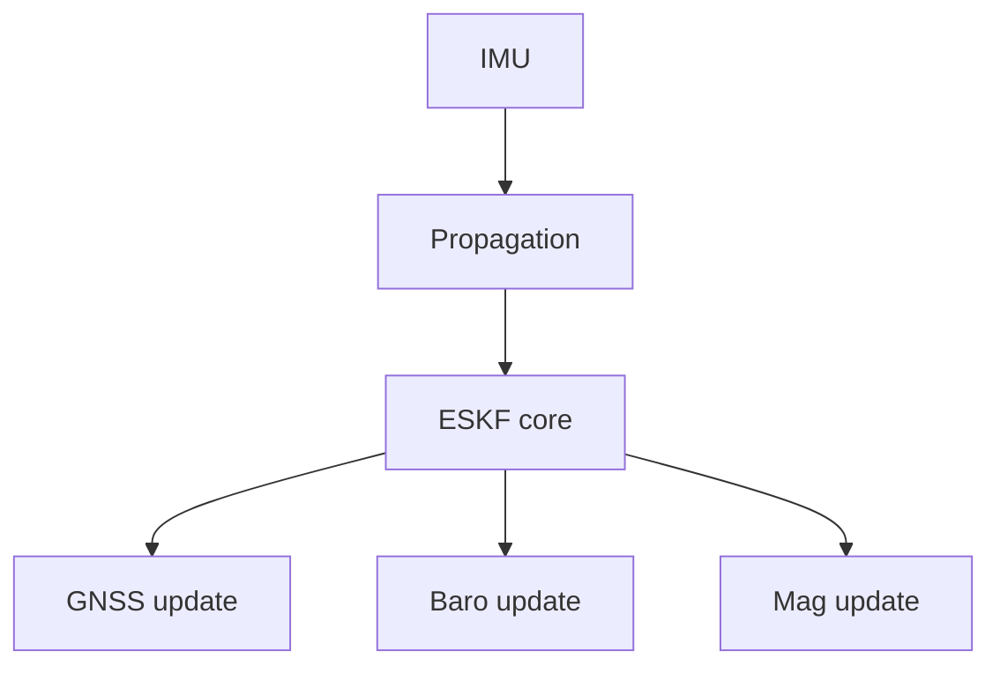
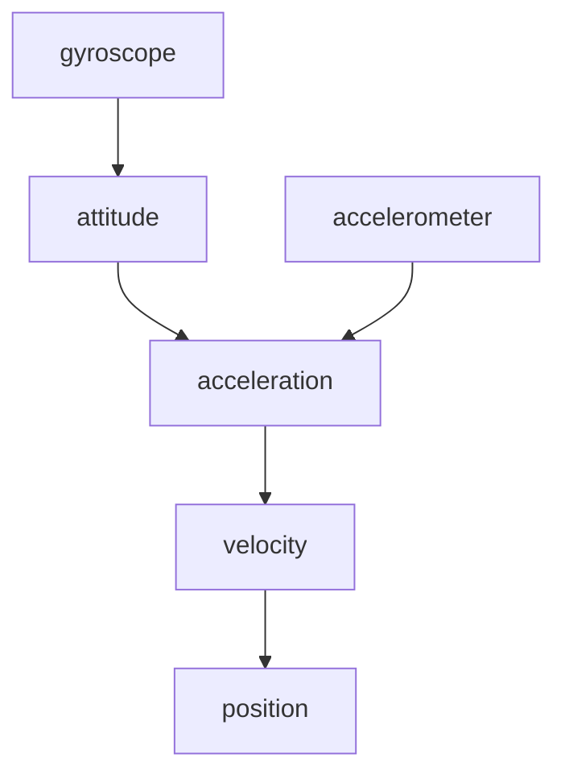
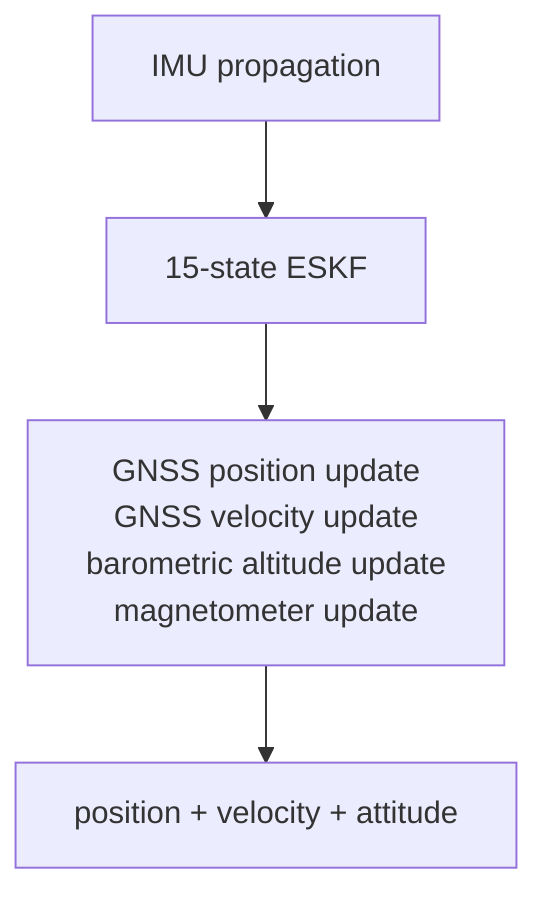

# Design

How `fusion-nav` is built and why. For how to use it see [README.md](README.md); for the
mathematics see [EQUATIONS.md](EQUATIONS.md); for positioning and decisions already made see
[GOALS.md](GOALS.md).

> **Status: complete and aided by GNSS position and velocity, the barometer and magnetic
> heading.** The structure below is built, not intended: initialization, equations (5)–(8);
> nominal propagation, (9)–(15), and covariance propagation, (16)–(22); the measurement update,
> (23)–(30), (34)–(36) with the levelling variance (36′), and (37)–(41), wired to every source
> the crate carries; and the conditioning of (42) and (42′). Two are not implemented: three-axis
> magnetometer fusion, (31)–(33), which is out of scope rather than pending, and (5′), whose
> in-motion levelling term is measured and reported but not yet subtracted.

## Error-State Kalman Filter

`fusion-nav` uses an Error-State Kalman Filter rather than representing the complete navigation
state directly in the Kalman filter.

The nominal navigation state is

| nominal state       | dimension |
| ------------------- | --------- |
| position            | 3         |
| velocity            | 3         |
| attitude quaternion | 4         |
| accelerometer bias  | 3         |
| gyroscope bias      | 3         |
| **total**           | **16**    |

The corresponding error state is

| error state        | dimension |
| ------------------ | --------- |
| position error     | 3         |
| velocity error     | 3         |
| attitude error     | 3         |
| accelerometer bias | 3         |
| gyroscope bias     | 3         |
| **total**          | **15**    |

The filter therefore maintains a `15 × 15` error covariance matrix while orientation is
represented by a quaternion in the nominal state.

Using a three-dimensional attitude error avoids treating the four quaternion components as
independent Kalman states and preserves the unit-quaternion constraint naturally.

See [state definitions](EQUATIONS.md#state-definitions).

## Architecture

The filter is intentionally sensor-independent at its core.

Sensor drivers and hardware interfaces are outside the scope of the crate. Applications provide
measurements together with their associated uncertainty.

### Module map

| module | holds |
| ------ | ----- |
| `src/eskf.rs` | `Eskf`, the whole public filter: `initialize*`, `predict`, `fuse_*`, `state`, `reset_*_to` |
| `src/init.rs` | initialization types (`StaticSample`, `StaticWindow`, `Alignment`, `Coarse`, `InitError`) and the pure functions the `initialize*` methods commit |
| `src/propagate.rs` | `ImuSample`; equations (9)–(22) land here |
| `src/history.rs` | the recent past of the nominal state, which a measurement is fused against at the time it was taken, equation (23′) |
| `src/math.rs` | the primitives the equations share: `skew`, `exp_quat`, `wrap_pi`, and the symmetry enforcement of (42) |
| `src/state.rs` | `State`, `Covariance`, and `ErrorState`, whose order defines the covariance layout `[δp δv δθ δβa δβg]` |
| `src/health.rs` | `Propagation`, `Fusion`, `Status`, `Validity`, per-source diagnostics |
| `src/config.rs` | tuning; each default's doc comment records its evidence or says it is a placeholder |
| `src/units.rs`, `src/frames.rs` | typed quantities and the sealed `Ned` / `Enu` / `Body` frame markers |
| `src/geodetic.rs` | `Geodetic` and `LocalOrigin`: the navigation origin the filter holds and the tangent plane about it, equations (43)–(44) |
| `src/lib.rs` | the crate root: `no_std` and the lint gates, and the prelude — the one list of public types, minus three names too generic to glob-import |

The [equation-to-code mapping](EQUATIONS.md#equation-to-code-mapping) names the function
intended to implement each numbered equation, including modules not yet written.

## State Propagation

The IMU drives propagation, and it is the only path that runs on every sample: gyroscope to
attitude, accelerometer through that attitude into the navigation frame, gravity added, the
result integrated into velocity and position. Equations (12)–(15) have the form.

What matters here rather than in the equations is that this is a first-order discretization over
a short interval, which is why `Config::max_predict_dt` exists: one IMU sample cannot describe a
long gap, so `predict` refuses a step beyond the limit instead of producing a number that looks
like an estimate. The health timers advance through the refusal, because the time passed whether
or not the state moved.

A sample carrying a NaN or an infinity is refused the same way, timers included, as
`Propagation::NotFinite`. It has to be refused at this boundary because nothing downstream can
report it: a non-finite rate reaches the quaternion through (15), which composes it unchecked,
and then the covariance, where one NaN stays for the rest of the flight. The variant documents
what the two production estimators do here, and which of them checks.

The covariance is propagated alongside the nominal state using the linearized error-state
dynamics.

See [nominal state propagation](EQUATIONS.md#nominal-state-propagation) and
[covariance propagation](EQUATIONS.md#covariance-propagation).

## Measurement Updates

Each source is fused as its own update against its own gate, rather than assembled into one
combined measurement: a sensor that goes bad takes out the quantity it observes and nothing else,
and the health that follows is per source for the same reason.

See [observation models](EQUATIONS.md#observation-models) for the measurement Jacobians.

### GNSS Position

The filter converts the fix rather than accepting a converted one, because it owns the navigation
origin: the fix and the estimate are then relative to the same point by construction.
`fuse_gnss_geodetic` takes latitude and longitude and converts about that origin;
`fuse_gnss_position` is for a caller whose positions were never geodetic — a local RTK base,
motion capture — and is right only if the caller's origin is the filter's.

A fix is fused as two measurements rather than one: (28)'s north–east rows under a `Gate<2>`,
then its down row under a `Gate<1>`, each with its own `Fusion` in the `GnssFusion` returned and
its own `SourceHealth`. A receiver's height is the half that wanders and the half another source
disputes, and one joint test turns every such dispute into lost horizontal aiding — on
`2c42096b`, with its barometer fused, 3945 of 4616 fixes, every one of them vertical. PX4 runs
GNSS position and GNSS height as separate aid sources and ArduPilot gates them apart; `Gates`
carries the citations and the measurement.

The first fix places the origin, under the estimate where there is one, and at the fix itself
after a start whose window did not show the vehicle at rest, where it is adopted rather than
fused. See
[geodetic origin](EQUATIONS.md#geodetic-origin).

### GNSS Velocity

Velocity is the observation that matters most between position fixes: velocity error accumulates
rapidly from accelerometer and attitude error, and a velocity measurement constrains it directly
rather than waiting for the position error it would become.

### Barometric Altitude

Barometric altitude is the vertical observation that is available when GNSS is not, and at a
higher rate when it is.

The barometer reference is captured at initialization and estimated from then on: its error is
an offset carried beside the 15-state covariance, correlated with height and corrected whenever
a barometer and a GNSS height disagree, and it walks so that slow drift — weather, ground effect,
sensor warm-up — can be followed rather than becoming vertical position error. `State` and
`Covariance` do not carry it. See
[barometric reference as an estimated offset](GOALS.md#barometric-reference-as-an-estimated-offset)
and [equation (30′)](EQUATIONS.md#barometric-offset).

### Magnetometer

The magnetometer is the heading source most vehicles carry. Gravity pins roll and pitch and says
nothing about the rotation about them, so without a heading source yaw follows the gyroscope bias
wherever it goes. The other two are a dual-antenna GNSS heading and, for a vehicle that points
where it goes, the course constraint: [heading from GNSS](EQUATIONS.md#heading-from-gnss).

Fusion is **heading only** by default: the field is reduced to a single scalar heading and fused
as one measurement, leaving roll and pitch to gravity where they are well determined. A magnetic
disturbance can then corrupt one state rather than three, and the innovation gate has a
one-dimensional quantity to act on.

Three-axis field fusion is documented for completeness but is not the default. `fusion-nav`
carries no magnetic-field or magnetometer-bias states, so hard- and soft-iron calibration is the
application's responsibility; an uncalibrated magnetometer produces a heading bias the filter
cannot detect.

What the filter *can* price is the other half of that error. Reducing the field to a heading
means rotating it by the attitude estimate, so a tilt error tips the field and turns the heading
it yields by `tan δ` times as much — twice as much as the tilt itself, at the dip the corpus
carries. The caller hands over a field and never sees that rotation, so the variance it supplies
cannot describe it; the filter adds it, equation (36′). It goes into `R` rather than `H`: the
heading becomes less trustworthy without being made to look like an observation of the tilt that
spoiled it, which is what a scalar carrying 3° of noise must not be allowed to correct.

See [magnetometer, heading only](EQUATIONS.md#magnetometer-heading-only).

## Innovation Gating

A measurement is checked against the state it is about to correct before it is allowed to correct
it. The filter forms the innovation and its covariance and compares the normalized innovation
against a threshold in the observation's degrees of freedom, which is one mechanism covering GNSS
glitches, barometer transients and magnetic interference.

Rejections are counted and exposed. A filter that silently discards every measurement looks
identical to one that is working.

See [innovation gating](EQUATIONS.md#innovation-gating).

### Measurement rejection

Gating is self-sealing: if the filter itself is wrong, correct measurements look inconsistent,
all are rejected, and the filter dead-reckons while looking confident. So health is tracked per
source and carried on the estimate, and a source locked out past its timeout is recovered by
adoption, one switch per source in `Config::recovery`. The user-facing
side is in [README.md](README.md#health-reporting); the reasoning in
[rejection handling](GOALS.md#rejection-handling-recover-by-default-opt-out-per-source),
[per-quantity validity](GOALS.md#per-quantity-validity-not-one-ladder), and
[gate lockout](EQUATIONS.md#gate-lockout).

## Embedded Design

`fusion-nav` is intended to be suitable for microcontrollers used in flight-control applications.

The implementation therefore favors:

* fixed-size matrices
* compile-time dimensions
* stack allocation
* no dynamic allocation
* deterministic execution time
* `no_std`
* no panics, [checked in CI](README.md#the-library-cannot-panic)
* explicit numerical types
* minimal dependencies

The only dependency is [`nalgebra`](https://crates.io/crates/nalgebra), built `no_std` with its
`libm` feature, which supplies the fixed-size matrix algebra and the quaternion type. It fixes the
MSRV at 1.89. It stays behind the API: `nalgebra` is 0.x, so each minor version is a semver
break, and a public `Vector3` would make its upgrade this crate's. Vectors and the covariance
cross as arrays, which convert to and from any version's types, and a quaternion as a
`Quaternion` with named fields, since the libraries disagree on the order of four numbers.
[`defmt`](https://crates.io/crates/defmt) is the one optional dependency, behind a feature of the
same name and off by default, for a target that logs through it.

A 15-state filter requires a `15 × 15` covariance matrix containing 225 scalar values, which in
`f32` is 900 bytes.

The covariance is not the whole cost. A measurement update in Joseph form also needs the
transition matrix, the `(I − KH)` product, and at least one `15 × 15` temporary, each another
900 bytes, so the realistic working set is a few kilobytes rather than one. Peak stack usage
depends on how aggressively temporaries are reused, which is exactly why the intent is to
**measure and publish** the figure per operation rather than estimate it here; the
[measured figures](#measured-cost-by-function) follow.

A few kilobytes is still comfortable on an STM32H7-class flight controller while providing a full
inertial-navigation state.

`Status` is a payload-free enum and `state()` stays small and `Copy`, so reading it in a control
loop costs nothing. Timing detail lives in `diagnostics()`, which is not on the hot path.

### Measured cost, by function

Every figure a doc comment would otherwise carry about stack, flash or arithmetic lives here, keyed
by the function it measures; the comment keeps the one sentence saying why its form was chosen.
These are host-side measurements: #41 measures stack high-water and execution time on hardware,
and its figures land in this section.

**Stack frames**, `-Zemit-stack-sizes` at `opt-level = 3` (the recipe is under Commands in
`AGENTS.md`). A frame moves by tens of bytes with codegen that touches nothing in it (adding
`update::<1>` moved `reparameterize`'s share without a line of it changing), so where a form was
chosen the *difference* against the rejected one is the figure that carries the decision.

| function | `thumbv6m` | `thumbv7em` | against the rejected form |
| --- | --- | --- | --- |
| `update::<3>` | 8088 | 7960 | the offset of (30′) in blocks costs 968 over the fifteen-state update; the augmented 16 × 16 written out cost 4168 more (a 1024-byte matrix per 900-byte temporary, plus a copy in and out); (24′)'s second Cholesky factor costs 272 (64 on `thumbv7em`) |
| `update::<1>` | 6384 | 6240 | the second factor costs 320 (64) |
| `reparameterize` (in `update`) | | | the full `G P Gᵀ` cost 864 more of `update`'s frame |
| `fuse_gnss_velocity` → `update::<3>` | 9504 | | the crate's high-water mark; `fuse_gnss_velocity` is 1416 with `apply_or_recover` out of line, 2384 inlined |
| `Eskf::observe::<3>` | 1464 | | `Observation::delayed` 752 and `error_dynamics` 400 beneath it; inlined into `fuse_gnss_velocity` it put the high-water mark at 10800 |
| `Eskf::fuse_heading` | 1224 over `update::<1>`'s 6368 | | with `fuse_course`'s 264 above it, 7856 at the peak, against 7624 when `fuse_mag_heading` did the work in its own 1240-byte frame |
| `Eskf::adopt_position`, `adopt_velocity` | | | inlined, +976 on `fuse_gnss_position` and +952 on `fuse_gnss_velocity`; out of line they follow `update` rather than stacking on it |
| `propagate_covariance` | 2832 | 2760 | the largest frame propagation reaches; with `predict` (2168, 2160) and `propagate` (1056) above it the chain is 6056 (5976). With one caller it inlined and the same three temporaries sat in `predict` |
| `project` | 1952 | 1936 | with `predicted_validity`'s 1856 above and `propagate_covariance` below, 6640; through `coast` the arming query's chain measured 9 KB |
| `coast` | 2144 | 2136 | with `predict` above and `propagate_covariance` below, 7144 |
| `enforce_symmetry` | 108 | 0 | the equation form, `(P + Pᵀ)/2`, is 1884 (1820): two 15 × 15 temporaries under `predict` |
| `init::initial_covariance` | 1120 | | a diagonal-only `P₀` inlined to 80; `Eskf::initialize` is 1224 above it |
| `Eskf::initialize_coarse` | 1984 | | most of it the `StaticWindow` of one sample |
| `History::clear` | | | rebuilding the ring put a 1552-byte temporary in `Eskf::apply_alignment` |
| `StaticWindow::halve` | | | a copy of the blocks is 512 bytes |

Every initialization frame stays under the 9504 of `fuse_gnss_velocity` into `update::<3>`, and so
do the arming query and a coast, so no path but an update moves the crate's peak. That peak is
comfortable on the STM32H7 class above and nearly all the RAM of an 8 KB Cortex-M0 part. The
block-wise forms that would cut it (of (22), where (20)'s identity and zero blocks make most of
`F P Fᵀ` known; of a coast, whose `F` is a four-term polynomial in `Δt` since `ω = 0` makes the
error dynamics nilpotent; a runtime `M` for `update` in place of a type parameter) are each written
as the equation reads until #41's figures say a target needs them.

**Sizes.** `P` is 900 bytes, so it is passed by reference, and `Covariance::to_rows` is a copy of
that size on the caller's stack. `StaticWindow` is 936 bytes at any rate and length
(`the_window_is_the_size_its_documentation_quotes` pins it), where a buffered 2 s window at 400 Hz
is 800 `StaticSample`s of 80 bytes, 64 KB. The history of (23′) is 1.5 KB of `Eskf`.

**Flash**, `.text` on `panic-check`'s ELF (fat LTO) linking the whole public API for `thumbv6m`. A
measurement dimension is what costs flash, not a source: the barometer brought `update::<1>` into
existence for 4.1 %, and the magnetic heading of (34)–(36), sharing it, added 1204 bytes, 2.4 %.
The `magnetic-model` table is 1408 bytes of `.rodata` and its lookup 1096 of `.text` (1520 on
`thumbv7em`), about 2.5 KB, at `opt-level = "s"`; the same lookup in `f64` linked 4496 bytes of
`.text` in software doubles.

**Arithmetic.** (22) as written is of order 6750 multiplications and three 900-byte temporaries
per IMU sample, at up to 400 Hz; a dense `Q` would add 900 bytes and 225 additions to add twelve
numbers. `project` is ten runs of (22) at the default 1 s horizon, up to 64; a coast is up to 64
runs landing on one step, 12 for a 1.2 s gap. Each `StaticWindow::push` costs 32 `f64` additions,
9 multiplications, 2 comparisons, a subtraction and 18 widenings (the barometer's share only on a
fresh reading), and 27 operations in `f32`: 7 divisions, 6 multiplications, 5 additions,
4 comparisons, 2 maxima, 2 square roots and a conversion. Each `WindowNoise::BLOCK` closed costs its
sensor 7 additions, 6 multiplications and a division more. Counted in the `thumbv6m` disassembly,
less the merge a doubling adds; on a core with no FPU each is a library call, paid only until the
window commits.

## Initial Scope

The first version focuses on:

Out of scope, as [GOALS.md](GOALS.md#non-goals) decides and owns:

* wind estimation
* terrain estimation
* magnetic-field state estimation
* magnetometer bias states
* optical flow
* visual odometry
* range finder fusion
* airspeed fusion
* multiple simultaneous navigation filters
* automatic sensor-source switching

Adding one is a change to that decision, not an implementation task. The filter focuses on the
core navigation problem rather than reproducing every feature of mature autopilot estimators such
as PX4 EKF2.

## Staging the implementation

`EQUATIONS.md` is implemented in stages rather than in one pass, each one verifiable on its own
before the next builds on it. Four constraints set that order, and none of them is the order the
equations are numbered in.

**Verification leads the mathematics.** The seeded simulator, the scoring against its truth and
the ratcheted ceilings — `examples/simulate.rs`, the `score` line, `data/scenarios.txt` — landed
before the equations they measure, so a stage has acceptance criteria on the day it lands rather
than an audit afterwards. The other order is worse than slower: an equation eyeballed once becomes
the baseline everything later is compared against. It paid immediately. When nominal propagation
(9)–(15) landed, every ceiling in `data/scenarios.txt` moved, in both directions, and `harsh_imu`
separated from `mission` for the first time — neither of which a reading of the diff would have
shown.

**A key is pinned before the behaviour it counts exists.** `data/manifest.txt` matches the
`summary` line and nothing else, so a behaviour with no key on that line lands entirely unpinned.
The gate's `rejected=` was therefore added while every `fuse_*` was still a stub returning a zero
test ratio. A key whose value is trivially constant still fixes the corpus baseline that its first
real value is read against, so defining a statistic before there are values to put in it is the
normal order here rather than a workaround. It paid at stage 6. `rejected=` had been zero across
five logs and all four candidate gates while GNSS position was the only gated source; the first
velocity fusion turned down 284 of one log's 609 solutions, and that arrived as a diff against a
pinned zero rather than as a number nobody had a baseline for. The same argument is why `ba=` and
`bg=` were added to the `score` line on the stub filter one commit before (29) landed.

**`-D warnings` decides what can land alone.** The generic update of (23)–(28) has no caller of
its own — an observation model is what calls it — so a module holding it and nothing else fails
the build. It ships with its first observation instead of as a stage of its own, and any primitive
introduced ahead of its user has the same problem.

**A covariance that moves invalidates a bar that was set against one that did not.** While `P` was
constant, a `Config::accuracy` threshold equal to the `Initialization` prior it is compared against
passed by exactly zero margin, and the first real `predict` took it away; `Accuracy`'s doc comment
records what that read on the corpus. A mission bar and an alignment prior are two numbers with two
justifications even where they are numerically equal, and stages that move `P` are where the
difference stops being academic.

## Design Philosophy

The mathematics should be visible in the code rather than hidden behind an abstraction layer, so
equations in the implementation correspond directly to the numbered equations in the crate's
documentation. The [equation-to-code mapping](EQUATIONS.md#equation-to-code-mapping) is the
concrete form of that promise: every numbered equation names the function that implements it,
including the ones not yet written.

Positioning, the differentiators this follows from, and the decisions already made are in
[GOALS.md](GOALS.md).

## References

The architecture is informed by established error-state inertial-navigation literature and
production UAV estimators, including PX4 EKF2 and ArduPilot EK3.

Those two are read as source rather than as documentation — defaults in
`src/modules/ekf2/EKF/common.h`, alignment in `EKF/ekf.cpp`, the status model in
`filter_control_status_u`, and ArduPilot's equivalents — because published figures drift from what
the code does. `fusion-nav` is an independent Rust implementation rather than a source-code port
of either.

The mathematical formulation follows J. Solà, *Quaternion kinematics for the error-state Kalman
filter* ([arXiv:1711.02508](https://arxiv.org/abs/1711.02508)), which is the primary source for
the error-state formulation and its Jacobians. Full reference list in
[EQUATIONS.md](EQUATIONS.md#references).
