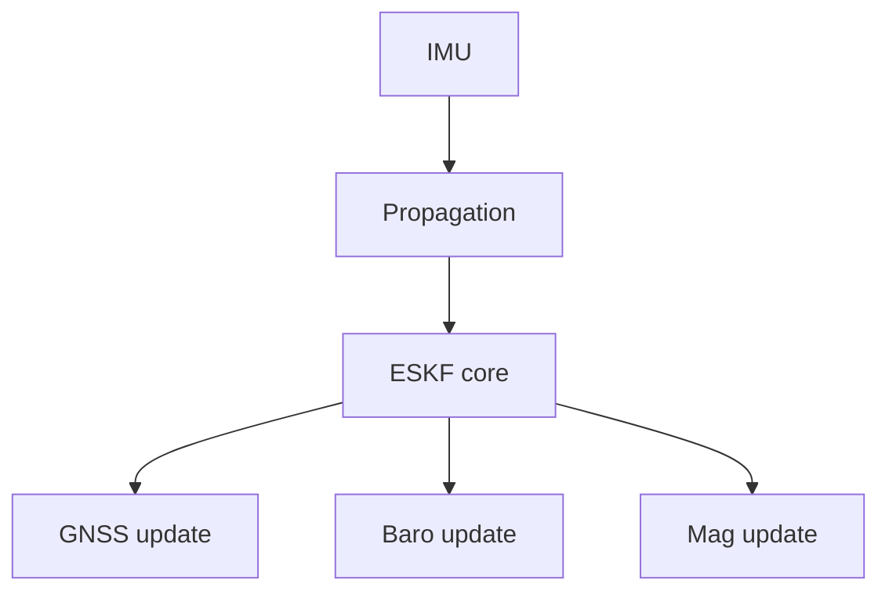
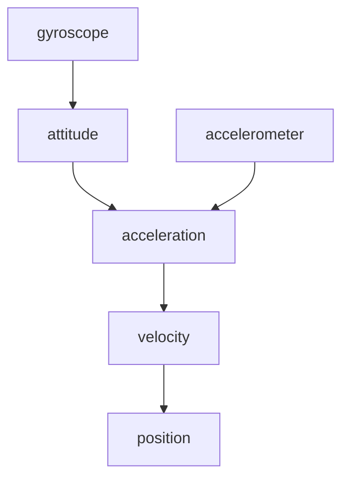
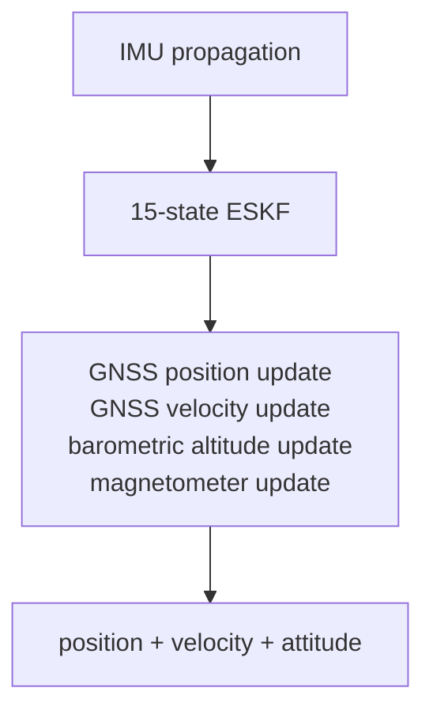

# Design

How `fusion-nav` is built and why. For how to use it see [README.md](README.md); for the
mathematics see [EQUATIONS.md](EQUATIONS.md); for positioning and decisions already made see
[GOALS.md](GOALS.md).

> **Status: API sketch.** The structure below is the intended one. The types and signatures
> exist; almost none of the estimation mathematics does. Initialization is the exception —
> equations (5)–(8) are implemented and the filter starts at the attitude it levelled.

## Error-State Kalman Filter

`fusion-nav` uses an Error-State Kalman Filter rather than representing the complete navigation
state directly in the Kalman filter.

The nominal navigation state is

| nominal state       | dimension |
| ------------------- | --------- |
| position            | 3         |
| velocity            | 3         |
| attitude quaternion | 4         |
| accelerometer bias  | 3         |
| gyroscope bias      | 3         |
| **total**           | **16**    |

The corresponding error state is

| error state        | dimension |
| ------------------ | --------- |
| position error     | 3         |
| velocity error     | 3         |
| attitude error     | 3         |
| accelerometer bias | 3         |
| gyroscope bias     | 3         |
| **total**          | **15**    |

The filter therefore maintains a `15 × 15` error covariance matrix while orientation is
represented by a quaternion in the nominal state.

Using a three-dimensional attitude error avoids treating the four quaternion components as
independent Kalman states and preserves the unit-quaternion constraint naturally.

See [state definitions](EQUATIONS.md#state-definitions).

## Architecture

The filter is intentionally sensor-independent at its core.

Sensor drivers and hardware interfaces are outside the scope of the crate. Applications provide
measurements together with their associated uncertainty.

### Module map

| module | holds |
| ------ | ----- |
| `src/eskf.rs` | `Eskf`, the whole public filter: `initialize*`, `predict`, `fuse_*`, `state`, `reset_*_to` |
| `src/init.rs` | initialization types (`StaticSample`, `Alignment`, `Coarse`, `InitError`) and the pure functions the `initialize*` methods commit |
| `src/propagate.rs` | `ImuSample`; equations (9)–(22) land here |
| `src/math.rs` | the primitives the equations share: `skew`, `exp_quat`, `wrap_pi`, and the symmetry enforcement of (42) |
| `src/state.rs` | `State`, `Covariance`, and `ErrorState`, whose order defines the covariance layout `[δp δv δθ δβa δβg]` |
| `src/health.rs` | `Propagation`, `Fusion`, `Status`, `Validity`, per-source diagnostics |
| `src/config.rs` | tuning; each default's doc comment records its evidence or says it is a placeholder |
| `src/units.rs`, `src/frames.rs` | typed quantities and the sealed `Ned` / `Enu` / `Body` frame markers |
| `src/geodetic.rs` | `Geodetic` and `LocalOrigin`: the navigation origin the filter holds and the tangent plane about it, equations (43)–(44) |
| `src/lib.rs` | the crate root: `no_std` and the lint gates, and the prelude — the one list of public types, minus three names too generic to glob-import |

The [equation-to-code mapping](EQUATIONS.md#equation-to-code-mapping) names the function
intended to implement each numbered equation, including modules not yet written.

## State Propagation

The IMU drives propagation, and it is the only path that runs on every sample: gyroscope to
attitude, accelerometer through that attitude into the navigation frame, gravity added, the
result integrated into velocity and position. Equations (12)–(15) have the form.

What matters here rather than in the equations is that this is a first-order discretization over
a short interval, which is why `Config::max_predict_dt` exists: one IMU sample cannot describe a
long gap, so `predict` refuses a step beyond the limit instead of producing a number that looks
like an estimate. The health timers advance through the refusal, because the time passed whether
or not the state moved.

A sample carrying a NaN or an infinity is refused the same way, timers included, as
`Propagation::NotFinite`. It has to be refused at this boundary because nothing downstream can
report it: a non-finite rate reaches the quaternion through (15), which composes it unchecked,
and then the covariance, where one NaN stays for the rest of the flight. The variant documents
what the two production estimators do here, and which of them checks.

The covariance is propagated alongside the nominal state using the linearized error-state
dynamics.

See [nominal state propagation](EQUATIONS.md#nominal-state-propagation) and
[covariance propagation](EQUATIONS.md#covariance-propagation).

## Measurement Updates

Each source is fused as its own update against its own gate, rather than assembled into one
combined measurement: a sensor that goes bad takes out the quantity it observes and nothing else,
and the health that follows is per source for the same reason.

See [observation models](EQUATIONS.md#observation-models) for the measurement Jacobians.

### GNSS Position

The filter converts the fix rather than accepting a converted one, because it owns the navigation
origin: the fix and the estimate are then relative to the same point by construction.
`fuse_gnss_geodetic` takes latitude and longitude and converts about that origin;
`fuse_gnss_position` is for a caller whose positions were never geodetic — a local RTK base,
motion capture — and is right only if the caller's origin is the filter's.

The first fix places the origin, under the estimate where there is one, and at the fix itself
after a coarse start, where it is adopted rather than fused. See
[geodetic origin](EQUATIONS.md#geodetic-origin).

### GNSS Velocity

Velocity is the observation that matters most between position fixes: velocity error accumulates
rapidly from accelerometer and attitude error, and a velocity measurement constrains it directly
rather than waiting for the position error it would become.

### Barometric Altitude

Barometric altitude is the vertical observation that is available when GNSS is not, and at a
higher rate when it is.

The barometer reference is captured once at initialization and held as a constant. There is no
barometer bias state, so slow drift in that reference — weather, ground effect, sensor warm-up —
is not estimated and appears directly as vertical position error. See
[barometric reference as a constant](GOALS.md#barometric-reference-as-a-constant).

### Magnetometer

The magnetometer is the only source that observes yaw. Gravity pins roll and pitch and says
nothing about the rotation about them, so without one, yaw follows the gyroscope bias wherever it
goes.

Fusion is **heading only** by default: the field is reduced to a single scalar heading and fused
as one measurement, leaving roll and pitch to gravity where they are well determined. A magnetic
disturbance can then corrupt one state rather than three, and the innovation gate has a
one-dimensional quantity to act on.

Three-axis field fusion is documented for completeness but is not the default. `fusion-nav`
carries no magnetic-field or magnetometer-bias states, so hard- and soft-iron calibration is the
application's responsibility; an uncalibrated magnetometer produces a heading bias the filter
cannot detect.

See [magnetometer, heading only](EQUATIONS.md#magnetometer-heading-only).

## Innovation Gating

A measurement is checked against the state it is about to correct before it is allowed to correct
it. The filter forms the innovation and its covariance and compares the normalized innovation
against a threshold in the observation's degrees of freedom, which is one mechanism covering GNSS
glitches, barometer transients and magnetic interference.

Rejections are counted and exposed. A filter that silently discards every measurement looks
identical to one that is working.

See [innovation gating](EQUATIONS.md#innovation-gating).

### Measurement rejection

Gating is self-sealing: if the filter itself is wrong, correct measurements look inconsistent,
all are rejected, and the filter dead-reckons while looking confident. So health is tracked per
source and carried on the estimate, and recovery is left to the application. The user-facing
side is in [README.md](README.md#health-reporting); the reasoning in
[rejection handling](GOALS.md#rejection-handling-report-do-not-self-recover),
[per-quantity validity](GOALS.md#per-quantity-validity-not-one-ladder), and
[gate lockout](EQUATIONS.md#gate-lockout).

## Embedded Design

`fusion-nav` is intended to be suitable for microcontrollers used in flight-control applications.

The implementation therefore favors:

* fixed-size matrices
* compile-time dimensions
* stack allocation
* no dynamic allocation
* deterministic execution time
* `no_std`
* no panics, [checked in CI](README.md#the-library-cannot-panic)
* explicit numerical types
* minimal dependencies

The only dependency is [`nalgebra`](https://crates.io/crates/nalgebra), built `no_std` with its
`libm` feature, which supplies the fixed-size matrix algebra and the quaternion type. It fixes the
MSRV at 1.89.

A 15-state filter requires a `15 × 15` covariance matrix containing 225 scalar values, which in
`f32` is 900 bytes.

The covariance is not the whole cost. A measurement update in Joseph form also needs the
transition matrix, the `(I − KH)` product, and at least one `15 × 15` temporary, each another
900 bytes, so the realistic working set is a few kilobytes rather than one. Peak stack usage
depends on how aggressively temporaries are reused, which is exactly why the intent is to
**measure and publish** the figure per operation rather than estimate it here.

A few kilobytes is still comfortable on an STM32H7-class flight controller while providing a full
inertial-navigation state.

`Status` is a payload-free enum and `state()` stays small and `Copy`, so reading it in a control
loop costs nothing. Timing detail lives in `diagnostics()`, which is not on the hot path.

## Initial Scope

The first version focuses on:

Features deliberately deferred include:

* wind estimation
* terrain estimation
* magnetic-field state estimation
* magnetometer bias states
* optical flow
* visual odometry
* range finder fusion
* airspeed fusion
* multiple simultaneous navigation filters
* automatic sensor-source switching

These can be added as concrete use cases require them. The initial implementation intentionally
focuses on the core navigation problem rather than reproducing every feature of mature autopilot
estimators such as PX4 EKF2.

## Design Philosophy

The mathematics should be visible in the code rather than hidden behind an abstraction layer, so
equations in the implementation correspond directly to the numbered equations in the crate's
documentation. The [equation-to-code mapping](EQUATIONS.md#equation-to-code-mapping) is the
concrete form of that promise: every numbered equation names the function that implements it,
including the ones not yet written.

Positioning, the differentiators this follows from, and the decisions already made are in
[GOALS.md](GOALS.md).

## References

The architecture is informed by established error-state inertial-navigation literature and
production UAV estimators, including PX4 EKF2 and ArduPilot EK3.

Those two are read as source rather than as documentation — defaults in
`src/modules/ekf2/EKF/common.h`, alignment in `EKF/ekf.cpp`, the status model in
`filter_control_status_u`, and ArduPilot's equivalents — because published figures drift from what
the code does. `fusion-nav` is an independent Rust implementation rather than a source-code port
of either.

The mathematical formulation follows J. Solà, *Quaternion kinematics for the error-state Kalman
filter* ([arXiv:1711.02508](https://arxiv.org/abs/1711.02508)), which is the primary source for
the error-state formulation and its Jacobians. Full reference list in
[EQUATIONS.md](EQUATIONS.md#references).
