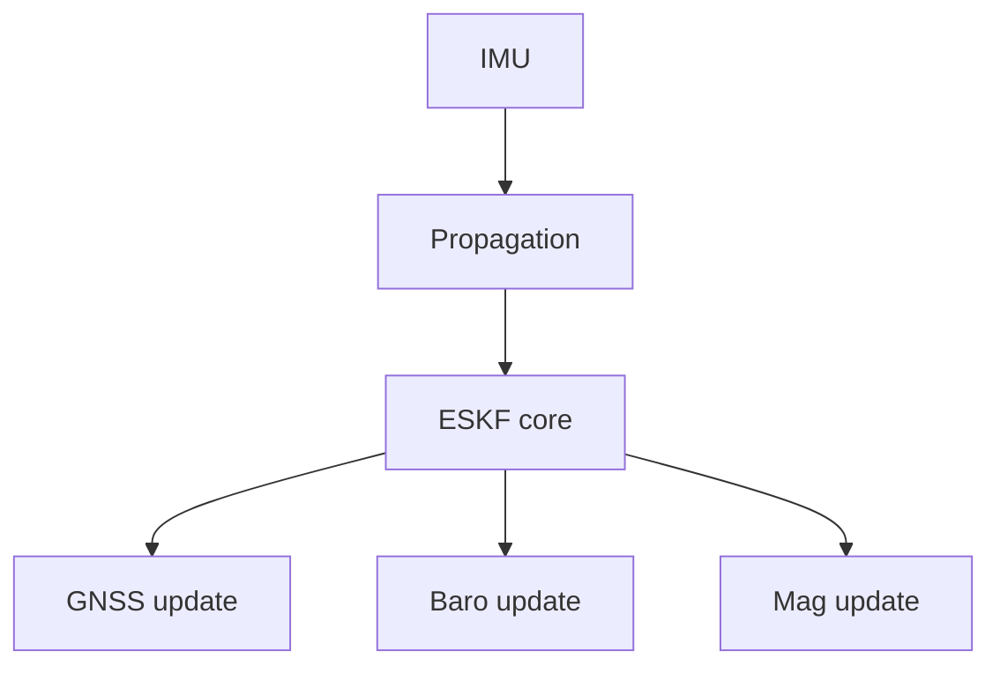
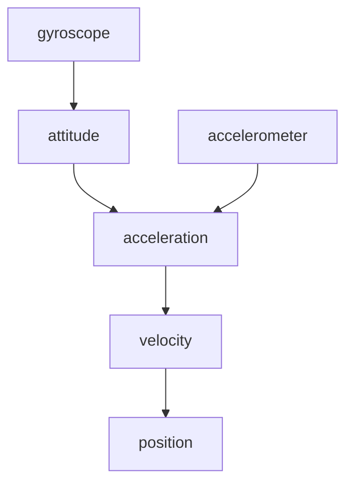
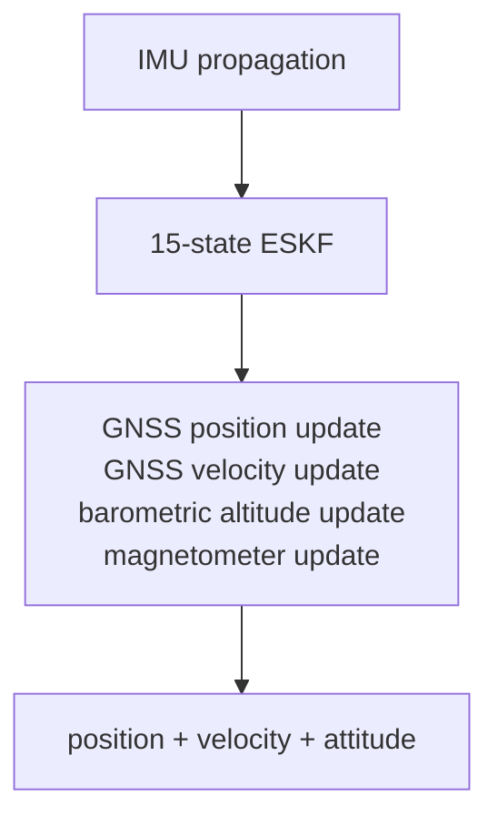

# Design

How `fusion-nav` is built and why. For how to use it see [README.md](README.md); for the
mathematics see [EQUATIONS.md](EQUATIONS.md); for positioning and decisions already made see
[GOALS.md](GOALS.md).

> **Status: complete and aided by GNSS position and velocity, the barometer and magnetic
> heading.** The structure below is built, not intended: initialization, equations (5)–(8);
> nominal propagation, (9)–(15), and covariance propagation, (16)–(22); the measurement update,
> (23)–(30), (34)–(36) with the levelling variance (36′), and (37)–(41), wired to every source
> the crate carries; and the conditioning of (42) and (42′). Two are not implemented: three-axis
> magnetometer fusion, (31)–(33), which is out of scope rather than pending, and (5′), whose
> in-motion levelling term is measured and reported but not yet subtracted.

## Error-State Kalman Filter

`fusion-nav` uses an Error-State Kalman Filter rather than representing the complete navigation
state directly in the Kalman filter.

The nominal navigation state is

| nominal state       | dimension |
| ------------------- | --------- |
| position            | 3         |
| velocity            | 3         |
| attitude quaternion | 4         |
| accelerometer bias  | 3         |
| gyroscope bias      | 3         |
| **total**           | **16**    |

The corresponding error state is

| error state        | dimension |
| ------------------ | --------- |
| position error     | 3         |
| velocity error     | 3         |
| attitude error     | 3         |
| accelerometer bias | 3         |
| gyroscope bias     | 3         |
| **total**          | **15**    |

The filter therefore maintains a `15 × 15` error covariance matrix while orientation is
represented by a quaternion in the nominal state.

Using a three-dimensional attitude error avoids treating the four quaternion components as
independent Kalman states and preserves the unit-quaternion constraint naturally.

See [state definitions](EQUATIONS.md#state-definitions).

## Architecture

The filter is intentionally sensor-independent at its core.



Sensor drivers and hardware interfaces are outside the scope of the crate. Applications provide
measurements together with their associated uncertainty.

### Module map

| module | holds |
| ------ | ----- |
| `src/eskf.rs` | `Eskf`, the whole public filter: `initialize*`, `predict`, `fuse_*`, `state`, `reset_*_to` |
| `src/init.rs` | initialization types (`StaticSample`, `StaticWindow`, `Alignment`, `Coarse`, `InitError`) and the pure functions the `initialize*` methods commit |
| `src/propagate.rs` | `ImuSample`; equations (9)–(22) land here |
| `src/history.rs` | the recent past of the nominal state, which a measurement is fused against at the time it was taken, equation (23′) |
| `src/math.rs` | the primitives the equations share: `skew`, `exp_quat`, `wrap_pi`, and the symmetry enforcement of (42) |
| `src/state.rs` | `State`, `Covariance`, and `ErrorState`, whose order defines the covariance layout `[δp δv δθ δβa δβg]` |
| `src/health.rs` | `Propagation`, `Fusion`, `Status`, `Validity`, per-source diagnostics |
| `src/config.rs` | tuning; each default's doc comment says where its number came from or that it is a placeholder, and [Defaults and their evidence](#defaults-and-their-evidence) holds the measurements |
| `src/units.rs`, `src/frames.rs` | typed quantities and the sealed `Ned` / `Enu` / `Body` frame markers |
| `src/geodetic.rs` | `Geodetic` and `LocalOrigin`: the navigation origin the filter holds and the tangent plane about it, equations (43)–(44) |
| `src/lib.rs` | the crate root: `no_std` and the lint gates, and the prelude — the one list of public types, minus three names too generic to glob-import |

The [equation-to-code mapping](EQUATIONS.md#equation-to-code-mapping) names the function
intended to implement each numbered equation, including modules not yet written.

## State Propagation

The IMU drives propagation, and it is the only path that runs on every sample: gyroscope to
attitude, accelerometer through that attitude into the navigation frame, gravity added, the
result integrated into velocity and position. Equations (12)–(15) have the form.



What matters here rather than in the equations is that this is a first-order discretization over
a short interval, which is why `Config::max_predict_dt` exists: one IMU sample cannot describe a
long gap, so `predict` refuses a step beyond the limit instead of producing a number that looks
like an estimate. The health timers advance through the refusal, because the time passed whether
or not the state moved.

A sample carrying a NaN or an infinity is refused the same way, timers included, as
`Propagation::NotFinite`. It has to be refused at this boundary because nothing downstream can
report it: a non-finite rate reaches the quaternion through (15), which composes it unchecked,
and then the covariance, where one NaN stays for the rest of the flight. The variant documents
what the two production estimators do here, and which of them checks.

The covariance is propagated alongside the nominal state using the linearized error-state
dynamics.

See [nominal state propagation](EQUATIONS.md#nominal-state-propagation) and
[covariance propagation](EQUATIONS.md#covariance-propagation).

## Measurement Updates

Each source is fused as its own update against its own gate, rather than assembled into one
combined measurement: a sensor that goes bad takes out the quantity it observes and nothing else,
and the health that follows is per source for the same reason.

See [observation models](EQUATIONS.md#observation-models) for the measurement Jacobians.

### GNSS Position

The filter converts the fix rather than accepting a converted one, because it owns the navigation
origin: the fix and the estimate are then relative to the same point by construction.
`fuse_gnss_geodetic` takes latitude and longitude and converts about that origin;
`fuse_gnss_position` is for a caller whose positions were never geodetic — a local RTK base,
motion capture — and is right only if the caller's origin is the filter's.

A fix is fused as two measurements rather than one: (28)'s north–east rows under a `Gate<2>`,
then its down row under a `Gate<1>`, each with its own `Fusion` in the `GnssFusion` returned and
its own `SourceHealth`. A receiver's height is the half that wanders and the half another source
disputes, and one joint test turns every such dispute into lost horizontal aiding — on
`2c42096b`, with its barometer fused, 3945 of 4616 fixes, every one of them vertical. PX4 runs
GNSS position and GNSS height as separate aid sources and ArduPilot gates them apart; `Gates`
carries the citations.

The first fix places the origin, under the estimate where there is one, and at the fix itself
after a start whose window did not show the vehicle at rest, where it is adopted rather than
fused. See
[geodetic origin](EQUATIONS.md#geodetic-origin).

### GNSS Velocity

Velocity is the observation that matters most between position fixes: velocity error accumulates
rapidly from accelerometer and attitude error, and a velocity measurement constrains it directly
rather than waiting for the position error it would become.

### Barometric Altitude

Barometric altitude is the vertical observation that is available when GNSS is not, and at a
higher rate when it is.

The barometer reference is captured at initialization and estimated from then on: its error is
an offset carried beside the 15-state covariance, correlated with height and corrected whenever
a barometer and a GNSS height disagree, and it walks so that slow drift — weather, ground effect,
sensor warm-up — can be followed rather than becoming vertical position error. `State` and
`Covariance` do not carry it. See
[barometric reference as an estimated offset](GOALS.md#barometric-reference-as-an-estimated-offset)
and [equation (30′)](EQUATIONS.md#barometric-offset).

### Magnetometer

The magnetometer is the heading source most vehicles carry. Gravity pins roll and pitch and says
nothing about the rotation about them, so without a heading source yaw follows the gyroscope bias
wherever it goes. The other two are a dual-antenna GNSS heading and, for a vehicle that points
where it goes, the course constraint: [heading from GNSS](EQUATIONS.md#heading-from-gnss).

Fusion is **heading only** by default: the field is reduced to a single scalar heading and fused
as one measurement, leaving roll and pitch to gravity where they are well determined. A magnetic
disturbance can then corrupt one state rather than three, and the innovation gate has a
one-dimensional quantity to act on.

Three-axis field fusion is documented for completeness but is not the default. `fusion-nav`
carries no magnetic-field or magnetometer-bias states, so hard- and soft-iron calibration is the
application's responsibility; an uncalibrated magnetometer produces a heading bias the filter
cannot detect.

What the filter *can* price is the other half of that error. Reducing the field to a heading
means rotating it by the attitude estimate, so a tilt error tips the field and turns the heading
it yields by `tan δ` times as much — twice as much as the tilt itself, at the dip the corpus
carries. The caller hands over a field and never sees that rotation, so the variance it supplies
cannot describe it; the filter adds it, equation (36′). It goes into `R` rather than `H`: the
heading becomes less trustworthy without being made to look like an observation of the tilt that
spoiled it, which is what a scalar carrying 3° of noise must not be allowed to correct.

See [magnetometer, heading only](EQUATIONS.md#magnetometer-heading-only).

## Innovation Gating

A measurement is checked against the state it is about to correct before it is allowed to correct
it. The filter forms the innovation and its covariance and compares the normalized innovation
against a threshold in the observation's degrees of freedom, which is one mechanism covering GNSS
glitches, barometer transients and magnetic interference.

Rejections are counted and exposed. A filter that silently discards every measurement looks
identical to one that is working.

See [innovation gating](EQUATIONS.md#innovation-gating).

### Measurement rejection

Gating is self-sealing: if the filter itself is wrong, correct measurements look inconsistent,
all are rejected, and the filter dead-reckons while looking confident. So health is tracked per
source and carried on the estimate, and a source locked out past its timeout is recovered by
adoption, one switch per source in `Config::recovery`. The user-facing
side is in [README.md](README.md#health-reporting); the reasoning in
[rejection handling](GOALS.md#rejection-handling-recover-by-default-opt-out-per-source),
[per-quantity validity](GOALS.md#per-quantity-validity-not-one-ladder), and
[gate lockout](EQUATIONS.md#gate-lockout).

## Embedded Design

`fusion-nav` is intended to be suitable for microcontrollers used in flight-control applications.

The implementation therefore favors:

* fixed-size matrices
* compile-time dimensions
* stack allocation
* no dynamic allocation
* deterministic execution time
* `no_std`
* no panics, [checked in CI](README.md#the-library-cannot-panic)
* explicit numerical types
* minimal dependencies

The only dependency is [`nalgebra`](https://crates.io/crates/nalgebra), built `no_std` with its
`libm` feature, which supplies the fixed-size matrix algebra and the quaternion type. It fixes the
MSRV at 1.89. It stays behind the API: `nalgebra` is 0.x, so each minor version is a semver
break, and a public `Vector3` would make its upgrade this crate's. Vectors and the covariance
cross as arrays, which convert to and from any version's types, and a quaternion as a
`Quaternion` with named fields, since the libraries disagree on the order of four numbers.
[`defmt`](https://crates.io/crates/defmt) is the one optional dependency, behind a feature of the
same name and off by default, for a target that logs through it.

A 15-state filter requires a `15 × 15` covariance matrix containing 225 scalar values, which in
`f32` is 900 bytes.

The covariance is not the whole cost. A measurement update in Joseph form also needs the
transition matrix, the `(I − KH)` product, and at least one `15 × 15` temporary, each another
900 bytes, so the realistic working set is a few kilobytes rather than one. Peak stack usage
depends on how aggressively temporaries are reused, which is exactly why the intent is to
**measure and publish** the figure per operation rather than estimate it here; the
[measured figures](#measured-cost-by-function) follow.

A few kilobytes is still comfortable on an STM32H7-class flight controller while providing a full
inertial-navigation state.

`Status` is a payload-free enum and `state()` stays small and `Copy`, so reading it in a control
loop costs nothing. Timing detail lives in `diagnostics()`, which is not on the hot path.

### Measured cost, by function

Every figure a doc comment would otherwise carry about stack, flash or arithmetic lives here, keyed
by the function it measures; the comment keeps the one sentence saying why its form was chosen.
These are host-side measurements: #41 measures stack high-water and execution time on hardware,
and its figures land in this section.

#### Stack frames

Measured with `-Zemit-stack-sizes` at `opt-level = 3` (the recipe is under Commands in
`AGENTS.md`). A frame moves by tens of bytes with codegen that touches nothing in it (adding
`update::<1>` moved `reparameterize`'s share without a line of it changing), so where a form was
chosen the *difference* against the rejected one is the figure that carries the decision.

| function | `thumbv6m` | `thumbv7em` | against the rejected form |
| --- | --- | --- | --- |
| `update::<3>` | 8088 | 7960 | the offset of (30′) in blocks costs 968 over the fifteen-state update; the augmented 16 × 16 written out cost 4168 more (a 1024-byte matrix per 900-byte temporary, plus a copy in and out); (24′)'s second Cholesky factor costs 272 (64 on `thumbv7em`) |
| `update::<1>` | 6384 | 6240 | the second factor costs 320 (64) |
| `reparameterize` (in `update`) | | | the full `G P Gᵀ` cost 864 more of `update`'s frame |
| `fuse_gnss_velocity` → `update::<3>` | 9504 | | the crate's high-water mark; `fuse_gnss_velocity` is 1416 with `apply_or_recover` out of line, 2384 inlined |
| `Eskf::observe::<3>` | 1464 | | `Observation::delayed` 752 and `error_dynamics` 400 beneath it; inlined into `fuse_gnss_velocity` it put the high-water mark at 10800 |
| `Eskf::fuse_heading` | 1224 over `update::<1>` (6368 in that build) | | with `fuse_course`'s 264 above it, 7856 at the peak, against 7624 when `fuse_mag_heading` did the work in its own 1240-byte frame |
| `Eskf::adopt_position`, `adopt_velocity` | | | inlined, +976 on `fuse_gnss_position` and +952 on `fuse_gnss_velocity`; out of line they follow `update` rather than stacking on it |
| `propagate_covariance` | 2832 | 2760 | the largest frame propagation reaches; with `predict` (2168, 2160) and `propagate` (1056) above it the chain is 6056 (5976). With one caller it inlined and the same three temporaries sat in `predict` |
| `project` | 1952 | 1936 | with `predicted_validity`'s 1856 above and `propagate_covariance` below, 6640; through `coast` the arming query's chain measured 9 KB, over `update::<3>` |
| `coast` | 2144 | 2136 | with `predict` above and `propagate_covariance` below, 7144 |
| `enforce_symmetry` | 108 | 0 | the equation form, `(P + Pᵀ)/2`, is 1884 (1820): two 15 × 15 temporaries under `predict` |
| `init::initial_covariance` | 1120 | | a diagonal-only `P₀` inlined to 80; `Eskf::initialize` is 1224 above it |
| `Eskf::initialize_coarse` | 1984 | | most of it the `StaticWindow` of one sample |
| `History::clear` | | | rebuilding the ring put a 1552-byte temporary in `Eskf::apply_alignment` |
| `StaticWindow::halve` | | | a copy of the blocks is 512 bytes |

Every initialization frame stays under the 9504 of `fuse_gnss_velocity` into `update::<3>`, and so
do the arming query and a coast, so no path but an update moves the crate's peak. That peak is
comfortable on the STM32H7 class above and nearly all the RAM of an 8 KB Cortex-M0 part. The
block-wise forms that would cut it (of (22), where (20)'s identity and zero blocks make most of
`F P Fᵀ` known; of a coast, whose `F` is a four-term polynomial in `Δt` since `ω = 0` makes the
error dynamics nilpotent; a runtime `M` for `update` in place of a type parameter) are each written
as the equation reads until #41's figures say a target needs them.

#### Sizes

`P` is 900 bytes, so it is passed by reference, and `Covariance::to_rows` is a copy of
that size on the caller's stack. `StaticWindow` is 936 bytes at any rate and length
(`the_window_is_the_size_its_documentation_quotes` pins it), where a buffered 2 s window at 400 Hz
is 800 `StaticSample`s of 80 bytes, 64 KB. The history of (23′) is 1.5 KB of `Eskf`.

#### Flash

`.text` on `panic-check`'s ELF (fat LTO) linking the whole public API for `thumbv6m`. A
measurement dimension is what costs flash, not a source: the barometer brought `update::<1>` into
existence for 4.1 %, and the magnetic heading of (34)–(36), sharing it, added 1204 bytes, 2.4 %.
The `magnetic-model` table is 1408 bytes of `.rodata` and its lookup 1096 of `.text` (1520 on
`thumbv7em`), about 2.5 KB, at `opt-level = "s"`; the same lookup in `f64` linked 4496 bytes of
`.text` in software doubles.

#### Arithmetic

(22) as written is of order 6750 multiplications and three 900-byte temporaries
per IMU sample, at up to 400 Hz; a dense `Q` would add 900 bytes and 225 additions to add twelve
numbers. `project` is ten runs of (22) at the default 1 s horizon, up to 64; a coast is up to 64
runs landing on one step, 12 for a 1.2 s gap. Each `StaticWindow::push` costs 32 `f64` additions,
9 multiplications, 2 comparisons, a subtraction and 18 widenings (the barometer's share only on a
fresh reading), and 27 operations in `f32`: 7 divisions, 6 multiplications, 5 additions,
4 comparisons, 2 maxima, 2 square roots and a conversion. Each `WindowNoise::BLOCK` closed costs its
sensor 7 additions, 6 multiplications and a division more. Counted in the `thumbv6m` disassembly,
less the merge a doubling adds; on a core with no FPU each is a library call, paid only until the
window commits.

## Defaults and their evidence

A default justified by data carries its deciding figure in its doc comment, in one sentence, and
links here for the rest: the per-log breakdowns, the tables and the alternatives measured and
rejected. Where `GOALS.md` records a decision, the evidence for its default sits with the decision
instead, and the comment links there. Each heading below is the item's name, so a comment's link
names what it is about. A figure here is a measurement of the corpus and the scenarios as they
stood when it was taken; where the corpus has grown since, the text says which logs it covered.

### `ImuNoise`

**Bias walks.** Converting both estimators' per-step σ to a density is worth this much. Read
unconverted as a density, the accelerometer-bias walk is 33 times PX4's in σ, and on `2c42096b`,
grounded for two hours, where only `tilt · g + b_a` is observed, `σ_ba` grows to 0.63 m s⁻², the
bias estimate walks to 0.56 and drags tilt from 0.95° to a peak of 5.2°, against EKF2's 1.08°.
Converted, the ten-minute mean tilt holds between 0.89° and 1.11°, and the 2.5° peak is a 3.5 g
knock at 4757 s. PX4's own pair gives 2.4°. A ceiling on `σ_ba` at PX4's 0.35 gives 3.3° and a
clamp on the bias at its 0.4 gives 4.4°, and neither is reached once the walk is converted.

**White noise at ten times PX4's density**, because replay measured the factor being spent.
Scaling `accel_white` down breaks the one thing each source can say: at 0.3×, `2c42096b`, a real
airframe vibrating on the ground, reads a tilt peak of 4.6° against 2.5° (EKF2 never leaves
1.08°), and still 4.5° with PX4's `R` floors applied, so the vibration needs it; `a299e722` ends
`Degraded`, rejecting 493 velocity solutions against 283, which PX4's floors cure (43, `Healthy`),
so the receiver's raw `R` needs it. `gnss_latency` does not: with each fix fused at the time it was
taken, (23′), it reads `false_valid` 0 at 0.3× as at 1×, where fused as current it read 888 at
0.3×. Scaling `gyro_white` down to 0.7× improves `tilt` and `yaw` on every scenario, but
`harsh_imu`'s `nees_att` crosses 1 (1.07), and on the corpus `f16771dd` grows a 14.1° tilt at
t = 51 s where EKF2 reads 2.6°. The simulator's IMU is 58 times quieter than this figure, so the
scenarios favouring less gyroscope noise are the simulator's preference rather than an
airframe's.

**Against the floor the sensors measure**, `StaticWindow::noise`: on the worst axis of the nine
real logs whose window is still, less `a299e722`, whose rows each average 2.5 ms while standing for
20 ms and so read `√8` high (#177), gyroscopes read 8.4e-5 to 1.6e-3 rad s⁻¹/√Hz and
accelerometers 1.5e-3 to 5.6e-2 m s⁻²/√Hz, so the default is 9 to 180 times the one and 6 to 230
times the other. That is the factor measured from below; a default under the floor would be the
error. Against PX4's own densities, a tenth of these, the floor comes within reach: `2c42096b`'s
accelerometer, a grounded airframe with its props spinning, reads 1.6 times PX4's, and
`f16771dd`'s gyroscope 1.1 times.

### `Gates`

**The split of a GNSS fix.** `2c42096b` is a stationary vehicle whose barometer and receiver
drift ~20 m apart in height; the 3945 of its 4616 fixes a joint `Gate<3>` rejects
([GNSS Position](#gnss-position)) each pass a `Gate<2>` of the horizontal pair at
`Percentile::P999`.

**The default percentile, 99.9 %.** GNSS position was replayed at 95 %, 99 %, 99.9 % and a 5σ
equivalent (`γ` = 31.81 at three degrees of freedom, the two-sided tail of 5σ in one), tested as
one joint three-axis `Gate<3>` rather than split. The percentile applies to both halves of the
split unchanged.

The corpus could not tell them apart when it was measured. No log rejected a fix at any of the
four, because PX4's `eph` and `epv` are far wider than the innovations they come with: the mean
test ratio at 95 % was 0.0023–0.0449 across the three logs then carrying GNSS and the largest
0.33, where a consistent `R` would put the mean near 0.38. Those figures move as the filter gains
aiding, in the direction to expect: every source that tightens `P` tightens `S = H P Hᵀ + R`, so
the same innovation reads as a larger ratio. They were 0.005–0.02 and 0.21 when position was the
only gated source. `nis_gnss_pos=` on the `summary` line is the maintained form of this claim,
per log, pinned in `data/manifest.txt`, and stated as a distribution rather than as a distance
from a threshold that itself moves.

The simulator, whose GNSS errors are exactly the Gaussian `R` claims, can, and it prices the
tight end. On `mission`, 95 % rejects 30 of 915 good fixes and 99 % rejects 4, with horizontal
RMSE 0.716 m and 0.702 m and vertical 0.796 m and 0.749 m. 99.9 % rejects 1 and 5σ none, and
both give the same 0.702 m and 0.749 m that 99 % does. So 95 % buys worse accuracy, and one good
fix in thirty turned away, for protection against outliers that nothing there contains. Between
99.9 % and 5σ good data says nothing; hostile data (#60, UrbanNav) found no percentile that helps,
so 99.9 % stands.

### `Coast`

Measured on the two sources with gaps at speed, and set at twice the smallest value either
needed.

`4b473e91`, a VTOL at 30 m/s with eight logging dropouts of 1.0–3.1 s, is what sets both, since
in the simulator any value passes. Refused, its gaps cost 12 recoveries, 39 rejected positions and
28 velocities. Coasted with `rotation` at zero, the first fix after every gap is accepted at any
`acceleration`, and what follows it is not: the course turns 44° across the 3.1 s gap at 954 s,
the heading innovation afterwards sits at −0.60 rad under an `S` that did not grow, and the stale
heading steers velocity off until the gate turns it down (7 recoveries at `acceleration` 1.0).
With `rotation` at 0.02 or more and `acceleration` at 2.0 no gap causes a rejection or a recovery.
When this was measured (#144), two positions and two velocities were still rejected, fixes
timestamped inside a gap and fused before the IMU sample that ends it; since #52 those are refused
as `Fusion::OutOfHorizon`, and the log reads `rejected_gnss_pos=0 rejected_gnss_vel=0`. `acceleration` at 1.0 still needs `rotation` at 0.1, and at
0.5 leaves 7 recoveries at any `rotation`.

`logging_dropout` (1.2 s at 20 m/s in a turn) passes at `acceleration` 0.5 or more whatever the
rotation, and reads the same across the whole range: `pos_h_max` 23.25 m refused, 2.74 m coasted,
`false_valid` 1946 → 0.

### `Initialization`

**Stationarity tolerances**, PX4 EKF2's 15°/s and 20 % of gravity, chosen against the five logs
the corpus held then. Tighter ones fail parked vehicles: at 0.05 rad s⁻¹ and 0.5 m s⁻², four of
those five were called moving while sitting on the ground, on peaks of 0.026–0.172 rad s⁻¹ and
0.15–1.04 m s⁻² that are idle vibration and prop wash, not motion. A tolerance that calls a
parked quadrotor moving does not protect the alignment, it just denies it. At these values four of
the five aligned statically, and the fifth, peak deviation 6.2 m s⁻², stayed coarse, correctly:
6 m s⁻² is a vehicle being handled, not a vehicle vibrating.

**`sigma_accel_bias`, 0.2 m/s².** At 0.1 the `harsh_imu` scenario's 0.186 m/s² sat at 1.86σ, and
its attitude was overconfident on 50 seeds wherever (24′) did not inflate the covariance past it:
2281 epochs over the family-wise bound at `Correlation::WHITE`, none at 0.2 with the
correlation. On the corpus it is worth most on `7ce66f0d`, the hand launch levelled 12° wrong:
69 recoveries → 28, and aligned at 17.7 s rather than 32.7.

### `FLOOR`

The floor of (42′) is PX4's values, and the corpus says they sit below anything an honest source
drives the filter to: across the thirteen logs of `data/manifest.txt` and the thirteen scenarios
`examples/simulate.rs` had before `lever_arm` (#170), the smallest variance any state reaches at an epoch is 1.9e-4 m² of
position on `89a498ce`, an RTK receiver, 1.7e-6 (rad/s)² of gyroscope bias, the bias walk's steady
state, reached on six logs, 9.0e-5 rad² of attitude on `gnss_heading`, 7.3e-4 (m s⁻²)² of
accelerometer bias on `093e806a` and 5.6e-4 (m/s)² of velocity on `cd7e0001`. Two to six decades
of headroom, so `Diagnostics::floored` reads zero on all thirteen logs, `cd7e0001` included, whose
receiver reports a 0.43 mm/s velocity after touchdown and is fused raw. Measured as σ² from the
replay output's six-decimal σ columns.

### `PROJECTION_STEP`

Measured against the same horizon propagated at 100 Hz, as the fraction of the position
*variance* the projection reaches:

```text
 horizon    0.2 s step   0.1 s step   0.05 s step
   1 s        0.989        0.994        0.997
   2 s        0.953        0.977        0.989
   5 s        0.873        0.938        0.953
```

0.1 s is where that stops buying much per step: it holds the projection within 6.5 % of the
variance, 3.2 % of the sigma, out to a 5 s horizon.

### `MAX_PROJECTION_STEPS`

Past 64 steps of `PROJECTION_STEP`, 6.4 s, a horizon is projected in 64 longer steps. Position
variance against the same 100 Hz reference: 0.950 at 6.4 s, 0.935 at 10 s, 0.913 at 30 s, 0.907
at 60 s, 0.902 at 120 s. So a horizon of minutes is answered about 10 % optimistic in the
variance, 5 % in the sigma, where a 5 s horizon at `PROJECTION_STEP` is 6.5 % and 3.2 %.

### `WindowNoise`

**Blocks rather than samples** (`Density`, equation (8″)). Taken on each real log's window, the
rows the filter started on (`a299e722` aside, #177), the lag-one autocorrelation runs from −0.98
to +0.96 across the axes, and on the worst axis one sample's scatter reads `093e806a`'s
accelerometer 6.0 times the blocks' figure and `4b473e91`'s 2.9 (vibration aliased near the
sample rate, which cancels within a block), `89a498ce`'s gyroscope 2.9 times low (filtered or
rocking noise, which accumulates). Correcting one sample's scatter by its lag-one
autocorrelation, `(1 + ρ)/(1 − ρ)` as (24′) does for a source, misses the blocks' figure by up to
3.3× on the same windows (`89a498ce`'s accelerometer) and 6.5× on the simulated `3949f175`, whose
`ρ` nears one.

**`BLOCK`, 50 ms.** At 25 ms the aliasing is still being read (`093e806a`'s accelerometer
4.8e-3 m s⁻²/√Hz against 1.7e-3 at 50 ms). Past 50 ms the figure is not settled either, and that
is its real uncertainty, larger than the ±11 % of its 40 blocks: across 50, 100 and 125 ms the
worst-axis figures of the seven real logs whose windows hold nine blocks at all three move by up
to 2.3× (`4b473e91`'s accelerometer), 2.2× (`f16771dd`'s gyroscope) and 1.8× (`285ee2e7`'s
accelerometer), the other eleven by under 1.5×: noise that is not white below 20 Hz either.

**`MIN_READINGS`, and why `α₀` does not wait for it.** Holding `α₀` to nine readings was
measured: it moves `2c42096b` (six readings in its 0.80 s), `4b473e91` (seven) and `eb799954`
(four) to a reference read from the estimate, moving no rejection or transition count, and leaves
the corpus no real vehicle whose short still start sets its own reference, where these three were
all of them.

**The barometer's figure is a floor.** Fused as `R_m` in place of the 2 m the converter
substitutes, it takes `nis_baro` past 1 on five of the six real logs that report it (1.54 to
34.56, against 1 for an `R` the residuals agree with), and the gate refuses 45 to 1976 readings on
each of those five.

### `BLOCKS`

Eight blocks, measured against an exact split (4096 blocks, which no window the replay harness
builds fills, and which reproduces every scenario and corpus output byte for byte). The halves'
disagreement moves, exact to 8 blocks, on the coarse starts: `7ce66f0d` 26.50° → 22.45° of tilt
and 26.27° → 27.13° of heading, `cd7e0001` 0.29° → 0.50° and 1.27° → 1.70°, `moving_start`
0.00° → 0.02° and 12.23° → 11.94°. The outputs barely do, because it reaches only `coarse_sigmas`
and only where it is the largest bound: at 8 blocks and at 16, one corpus log, `7ce66f0d`, moves
by one in the last printed digit of three innovation keys, and no scenario moves.

## Initial Scope

The first version focuses on:



Out of scope, as [GOALS.md](GOALS.md#non-goals) decides and owns:

* wind estimation
* terrain estimation
* magnetic-field state estimation
* magnetometer bias states
* optical flow
* visual odometry
* range finder fusion
* airspeed fusion
* multiple simultaneous navigation filters
* automatic sensor-source switching

Adding one is a change to that decision, not an implementation task. The filter focuses on the
core navigation problem rather than reproducing every feature of mature autopilot estimators such
as PX4 EKF2.

## Staging the implementation

`EQUATIONS.md` is implemented in stages rather than in one pass, each one verifiable on its own
before the next builds on it. Four constraints set that order, and none of them is the order the
equations are numbered in.

**Verification leads the mathematics.** The seeded simulator, the scoring against its truth and
the ratcheted ceilings — `examples/simulate.rs`, the `score` line, `data/scenarios.txt` — landed
before the equations they measure, so a stage has acceptance criteria on the day it lands rather
than an audit afterwards. The other order is worse than slower: an equation eyeballed once becomes
the baseline everything later is compared against. It paid immediately. When nominal propagation
(9)–(15) landed, every ceiling in `data/scenarios.txt` moved, in both directions, and `harsh_imu`
separated from `mission` for the first time — neither of which a reading of the diff would have
shown.

**A key is pinned before the behaviour it counts exists.** `data/manifest.txt` matches the
`summary` line and nothing else, so a behaviour with no key on that line lands entirely unpinned.
The gate's `rejected=` was therefore added while every `fuse_*` was still a stub returning a zero
test ratio. A key whose value is trivially constant still fixes the corpus baseline that its first
real value is read against, so defining a statistic before there are values to put in it is the
normal order here rather than a workaround. It paid at stage 6. `rejected=` had been zero across
five logs and all four candidate gates while GNSS position was the only gated source; the first
velocity fusion turned down 284 of one log's 609 solutions, and that arrived as a diff against a
pinned zero rather than as a number nobody had a baseline for. The same argument is why `ba=` and
`bg=` were added to the `score` line on the stub filter one commit before (29) landed.

**`-D warnings` decides what can land alone.** The generic update of (23)–(28) has no caller of
its own — an observation model is what calls it — so a module holding it and nothing else fails
the build. It ships with its first observation instead of as a stage of its own, and any primitive
introduced ahead of its user has the same problem.

**A covariance that moves invalidates a bar that was set against one that did not.** While `P` was
constant, a `Config::accuracy` threshold equal to the `Initialization` prior it is compared against
passed by exactly zero margin, and the first real `predict` took it away; `Accuracy`'s doc comment
records what that read on the corpus. A mission bar and an alignment prior are two numbers with two
justifications even where they are numerically equal, and stages that move `P` are where the
difference stops being academic.

## Design Philosophy

The mathematics should be visible in the code rather than hidden behind an abstraction layer, so
equations in the implementation correspond directly to the numbered equations in the crate's
documentation. The [equation-to-code mapping](EQUATIONS.md#equation-to-code-mapping) is the
concrete form of that promise: every numbered equation names the function that implements it,
including the ones not yet written.

Positioning, the differentiators this follows from, and the decisions already made are in
[GOALS.md](GOALS.md).

## References

The architecture is informed by established error-state inertial-navigation literature and
production UAV estimators, including PX4 EKF2 and ArduPilot EK3.

Those two are read as source rather than as documentation — defaults in
`src/modules/ekf2/EKF/common.h`, alignment in `EKF/ekf.cpp`, the status model in
`filter_control_status_u`, and ArduPilot's equivalents — because published figures drift from what
the code does. `fusion-nav` is an independent Rust implementation rather than a source-code port
of either.

The mathematical formulation follows J. Solà, *Quaternion kinematics for the error-state Kalman
filter* ([arXiv:1711.02508](https://arxiv.org/abs/1711.02508)), which is the primary source for
the error-state formulation and its Jacobians. Full reference list in
[EQUATIONS.md](EQUATIONS.md#references).
