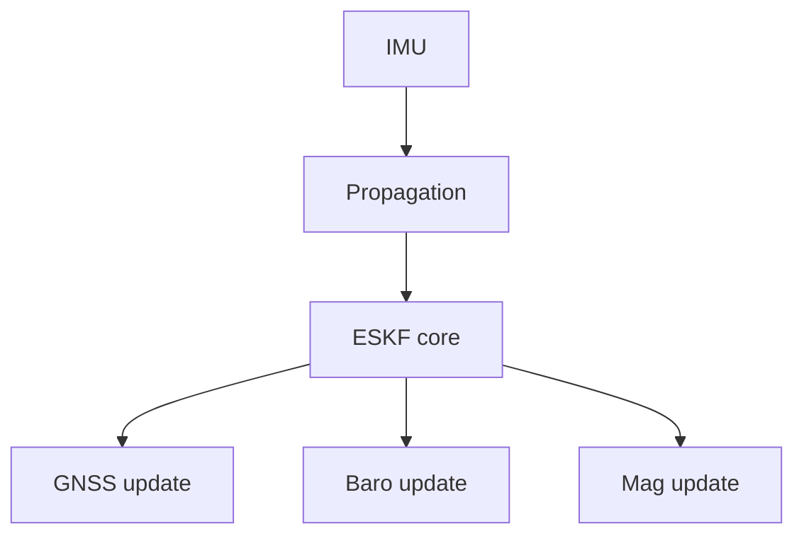
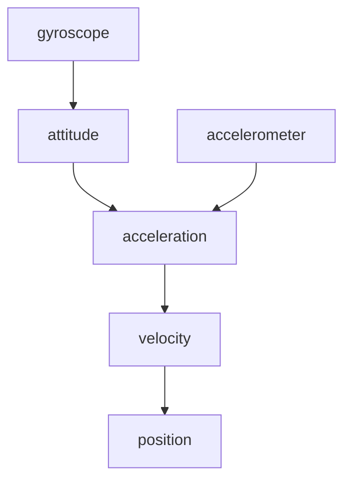
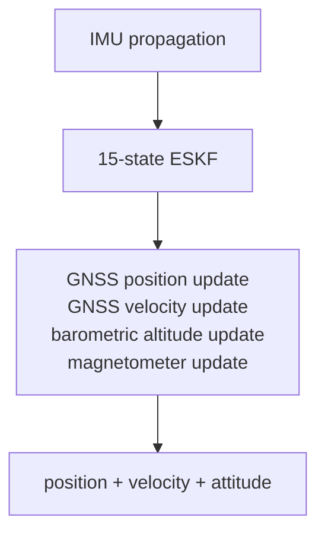

# Design

How `fusion-nav` is built and why. For how to use it see [README.md](README.md); for the
mathematics see [EQUATIONS.md](EQUATIONS.md); for positioning and decisions already made see
[GOALS.md](GOALS.md).

> **Status: API sketch.** The structure below is the intended one. The types and signatures
> exist; the estimation mathematics does not.

## Error-State Kalman Filter

`fusion-nav` uses an Error-State Kalman Filter rather than representing the complete navigation
state directly in the Kalman filter.

The nominal navigation state is

| nominal state       | dimension |
| ------------------- | --------- |
| position            | 3         |
| velocity            | 3         |
| attitude quaternion | 4         |
| accelerometer bias  | 3         |
| gyroscope bias      | 3         |
| **total**           | **16**    |

The corresponding error state is

| error state        | dimension |
| ------------------ | --------- |
| position error     | 3         |
| velocity error     | 3         |
| attitude error     | 3         |
| accelerometer bias | 3         |
| gyroscope bias     | 3         |
| **total**          | **15**    |

The filter therefore maintains a `15 × 15` error covariance matrix while orientation is
represented by a quaternion in the nominal state.

Using a three-dimensional attitude error avoids treating the four quaternion components as
independent Kalman states and preserves the unit-quaternion constraint naturally.

See [state definitions](EQUATIONS.md#state-definitions).

## Architecture

The filter is intentionally sensor-independent at its core.

Sensor drivers and hardware interfaces are outside the scope of the crate. Applications provide
measurements together with their associated uncertainty.

### Module map

| module | holds |
| ------ | ----- |
| `src/eskf.rs` | `Eskf`, the whole public filter: `initialize*`, `predict`, `fuse_*`, `state`, `reset_*_to` |
| `src/init.rs` | initialization types (`StaticSample`, `Alignment`, `Coarse`, `InitError`) and the pure functions the `initialize*` methods commit |
| `src/propagate.rs` | `ImuSample`; equations (9)–(22) land here |
| `src/state.rs` | `State`, `Covariance`, and `ErrorState`, whose order defines the covariance layout `[δp δv δθ δβa δβg]` |
| `src/health.rs` | `Propagation`, `Fusion`, `Status`, `Validity`, per-source diagnostics |
| `src/config.rs` | tuning; each default's doc comment records its evidence or says it is a placeholder |
| `src/units.rs`, `src/frames.rs` | typed quantities and the sealed `Ned` / `Enu` / `Body` frame markers |

The [equation-to-code mapping](EQUATIONS.md#equation-to-code-mapping) names the function
intended to implement each numbered equation, including modules not yet written.

## State Propagation

The IMU drives the high-rate propagation step.

Gyroscope measurements are bias corrected and propagate attitude.

Accelerometer measurements are bias corrected, rotated into the navigation frame, and gravity is
added.

The resulting acceleration propagates velocity and position.

The covariance is propagated alongside the nominal state using the linearized error-state
dynamics.

See [nominal state propagation](EQUATIONS.md#nominal-state-propagation) and
[covariance propagation](EQUATIONS.md#covariance-propagation).

## Measurement Updates

External sensors constrain IMU drift through independent measurement updates.

See [observation models](EQUATIONS.md#observation-models) for the measurement Jacobians.

### GNSS Position

GNSS position observations correct the estimated navigation position directly.

### GNSS Velocity

GNSS velocity observations correct the estimated navigation velocity directly.

GNSS velocity is particularly useful because velocity errors otherwise accumulate rapidly from
accelerometer and attitude errors.

### Barometric Altitude

Barometric altitude provides an independent vertical-position observation.

This constrains vertical drift between GNSS updates and can provide higher-rate vertical
corrections than GNSS alone.

The barometer reference is captured once at initialization and held as a constant. There is no
barometer bias state, so slow drift in that reference — weather, ground effect, sensor warm-up —
is not estimated and appears directly as vertical position error. See
[barometric reference as a constant](GOALS.md#barometric-reference-as-a-constant).

### Magnetometer

Magnetometer measurements constrain yaw drift caused by gyroscope bias.

Fusion is **heading only** by default: the field is reduced to a single scalar heading and fused
as one measurement, leaving roll and pitch to gravity where they are well determined. A magnetic
disturbance can then corrupt one state rather than three, and the innovation gate has a
one-dimensional quantity to act on.

Three-axis field fusion is documented for completeness but is not the default. `fusion-nav`
carries no magnetic-field or magnetometer-bias states, so hard- and soft-iron calibration is the
application's responsibility; an uncalibrated magnetometer produces a heading bias the filter
cannot detect.

See [magnetometer, heading only](EQUATIONS.md#magnetometer-heading-only).

## Innovation Gating

Measurements should not automatically be accepted simply because they are available.

For each observation the filter computes the innovation and its covariance, then uses the
normalized innovation to reject measurements inconsistent with the current state estimate.

This provides a common mechanism for handling GNSS glitches, barometer transients, and magnetic
interference.

Rejections are counted and exposed. A filter that silently discards every measurement looks
identical to one that is working.

See [innovation gating](EQUATIONS.md#innovation-gating).

### Measurement rejection

Gating is self-sealing: if the filter itself is wrong, correct measurements look inconsistent,
all are rejected, and the filter dead-reckons while looking confident. So health is tracked per
source and carried on the estimate, and recovery is left to the application. The user-facing
side is in [README.md](README.md#health-reporting); the reasoning in
[rejection handling](GOALS.md#rejection-handling-report-do-not-self-recover),
[per-quantity validity](GOALS.md#per-quantity-validity-not-one-ladder), and
[gate lockout](EQUATIONS.md#gate-lockout).

## Embedded Design

`fusion-nav` is intended to be suitable for microcontrollers used in flight-control applications.

The implementation therefore favors:

* fixed-size matrices
* compile-time dimensions
* stack allocation
* no dynamic allocation
* deterministic execution time
* `no_std`
* explicit numerical types
* minimal dependencies

The only dependency is [`nalgebra`](https://crates.io/crates/nalgebra), built `no_std` with its
`libm` feature, which supplies the fixed-size matrix algebra and the quaternion type. It fixes the
MSRV at 1.89.

A 15-state filter requires a `15 × 15` covariance matrix containing 225 scalar values, which in
`f32` is 900 bytes.

The covariance is not the whole cost. A measurement update in Joseph form also needs the
transition matrix, the `(I − KH)` product, and at least one `15 × 15` temporary, each another
900 bytes, so the realistic working set is a few kilobytes rather than one. Peak stack usage
depends on how aggressively temporaries are reused, which is exactly why the intent is to
**measure and publish** the figure per operation rather than estimate it here.

A few kilobytes is still comfortable on an STM32H7-class flight controller while providing a full
inertial-navigation state.

`Status` is a payload-free enum and `state()` stays small and `Copy`, so reading it in a control
loop costs nothing. Timing detail lives in `diagnostics()`, which is not on the hot path.

## Initial Scope

The first version focuses on:

Features deliberately deferred include:

* wind estimation
* terrain estimation
* magnetic-field state estimation
* magnetometer bias states
* optical flow
* visual odometry
* range finder fusion
* airspeed fusion
* multiple simultaneous navigation filters
* automatic sensor-source switching

These can be added as concrete use cases require them. The initial implementation intentionally
focuses on the core navigation problem rather than reproducing every feature of mature autopilot
estimators such as PX4 EKF2.

## Design Philosophy

`fusion-nav` favors a small, understandable navigation estimator over a feature-complete autopilot
navigation subsystem.

The filter should make the underlying mathematics visible rather than hiding it behind a large
abstraction layer.

Where practical, equations in the implementation should correspond directly to the equations
documented in the crate. The [equation-to-code mapping](EQUATIONS.md#equation-to-code-mapping) is
the concrete form of that promise: every numbered equation names the function that implements it.

The intended result is an estimator that is:

* small enough to understand
* fast enough for embedded use
* complete enough for real navigation

## References

The architecture is informed by established error-state inertial-navigation literature and
production UAV estimators, including PX4 EKF2.

PX4 is used as a reference for practical topics such as:

* IMU propagation
* covariance propagation
* sensor fusion
* innovation gating
* bias estimation
* estimator initialization
* numerical robustness

`fusion-nav` is an independent Rust implementation rather than a source-code port of PX4 EKF2.

The mathematical formulation follows J. Solà, *Quaternion kinematics for the error-state Kalman
filter* ([arXiv:1711.02508](https://arxiv.org/abs/1711.02508)), which is the primary source for
the error-state formulation and its Jacobians. Full reference list in
[EQUATIONS.md](EQUATIONS.md#references).
