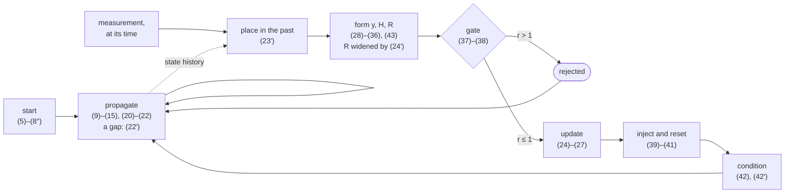
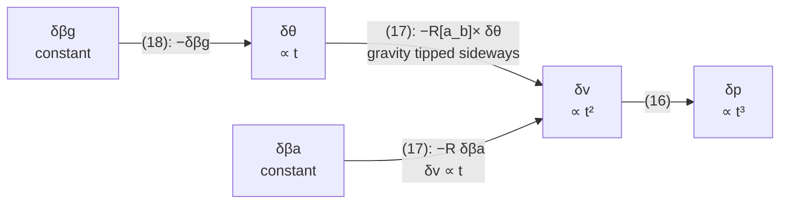

# Equations

> **Status: the estimation mathematics is implemented.** Every equation below is built except
> the three-axis magnetometer, (31)–(33), which is
> [out of scope](GOALS.md#magnetometer-without-magnetic-field-states) rather than pending, and
> equation (5′), whose subtraction is measured and reported but not applied (not built: #59). The
> [equation-to-code mapping](#equation-to-code-mapping) names the function implementing each,
> and marks those two. One unnumbered correction is unbuilt too: the barometer's curvature term
> beside (30), #124.

This document is the normative mathematical description of `fusion-nav`. Equations are numbered
so that the implementation can cite them directly; see
[Readable mathematics](GOALS.md#3-readable-mathematics) for why that matters.

The documents, by question: [README.md](README.md) is how to use the filter, [GOALS.md](GOALS.md)
why it exists, [DESIGN.md](DESIGN.md) how it is built, this one what it computes, and
[GLOSSARY.md](GLOSSARY.md) what the words mean.

## The filter at a glance

The equations in the order the filter runs them. A start runs once. Propagation runs on every IMU
sample. An update runs on every measurement, against the state at the time it was taken.



| stage | equations | section |
| --- | --- | --- |
| what is estimated | (1)–(4) | [state definitions](#state-definitions) |
| start | (5)–(8″) | [initialization](#initialization) |
| propagate | (9)–(22′) | [nominal state](#nominal-state-propagation), [error dynamics](#error-state-dynamics), [covariance](#covariance-propagation) |
| update | (23)–(27) | [measurement update](#measurement-update) |
| gate | (37)–(38) | [innovation gating](#innovation-gating) |
| inject and reset | (39)–(41) | [error injection and reset](#error-injection-and-reset) |
| condition | (42), (42′) | [numerical conditioning](#numerical-conditioning) |
| the frame's origin | (43)–(44) | [geodetic origin](#geodetic-origin) |
| what each sensor reads | (28)–(36′) | [observation models](#observation-models) |
| when, and how often | (23′), (24′) | [measurement time and correlation](#measurement-time-and-correlation) |

The sections below follow that order. Equations keep the numbers the code cites, so the numbers
jump: (27) is followed by (37)–(44), then (28)–(36) with the unbuilt (31)–(33) last, then (23′)
and (24′). Within initialization, (5′) follows (8′).

## Notation and conventions

### Frames

Frame labels appear only as subscripts on vectors: $`a_b`$ is a body-frame vector, $`a_n`$ a
navigation-frame vector.

| symbol | meaning |
| ------ | ------- |
| $`n`$ | navigation frame, North-East-Down |
| $`b`$ | body frame |

The navigation frame is down-positive, so gravity has a **positive** $`z`$ component.

The attitude error is a **local** (body-frame) perturbation, $`q = \hat{q} \otimes \delta q`$.
Every Jacobian below follows from that choice. The global alternative
$`q = \delta q \otimes \hat{q}`$ does not flip signs; it moves $`R`$. Solà (295) and (311) against
his (238) and (270) give $`-[\,R a_b\,]_\times`$ for $`-R[\,a_b\,]_\times`$ in (17) and (20),
$`I`$ for $`R\{\omega\Delta t\}^\mathsf{T}`$ in the attitude block, and $`-R\Delta t`$ for
$`-I\Delta t`$ where the gyroscope bias enters. Solà numbers are v1's throughout; see
[Correspondence with Solà](#correspondence-with-solà).

### States and measurements

| symbol | meaning | units |
| ------ | ------- | ----- |
| $`p, v`$ | position and velocity, navigation frame | m, m s⁻¹ |
| $`q`$ | unit quaternion rotating body to navigation, Hamilton convention, scalar first | — |
| $`R(q)`$ | rotation matrix equivalent of $`q`$, body to navigation | — |
| $`\beta_a, \beta_g`$ | accelerometer and gyroscope bias, body frame | m s⁻², rad s⁻¹ |
| $`a_m, \omega_m`$ | raw accelerometer and gyroscope measurements, body frame | m s⁻², rad s⁻¹ |
| $`g`$ | gravity vector in the navigation frame | m s⁻² |
| $`m_n`$ | reference magnetic field, navigation frame | normalized |
| $`D_m`$ | magnetic declination | rad |
| $`\alpha`$ | barometric altitude above its own reference, positive **up** | m |

Biases are written $`\beta`$ rather than $`b`$ so that they never collide with the body-frame
subscript.

### Filter quantities

| symbol | meaning | dimension |
| ------ | ------- | --------- |
| $`\delta x`$ | error state | 15 |
| $`P`$ | error covariance | 15 × 15 |
| $`F`$ | discrete state transition matrix | 15 × 15 |
| $`Q`$ | discrete process noise | 15 × 15 |
| $`H`$ | measurement Jacobian, $`H = \left.\partial h / \partial \delta x\right\rvert_{\hat{x}}`$ | dim(z) × 15 |
| $`R_m`$ | measurement noise covariance | dim(z) × dim(z) |
| $`y`$ | innovation | dim(z) |
| $`S`$ | innovation covariance | dim(z) × dim(z) |
| $`K`$ | Kalman gain | 15 × dim(z) |
| $`G`$ | reset Jacobian | 15 × 15 |
| $`w_a, w_g`$ | accelerometer and gyroscope white noise | — |
| $`w_{\beta a}, w_{\beta g}`$ | bias random-walk driving noise | — |
| $`\sigma_a, \sigma_g, \sigma_{\beta a}, \sigma_{\beta g}`$ | the spectral densities of those four, as `ImuNoise` states them | per $`\sqrt{\mathrm{Hz}}`$ |
| $`A`$ | continuous error dynamics (16)–(19) as a matrix, which (20) discretizes and (23′) reads | 15 × 15 |
| $`b`$, $`q_b`$ | error in the barometric reference $`\alpha_0`$, and its random-walk density, (30′) | scalar |
| $`\tau`$ | a measurement's age in (23′); a source's correlation time in (24′) | s |
| $`\rho`$ | the fraction of error two readings share, (24′) | — |

### Operators

| symbol | meaning |
| ------ | ------- |
| $`\hat{x}`$ | estimated (nominal) quantity |
| $`[\,u\,]_\times`$ | skew-symmetric matrix of $`u`$, so that $`[\,u\,]_\times v = u \times v`$ |
| $`\otimes`$ | quaternion product |
| $`\mathrm{Exp}(\phi)`$ | rotation vector to quaternion, $`\mathrm{Exp}(\phi) = [\cos\tfrac{\lVert\phi\rVert}{2},\ \tfrac{\phi}{\lVert\phi\rVert}\sin\tfrac{\lVert\phi\rVert}{2}]`$ |
| $`R\{\phi\}`$ | rotation **matrix** of the rotation vector $`\phi`$, equal to $`R(\mathrm{Exp}(\phi))`$ |
| $`\mathrm{wrap}(\cdot)`$ | angle wrapped to $`(-\pi, \pi]`$ |
| $`e_3`$ | $`[0, 0, 1]^\mathsf{T}`$ |

### Gravity

$`g = [0, 0, \gamma]^\mathsf{T}`$ with $`\gamma`$ the local gravity magnitude, entering the
propagation of (11) and the levelling of (5)–(8). It is `Config::gravity`, the WGS-84 standard
value 9.80665 m s⁻² unless configured, and constant for a filter's life. A site's value comes
offline from `Geodetic::normal_gravity` (NGA.STND.0036 (4-1) and (4-3)), which `replay --derive`
prints from a log, for the reasons in
[the decision](GOALS.md#local-gravity-configured-derived-offline).

## State definitions

The nominal state has 16 components:

**(1)**

```math
x = \begin{bmatrix} p & v & q & \beta_a & \beta_g \end{bmatrix}^\mathsf{T}
```

The error state has 15:

**(2)**

```math
\delta x = \begin{bmatrix} \delta p & \delta v & \delta\theta & \delta\beta_a & \delta\beta_g \end{bmatrix}^\mathsf{T} \in \mathbb{R}^{15}
```

True state as nominal composed with error:

**(3)**

```math
p = \hat{p} + \delta p, \quad v = \hat{v} + \delta v, \quad q = \hat{q} \otimes \delta q, \quad \beta_a = \hat{\beta}_a + \delta\beta_a, \quad \beta_g = \hat{\beta}_g + \delta\beta_g
```

with the small-angle approximation

**(4)**

```math
\delta q \approx \begin{bmatrix} 1 & \tfrac{1}{2}\delta\theta \end{bmatrix}^\mathsf{T}
```

Using a three-component $`\delta\theta`$ rather than four quaternion states keeps the covariance
non-singular and preserves the unit-norm constraint on $`q`$ automatically.

## Initialization

The filter starts from a quasi-static interval: the vehicle stationary, gravity the only specific
force. Initialization quality dominates early flight, so the static assumption is validated, not
assumed.

Roll and pitch follow from the accelerometer. With $`f = a_m`$ averaged over the interval:

**(5)**

```math
\phi_0 = \mathrm{atan2}(-f_y,\ -f_z), \qquad \theta_0 = \mathrm{atan2}\left(f_x,\ \sqrt{f_y^2 + f_z^2}\right)
```

The signs follow from the down-positive convention: a level, stationary accelerometer reads
$`f = [0, 0, -\gamma]^\mathsf{T}`$. A window taken in motion is levelled by (5′),
[after (8′)](#levelling-a-window-taken-in-motion).

Yaw follows from the magnetometer, levelled by the roll and pitch just computed. With
$`R_0 = R_y(\theta_0) R_x(\phi_0)`$ and $`m_b`$ the averaged magnetometer reading:

**(6)**

```math
\tilde{m} = R_0\, m_b, \qquad \psi_0 = D_m - \mathrm{atan2}(\tilde{m}_E,\ \tilde{m}_N)
```

The nominal state is then initialized as

**(7)**

```math
\hat{q}_0 = q_{ZYX}(\psi_0, \theta_0, \phi_0), \qquad \hat{p}_0 = 0, \qquad \hat{v}_0 = 0, \qquad \hat{\beta}_{a,0} = 0, \qquad \hat{\beta}_{g,0} = K\, \overline{\omega_m}
```

with $`q_{ZYX}`$ the quaternion of the yaw-pitch-roll sequence
$`R = R_z(\psi) R_y(\theta) R_x(\phi)`$, matching $`R_0`$ in (6).

The gyroscope bias is observable at rest. The window's mean rate
$`\overline{\omega_m} = \sum \Delta\theta / \sum T`$ measures it, weighed against the prior per
body axis by $`K = \sigma_{\beta g}^2 / (\sigma_{\beta g}^2 + R)`$, with $`\sigma_{\beta g}`$
`Initialization::sigma_gyro_bias` and $`R`$ the variance of the mean, given with (8). On the
corpus's still windows $`K`$ is near one (`DESIGN.md`,
[`Initialization`](DESIGN.md#initialization)); one sample's $`R`$ is far above the prior's, and
$`K`$ near zero. The accelerometer bias is not separable from attitude error at rest and starts
at zero.

The weighing needs a window taken **at rest**, which is what makes the bias observable. A window
taken in motion offers the vehicle's own rotation under the same name, so it starts at zero
instead, $`K = 0`$. The test is `init::at_rest`, not the `Alignment`: the same distinction `α₀`
draws below. Neither production estimator averages at all. ArduPilot zeroes the bias at bootstrap
(`libraries/AP_NavEKF3/AP_NavEKF3_core.cpp:546`, `368dc0c4`); PX4 refuses to initialize outside
0.8–1.2 g and 15°/s (`src/modules/ekf2/EKF/ekf.cpp:213-227`, `c4e4ef98`).

The initial covariance is diagonal apart from attitude and the attitude's correlation with the
accelerometer bias:

**(8)**

```math
P_0 = \begin{bmatrix}
\sigma_{p,0}^2 I & 0 & 0 & 0 & 0 \\
0 & \sigma_{v,0}^2 I & 0 & 0 & 0 \\
0 & 0 & P_{\theta\theta} & P_{\theta\beta_a} & 0 \\
0 & 0 & P_{\theta\beta_a}^\mathsf{T} & \sigma_{\beta a,0}^2 I & 0 \\
0 & 0 & 0 & 0 & \operatorname{diag}(\sigma_{\beta g,0}^2)
\end{bmatrix}
```

```math
P_{\theta\theta} = R(\hat q_0)^\mathsf{T}\, \mathrm{diag}(\bar\sigma_{\text{tilt}}^2, \bar\sigma_{\text{tilt}}^2, \sigma_{\psi,0}^2)\, R(\hat q_0),
\qquad
P_{\theta\beta_a} = -\frac{\sigma_{\beta a,0}^2}{\gamma} [\hat d]_\times,
\qquad
\bar\sigma_{\text{tilt}}^2 = \frac{\sigma_{\beta a,0}^2}{\gamma^2} + \max\left( \sigma_{\text{tilt},0}^2 - \frac{\sigma_{\beta a,0}^2}{\gamma^2},\; \lambda \right)
```

with $`\hat d = R(\hat q_0)^\mathsf{T} e_3`$, navigation down in body axes, and $`\lambda`$ the
window's own scatter across gravity as a tilt. With $`C`$ the sample covariance of the specific
force, per horizontal axis,
$`\lambda = \tfrac{1}{2}\bigl(\operatorname{tr} C - \hat d^\mathsf{T} C \hat d\bigr) / (N \gamma^2)`$.
A window of one measures none, and takes $`\lambda = \sigma_{\text{tilt},0}^2`$.

The gyroscope-bias prior is what the weighing of (7) leaves. Where the window was at rest, per
body axis,

```math
\sigma_{\beta g,0}^2 = K R + \Omega_{ie}^2, \qquad R = \frac{\hat N^2}{T} \cdot \frac{J - 1}{J - 3}
```

with $`\hat N`$ the gyroscope's density over $`J`$ blocks, defined by
[(8″)](#what-a-still-window-measures-of-its-sensors) below, and $`T`$ the window's span.
$`\hat N^2`$ is a $`\chi^2`$ of $`J - 1`$ degrees of freedom, and $`(J - 1)/(J - 3)`$ is the
expected overconfidence its inverse carries. So $`R`$ is scaled by it and needs four blocks.
Under four, or on an axis whose blocks did not scatter at all, $`R = N^2 / T`$ at the configured
`ImuNoise::gyro_white`. $`\Omega_{ie}`$ is the Earth's rotation rate, which (9)–(15) leave out
and $`\overline{\omega_m}`$ therefore holds. In motion $`\sigma_{\beta g,0}`$ is
`Initialization::sigma_gyro_bias`.

The cross block is what (5) does to a biased accelerometer. At rest the sensor reads
$`\bar f = R^\mathsf{T}(-\gamma e_3) + \beta_a`$, and (5) levels to $`\bar f`$ as though
$`\hat\beta_{a,0} = 0`$ of (7) were the bias, so to first order the committed attitude is wrong by

```math
\delta\theta = -\frac{1}{\gamma} [\hat d]_\times\, \delta\beta_a
```

The horizontal bias reads as a lean. The vertical one reads as nothing, since it moves
$`\lVert \bar f \rVert`$ and not its direction. At $`t_0`$ the tilt error and the
accelerometer-bias error are one error, and
$`P_{\theta\beta_a} = \mathrm{E}[\delta\theta\, \delta\beta_a^\mathsf{T}]`$ says so. Left
out, velocity fusion that learns the bias has no way to move the tilt it caused.

The share of the tilt the bias explains, $`\sigma_{\beta a,0}/\gamma`$ per horizontal axis, is
part of $`\sigma_{\text{tilt},0}`$ rather than added to it; where it is the larger, it is the
prior. What is left once the bias is known, the Schur complement across tilt, is the second term,
and $`\lambda`$ keeps it from zero. At the defaults the bias's share exceeds
$`\sigma_{\text{tilt},0}`$, so without $`\lambda`$ the prior would call every level error the
bias and leave none for the vibration or noise the average levelled through. A seeded start
commits the caller's covariance instead, having levelled nothing. What the correlation and the
`max` were each measured against is `init::initial_covariance`'s.

Tilt and yaw are uncertainties about navigation axes: rotation about north and east, and about
down. $`\delta\theta`$ is a body-frame rotation vector, whose navigation-frame counterpart is
$`R(\hat q)\,\delta\theta`$, as (36) uses. So the attitude block is the navigation-frame diagonal
rotated into body axes, diagonal only when the start is level. On a vehicle standing on its tail,
body x points up and the yaw prior belongs on $`\delta\theta_x`$. Every reader of tilt and
heading takes the same diagonal back out, $`\mathrm{diag}(R\, P_{\theta\theta} R^\mathsf{T})`$
(`AttitudeVariance`): `Validity`, the alignment latch and the heading adoption. (36′) reads the
same block's largest horizontal eigenvalue instead.

Yaw uncertainty $`\sigma_{\psi,0}`$ is much larger than tilt uncertainty
$`\sigma_{\text{tilt},0}`$: roll and pitch come from gravity and are well determined, while yaw
comes from the magnetometer and inherits its calibration error.

A window that is *not* a static interval keeps that shape and reads both figures off what it
measured. (5)–(6) level **averages**, so what bounds their attitude is how far those averages sit
from what a still vehicle reads, not how far the worst sample strayed:

**(8′)**

```math
\sigma_{\text{tilt},0} = \max\left( \sigma_{\text{tilt}},\quad
\frac{\bigl|\, \lVert \bar f \rVert - \gamma \,\bigr|}{\gamma},\quad
\bigl\lVert (I - \hat d\, \hat d^\mathsf{T})\, \bar\omega_r\, T \bigr\rVert,\quad
\angle\bigl( \bar f_1,\, \bar f_2 \bigr) \right)
```

```math
\sigma_{\psi,0} = \min\left( \max\bigl( \sigma_\psi,\; \tan\delta \cdot \sigma_{\text{tilt},0},\; \bigl| \hat d \cdot \bar\omega_r\, T \bigr|,\; \lvert \psi_2 - \psi_1 \rvert \bigr),\; \frac{\pi}{\sqrt 3} \right),
\qquad
\tan\delta = \frac{\bigl| \bar m \cdot \hat d \bigr|}{\bigl\lVert (I - \hat d\, \hat d^\mathsf{T})\, \bar m \bigr\rVert}
```

with $`T`$ the window's span, $`\hat d = -\bar f / \lVert \bar f \rVert`$ the direction (5)
levelled to, and subscripts 1 and 2 the same averages over the first and second **half** of the
window. $`\psi_i`$ is the heading (6) yields from that half alone, so the declination cancels.
The rotation charged is what (7) did *not* take, $`\bar\omega_r = \bar\omega - \hat\beta_{g,0}`$:
a window at rest commits the whole average as gyroscope bias, and the same quantity cannot be both
removed from the state and charged to the prior around it. Where (7) left the bias at zero,
$`\bar\omega_r = \bar\omega`$.

The code takes the window one sample at a time and cannot know its middle until it ends. It
splits at the nearest of the block boundaries it keeps, which leaves each half between 37.5 % and
62.5 % of the window (`init::BLOCKS`).

Past the configured floor and the specific force that is not gravity, two witnesses bound how far
the attitude moved while it was being averaged. **Both** are needed, because each is blind to
what the other sees:

* **The gyroscope's net rotation** splits about $`\hat d`$. Across it, it spoils the tilt, since
  $`\dot{\hat g} = -\omega \times \hat g`$ has magnitude $`\lVert \omega_\perp \rVert`$. About
  it, it turns the vehicle without moving that vector in body axes, and spoils the heading
  instead. But a net rotation cancels for a vehicle that swings out and comes back, charging
  nothing where the attitude (5) commits is the middle of an arc already left.
* **The disagreement between the window's two halves** never cancels. It cannot see a
  *coordinated* turn, though: the specific force stays put in body axes while the vehicle banks,
  so every average agrees and the tilt is wrong by the bank angle.

Neither alone is a bound; the evidence is in `data/scenarios.txt`.

$`\sigma_{\psi,0} = \pi/\sqrt 3`$, a heading uniform on the circle, where no magnetometer
observed the window, where its field has no horizontal part, or where the bound above would claim
more spread than a circle holds. The dip $`\delta`$ is read off the same averaged field (6) takes
its heading from, and is the rate at which a tilt error turns that heading.

### Levelling a window taken in motion

(5) reads $`f`$ as gravity alone only while the vehicle is still; an accelerating vehicle breaks
that. Equation (11) read backwards says by how much, $`R^\mathsf{T}(a_n - g) = f`$, so the vector
to level is the averaged specific force with the vehicle's own acceleration taken out:

**(5′)**

```math
\bar{f}' = \bar{f} - R^\mathsf{T} \bar{a}_n, \qquad
\bar{a}_n = \frac{v_n(t_1) - v_n(t_0)}{t_1 - t_0}
```

with $`v_n`$ the GNSS velocity at the first and the last sample of the window carrying one. At
rest $`\bar a_n = 0`$ and (5′) is (5). Applying (5) to $`\bar f'`$ rather than to $`\bar f`$ is
the whole of in-motion levelling
([GOALS.md, alignment option 4](GOALS.md#alignment-beyond-the-static-window)).

Two properties keep it a *coarse* alignment, and neither improves with care:

* $`\bar a_n`$ is a difference of two noisy velocities over the span between them. A receiver
  reporting $`\sigma_v`$ = 0.28 m s⁻¹ at 1 Hz, differenced over 1 s, puts 0.39 m s⁻² of noise
  into a term whose whole purpose is to be subtracted from 9.8. The corrected tilt inherits an
  error the static case does not have, so the result must not promote to `Alignment::Static`.
  The window mean comes from the endpoints for this reason: the mean of a derivative is its
  endpoint difference, and differencing the samples in between would add their noise back.
* $`R^\mathsf{T}`$ is part of what is being solved for. The correction splits by axis, and the
  split decides how much of it is available. The third column of $`R^\mathsf{T}`$ is the
  body-frame down direction, so the **vertical** part of $`\bar a_n`$ needs only the tilt. It is
  taken by fixed-point iteration from the uncorrected (5): one pass is worth
  $`\lVert\bar a_n\rVert / \gamma`$, and the count is fixed rather than tested for convergence,
  for the reason `geodetic.rs` fixes its own. The **horizontal** part needs the yaw as well, so
  it is available only where (6) supplies one, iterating (5) and (6) together. A bare vehicle
  accelerating horizontally with no heading source is the case option 4 does not reach on its
  own; [option 5](GOALS.md#alignment-beyond-the-static-window) is for that.

Solving instead for the rotation that carries $`\bar f`$ onto the known navigation vector
$`\bar a_n - g`$ would need no iteration and would observe part of the yaw. But it degenerates as
$`\bar a_n \to 0`$, the regime most launches sit in, and it couples heading into a step whose job
is tilt.

### What a still window measures of its sensors

A window at rest also measures each sensor's white noise. The filter reports it and never applies
it as noise: it is a floor under $`Q`$ and $`R_m`$, since a vehicle on the ground is quieter than
one in the air. What it does apply is $`\hat N^2 / T`$, how well this window's own average is
known, in the weighing of (7) and the bias prior of (8).

A white-noise density $`N`$ on a rate gives an increment of variance $`N^2 T`$ over any interval
$`T`$. So rates of samples $`\Delta t`$ apart scatter by $`N/\sqrt{\Delta t}`$, and (21) adds
$`N^2 \Delta t`$ per step. The window sums each IMU's increments into blocks $`B_j`$ of length
$`T_j \approx T`$ and weights each squared deviation by $`1/T_j`$, which makes blocks of unequal
length count alike:

**(8″)**

```math
\hat N^2 = \frac{1}{J - 1}\left( \sum_j \frac{B_j^2}{T_j} - \frac{\bigl(\sum_j B_j\bigr)^2}{\sum_j T_j} \right)
```

per axis, over $`J`$ closed blocks. With $`B_j = c\,T_j + e_j`$ for a constant rate $`c`$ (a
bias, gravity, the Earth's rotation) and $`\operatorname{Var} e_j = N^2 T_j`$, the first sum's
expectation is $`c^2 \sum T + J N^2`$ and the second's $`c^2 \sum T + N^2`$, so $`\hat N^2`$ is
unbiased and $`c`$ cancels. For blocks of one sample it is $`N = s\sqrt{\Delta t}`$, with $`s`$
the rates' standard deviation.

Blocks are $`T = 50`$ ms rather than single samples because a still airframe's samples are not
white. Vibration aliased near the sample rate cancels within a block, and filtered noise
accumulates across it; one sample's scatter would read the first as noise and miss the second.
`DESIGN.md`, [`WindowNoise`](DESIGN.md#windownoise), carries the corpus figures. The barometer's
floor is the plain sample variance of its distinct readings, the scatter (30) already takes for
$`\alpha_0`$ before dividing by their count.

## Nominal state propagation

The IMU supplies **increments**: a rotation $`\Delta\theta_m`$ integrated over $`\Delta t_\theta`$
and a velocity $`\Delta v_m`$, specific force integrated over $`\Delta t_v`$, as both PX4's
`imuSample` and ArduPilot's `imu_elements` carry them. The equations are written in rates, where
the algebra is clearer. The code evaluates each one multiplied through by its interval, so
$`\omega \Delta t_\theta`$ below is the corrected increment itself and no rate is ever formed. A
rate gyroscope is the case $`\Delta\theta_m = \omega_m \Delta t`$, which `ImuSample::from_rates`
forms. The two intervals are each increment's own. The time between samples is neither: it is
differenced from their timestamps, and the health timers and the gap test of
[coasting](#coasting-across-a-gap) read it.

Bias-corrected IMU measurements:

**(9)**

```math
\omega = \omega_m - \hat{\beta}_g, \qquad \omega\,\Delta t_\theta = \Delta\theta_m - \hat{\beta}_g \Delta t_\theta
```

**(10)**

```math
a_b = a_m - \hat{\beta}_a, \qquad a_b\,\Delta t_v = \Delta v_m - \hat{\beta}_a \Delta t_v
```

Specific force rotated into the navigation frame and gravity added, gravity over the same
$`\Delta t_v`$ the accelerometer integrated, so a vehicle at rest gains nothing whatever the two
intervals are:

**(11)**

```math
a_n = R(\hat{q})\, a_b + g, \qquad a_n \Delta t_v = R(\hat{q})\,(a_b \Delta t_v) + g\,\Delta t_v
```

Continuous-time kinematics:

**(12)**

```math
\dot{p} = v, \qquad \dot{v} = a_n, \qquad \dot{q} = \tfrac{1}{2}\, q \otimes \begin{bmatrix} 0 \\ \omega \end{bmatrix}, \qquad \dot{\beta}_a = 0, \qquad \dot{\beta}_g = 0
```

Discrete integration, translation over $`\Delta t = \Delta t_v`$ and rotation over
$`\Delta t = \Delta t_\theta`$:

**(13)**

```math
\hat{p} \leftarrow \hat{p} + \hat{v}\,\Delta t + \tfrac{1}{2} a_n \Delta t^2
```

**(14)**

```math
\hat{v} \leftarrow \hat{v} + a_n \Delta t
```

**(15)**

```math
\hat{q} \leftarrow \hat{q} \otimes \mathrm{Exp}(\omega\,\Delta t)
```

> **Order matters.** Equation (13) uses the **pre-update** velocity. Applying (14) first and then
> (13) adds a spurious $`a_n \Delta t^2`$ to position on every propagation step, a bias that
> integrates without bound. Implementations must evaluate (13) before (14), or compute both from
> a saved copy of $`\hat{v}`$.

Biases are modelled as random walks and are unchanged by propagation. The quaternion is
renormalized after (15).

## Error-state dynamics

Linearized continuous-time error dynamics, local attitude error:

**(16)**

```math
\delta\dot{p} = \delta v
```

**(17)**

```math
\delta\dot{v} = -R(\hat{q})\,[\,a_b\,]_\times\,\delta\theta \;-\; R(\hat{q})\,\delta\beta_a \;-\; R(\hat{q})\,w_a
```

**(18)**

```math
\delta\dot{\theta} = -[\,\omega\,]_\times\,\delta\theta \;-\; \delta\beta_g \;-\; w_g
```

**(19)**

```math
\delta\dot{\beta}_a = w_{\beta a}, \qquad \delta\dot{\beta}_g = w_{\beta g}
```

Equation (17) is the coupling that motivates the whole filter: an attitude error rotates the
measured specific force incorrectly, which integrates into velocity and then position. Each arrow
below is one term of (16)–(18), and each step integrates once more. From an unestimated gyroscope
bias the chain reaches position as $`t^3`$; from an accelerometer bias, which enters velocity
directly, its $`\delta v`$ grows only as $`t`$:



A measurement of any one of them reaches the others only through the correlations this chain
builds in $`P`$, which is why a velocity fix corrects attitude.

## Covariance propagation

Discrete state transition matrix. Every block is first order in $`\Delta t`$ except the attitude
block, which is exact:

**(20)**

```math
F = \begin{bmatrix}
I & I\Delta t & 0 & 0 & 0 \\
0 & I & -R(\hat{q})[\,a_b\,]_\times \Delta t & -R(\hat{q})\Delta t & 0 \\
0 & 0 & R\{\omega \Delta t\}^\mathsf{T} & 0 & -I\Delta t \\
0 & 0 & 0 & I & 0 \\
0 & 0 & 0 & 0 & I
\end{bmatrix}
```

Each $`\Delta t`$ is the interval of the increment its block reads: $`\Delta t_v`$ on the position
and velocity rows, $`\Delta t_\theta`$ on the attitude row. So $`[\,a_b\,]_\times \Delta t`$ is the
skew of the corrected velocity increment and $`\omega\Delta t`$ the corrected angle increment,
and $`F`$ reads the sample as it arrived.

The attitude block $`R\{\omega\Delta t\}^\mathsf{T}`$ may be approximated as
$`I - [\,\omega\,]_\times \Delta t`$ where the exact form's cost is not justified. That
approximation is the usual source of small attitude-covariance error at high rotation rates.

Discrete process noise, impulse form:

**(21)**

```math
Q = \mathrm{diag}\left( 0,\quad \sigma_a^2 \Delta t\, I,\quad \sigma_g^2 \Delta t\, I,\quad \sigma_{\beta a}^2 \Delta t\, I,\quad \sigma_{\beta g}^2 \Delta t\, I \right)
```

Covariance propagation:

**(22)**

```math
P \leftarrow F P F^\mathsf{T} + Q
```

The velocity block of (21) is the rotated accelerometer noise $`R \Sigma_a R^\mathsf{T}`$. Writing
it as $`\sigma_a^2 I`$ is exact only when the accelerometer noise is **isotropic**, since
$`R (\sigma_a^2 I) R^\mathsf{T} = \sigma_a^2 I`$ for orthogonal $`R`$. Real IMUs are not: the
z axis is typically noisier. Either use a per-axis $`\Sigma_a`$ and carry the rotation, or set
$`\sigma_a`$ to the worst axis and document the conservatism. The code takes the second, which
also lets $`Q`$ be built as a diagonal rather than a matrix.

### Densities, not per-sample σ

Every block of (21) carries $`\Delta t`$, the accelerometer's two over $`\Delta t_v`$ and the
gyroscope's over $`\Delta t_\theta`$, because the four $`\sigma`$ are **spectral densities**.
`ImuNoise`'s fields are stated per $`\sqrt{\mathrm{Hz}}`$, and `examples/simulate.rs` draws its
per-sample noise as $`\sigma / \sqrt{\Delta t}`$. So a density adds $`\sigma^2 \Delta t`$ of
variance over a step, for the white-noise blocks exactly as for the two random walks.

Solà writes the white-noise blocks with $`\Delta t^2`$ (262)–(265), and so do PX4 and ArduPilot,
because the $`\sigma`$ each names is one sample's increment rather than a density:

* Solà states $`\sigma_{\tilde a}`$ in m s⁻² (452) and holds it constant across the step
  (427), (444).
* PX4 has `sq(dt) * accel_var` with `accel_var = sq(ekf2_acc_noise)`
  (`src/modules/ekf2/EKF/python/ekf_derivation/generated/predict_covariance.h:161-164`,
  `EKF/covariance.cpp:119-133`, at `c4e4ef98e9`).
* ArduPilot has `dvxVar = sq(dt * _accNoise)`
  (`libraries/AP_NavEKF3/AP_NavEKF3_core.cpp:1177` at `368dc0c428`).

The two forms are one equation: $`\sigma_{\text{sample}} = \sigma / \sqrt{\Delta t}`$ carries
$`\sigma_{\text{sample}}^2 \Delta t^2`$ into $`\sigma^2 \Delta t`$. They differ in which is held
fixed when the rate changes. Holding the per-sample $`\sigma`$ fixed ties $`Q`$ to the sample
rate: the variance it adds over $`T`$ seconds is $`\sigma^2 \Delta t\, T`$, so the same airframe
logged at 400 Hz gets eight times less process noise than at 50 Hz. The logs in
`data/manifest.txt` run from 50 Hz to 250 Hz against one `Config`. Holding the density fixed is
rate-independent, and `propagate::process_noise` implements that.

The form does not convert a number. A production default is a per-step
$`\sigma_{\text{sample}}`$ at that estimator's own prediction step (10 ms for PX4, 12 ms for
ArduPilot), so the density it stands for is $`\sigma_{\text{sample}} \sqrt{\Delta t}`$, about a
tenth of it. The random walks carry the same per-step form, $`(\sigma \Delta t)^2`$ in both
estimators. `ImuNoise`'s bias walks are converted this way. Its white noise is kept at ten times
PX4's density, because replay measured this filter needing it; `DESIGN.md`,
[`ImuNoise`](DESIGN.md#imunoise), carries the figures and what each choice measured.

### Coasting across a gap

A step longer than `Config::max_predict_dt` has no sample describing it. One IMU reading cannot
stand for seconds of flight, so (9)–(22) are not run on it. What the filter can state about the
gap is an assumption and its uncertainty. It assumes the vehicle was unaccelerated and not
rotating, the input $`\omega = 0`$, $`a_b = -R(\hat{q})^\mathsf{T} g`$. Through (13)–(15) that
moves position by $`\hat{v}\Delta t`$ and nothing else; through (20) it gives the $`F`$ of the
same assumption. What the assumption leaves out enters as two white densities, an acceleration
$`\sigma_c`$ and a rotation $`\sigma_r`$ (`Config::coast`):

**(22′)**

```math
P \leftarrow F^n P (F^n)^\mathsf{T} + \sum_{k<n} F^k (Q + Q_r) (F^k)^\mathsf{T} + \sigma_c^2 \begin{bmatrix} \tfrac{T^3}{3} I & \tfrac{T^2}{2} I \\ \tfrac{T^2}{2} I & T I \end{bmatrix}_{pv},
\qquad Q_r = \mathrm{diag}(0,\ 0,\ \sigma_r^2 \Delta t\, I,\ 0,\ 0)
```

that is, (22) run $`n`$ times at $`\Delta t = T / n`$ with $`Q_r`$ added to (21), then the
acceleration's white-noise integral added once to the position–velocity block. `project` takes
$`n = \lceil T / 0.1\,\mathrm{s} \rceil`$ steps, at most 64, because a single first-order step
of (20) understates what reaches position. The acceleration term needs no steps: it reaches
nothing but position, through the $`I\Delta t`$ block that is exact at any $`\Delta t`$, so its
integral is exact in closed form. The rotation reaches velocity through (17)'s gravity term,
which only the steps integrate.

Refusing the step instead, as `Propagation::StepTooLong` does with `Config::coast` off, leaves a
moving vehicle stale by $`\hat{v}\Delta t`$ under a $`P`$ that did not grow, so every fix after
the gap is tens of $`\sigma`$ away and the gate locks the filter out
([gate lockout](#gate-lockout)). PX4 clamps an overlong step (`estimator_interface.cpp:102-108`
at `c4e4ef98e9`) and does the same.

## Measurement update

For an observation $`z`$ with model $`h(x)`$, Jacobian $`H`$, and noise covariance $`R_m`$:

**(23)**

```math
y = z - h(\hat{x})
```

**(24)**

```math
S = H P H^\mathsf{T} + R_m
```

**(25)**

```math
K = P H^\mathsf{T} S^{-1}
```

**(26)**

```math
\delta\hat{x} = K y
```

Because the error state is reset to zero after every update, its prior is always zero and (26)
has no prior term.

Covariance update in Joseph form, which preserves symmetry and positive definiteness under
finite precision:

**(27)**

```math
P \leftarrow (I - KH)\,P\,(I - KH)^\mathsf{T} + K R_m K^\mathsf{T}
```

Joseph form costs more than $`P \leftarrow (I - KH)P`$ but is the appropriate default for `f32`
arithmetic on an embedded target.

(23′) and (24′), [at the end](#measurement-time-and-correlation), refine this for a measurement's
age and its correlation.

### Adoption

Some measurements are written as the state rather than fused into it. Adoption is the update's
limit as the prior's variance goes to infinity, taken exactly. For a position fix:

```math
\hat{p} \leftarrow z, \qquad P_{pp} \leftarrow R, \qquad P_{p\ast} \leftarrow 0
```

which is $`\lim_{P_{pp} \to \infty}`$ of (24)–(27). The correlations go to zero because the new
error is the measurement's and has nothing to do with what preceded it. Adoption applies once to a
quantity never established, such as the first fix after a coarse start, with the vehicle moving
through somewhere it cannot name. It also applies to a source locked out past its
`Config::recovery` timeout; see [gate lockout](#gate-lockout).

## Innovation gating

The normalized innovation squared

**(37)**

```math
\epsilon = y^\mathsf{T} S^{-1} y
```

is compared against a threshold $`\gamma`$ from the chi-square distribution with
$`\dim(z)`$ degrees of freedom. The measurement is rejected when $`\epsilon > \gamma`$.

| dim(z) | observation | 95 % | 99 % | 99.9 % |
| ------ | ----------- | ---- | ---- | ------ |
| 1 | barometric altitude, GNSS height, magnetic heading | 3.8415 | 6.6349 | 10.8276 |
| 2 | GNSS horizontal position | 5.9915 | 9.2103 | 13.8155 |
| 3 | GNSS velocity, three-axis magnetometer | 7.8147 | 11.3449 | 16.2662 |

`Gate::at` holds these, typed by $`\dim(z)`$, and `Gates::at` builds one per source from a single
percentile. The test is joint over every component of $`z`$, not per axis as PX4 and ArduPilot
gate; why, and what it costs, is on `Gates`. A GNSS position fix is the one observation applied
as two: (28)'s north–east rows and its down row, each gated on its own (`GnssFusion`). A joint
test would let a height the estimate disagrees with reject a good horizontal fix. This is
ArduPilot's split, and PX4's two aid sources.

Rather than reporting $`\epsilon`$ directly, the filter exposes the dimensionless **test ratio**

**(38)**

```math
r = \frac{\epsilon}{\gamma}
```

so that $`r > 1`$ means rejected whatever the observation's degrees of freedom. One number is
then comparable across GNSS position, barometric altitude and magnetic heading. It is on the
scale of the innovation test ratios PX4 logs, so a replay puts rejection behaviour beside EKF2's.
The two group components differently, PX4's per axis; the glossary's
[innovation test ratio](GLOSSARY.md#coming-from-px4-or-ardupilot) says how.

This single mechanism covers GNSS glitches, barometer transients, and magnetic interference.

### Gate lockout

Gating creates its own failure, **gate lockout**. If the **filter** is wrong rather than the
measurement (a poor initialization, an unmodelled bias, a divergence), correct measurements are
inconsistent with the state. Every one is rejected, and the filter locks itself out of the very
data that would correct it. It then dead-reckons on the IMU alone, still reporting a solution
whose covariance says it is confident.

A filter that gates without a route out of this state is more dangerous than one that does not
gate at all.

`fusion-nav` therefore tracks, per observation source, the time since a measurement was last
accepted and the number of consecutive rejections, and reports an aggregate status beside the
state estimate. It also takes the route out: a source rejected for longer than `Config::recovery`
allows has its next measurement [adopted](#adoption) rather than discarded. The adoption sets the
covariance block to the measurement's `R`, which undoes the overconfidence that locked the gate
rather than only moving the state. Each source has its own switch. `Recovery`'s doc comment owns
the timeouts and the PX4 behaviour they follow; the decision is
[rejection handling](GOALS.md#rejection-handling-recover-by-default-opt-out-per-source).

The design obligation is that a recovery cannot be missed either: it is `Fusion::Reset` on the
returned outcome and `SourceHealth::recovered` in the diagnostics.

## Error injection and reset

The estimated error is composed into the nominal state:

**(39)**

```math
\hat{p} \leftarrow \hat{p} + \delta\hat{p}, \qquad \hat{v} \leftarrow \hat{v} + \delta\hat{v}, \qquad \hat{q} \leftarrow \hat{q} \otimes \mathrm{Exp}(\delta\hat{\theta})
```

**(40)**

```math
\hat{\beta}_a \leftarrow \hat{\beta}_a + \delta\hat{\beta}_a, \qquad \hat{\beta}_g \leftarrow \hat{\beta}_g + \delta\hat{\beta}_g
```

The error state is then reset to zero and the covariance transformed by the reset Jacobian:

**(41)**

```math
\delta x \leftarrow 0, \qquad P \leftarrow G P G^\mathsf{T}, \qquad G = \mathrm{diag}\left(I, I, I - [\tfrac{1}{2}\delta\hat{\theta}]_\times, I, I\right)
```

The attitude block of $`G`$ is frequently approximated as $`I`$. That is acceptable for small
corrections and should be an explicit, documented choice rather than an omission. `update.rs`
keeps the exact block, and `reset` says why.

$`I - [\tfrac{1}{2}\delta\hat{\theta}]_\times`$ is itself first order in the correction, which is
sound for an update and not for an adoption. Where the nominal attitude is replaced rather than
corrected (a heading adoption, which can turn it by half a circle), (41) still applies, and
$`G`$'s attitude block is the exact change of body frame,
$`R(\hat{q}^+)^\mathsf{T} R(\hat{q})`$. The tilt block is near-isotropic and largely survives
either choice. The attitude–bias cross-blocks do not: the bias states are in physical body axes
that do not turn with the nominal, so they transform on one side only.

## Numerical conditioning

Symmetry is enforced after each product that can drift off it:

**(42)**

```math
P \leftarrow \tfrac{1}{2}\left(P + P^\mathsf{T}\right)
```

and every variance is held at or above a floor of its own:

**(42′)**

```math
P_{ii} \leftarrow \max\left(P_{ii},\ \underline{\sigma}^2_i\right)
```

A variance that reaches zero is a state the filter claims to know exactly, and the claim is
self-sealing: $`K = P H^\mathsf{T} S^{-1}`$ is zero in that row, so no measurement moves it
again. With `f32`, rounding reaches it even where the arithmetic would not: the Joseph form of
(27) keeps $`P`$ positive semi-definite, and semi-definite includes zero. So the floor is not an
optional refinement. It is what keeps a 15-state filter stable over a long flight.

There is one floor per state group, not one for the matrix. The fifteen states carry five units,
m², (m/s)², rad², (m s⁻²)² and (rad/s)², and one small number is a different claim in each. Both
production estimators floor per group for the same reason. The values of
$`\underline{\sigma}^2`$ are `math.rs`'s `FLOOR`, written down beside the PX4 and ArduPilot
citations they come from and the headroom the corpus measures against them; a second copy here
would rot the moment a floor moved.

The two halves answer different faults, so they apply in different places. Symmetry repairs the
drift a product introduces, so it belongs to the product: (22) and (41). The floor bounds a
value, so it belongs to the value. `Eskf::commit_covariance` applies it to every covariance the
filter stores, which covers those no product built, such as an adopted block or the (8) a window
commits.

## Geodetic origin

The navigation frame is the plane tangent to the WGS84 ellipsoid at an origin
$`(\varphi_0, \lambda_0, h_0)`$, which the filter holds so that a geodetic fix and the estimate
are relative to the same point. A geodetic position goes to Earth-centered, Earth-fixed
coordinates (Groves (2.112)), with $`N`$ the radius of curvature in the prime vertical,

```math
r^e = \begin{bmatrix} (N + h)\cos\varphi\cos\lambda \\ (N + h)\cos\varphi\sin\lambda \\ \left(N(1 - e^2) + h\right)\sin\varphi \end{bmatrix},
\qquad N = \frac{a}{\sqrt{1 - e^2\sin^2\varphi}}
```

and a fix is its ECEF offset from the origin, rotated onto the origin's north, east and down:

**(43)**

```math
p = C_e^n \left(r^e - r^e_0\right), \qquad
C_e^n = \begin{bmatrix}
-\sin\varphi_0\cos\lambda_0 & -\sin\varphi_0\sin\lambda_0 & \cos\varphi_0 \\
-\sin\lambda_0 & \cos\lambda_0 & 0 \\
-\cos\varphi_0\cos\lambda_0 & -\cos\varphi_0\sin\lambda_0 & -\sin\varphi_0
\end{bmatrix}
```

(43) is exact at every range, including the poles; the only rounding is the final narrowing to
`f32`, 1 mm at 10 km. The inverse is $`r^e = r^e_0 + (C_e^n)^\mathsf{T} p`$ followed by ECEF to
geodetic. Its latitude is the fixed point of
$`\varphi = \operatorname{atan2}(z + e^2 N(\varphi)\sin\varphi,\ p_{xy})`$; each pass shrinks
the error by about $`e^2`$, so five passes from the geocentric latitude reach below a micrometre.
Height is $`h = p_{xy}\cos\varphi + z\sin\varphi - a\sqrt{1 - e^2\sin^2\varphi}`$, which
stays finite at the poles.

Exact conversion does not make the plane follow the Earth. At a horizontal distance $`d`$ from
the origin the plane sits $`d^2 / 2R`$ above the surface (8 cm at 1 km, 7.8 m at 10 km), so
$`-p_D`$ there is not height above the origin. A GNSS fix converted by (43) carries that
curvature and a barometer does not, which the [barometric model](#barometric-altitude) has to
account for.

The first geodetic fix $`z_g`$ places the origin. A filter that already has a position estimate
$`\hat{p}`$, having navigated relative to its own start, places it so the fix lands on the
estimate:

**(44)**

```math
r^e_0 = r^e(z_g) - (C_e^n)^\mathsf{T}\,\hat{p}
```

where $`C_e^n`$ is itself the origin's, so the equation is solved by iteration: start at the fix,
and take each pass's axes from the previous guess. The error shrinks by $`|\hat{p}| / R`$ a pass;
from 10 km, three passes leave 40 µm. `LocalOrigin::placing` runs five, then checks that the fix
lands on the estimate rather than assuming it did. Near a pole the passes need not converge, and
an origin putting the fix at the estimate need not exist at all.

The first fix then carries no information about position. That is correct: before it, the
filter's absolute position was unknown, not wrong. The fix is spent placing the origin and is not
fused as well, which would count it twice.

It does fix the position uncertainty. With $`e_g`$ the fix's error, the origin sits $`e_g`$ from
where it should, so the position error about it is $`\delta p = -e_g`$. Whatever $`P`$ said about
position relative to the start no longer applies, and $`e_g`$ is independent of every other error
state:

```math
P_{pp} \leftarrow R_g, \qquad P_{px} \leftarrow 0
```

the covariance half of `Eskf::reset_position_to`, with $`\hat{p}`$ unchanged. Fusing the fix
instead, at zero innovation, would give $`(P_{pp}^{-1} + R_g^{-1})^{-1}`$: after a static start,
where $`P_{pp}`$ is small, an estimate claiming centimeters about an origin placed to meters.

Without an estimate (a coarse start) the origin is the fix, and the fix is
[adopted](#adoption) as $`\hat{p} = 0`$.

## Observation models

Which error-state blocks each observation's $`H`$ touches directly, as fused at the present.
Everything else it corrects through the correlations in $`P`$. A measurement fused at its own
time, (23′), reaches further through $`A`$.

| observation | $`\delta p`$ | $`\delta v`$ | $`\delta\theta`$ | $`\delta\beta_a`$ | $`\delta\beta_g`$ | $`b`$ (30′) |
| --- | --- | --- | --- | --- | --- | --- |
| (28) GNSS position | ● | | | | | |
| (28′) at the antenna | ● | | ● | | | |
| (29) GNSS velocity | | ● | | | | |
| (29′) at the antenna | | ● | ● | | ● | |
| (30) barometric altitude | down | | | | | |
| (30′) with the offset | down | | | | | ● |
| (36) heading: magnetometer (34)–(35), dual antenna (35′) | | | ● | | | |
| (35″) course | | ● | ● | | | |

No observation touches $`\delta\beta_a`$: the accelerometer bias is learned only through (17)'s
coupling, and at rest that coupling cannot separate its horizontal part from tilt.

### GNSS position

**(28)**

```math
z = p_{\text{GNSS}}, \qquad h(x) = p, \qquad H = \begin{bmatrix} I_3 & 0 & 0 & 0 & 0 \end{bmatrix}
```

Where the filter has no position estimate at all, the first fix is [adopted](#adoption) rather
than fused.

**(28′)** At the antenna. A receiver measures where its antenna is, and the antenna sits at
$`r`$ from the IMU in body axes. With the body-frame attitude error of (2),
$`R = \hat{R}(I + [\delta\theta]_\times)`$, so
$`R r \approx \hat{R} r - \hat{R}[r]_\times \delta\theta`$:

```math
h(x) = p + R r, \qquad H = \begin{bmatrix} I_3 & 0 & -\hat{R}[r]_\times & 0 & 0 \end{bmatrix}
```

A zero arm is (28). PX4 subtracts $`\hat{R} r`$ from the fix and keeps (28)'s $`H`$; this one
carries the attitude term, so a fix observes attitude through a long mast. An adoption writes
$`z - \hat{R} r`$, and (44) places the origin under the estimate of the antenna rather than of
the IMU.

### GNSS velocity

**(29)**

```math
z = v_{\text{GNSS}}, \qquad h(x) = v, \qquad H = \begin{bmatrix} 0 & I_3 & 0 & 0 & 0 \end{bmatrix}
```

Velocity observations matter disproportionately. Velocity error grows linearly from
accelerometer and attitude error, so constraining it directly also constrains those states
through the covariance.

[Adoption](#adoption) applies to the first velocity solution after a coarse start too, and
matters more there: a static initialization knows the vehicle is at rest, a coarse one knows
nothing at all.

**(29′)** At the antenna, which moves about the IMU as the vehicle turns. With
$`\omega = \omega_m - \beta_g`$ from (9), $`\omega \times r = -[r]_\times \omega`$, and the attitude
error entering as in (28′):

```math
h(x) = v + R(\omega \times r), \qquad
H = \begin{bmatrix} 0 & I_3 & -\hat{R}[\omega \times r]_\times & 0 & \hat{R}[r]_\times \end{bmatrix}
```

$`\omega`$ is the rate over the solution's age, the attitude's own turn between the history's
state at the fix's time and now, (23′), rather than the last sample's. A zero arm is (29).

### Barometric altitude

The barometer reports altitude $`\alpha`$ above its own reference, positive up, while the
navigation frame is down-positive:

**(30)**

```math
z = -(\alpha - \alpha_0), \qquad h(x) = p_D, \qquad H = \begin{bmatrix} e_3^\mathsf{T} & 0 & 0 & 0 & 0 \end{bmatrix}
```

The barometer measures height, and the navigation frame is a plane. Written as above, (30)
treats $`-p_D`$ as height. That is off by the plane's rise above the surface, $`d^2 / 2R`$ at a
horizontal distance $`d`$ from the origin: 1 cm at 357 m, growing with its square
([geodetic origin](#geodetic-origin)). GNSS positions converted by (43) carry that rise and the
barometer does not, so beyond a few kilometres the two disagree about height by exactly that
amount. Removing it means writing $`h(x)`$ as minus the height of $`\hat{p}`$ above $`h_0`$, by
the inverse of (43), which is $`p_D - (p_N^2 + p_E^2) / 2R`$ to second order. Both sides are then
heights, and $`H`$ is unchanged to first order.

`altitude_observation` does not write it. The corpus reaches the term: `2b2ad123` flies 5.13 km
from its origin, a rise of 2.07 m, and `89a498ce` 4.07 km, 1.30 m, both on RTK receivers whose
height is reported to centimetres. But the simulator generates its reading from $`-p_D`$ on a
flat plane, and `circuit()` reaches 144 m, worth 1.6 mm, so no scenario could score the
correction. Not built: #124.

$`\alpha_0`$ is the barometric altitude at the navigation origin, recorded by a window taken at
rest or named by the caller. It is not known exactly, since a window's mean carries its readings'
noise. Nor does it stay put: the reference drifts with weather, ground effect and sensor warm-up.
Its error is shared by every altitude, so no $`R_m`$ can express it. (24) treats each reading's
error as independent and averages $`S`$ down by about $`N`$ over $`N`$ readings, however large
$`R_m`$ is. (30′) carries it in the covariance instead.

### Barometric offset

The filter holds an estimate $`\hat\alpha_0`$ and a scalar $`b = \hat\alpha_0 - \alpha_0`$, the
error in it. $`b`$ is appended to the error state for (23)–(27) and nowhere else: it is not a
component of (1) or (2), and the 15 × 15 $`P`$ a caller reads is the marginal of the state they
describe. With $`\hat b = 0`$ always, (30) becomes

**(30′)**

```math
z = -(\alpha - \hat\alpha_0), \qquad h(x, b) = p_D + b, \qquad
\begin{bmatrix} H & H_b \end{bmatrix} = \begin{bmatrix} e_3^\mathsf{T} & 0 & 0 & 0 & 0 & 1 \end{bmatrix}
```

```math
P \leftarrow \begin{bmatrix} P & P_{xb} \\ P_{bx} & P_{bb} \end{bmatrix}, \qquad
P_{xb} \leftarrow F P_{xb}, \quad P_{bb} \leftarrow P_{bb} + q_b^2\,\Delta t, \qquad
\hat\alpha_0 \leftarrow \hat\alpha_0 - \delta\hat b
```

Every other observation has $`H_b = 0`$ and still moves $`P_{xb}`$ and $`\delta\hat b`$, through
the height the two are correlated with. A GNSS height and a barometer that disagree are what
make $`b`$ observable. The update is (23)–(27) on the augmented covariance, taken in blocks so
that nothing 16 × 16 is formed. An adoption zeroes the adopted rows of $`P_{xb}`$ as it zeroes
their correlations in $`P`$, and (41) rotates its attitude rows on one side, as it does the bias
blocks'. $`q_b`$ is `Config::baro_offset_walk`.

Initialization gives $`P_{xb} = 0`$ either way, since the origin is defined where the reference
was measured, and $`P_{bb}`$ from what was measured. A window at rest takes the sample variance
of its $`N`$ readings over $`N`$, the standard error of the mean it sets $`\hat\alpha_0`$ to. A
caller naming $`\alpha_0`$ names its $`\sigma`$ too. A reference read from the estimate,
$`\hat\alpha_0 = \alpha + \hat p_D`$, is the one start that correlates them: its error is
$`-\delta p_D`$ plus the reading's noise, so $`P_{bb} = P_{DD} + R_m`$ and
$`P_{xb} = -P_{\ast D}`$.

Two alternatives were measured against this and lost:

* holding $`\hat\alpha_0`$ constant with its variance added to $`R_m`$, which fails for the
  reason above;
* a **consider** state, the same augmentation with $`K_b`$ zeroed so that $`b`$ is carried and
  never corrected (Zanetti & D'Souza, (26) and (29)), which cannot follow a barometer that drifts.

The measurements are [the decision's](GOALS.md#barometric-reference-as-an-estimated-offset).

### Magnetometer, heading only

This is the **default**. It constrains yaw alone, leaving roll and pitch to gravity.

Rotate the measurement into the navigation frame with the current attitude estimate:

**(34)**

```math
\tilde{m}_n = R(\hat{q})\, m_b^{\text{meas}}
```

If the attitude estimate were exact, the horizontal part of $`\tilde{m}_n`$ would make an angle
$`D_m`$ with North. Any residual is yaw error, so the innovation is formed directly rather than
as a difference of two angles:

**(35)**

```math
y = -\,\mathrm{wrap}\big(\mathrm{atan2}(\tilde{m}_{n,E},\ \tilde{m}_{n,N}) - D_m\big)
```

A local body-frame error $`\delta\theta`$ corresponds to the navigation-frame rotation vector
$`R(\hat{q})\,\delta\theta`$, and yaw is rotation about the navigation down axis, so

**(36)**

```math
H = \begin{bmatrix} 0 & 0 & e_3^\mathsf{T} R(\hat{q}) & 0 & 0 \end{bmatrix}
```

Equation (36) treats yaw as the down-axis component of the rotation vector, which is exact at
zero tilt and degrades as $`1/\cos\theta`$; at the tilt angles flight controllers operate at, the
error is not significant, and the approximation avoids a singularity at 90° pitch.

Note that (35) wraps the angle **before** it is used, so the innovation is always in
$`(-\pi, \pi]`$ and a heading near ±180° does not produce a spurious 2π innovation.

### What the levelling costs

$`R_m`$ is not $`\sigma_\psi^2`$ alone. Perturb (35) exactly, writing
$`\varphi = R(\hat q)\,\delta\theta`$ for the navigation-frame error and
$`\tilde m_n = (\tilde m_{n,N}, \tilde m_{n,E}, \tilde m_{n,D})`$ with
$`h^2 = \tilde m_{n,N}^2 + \tilde m_{n,E}^2`$:

```math
y = \varphi_D - \frac{\tilde m_{n,D}}{h^2}\bigl( \varphi_N\, \tilde m_{n,N} + \varphi_E\, \tilde m_{n,E} \bigr)
```

(36) keeps the first term and drops the second, the **levelling error**. (34) rotates the
measurement by the *estimated* attitude, so a tilt error tips the field and turns its horizontal
part by $`\tan\delta`$ times as much. It is the same leak (8′) charges a coarse window's heading
prior for. At the 1.107 rad of dip the corpus carries it is a factor of 2.0, twice the
sensitivity (36) keeps.

Dropping it from $`H`$ and saying nothing leaves $`S`$ too small, so the filter treats a heading
spoiled by its own tilt as evidence about yaw and gyroscope bias. It is priced in $`R_m`$ instead:

**(36′)**

```math
R_m = \sigma_\psi^2 + \tan^2\!\delta \cdot \sigma_{\text{tilt}}^2,
\qquad
\tan\delta = \frac{\bigl| \tilde m_n \cdot e_3 \bigr|}{\bigl\lVert (I - e_3 e_3^\mathsf{T})\, \tilde m_n \bigr\rVert},
\qquad
\sigma_{\text{tilt}}^2 = \lambda_{\max}\bigl( Q^\mathsf{T} P_{\theta\theta}\, Q \bigr),
\qquad
Q = \bigl[\, \hat f_b \;\; d_b \times \hat f_b \,\bigr]
```

$`\tan\delta`$ is the ratio (8′) already defines, measured off this field rather than
configured. It is an angle between a field and a direction, the same number in whichever frame
the two are expressed together, so the implementation reads it in body axes. There navigation
down is (36)'s Jacobian row transposed, $`d_b = R^\mathsf{T} e_3`$, and $`\hat f_b`$ is the unit
horizontal part of $`m_b`$ about it. So $`Q`$ is an orthonormal basis of the horizontal plane in
body axes, and $`Q^\mathsf{T} P_{\theta\theta} Q`$ is the tilt block. Its eigenvalue is the
variance of tilt about the worst horizontal axis, the same on any basis of the plane, which frees
it from a choice of axes.

**The price.** To first order only tilt about $`\hat f`$ leaks. The error tips the field's
vertical component sideways by $`\delta\theta_t \times v e_3`$, whose part across $`\hat f`$ is
$`-v\, \hat f \cdot \delta\theta_t`$. So $`\delta\psi = -\tan\delta\; \hat f \cdot \delta\theta_t`$,
and the exact price of one reading is
$`\tan^2\!\delta \cdot \hat f^\mathsf{T} P_{\text{tilt}} \hat f`$.

**Which tilt.** (36′) takes the bound over that price on purpose. Velocity fusion corrects the
tilt error over seconds, while headings arrive every 50 ms in the simulator, so consecutive
headings share most of it. Fused as white, (24) took each reading's share as independent, and a
run of headings was believed too much in aggregate. Adding the tilt–heading covariance that `R`
inflation drops makes $`S`$ exact per reading, and measured the same as the field axis, so the
eigenvalue's margin stood in for the correlation across readings. (24′) prices that correlation
directly, as the magnetometer's $`\tau`$, and the gap closes. On 50 seeds both forms then sit
inside the attitude bound on every scenario, their ANEES within a few percent.

| scenario, measure | field axis, $`\hat f^\mathsf{T} P \hat f`$ | exact per reading | eigenvalue, $`\lambda_{\max}`$ | larger N/E diagonal |
| --- | --- | --- | --- | --- |
| `gnss_outage` horizontal error, fused white | 2.630 m | 2.620 m | 2.227 m | |
| `gnss_outage` horizontal error, under (24′) | 1.255 m | | 1.252 m | |
| `moving_start` yaw, under (24′) | 1.364° | | 1.461° | |
| `7ce66f0d` recoveries, under (24′) | 63 | | 69 | |
| `flight` `pos_h` | | | 2.503 m | 2.499 m |

Under (24′) what is left favours the eigenvalue on yaw by about 0.006° on the white scenarios, and
the field axis on a coarse start. `static`, whose tilt block is isotropic, reads the same under
every form. The eigenvalue is kept as the bound, not for a margin. It is never below either
diagonal and is the same on any basis of the plane. A $`\sigma`$ too large only slows the
heading's correction; one too small is a filter claiming an attitude it does not have.

The larger of the north and east diagonals is the axis-dependent alternative. On an anisotropic
block it moves with the vehicle's yaw, so taking the pair on body axes or on north and east gives
`f16771dd` a different mean heading innovation with nothing about the log changed. Against it the
eigenvalue is ahead or level on every scenario but `flight`, where it is 0.1–0.3 % behind on
`pos_h`, `vel` and `tilt`. Its `nees_att` sits up to 1.4 % lower, the direction of a larger `R`:
a covariance a little more conservative about attitude, not a filter more certain of it.

**Why R, not H.** Widening $`R_m`$ rather than extending $`H`$ is deliberate, and the alternative
was measured. The exact Jacobian *does* constrain tilt, and using it is worse than dropping the
term. It corrects, from a scalar carrying 3° of noise, a quantity gravity determines an order of
magnitude better:

| `mission` | exact $`H`$ | (36′) |
| --- | --- | --- |
| tilt error | 9.0° | 0.58° |
| accelerometer bias | 1.26 m/s² | 0.053 m/s² |

(36′) says the heading is less trustworthy than its own noise suggests, without claiming it
observes the tilt that made it so. That is `R` inflation with no cross-covariance. It is enough
here because the error it prices does not persist: velocity fusion keeps correcting the tilt
between headings. An error shared unchanged across readings needs the cross-covariance as well,
which is (30′). On `moving_start`, whose coarse start is where an unpriced levelling error is
largest:

| `moving_start` | (36) alone | (36′) |
| --- | --- | --- |
| tilt | 2.653° | 1.665° |
| yaw | 3.777° | 0.917° |
| `nees_att` | 1.634 | 0.226 |
| falsely-valid attitude quantity-epochs | 840 | none |

**The adoption.** $`R_m`$ prices the adoption as well as the update. The first heading a filter
with no established yaw receives is taken outright rather than gated: a yaw error of a radian is
not a small-angle quantity, and no variance expresses it. The variance it carries away is this
$`R_m`$, not $`\sigma_\psi^2`$. It is levelled by (34) like any other, on the worst tilt the
filter ever holds. An adoption storing the magnetometer's own number would be precisely the
falsely valid attitude (36′) exists to remove, reintroduced where the error is largest. On
`moving_start` the adopted variance is 0.582 rather than 0.01: $`\sigma`$ = 0.76 rad, outside
`Accuracy::heading`, so the heading is established and honestly reported invalid.

### Heading from GNSS

Two heading sources arrive as an angle rather than a field, so nothing is levelled with the
estimated attitude and (36′) has no counterpart in either. Both read the heading of the forward
axis, body $`x`$ in navigation axes, $`f = R(\hat{q})\,e_1`$:

```math
\hat{\psi} = \mathrm{atan2}(f_E,\ f_N)
```

A left rotation about navigation down turns the horizontal part of every vector by the same
angle, so $`\hat{\psi}`$ moves one for one with the rotation (36) reads, at any tilt. Where
$`f`$ is within 30° of vertical its horizontal part names no direction, and both sources are
refused as unobservable (PX4's bar for a GNSS yaw reset,
`EKF/aid_sources/gnss/gnss_yaw_control.cpp:221` at `c4e4ef98`).

A **dual-antenna receiver** measures that heading directly, true rather than magnetic, with the
antennas' mounting angle removed by the caller:

**(35′)**

```math
y = \mathrm{wrap}\big(\psi_m - \hat{\psi}\big), \qquad H \text{ from (36)}, \qquad R_m = \sigma_\psi^2
```

PX4 differentiates the antenna baseline's heading exactly, so its $`H`$ carries tilt. (36) is kept
here for the reason the magnetometer keeps it:
[what the levelling costs](#what-the-levelling-costs).

The **course constraint** reads no sensor. It states that the vehicle points along its velocity
to within a sideslip $`\beta`$, $`h(x) = \psi - \chi`$ measured as zero, with the course taken
from the *estimated* velocity:

**(35″)**

```math
\chi = \mathrm{atan2}(\hat{v}_E,\ \hat{v}_N), \qquad y = \mathrm{wrap}\big(\chi - \hat{\psi}\big), \qquad R_m = \sigma_\beta^2
```

```math
H = \begin{bmatrix} 0 & -\nabla_v\chi^\mathsf{T} & e_3^\mathsf{T} R(\hat{q}) & 0 & 0 \end{bmatrix},
\qquad \nabla_v\chi = \frac{1}{v_h^2}\begin{bmatrix} -\hat{v}_E & \hat{v}_N & 0 \end{bmatrix}^\mathsf{T}
```

Taking $`\chi`$ from a GNSS velocity instead would count that velocity's cross-track error
twice, once in (29) and again here as if independent. Read off the state, it reaches $`S`$
through $`P`$ with its correlations, and $`R_m`$ is the one thing the constraint adds. The same
term decides when it is refused: when
$`\sigma_\chi^2 = \nabla_v\chi^\mathsf{T} P_{vv} \nabla_v\chi`$ exceeds $`\sin^2 15°`$
(ArduPilot's `GPS_VEL_YAW_ALIGN_MAX_ANG_ERR`, `AP_NavEKF3_core.h:125` at `368dc0c4`). So the
speed threshold is the velocity's own accuracy rather than a parameter. An adoption carries
$`\sigma_\beta^2 + \sigma_\chi^2`$. The sideslip persists as long as the wind and the trim do,
which (24′) prices. (24′) cannot observe it, though, so the heading is no better than $`\beta`$.

### Magnetometer, three-axis

With $`m_n`$ the reference field in the navigation frame, the predicted body-frame measurement is

**(31)**

```math
\hat{m}_b = R(\hat{q})^\mathsf{T} m_n
```

Perturbing with a local attitude error, $`R = R(\hat{q})\,\mathrm{Exp}(\delta\theta)`$, and using
$`[\,u\,]_\times v = -[\,v\,]_\times u`$:

**(32)**

```math
m_b \approx \hat{m}_b + [\,\hat{m}_b\,]_\times\, \delta\theta
```

so

**(33)**

```math
z = m_b^{\text{meas}}, \qquad h(x) = \hat{m}_b, \qquad H = \begin{bmatrix} 0 & 0 & [\,\hat{m}_b\,]_\times & 0 & 0 \end{bmatrix}
```

Three-axis fusion constrains all three attitude components from the magnetometer. Here that is a
liability. Hard- and soft-iron errors and local field anomalies corrupt roll and pitch, which the
accelerometer already determines well, and `fusion-nav` carries no magnetic-field states to
absorb them. See
[Magnetometer without magnetic-field states](GOALS.md#magnetometer-without-magnetic-field-states).

## Measurement time and correlation

(23)–(27) take a measurement as current and its error as independent of the last one's. Neither
holds for a real sensor. These two refine the update without changing its form: (23′) fuses a
measurement at the time it was taken, and (24′) prices an error that persists across readings.

### Delayed measurements

A measurement describes the vehicle when it was taken, and reaches the filter later: a GNSS
solution 100–200 ms after the epoch it was computed for (PX4 configures 110 ms,
`EKF2_GPS_DELAY`). Fused as though current, the innovation of (23) carries the distance flown in
the delay as error, and a velocity fix the change in velocity. At 20 m s⁻¹ and 3.7 m s⁻², 150 ms
is 3 m and 0.55 m s⁻¹ that $`R`$ does not describe. So every `fuse_*` takes the time the
measurement was taken. With $`\tau`$ its age against the state's time, the model is evaluated on
the state as it was, and its Jacobian carried to today's error:

**(23′)**

```math
y = z - h\big(\hat{x}(t - \tau)\big), \qquad
H_\tau = H\,e^{-A\tau} \approx H\left(I - A\tau + \tfrac{1}{2}A^2\tau^2\right)
```

$`H_\tau`$ replaces $`H`$ in (24)–(27). The correction is still applied to the current state,
which makes the verdict synchronous: the `Fusion` a call returns is the gate's.

$`H`$ is carried by $`e^{-A\tau}`$ because
$`\delta x(t-\tau) \approx e^{-A\tau}\,\delta x(t)`$, with the process noise over the age left
out. $`A`$ is the continuous error dynamics (16)–(19) as a matrix, taken at the mean rates over
the age: $`\bar\omega`$ from the attitude then and now, $`\bar a_n`$ from the velocities. A
position fix $`\tau`$ old observes $`\delta p - \tau\,\delta v + \dots`$, so $`S`$ carries
$`\tau^2 P_{vv}`$ and the fix informs velocity through the right correlation.

$`\hat{x}(t-\tau)`$ is read from a history of the nominal state: position, velocity and attitude
at intervals of about 10 ms across `LATENCY_HORIZON`, interpolated between entries. Two things
about it are not optional:

* **It is the state as it stood, not an extrapolation.** Extrapolating back from the present on
  the last IMU sample, $`\hat v - a_n\tau`$, matches the history on a simulated IMU and fails on
  a real one. One sample's specific force carries the airframe's vibration, which the velocities
  either side of it average out. [GOALS.md](GOALS.md#measurement-latency) has the corpus figures.
* **Every correction reaches it.** An update moves the estimate of the past with the present, so
  each one is applied to every entry. Otherwise a fix taken before the previous fix was fused is
  judged against a past that fix never corrected, and the same error is corrected twice.

At either end the history runs out. A measurement timed between the last IMU sample and the next,
ahead of the state, is placed on the present carried forward: position on its velocity, attitude
on the last sample's rate, and $`\tau`$ negative. One older than the history, which happens only
in the first moments after a start, is placed at the history's oldest entry, with $`\tau`$ that
entry's age, so that $`h`$ and $`H_\tau`$ describe the same moment.

An [adoption](#adoption) carries the measurement forward by the state's own motion over the age:
$`p \leftarrow z + \hat p - \hat p(t-\tau)`$. PX4 answers the same question with a delayed
fusion horizon: the whole filter runs $`\tau_{\max}`$ behind, and an output predictor brings it
forward (`src/modules/ekf2/EKF/output_predictor/`). Why this crate does not is
[the decision](GOALS.md#measurement-latency).

### Correlated measurements

(24) treats each measurement's error as independent of the last, and a sensor's rarely is. A
receiver filters its own solution in time; a barometer or magnetometer is sampled faster than the
error it carries changes. Nearly every source on every real corpus log has positively
autocorrelated innovations (`acf1_` in `data/manifest.txt`). Take the error as first-order
Gauss–Markov with time constant $`\tau`$, so measurements $`\Delta t`$ apart share the fraction
$`\rho = e^{-\Delta t/\tau}`$ of it. As $`n`$ grows, the mean of $`n`$ such measurements has
variance $`\sigma^2 (1+\rho) / \big((1-\rho)\, n\big)`$: what $`n`$ independent ones of variance
$`\sigma^2 (1+\rho)/(1-\rho)`$ carry. So the gain is computed with that variance, per axis:

**(24′)**

```math
\tilde{R} = R_m \, \frac{1 + \rho}{1 - \rho}, \qquad \rho = e^{-\Delta t / \tau}, \qquad
\tilde{S} = H P H^\mathsf{T} + \tilde{R}
```

in place of $`R_m`$ and $`S`$ in (25) and (27), with $`\Delta t`$ the interval since the source's
previous measurement fused and $`\tau`$ the source's, from `Config::correlation`. The factor is 1
as $`\Delta t / \tau \to \infty`$, where measurements are independent again, and
$`2\tau/\Delta t`$ as $`\Delta t / \tau \to 0`$. So a source sampled faster than its error
changes buys no more per second than one sampled at $`\tau`$. At $`\Delta t = 0`$ the same error
arrives twice, and the factor saturates rather than diverging.

Two things keep $`R_m`$:

* **The gate** of (37) tests one measurement against (24)'s $`S`$, because one measurement's
  innovation variance is $`H P H^\mathsf{T} + R_m`$ however correlated the next is. Against
  $`\tilde{S}`$, an innovation $`(1+\rho)/(1-\rho)`$ times larger passes; on `logging_dropout`
  that turned a lockout and its recovery into seconds of slow acceptance.
* **An adoption** writes $`R_m`$ onto the covariance, since one measurement's error is its
  stationary variance.

This is the equivalent white noise of the correlated sequence, not a model of it. It is exact for
the mean of a long run and conservative for a short one. It is also free of the Gauss–Markov state
per source and axis that would model the error exactly and grow the covariance past fifteen
states. What it was measured against, a floor on $`P`$ and PX4's floor on $`R`$, is in
[the decision](GOALS.md#correlated-measurement-error-as-equivalent-white-noise).

## Equation-to-code mapping

Each implementing function cites its equation numbers in a doc comment.

| equations | concept | module | function |
| --------- | ------- | ------ | -------- |
| (1)–(4) | state definitions | `state.rs` | `State`, `ErrorState` |
| (5)–(8) | static initialization | `init.rs` | `StaticWindow::push` and `measured`, `level_from_accel`, `heading_from_mag`, `nominal_state`, `classify`, `attitude_sigmas`, `Measured::gyro_bias`, `initial_covariance`, with `state.rs`'s `AttitudeVariance::in_body` and `Covariance::set_attitude_accel_bias_block` |
| (8′) | what a coarse window supports | `init.rs` | `coarse_sigmas`, `window_drift`, `heading_sensitivity`; `tan δ` shared with (36′) |
| (8″) | white noise a still window measures | `init.rs` | `Density`, `BaroReadings::noise`, and `Density::mean_variance` for the bias of (7)–(8); reported by `StaticWindow::noise` as `WindowNoise` |
| (5′) `ā_n` | in-motion levelling | `init.rs` | `Velocities::inertial_acceleration`; the correction itself: not built, #59 |
| (30) `α₀` | barometric reference and its variance | `init.rs` | `BaroReadings::reference`, through `StaticWindow::alpha0` |
| (9)–(11) | bias correction, gravity | `propagate.rs` | `ImuSample`, `corrected_imu` |
| (12)–(15) | nominal propagation | `propagate.rs` | `propagate_nominal` |
| (16)–(19) | error dynamics | `propagate.rs` | `error_dynamics`, the continuous `A` that (23′) carries `H` through; `transition_matrix` writes (20) out beside it, and a test holds the two together |
| (20) | state transition matrix | `propagate.rs` | `transition_matrix` |
| (21) | discrete process noise | `propagate.rs` | `process_noise` |
| (22) | covariance propagation | `propagate.rs` | `propagate_covariance`, called with (9)–(15) by `propagate` |
| (22′) | coasting across an IMU gap | `propagate.rs`, `eskf.rs` | `coast`, with `unaccelerated_sample` and `repeat_covariance`; chosen by `Eskf::predict` |
| (23)–(27) | generic update, Joseph form | `update.rs` | `update` |
| (23′) | delayed measurements | `eskf.rs`, `history.rs`, `update.rs`, `propagate.rs` | `Eskf::observe`, `Eskf::past`, `Eskf::carried_position` and `carried_velocity`; `History`; `Observation::delayed`; `error_dynamics` |
| (24′) | correlated measurements | `math.rs`, `update.rs`, `health.rs`, `eskf.rs` | `correlation_inflation`; `Observation::correlated` and its `r_gain`; `SourceHealth`'s `since_measured` for `Δt`; each `fuse_*` |
| (28) | GNSS position, as a horizontal and a height half | `observation/gnss.rs` | `horizontal_jacobian`, `horizontal_observation`, `height_jacobian`, `height_observation` |
| (28′) | GNSS position at the antenna | `observation/gnss.rs`, `eskf.rs` | `arm`, within `horizontal_observation` and `height_observation`; `Eskf::carried_position` for an adoption |
| (29) | GNSS velocity | `observation/gnss.rs` | `velocity_jacobian`, `velocity_observation` |
| (29′) | GNSS velocity at the antenna | `observation/gnss.rs`, `eskf.rs` | `velocity_observation`; `Eskf::mean_rate` for `ω`, `Eskf::carried_velocity` for an adoption |
| (30) | barometric altitude | `observation/baro.rs` | `altitude_jacobian`, `altitude_observation` |
| (30′) | barometric offset | `state.rs`, `update.rs`, `propagate.rs` | `Offset`; `update`'s blocks; `propagate_offset`; `Eskf::establish_reference` |
| (31)–(33) | magnetometer, three-axis | — | unbuilt and [out of scope](GOALS.md#magnetometer-without-magnetic-field-states); no `field_jacobian` exists |
| (34)–(36) | magnetometer, heading only | `observation/mag.rs`, `observation/heading.rs` | `heading_innovation`, `heading_observation`; `heading_jacobian` in `heading.rs`, shared by every heading source |
| (36′) | levelling variance | `observation/mag.rs` | `levelling_variance`, with `tan δ` and `f̂_b` from `init.rs`'s `heading_sensitivity` |
| (35′) | dual-antenna GNSS heading | `observation/heading.rs` | `gnss_observation`, `has_heading`; committed by `Eskf::fuse_gnss_heading` |
| (35″) | course constraint | `observation/heading.rs` | `course_observation`, `course_variance`; committed by `Eskf::fuse_course` |
| (37) `γ` | gate thresholds | `config.rs` | `Gate::at`, `Gate::new`, `Gates::at` |
| (37)–(38) | innovation gating, test ratio | `update.rs` | `nis`, `test_ratio`, called by `update` |
| — | per-source health tracking | `health.rs` | `SourceHealth`, `Status` |
| (39)–(41) | injection and reset | `update.rs` | `inject`, `reset_jacobian`, `reparameterize`, `reparameterize_offset`, called by `update` |
| (41) | reset after an adoption | `eskf.rs` | `Eskf::reset_heading_by`, through `update.rs`'s `reparameterize` and `state.rs`'s `Covariance::reset_attitude_direction` |
| (42) | symmetry enforcement | `math.rs` | `enforce_symmetry`, called by `propagate_covariance`, `reparameterize`, `Covariance::reset_attitude_direction`, `AttitudeVariance::in_body` and `Eskf::initialize_from` |
| (42′) | diagonal variance floor | `math.rs` | `floor_diagonal`, `floor_offset` and `FLOOR`; applied by `Eskf::commit_covariance` |
| (43) | local tangent plane | `geodetic.rs` | `LocalOrigin::to_ned`, `to_geodetic` |
| (44) | origin placement | `geodetic.rs` | `LocalOrigin::placing`; committed by `Eskf::fuse_gnss_geodetic` |
| (6), (35) `D_m` | declination from a magnetic model at the origin | `magnetic.rs`, `eskf.rs` | `declination_at` through `Geodetic::magnetic_declination`; applied by `Eskf::place_origin` |
| — | skew, quaternion exponential, angle wrap | `math.rs` | `skew`, `exp_quat`, `wrap_pi` |

## References

* J. Solà, *Quaternion kinematics for the error-state Kalman filter*, [arXiv:1711.02508](https://arxiv.org/abs/1711.02508): the primary source for the error-state formulation and the Jacobians above; [Correspondence with Solà](#correspondence-with-solà) says which equation here is which of his
* P. D. Groves, *Principles of GNSS, Inertial, and Multisensor Integrated Navigation Systems*, 2nd ed.: (2.112), the geodetic-to-ECEF conversion of (43), and the one citation here that needs a book. The ellipsoid constants it is evaluated with are cited in `src/geodetic.rs` to NGA.STND.0036, which is free and in [`reference/`](reference/README.md)
* R. Zanetti and C. D'Souza, *Recursive Implementations of the Consider Filter*, NASA NTRS [20120010515](https://ntrs.nasa.gov/citations/20120010515): the consider (Schmidt–Kalman) update (30′) was measured against: Joseph form valid for any gain, their (5), and the consider gain as the optimal one with its parameter rows zeroed, (26), leaving $`P_{pp}`$ unchanged, (29). In [`reference/`](reference/README.md)
* [PX4 EKF2](https://docs.px4.io/main/en/advanced_config/tuning_the_ecl_ekf): reference for practical behavior, not for derivations

### Correspondence with Solà

A bare number in parentheses elsewhere in this document is an equation of *this* document; a
number introduced by "Solà" is his, from arXiv v1, the only version arXiv holds, which
[`reference/README.md`](reference/README.md) says how to fetch. This document follows his
Section 5, the locally-defined angular error; Section 7 is the global alternative noted under
[Frames](#frames).

| here | Solà v1 | |
| ---- | ------- | --- |
| (2) | (266) | same ordering, without his gravity state |
| (3), (4) | Table 3, §6.1.1 | $`q_t = q \otimes \delta q`$, and $`\delta q \to [1, \tfrac{1}{2}\delta\theta]`$ |
| (12) | (237) | |
| (13)–(15) | (260a)–(260c) | (260a) takes the pre-update velocity, as (13) does |
| (16)–(19) | (238) | without $`\delta g`$, which this filter does not estimate |
| (20) | (270) | block for block |
| (21) | (262)–(265) | densities rather than per-sample $`\sigma`$; see [above](#densities-not-per-sample-σ) |
| (22) | (269) | |
| (23)–(26) | (274), (275) | |
| (27) | footnote 26 | Joseph form, which he recommends over his own (276) |
| (39), (40) | (283) | |
| (41) | (285)–(288) | the exact $`G`$; he gives $`G = I`$ as the usual approximation, which `reset` does not take |
| $`\mathrm{Exp}(\phi)`$ | (101) | |

The rest is not his. Initialization (5)–(8) follows the practice of PX4 and ArduPilot cited at
(7), except (8)'s tilt–bias correlation, which neither carries. (43) is Groves (2.112). The
observation models (28)–(36), the gating of (37)–(38) and the origin placement of (44) are
derived here.
