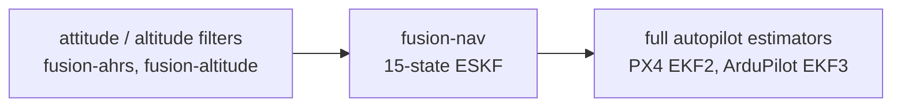
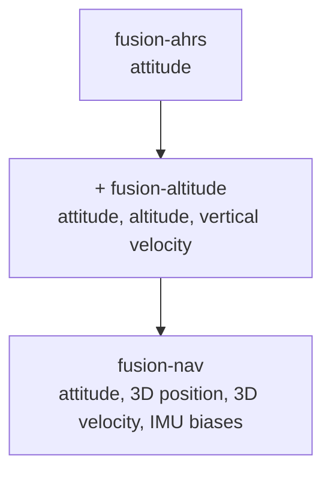

# Goals and Differentiators

> **Status: design only.** This document records the intended positioning of `fusion-nav`
> relative to existing Rust crates and production autopilot estimators. It is a rationale
> document, not a specification.

See [README.md](README.md) for the architecture.

## Positioning

`fusion-nav` aims to be the **readable, bounded-cost 15-state navigation ESKF for embedded Rust**.

It is deliberately not a port of PX4 EKF2 or ArduPilot EKF3, and not a research toolbox.
It targets the case where a flight controller needs 3D position and velocity, running in a
fixed time budget on a microcontroller, with mathematics an engineer can audit by reading it.

## Landscape

### Rust crates

| crate | what it is | state | status |
| ----- | ---------- | ----- | ------ |
| [`eskf`](https://crates.io/crates/eskf) | closest direct competitor | 18 (includes a gravity state) | v0.2.0 published March 2021, ~36 recent downloads, nalgebra 0.25. Repository has commits through December 2024 (gravity state removed) that were never released. `no_std` supported but, per its own docs, with few optimizations attempted. No magnetometer fusion, no innovation gating. |
| [`strapdown-rs`](https://github.com/jbrodovsky/strapdown-rs) / `strapdown-core` | research and teaching toolbox, GNSS-degradation simulator, datasets | 15-state ESKF, UKF and EKF selectable | Active (0.5.0, April 2026). `std`-oriented, desktop target. States it is "not intended to be a full-featured INS solution". |
| [`ekf2`](https://docs.rs/ekf2) | FFI wrapper over PX4's C++ EKF2 | 24 | v0.1.0 published 30 August 2026. `no_std` but heap-allocated via `allocator-api2`, requires a C++ toolchain, roughly half documented. |
| `adskalman`, `kfilter`, `minikalman`, `yakf` | generic Kalman filter math | n/a | No navigation model, no frame or sensor semantics. |

### Production autopilot estimators

| estimator | state | notable characteristics |
| --------- | ----- | ----------------------- |
| PX4 EKF2 | 24: quaternion, velocity NED, position LLA, gyro bias, accelerometer bias, earth magnetic field NED, body magnetic field bias, wind NE, terrain | Delayed fusion horizon with an output complementary filter, fusion equations generated by SymForce, multiple filter instances |
| ArduPilot EKF3 | 24: quaternion (4 states rather than 3 attitude errors), 3-axis accelerometer bias, no gyro scale factors | One lane per IMU with affinity and lane switching, three in-flight-switchable source sets, GSF yaw estimator for compass-less operation |

### The gap

No Rust crate today is an allocation-free, `f32`, fixed-size, `no_std`-native navigation ESKF
fusing GNSS, barometer, and magnetometer with innovation gating.

`eskf` is five years stale and lacks both magnetometer fusion and gating. `ekf2` requires a C++
toolchain and a heap. `strapdown` targets researchers on a desktop.

## Differentiators

Ranked by how defensible they are.

### 1. Verified embedded determinism

Publish measured worst-case execution time (cycle counts) and stack high-water marks per
`predict` and per measurement update, on a real STM32H7-class target.

No Rust navigation crate does this. It is currently impossible to tell from the outside whether
`eskf` fits in a 400 Hz control loop. PX4 and ArduPilot cannot claim it either.

### 2. Compile-time frames and units

Encode the navigation frame, body frame, and units in the type system so that mixing them is a
compile error rather than a flight anomaly.

Frame and unit confusion is the dominant bug class in navigation code. This is a genuine
Rust-only advantage: C++ autopilot estimators are structurally unable to offer it. It is the
most defensible answer to "why Rust".

### 3. Readable mathematics

PX4's fusion equations are SymForce-generated and effectively unauditable by hand.

`fusion-nav` should cite the source equation alongside each Jacobian and ship the derivation.
An estimator that can be checked by reading it is a real and unoccupied niche.

### 4. Pure Rust, single crate

No C++ toolchain, no bindgen, no allocator, no build script beyond the ordinary. `cargo add`
and it builds for a Cortex-M target. Direct contrast with `ekf2`.

### 5. Ecosystem coherence

`fusion-ahrs`, `fusion-altitude`, and `fusion-nav` as one family sharing units, frames, and
sensor conventions, forming a graduated ladder from attitude to full navigation.

No other Rust project offers this progression.

### 6. Validation that can be inspected

Replayable log-driven regression tests against public datasets, a deterministic seeded
simulation, and no hardware required in CI.

Trust in an estimator comes from reproducible numbers, not from documentation.

## Open design questions

Two gaps in the current design that need a decision before implementation.

### Measurement latency

GNSS measurements arrive 100–200 ms stale. PX4's delayed fusion horizon — a ring buffer of past
states plus an output complementary filter — exists specifically for this. Fusing stale GNSS
against the current state degrades the solution noticeably in flight.

Either implement a bounded state buffer or document the assumption explicitly. Handling this
cleanly at 15 states would itself be a differentiator.

### Magnetometer without magnetic-field states

PX4 carries six magnetic states (earth field and body bias) because hard- and soft-iron biases
corrupt heading directly. With neither, `fusion-nav` inherits whatever calibration the
application supplies.

Either add magnetometer bias states behind a feature flag, or state the calibration requirement
plainly.

## Validation

Differentiator 6 depends on being able to show reproducible numbers. The constraint is that
very few public datasets carry barometer, magnetometer, GNSS, and IMU together on a flight
vehicle, which is exactly the `fusion-nav` sensor set.

### Primary sources

**[INSANE](https://sst.aau.at/cns/datasets/insane-dataset/)** (University of Klagenfurt) is the
accuracy benchmark. It is the only public dataset found that covers the full sensor set on a
UAV: three IMUs (900 Hz LSM9DS1, 200 Hz ICM20689 and BMI055), dual RTK GNSS, two magnetometers,
a barometer, a laser range finder, UWB, and motor telemetry — eighteen sensors in total. Ground
truth is centimeter and sub-degree outdoors from dual RTK, millimeter indoors from motion
capture, with fiducial markers bridging the two. Recorded on a 3 kg quadcopter across a motion
capture facility, a university campus, a model airfield, and Mars-analog desert terrain. Raw
unprocessed measurements with post-processing tools. Confirm the data license on the site; the
paper's license does not cover it.

**[PX4 Flight Review](https://review.px4.io/)** public logs are the regression and robustness
corpus. Thousands of real flights in ULog format containing exactly what a flight controller
sees — IMU, barometer, magnetometer, GNSS — together with EKF2's own state estimate and
innovations. There is no ground truth, so this is not an accuracy benchmark. Its value is that
replaying a log and comparing against EKF2's published solution catches divergence on genuinely
glitchy sensor data, and gives free coverage of GNSS dropouts, magnetic interference, and
barometer transients that a clean RTK dataset will not. ArduPilot `.bin` logs serve the same
purpose.

The two are complementary: INSANE answers how accurate, PX4 logs answer whether it survives
reality.

### Secondary sources

| dataset | provides | missing |
| ------- | -------- | ------- |
| [UrbanNav](https://github.com/IPNL-POLYU/UrbanNavDataset) (PolyU, Hong Kong and Tokyo) | GNSS including raw RINEX, IMU, LiDAR, camera; SPAN-CPT ground truth; rosbag. The best GNSS-degradation stress test — urban canyon and multipath | ground vehicle, no barometer or magnetometer |
| KITTI raw | OXTS RT3003 IMU and GPS, RTK ground truth, very well understood | automotive dynamics, no barometer or magnetometer |
| EuRoC MAV | MAV, 200 Hz IMU, Vicon and Leica ground truth; the standard VIO benchmark | no GNSS, indoor only |
| [MILUV](https://arxiv.org/html/2504.14376v1) | quadcopters with IMU, magnetometer, barometer, UWB, range finder | no GNSS, indoor |
| Google Smartphone Decimeter Challenge | raw GNSS with Android IMU, magnetometer and barometer; NovAtel SPAN ground truth; large volume | automotive, phone-grade IMU |
| [strapdown-data](https://github.com/jbrodovsky/strapdown-rs) | smartphone MEMS IMU and GNSS, aimed at this use case | phone-grade, limited dynamics |

### Plan

1. INSANE as the accuracy benchmark — the only source exercising all four sensors on a UAV with
   centimeter ground truth.
2. A dozen PX4 public logs as the regression corpus — cheap to add, catches divergence, and
   provides EKF2 as a side-by-side reference.
3. UrbanNav specifically for innovation-gating tests, since its GNSS is deliberately hostile.
4. Recordings from [ark-fpv-discovery](https://github.com/wboayue/ark-fpv-discovery) for the
   timing and stack figures. No public dataset can supply differentiator 1; those numbers have
   to come off the target hardware.

### Harness constraint

Convert every source into a single normalized intermediate format — timestamped CSV or a small
binary record — and keep the converters out of the test path. Replaying rosbag or ULog directly
would make the test suite depend on ROS or the PX4 tooling, which destroys the
no-hardware-no-toolchain CI property that makes the validation claim worth anything.

## Non-goals

Deliberately out of scope, to keep the filter small and its cost bounded:

* 24-state formulations
* multiple filter lanes and IMU affinity
* automatic sensor-source switching
* terrain, wind, and magnetic-field state estimation
* optical flow, visual odometry, range finder, airspeed fusion

`ekf2` already covers the "PX4 EKF2 in Rust" position. `fusion-nav` is the readable,
bounded-cost 15-state core instead.

## References

* [eskf on crates.io](https://crates.io/crates/eskf) and [nordmoen/eskf-rs](https://github.com/nordmoen/eskf-rs)
* [jbrodovsky/strapdown-rs](https://github.com/jbrodovsky/strapdown-rs)
* [ekf2 on docs.rs](https://docs.rs/ekf2/latest/ekf2/) and [rechenmaschine/ekf2-rs](https://github.com/rechenmaschine/ekf2-rs)
* [PX4 EKF2 tuning guide](https://docs.px4.io/main/en/advanced_config/tuning_the_ecl_ekf)
* [ArduPilot EKF3 affinity and lane switching](https://ardupilot.org/plane/docs/common-ek3-affinity-lane-switching.html)
* [ArduPilot EKF source selection](https://ardupilot.org/plane/docs/common-ekf-sources.html)
* [fusion-ahrs](https://crates.io/crates/fusion-ahrs)
* [INSANE dataset](https://sst.aau.at/cns/datasets/insane-dataset/) ([paper](https://arxiv.org/html/2210.09114))
* [PX4 Flight Review](https://review.px4.io/) and [flight log analysis](https://docs.px4.io/main/en/log/flight_log_analysis)
* [UrbanNav dataset](https://github.com/IPNL-POLYU/UrbanNavDataset)

*Landscape surveyed September 2026.*
