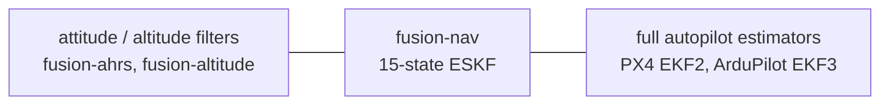

# Goals and Differentiators

> **Status: design only.** This document records the intended positioning of `fusion-nav`
> relative to existing Rust crates and production autopilot estimators. It is a rationale
> document, not a specification.

See [DESIGN.md](DESIGN.md) for the architecture and [EQUATIONS.md](EQUATIONS.md) for the
mathematics.

## Positioning

`fusion-nav` aims to be the **readable, bounded-cost 15-state navigation ESKF for embedded Rust**.

It is deliberately not a port of PX4 EKF2 or ArduPilot EKF3, and not a research toolbox.
It targets the case where a flight controller needs 3D position and velocity, running in a
fixed time budget on a microcontroller, with mathematics an engineer can audit by reading it.

Capability and cost increase left to right. These are alternatives to choose between, not stages
to progress through.

## Landscape

### Rust crates

| crate | what it is | state | status |
| ----- | ---------- | ----- | ------ |
| [`eskf`](https://crates.io/crates/eskf) | closest direct competitor | 18 (includes a gravity state) | v0.2.0 published March 2021, a few dozen downloads a quarter (33 in the 90 days to September 2026), nalgebra 0.25 against a current 0.35. Repository has commits through December 2024 (gravity state removed) that were never released. `no_std` supported but, per its own docs, with few optimizations attempted. No magnetometer fusion, no innovation gating. |
| [`strapdown-rs`](https://github.com/jbrodovsky/strapdown-rs) / `strapdown-core` | research and teaching toolbox, GNSS-degradation simulator, datasets | 15-state ESKF, UKF and EKF selectable | Active (0.5.0, April 2026). `std`-oriented, desktop target. States it is "not intended to be a full-featured INS solution". |
| [`ekf2`](https://docs.rs/ekf2) | FFI wrapper over PX4's C++ EKF2 | 24 | v0.1.0 published 30 August 2026. `no_std` but heap-allocated via `allocator-api2`, requires a C++ toolchain, roughly half documented. |
| `adskalman`, `kfilter`, `minikalman`, `yakf` | generic Kalman filter math | n/a | No navigation model, no frame or sensor semantics. |

### Production autopilot estimators

| estimator | state | notable characteristics |
| --------- | ----- | ----------------------- |
| PX4 EKF2 | 24: quaternion, velocity NED, position LLA, gyro bias, accelerometer bias, earth magnetic field NED, body magnetic field bias, wind NE, terrain | Delayed fusion horizon with an output complementary filter, fusion equations generated by SymForce, multiple filter instances |
| ArduPilot EKF3 | 24: quaternion (4 states rather than 3 attitude errors), 3-axis accelerometer bias, no gyro scale factors | One lane per IMU with affinity and lane switching, three in-flight-switchable source sets, GSF yaw estimator for compass-less operation |

### The gap

No Rust crate today is an allocation-free, `f32`, fixed-size, `no_std`-native navigation ESKF
fusing GNSS, barometer, and magnetometer with innovation gating.

The published `eskf` crate is five years stale — its repository moved on, its release did not —
and it lacks both magnetometer fusion and gating. `ekf2` requires a C++
toolchain and a heap. `strapdown` targets researchers on a desktop.

### Why not revive `eskf`?

The obvious objection. `eskf` already exists, already supports `no_std`, and its repository
already contains the 15-state formulation that was never released.

Four reasons this is a new crate rather than a pull request.

* **Different target.** `eskf` is a general navigation filter observing position, velocity, and
  orientation from any source — GPS, LIDAR, visual odometry. `fusion-nav` targets a flight
  controller's specific sensor set and fuses magnetometer and barometer, which `eskf` does not.
* **Different guarantees.** Innovation gating, bounded execution time, and published timing on
  real hardware are not features that bolt onto an existing filter; they constrain its structure.
* **Maintenance reality.** No release since March 2021, a few dozen downloads a quarter, and a
  `nalgebra` dependency ten minor versions behind. Work landed in the repository in late 2024
  and still has not shipped. Contributing means depending on a release cadence that has not
  existed for five years.
* **API break.** Adding gating, typed frames, and fixed-size `f32` matrices changes essentially
  every signature. That is a new major version wearing an old name.

None of this is a criticism of `eskf`, which does what it set out to do. It is a different thing.

## Differentiators

Ranked by how defensible they are, which is not the same as how valuable. Differentiator 4 is
true today by construction; differentiator 1 matters most and is entirely unbuilt.

Number 5 is missing on purpose: it was *ecosystem coherence*, and was dropped rather than
renumbered — see [Decisions](#ecosystem-coherence-dropped).

### 1. Verified embedded determinism

Publish measured worst-case execution time (cycle counts) and stack high-water marks per
`predict` and per measurement update, on a real STM32H7-class target.

No Rust navigation crate does this. It is currently impossible to tell from the outside whether
`eskf` fits in a 400 Hz control loop. PX4 and ArduPilot instrument their timing — `perf_counter`
and scheduler task budgets respectively — but neither publishes per-function worst-case figures
you can design against before adopting.

### 2. Compile-time frames and units

Encode the navigation frame, body frame, and units in the type system so that mixing them is a
compile error rather than a flight anomaly.

Frame and unit confusion is the dominant bug class in navigation code. C++ can express this too,
with strong typedefs, templates, or a units library, so the claim is not that PX4 and ArduPilot
could not — it is that they do not. Both are large, mature codebases where `float` is the lingua
franca and retrofitting types across the estimator is not worth the churn. A new crate pays that
cost once, at the start, and Rust makes it idiomatic rather than merely possible. That is the
honest answer to "why Rust".

**The boundary is where this pays off for someone coming from an existing autopilot.** A
`[f32; 4]` cannot carry the frame it is expressed in, so the commitment is not that a family of
crates agrees on one convention — it is that this crate converts at its own edge and names the
convention it expects, in the type where that is possible and in the doc comment where it is not.
The two conventions that matter most already agree with it, and `Attitude::body_to_ned` is where
that is stated and cited: seeding from PX4's `vehicle_attitude.q` or ArduPilot's
`get_quat_body_to_ned` converts nothing, because both publish
[the convention fixed here](EQUATIONS.md#states-and-measurements). Everything else converts
explicitly and names both frames while doing it — `Position::enu(..).to_ned()`,
`AngularRate::flu`, `Attitude::flu_to_enu` for a ROS attitude and `Attitude::flu_to_nwu` for a
Madgwick-family one. A quaternion takes no `From` impl at all, since `.into()` would claim
body-to-NED for whatever arrived.

### 3. Readable mathematics

PX4's fusion equations are SymForce-generated and effectively unauditable by hand.

`fusion-nav` should cite the source equation alongside each Jacobian and ship the derivation.
An estimator that can be checked by reading it is a real and unoccupied niche.

[EQUATIONS.md](EQUATIONS.md) is the mechanism: numbered equations and an explicit
equation-to-code mapping.

### 4. Pure Rust, single crate

No C++ toolchain, no bindgen, no allocator, no build script beyond the ordinary. `cargo add`
and it builds for a Cortex-M target. Direct contrast with `ekf2`.

MIT licensed, with a declared MSRV that is raised only in a minor version bump. Embedded
projects pin toolchains; a crate that floats its MSRV is a crate they cannot take.

### 6. Validation that can be inspected

Replayable log-driven regression tests against public datasets, a deterministic seeded
simulation, and no hardware required in CI.

Reporting gate decisions as a normalized test ratio rather than a raw normalized innovation
squared is part of this: it is the same quantity PX4 logs, so replaying a flight log and
comparing rejection behaviour against EKF2 is a like-for-like check.

Two gates, and they answer different questions. `data/manifest.txt` pins what real logs do, which
is self-consistency, because no PX4 log carries truth. `data/scenarios.txt` pins accuracy against
the simulator's analytic truth, and `data/bench.sh` asserts it in CI with no network and no PX4
tooling. Neither yet tests the covariance's own distributional promise — a ceiling passes a filter
that grew more accurate and more overconfident at once — which is ANEES over N seeds, #89, once
#35 gives it a covariance that moves.

Trust in an estimator comes from reproducible numbers, not from documentation.

### 7. Configuration derived, not demanded

Do not ask the user for a value the system could measure. Ask only for what cannot be learned:
physical facts about their vehicle, and policy.

PX4 and ArduPilot each expose dozens of estimator parameters, and a large share of them describe
the hardware rather than the mission — sensor noise, bias stability, measurement noise per
source. Those are measurable quantities, and asking an integrator to hand-tune them transfers
work the machine can do onto the one person least equipped to do it. The result in practice is
that almost nobody tunes them: the defaults fly, which is a tacit admission that the numbers
could have been derived.

**The boundary matters more than the principle.** Derived is not adaptive. A value is measured at
a defined moment, reported to the caller, and overridable — never silently retuned in flight.
Runtime self-tuning would contradict differentiator 1, because a filter that changes its own
covariance growth has no worst-case timing or behaviour to publish, and it would contradict
[rejection handling](#rejection-handling-report-do-not-self-recover), where the filter reports and
the application decides. Two channels, then: what the static window can honestly measure, handed
back by `initialize`; and everything else derived offline from a replay log by a tool that prints
a `Config` the user reads and commits.

| value | derived from | where |
| ----- | ------------ | ----- |
| `α₀`, barometric reference | mean of the window's barometer samples | `initialize` — **done** |
| accelerometer and gyroscope white noise | sample variance over the static window | `initialize` — candidate |
| barometer measurement noise | sample variance over the static window | `initialize` — candidate |
| `max_predict_dt` | observed IMU interval | offline |
| gate thresholds | chi-square quantile for a chosen percentile and dimension | a constructor, not a number |
| `Timeouts` | observed per-source update intervals | offline recommendation only |
| GNSS `R` | the receiver, floored | per measurement — **done** |
| local gravity `γ` | the origin's latitude, by the WGS-84 gravity formula | candidate; a constant today (#66) |
| magnetic declination | a magnetic model, given the GNSS origin and date | optional, for its flash cost |

And what stays with the user, because no amount of data yields it:

* **Accelerometer bias**, which is not separable from tilt at rest and becomes observable only
  under motion with aiding.
* **Bias random walk**, which needs an Allan variance soak measured in hours — an offline tool,
  never a two-second window.
* **Magnetometer calibration**, a precondition this filter states rather than solves.
* **Policy**: what a `DeadReckoning` status should do to the vehicle.
* **The static window itself.** The filter can validate stillness; it cannot arrange it.

Status: two rows of that table are done — `α₀`, measured from the window, and GNSS `R`, which the
receiver supplies and the caller floors. Everything needing the offline tool is a commitment
rather than a present fact, and this is the differentiator most likely to be judged on whether
that tool gets written.

### Per-quantity validity, not one ladder

`Status` answers how bad the worst thing is. PX4 and ArduPilot both answer a different question —
which output can I use — per quantity: ArduPilot's `nav_filter_status` carries `attitude`,
`horiz_vel`, `vert_vel`, `horiz_pos_rel`, `horiz_pos_abs` and `vert_pos` as separate bits, and
PX4 publishes `xy_valid`, `z_valid`, `v_xy_valid`, `v_z_valid` and `heading_good_for_control`
alongside the estimate.

The single ladder cannot express what a coarse start produces: position as good as the receiver
the moment a fix is adopted, while attitude is still converging. It also masks — the corpus log
that starts in motion reports `Aligning` throughout, and its 888 aiding transitions disappear
behind it.

**Decided:** keep `Status` as the one-glance summary and add `Validity` alongside it on the state,
six flags derived from the covariance against `Config::accuracy`. Horizontal and vertical
are separate because sources are. Validity also requires that the quantity was ever established,
since a coarse start's untouched prior is tight and meaningless — position and velocity until the
first fix, and heading until a magnetometer is fused, which stillness never supplies.

`Config::accuracy` is deliberately the exception to [differentiator 7](#7-configuration-derived-not-demanded):
how accurate is good enough is a property of the mission, not of the hardware or the mathematics,
and no flight data settles it. Asking is correct here.

`Eskf::predicted_validity` answers the arming question that neither `Status` nor `Validity` can —
whether each quantity will be good if the vehicle leaves the ground now, rather than whether it
is good while sitting still with half its states unobservable. ArduPilot's `pred_horiz_pos_rel`
is the same idea and PX4 has no equivalent, which makes it the one place the status model here is
ahead of both. In the stub it means *aiding is arriving*; with covariance propagation it should
mean *projected to a horizon and tested*.

## Open design questions

Two gaps in the current design still need a decision before implementation.

### Measurement latency

GNSS measurements arrive 100–200 ms stale. PX4's delayed fusion horizon — a ring buffer of past
states plus an output complementary filter — exists specifically for this. Fusing stale GNSS
against the current state degrades the solution noticeably in flight.

Either implement a bounded state buffer or document the assumption explicitly. Handling this
cleanly at 15 states would itself be a differentiator.

### Alignment beyond the static window

Requiring a validated static interval before the filter will run restricts the launch envelope,
and that is not a limitation this crate wants. It excludes takeoff from a moving deck, roof or
boat, hand launches where the operator's tremor exceeds the gate, air drops — and, most sharply,
any re-initialization at altitude, since there is no second static window before landing.

The physics is not symmetric, and it drives the options. **At rest**, gravity fixes tilt precisely
and yaw is unobservable without a magnetometer: MEMS gyroscopes cannot gyrocompass, Earth rate at
15°/h being far below their noise floor. **In motion**, that inverts — the accelerometer reads
specific force rather than gravity, so tilt is harder, while GNSS velocity says where the vehicle
is actually going, so yaw is easier. A moving launch is not less informed. It is differently
informed, and the current API cannot express that.

The deeper asymmetry is against the production estimators. PX4 and ArduPilot can afford sloppy
starts — ArduPilot aligns from a single un-averaged accelerometer sample — because they realign
continuously from aiding and from their bias states. A bad start is a transient they grow out of.
`fusion-nav` has no realignment path, so `initialize` is the only moment attitude is ever
established, and refusing is permanent rather than deferred. **That is what turns a stillness
precondition into a launch restriction**, and either half alone would be survivable.

The options, in the order they are worth doing:

1. **Seeded initialization.** Take the estimate from whatever the application already has: a
   companion AHRS, a survey, the previous flight's saved state. No new mathematics, no new
   states, no hot-path cost; what it does need is the boundary work of
   [differentiator 2](#2-compile-time-frames-and-units), since a seed arrives in whatever
   convention its source uses. **Done** —
   `Eskf::initialize_from`, with `set_baro_reference` to complete the seed. It covers the
   restart-at-altitude case and any vehicle already carrying an attitude source; it does nothing
   for a bare vehicle with no second source.

   Whether a seed counts as aligned is the covariance's answer, not a flag: a confident seed
   reports `Healthy` immediately, a vague one `Aligning`. One rule covers all three entry points.
2. **Coarse alignment and an `Aligning` status.** Initialize from whatever is available with a
   `P₀` inflated to match, let the filter run, and report that the attitude is not yet
   trustworthy. The missing concept was less any one algorithm than a way to say *running, but do
   not fly on my attitude yet*. **Done** — `initialize` no longer refuses a short or moving
   window, `initialize_coarse` needs no window at all, and `Status::Aligning` is reported until
   `Eskf::is_aligned` says attitude uncertainty has come down to what a static start would have
   given. Promotion is read from the covariance rather than run off a timer, and the bar reuses
   `Initialization`'s own sigmas, so there is no new knob. Heading is the exception no covariance
   can settle: stillness never observes yaw, so a vehicle with no magnetometer stays `Aligning`
   however tight the prior — which is what options 5 and 6 are for.
3. **Gate policy while aligning.** Less of a special case than it first appears. The innovation
   covariance `S = H P Hᵀ + R` already grows with `P`, so an honestly inflated coarse `P₀` makes
   the normalized test ratio self-scaling: [gate lockout](EQUATIONS.md#gate-lockout) is what an
   *overconfident* covariance causes, not a wide one. What genuinely needs handling is yaw, where
   a wide prior is not an honest wide prior: the three-component attitude error of equation (2)
   is a small-angle quantity, and a yaw error of a radian is not small, so the linearization is
   wrong in a way no variance expresses. The answer is a yaw **reset** when a heading source
   arrives rather than gradual correction — which is precisely why ArduPilot invented the GSF
   estimator in 6 rather than widening a prior. Open: whether tilt alone can be left to the
   ordinary gate, which the corpus should be able to answer once propagation lands.
4. **In-motion leveling.** Differentiate GNSS velocity for navigation-frame acceleration,
   subtract it from measured specific force, and recover gravity's direction while moving.
   Removes the stillness requirement for tilt outright. No new states; noisy under aggressive
   manoeuvring. **Half done** — the window carries GNSS velocity, `StaticSample::velocity`, and
   a moving window measures `ā_n` and reports it on `Coarse::NotStationary`. Equation (5′)
   subtracts nothing yet: the correction needs an attitude to rotate `ā_n` into body axes, and
   (5)–(7) do not compute one.

   Whether finishing it is worth anything the corpus cannot say. Its one moving start
   (`2c42096b`) measures `ā_n` = 0.14 m s⁻², against the 0.39 m s⁻² of noise that differencing a
   1 Hz receiver over 1 s produces — the vehicle is vibrating on the spot, not translating, so
   (5′) would subtract noise. On the same window the specific force peaks 5.46 m s⁻² off gravity
   while the *averaged* specific force is 0.93° off plumb, which says the tilt prior loses far
   more by charging a peak against an average than option 4 could recover there. Judging it needs
   a log that actually accelerates, which the simulator's `moving_start` now is — a banked,
   climbing turn from the first sample, with truth beside it. Reading a verdict off it needs the
   scoring of #16.
5. **Yaw from course over ground.** While moving, velocity direction is heading, nearly free.
   Works for fixed-wing and ground vehicles, not for a multirotor that crabs and hovers.
6. **An EKF-GSF yaw estimator.** A bank of small filters over yaw hypotheses weighted by GNSS
   velocity innovations — ArduPilot's invention, since ported into PX4, and the general answer to
   aligning yaw while moving without a magnetometer. Effective, and genuinely a second estimator
   inside a crate whose pitch is being small enough to read. Only if 4 and 5 prove insufficient.

Two API decisions shape the rest, and are worth settling early:

* **Each entry point reports which alignment it achieved; none takes a mode argument.** The
  window is what is optional, not the classification — `initialize` with a window, or
  `initialize_coarse` without one, and both answer with an `Alignment`. That is differentiator 7
  applied to alignment: the data already says what the launch was, so do not make the integrator
  classify it. **Settled**, and it is what decides where option 4's GNSS velocity goes: onto
  `StaticSample`, alongside the magnetometer and the barometer, rather than into a fourth entry
  point taking a moving window. A separate entry point would be the mode argument by another
  name, and the caller would have to know which launch it was having.
* **`Aligning` is not `Degraded`.** Degraded means aided and drifting; aligning means the
  attitude itself has not converged. Conflating them would mislead a controller in precisely the
  phase where the distinction matters most. **Settled**, with `Aligning` the more severe of the
  two. The cost is visible in the corpus: the one log that starts in motion now reports
  `Aligning` throughout and its 888 aiding transitions are masked behind it, because a stub
  covariance never shrinks and the filter therefore never finishes aligning.

Position and velocity were a related gap, and are now closed. A static start defines the origin
as where the vehicle was and its velocity as zero, both true by construction; a coarse start can
claim neither, so the first GNSS fix after one is **adopted rather than fused** —
`Fusion::Reset`, once per quantity. That is the exact limit of fusing against an infinitely
uncertain prior, taken exactly rather than approached with an invented variance, and it avoids
the alternative failure: a 0.1 m s⁻¹ velocity prior on a vehicle doing 18 m s⁻¹ gates out the fix
that would have corrected it.

This is a bounded exception to [rejection handling](#rejection-handling-report-do-not-self-recover),
and the boundary is what keeps it honest: the filter adopts a quantity it has **never
established**, where there is no estimate to step away from and no controller yet flying on one.
It never does so to recover. A quantity that was once known and has since been rejected stays the
application's problem, through `reset_position_to` and `reset_velocity_to`.

What remains for a bare vehicle with no second attitude source is options 4 and 5: a launch that
is moving and has nothing to seed from still starts coarse in **attitude** and stays that way
until aiding brings the uncertainty down.

## Decisions

Questions that were open and are now settled. Recorded here so the reasoning survives.

### Magnetometer without magnetic-field states

PX4 carries six magnetic states — earth field and body bias — because hard- and soft-iron errors
corrupt heading directly. `fusion-nav` carries none, and adding them would contradict the
non-goals below.

**Decided:** state the calibration requirement plainly and fuse magnetic **heading only**, as a
single scalar, rather than the three-axis field. Roll and pitch stay with gravity, where they are
well determined and where a field anomaly cannot reach them. A magnetometer disturbance can then
corrupt one state instead of three, and innovation gating has a one-dimensional quantity to gate.

Three-axis fusion remains documented for completeness, labelled as the liability it is. See
[magnetometer, heading only](EQUATIONS.md#magnetometer-heading-only).

The cost is that hard- and soft-iron calibration is the application's responsibility, and a badly
calibrated magnetometer produces a heading bias the filter cannot detect. That is a documented
precondition, not a silent failure.

### Barometric reference as a constant

The barometer measures altitude above its own reference, and that reference drifts — with
weather, with ground effect, with sensor warm-up. Both production estimators treat it as
something to track rather than something to fix. PX4 runs a dedicated bias estimator per height
source, a one-state filter fusing `measurement - altitude` with variance
`measurement_var + P(z,z)`, seeded from a low-passed barometer reading and reset whenever height
resets. ArduPilot slews a `baroHgtOffset` toward `baro + z` with a 0.1 gain clamped to ±5 m, and
separately corrects its origin height with a filter that models baro drift rate explicitly.

**Decided:** `fusion-nav` carries a constant. `α₀` is averaged over the quasi-static
initialization window and fixed there — `StaticSample::baro` in, `Eskf::baro_reference` out,
equation (30). Estimating the drift needs either a 16th state, which contradicts the bounded
15-state positioning, or a tracker living outside the covariance, which is a second estimator to
tune and explain for a quantity most short flights never see move.

The cost is that reference drift becomes vertical position error directly, and the filter cannot
tell a drifting reference from a genuine climb. The remedies available to an application are to
re-establish `α₀` on the ground, to lean on GNSS height for the low-frequency component, or to
accept the error over a flight short enough that it stays small.

This is the decision most likely to be revisited. Two independent production implementations
concluded a constant was not enough, which is evidence, and if validation shows vertical drift
dominating the error budget on long flights, ArduPilot's offset tracker is the cheaper of the two
answers: it leaves the 15 states alone. See
[barometric altitude](EQUATIONS.md#barometric-altitude).

### Rejection handling: report, do not self-recover

Innovation gating protects against bad measurements but is self-sealing. When the filter itself
is wrong, correct measurements are rejected, and the filter locks itself out of the data that
would correct it while continuing to report a confident solution.

**Decided:** track per-source health inside the filter — time since last accepted measurement,
consecutive rejections, and the dimensionless test ratio — and report an aggregate `Healthy` /
`Degraded` / `DeadReckoning` status **on the state estimate itself**, not behind a separate
accessor that an integration can neglect to call. Expose `reset_position_to` and
`reset_velocity_to` so the condition is actionable.

The filter does not reset itself. PX4 does, after 7 s of horizontal dead reckoning or 5 s of
failed height fusion (`src/modules/ekf2/EKF/common.h:515-517`), and that is the right choice for a
complete autopilot that owns the vehicle's failsafe policy.
`fusion-nav` is a library: it does not know whether the correct response is a state reset, a mode
degrade, or an operator alert, and silently snapping position is a step input to a controller
that did not ask for one.

The obligation this accepts is that the degraded condition must be impossible to **miss**, which
a status field on the returned state achieves, as distinct from impossible to **ignore**, which
would cost ergonomics that integrators route around anyway.

`Fusion` is deliberately not `#[must_use]` for the same reason, and the crate's own `basic.rs`
was the evidence: it discarded three of five outcomes with `let _ =` two lines under a comment
advertising the lint. Acceptance and rejection are already on the second channel — `Diagnostics`
keeps the test ratio, the counts and the timer per source — so the lint bought nothing there.
What it did cover is the refusals that move no timer and the one-shot `Fusion::Reset`, so those
gained counters of their own in #67 — `SourceHealth::refused`, `last_refusal` and `adopted`, plus
`PropagationHealth` for the steps `predict` turns away — and the decision stands on them. The
corpus made the case immediately: the coarse log's barometer reads `never accepted`, exactly like
a vehicle carrying no barometer, and now reports 35575 refusals with `NoReference` beside it.
`Propagation` and the `reset_*` outcomes keep the lint, having no second channel at all.

See [gate lockout](EQUATIONS.md#gate-lockout) and
[measurement rejection](DESIGN.md#measurement-rejection).

### Ecosystem coherence, dropped

`fusion-ahrs`, `fusion-altitude` and `fusion-nav` were listed as differentiator 5: one family
sharing units, frames and sensor conventions, with "making NED the documented default across all
three" named as work still to be done. It was conceded there to be a commitment rather than a fact.

**Dropped.** Each crate should use the conventions that suit its own use case. `fusion-ahrs`
inherits NWU from upstream and serves attitude-only users who already have it; re-defaulting a
published crate to NED to serve the positioning of an unpublished one spends someone else's
compatibility on a claim nobody chooses an estimator for. The graduated-ladder diagram went with
it. `README.md`'s "which of these do I want" section stays, because that is user guidance rather
than a differentiator, and the siblings are still worth seeding from — like any other attitude
source.

What survives is the falsifiable half, and it points at the incumbents rather than the siblings:
boundary compatibility for integrators arriving from PX4 or ArduPilot, now part of
[differentiator 2](#2-compile-time-frames-and-units).

The numbering keeps its gap rather than closing up, because `AGENTS.md`, the issue backlog and
`data/manifest.txt` all cite differentiators by number, and renumbering would silently repoint
every one of those citations.

## What would falsify this positioning

Several differentiators are contingent on a landscape that can change. Worth re-surveying when
any of these happen, rather than discovering it in a forum thread.

| if this happens | what it costs |
| --------------- | ------------- |
| `ekf2` sheds its C++ dependency or ships a pure-Rust port | differentiator 4 largely goes; 24 states in Rust with no toolchain burden is a strong alternative |
| `strapdown-core` goes `no_std` and allocation-free | differentiators 1 and 4 narrow to timing evidence alone |
| someone publishes a typed-frames navigation crate | differentiator 2 goes, and it is the most distinctive one |
| `eskf` ships its 15-state version with gating | the gap argument weakens considerably |
| PX4 or ArduPilot publish per-function WCET | differentiator 1 stops being unique, though it stays true |

Differentiators 3 and 6 — readable mathematics and inspectable validation — are the ones nobody
can take away by shipping code, because they are commitments about how the crate is documented
and tested rather than claims about what it does.

## Validation

Differentiator 6 depends on being able to show reproducible numbers. The constraint is that
very few public datasets carry barometer, magnetometer, GNSS, and IMU together on a flight
vehicle, which is exactly the `fusion-nav` sensor set.

### Primary sources

**[INSANE](https://www.aau.at/en/smart-systems-technologies/control-of-networked-systems/datasets/insane-dataset/)** (University of Klagenfurt) is the
accuracy benchmark. It is the only public dataset found that covers the full sensor set on a
UAV: three IMUs (900 Hz LSM9DS1, 200 Hz ICM20689 and BMI055), dual RTK GNSS, two magnetometers,
a barometer, a laser range finder, UWB, and motor telemetry — eighteen sensors in total. Ground
truth is centimeter and sub-degree outdoors from dual RTK, millimeter indoors from motion
capture, with fiducial markers bridging the two. Recorded on a 3 kg quadcopter across a motion
capture facility, a university campus, a model airfield, and Mars-analog desert terrain. Raw
unprocessed measurements with post-processing tools.

The data is licensed BSD-2-Clause **with commercial use excluded** — a rider that is not part of
BSD-2 and makes the license non-free despite the name. Two consequences, and the second is the
one that shapes the work. Redistribution is permitted, with the copyright notice, conditions and
disclaimer retained: that much is ordinary BSD-2, and the opposite of what the name "non-free"
suggests. But this crate is MIT, so bundling non-commercial data into it would hand every adopter
a restriction the crate does not otherwise carry. INSANE is therefore **fetched and never
committed**, pinned by checksum like the PX4 corpus and kept in a separate manifest with its terms
stated at the point of download — the CC BY 4.0 logs below can be redistributed and this cannot,
so the two must not share a default fetch.

Measured results are ours to publish: an RMSE or NEES figure is a fact about this filter, not a
copy of their data. Converted CSVs and trajectory plots are closer to derivative works and stay
out of the repository. And validating this crate against INSANE for a commercial product is
plausibly the commercial use the rider excludes, so an adopter doing that needs their own
arrangement with Klagenfurt; the benchmark here is for the crate and its readers.

**[PX4 Flight Review](https://review.px4.io/)** public logs are the regression and robustness
corpus. Thousands of real flights in ULog format containing exactly what a flight controller
sees — IMU, barometer, magnetometer, GNSS — together with EKF2's own state estimate and
innovations. There is no ground truth, so this is not an accuracy benchmark. Its value is that
replaying a log and comparing against EKF2's published solution catches divergence on genuinely
glitchy sensor data, and gives free coverage of GNSS dropouts, magnetic interference, and
barometer transients that a clean RTK dataset will not. ArduPilot `.bin` logs serve the same
purpose.

Public Flight Review logs are CC BY 4.0, so a pinned corpus can be redistributed with
attribution — unusually, the licence is not the obstacle here. `https://review.px4.io/dbinfo`
is the whole database as JSON, with a CDN `download_url` per entry; `tools/ulog2replay.py`
converts one into the replay format and `data/fetch.sh` pins it by checksum.

The two are complementary: INSANE answers how accurate, PX4 logs answer whether it survives
reality.

### Secondary sources

| dataset | provides | missing |
| ------- | -------- | ------- |
| [UrbanNav](https://github.com/IPNL-POLYU/UrbanNavDataset) (PolyU, Hong Kong and Tokyo) | GNSS including raw RINEX, IMU, LiDAR, camera; SPAN-CPT ground truth; rosbag. The best GNSS-degradation stress test — urban canyon and multipath | ground vehicle, no barometer or magnetometer |
| KITTI raw | OXTS RT3003 IMU and GPS, RTK ground truth, very well understood | automotive dynamics, no barometer or magnetometer |
| EuRoC MAV | MAV, 200 Hz IMU, Vicon and Leica ground truth; the standard VIO benchmark | no GNSS, indoor only |
| [MILUV](https://arxiv.org/html/2504.14376v1) | quadcopters with IMU, magnetometer, barometer, UWB, range finder | no GNSS, indoor |
| Google Smartphone Decimeter Challenge | raw GNSS with Android IMU, magnetometer and barometer; NovAtel SPAN ground truth; large volume | automotive, phone-grade IMU |
| [strapdown-data](https://github.com/jbrodovsky/strapdown-rs) | smartphone MEMS IMU and GNSS, aimed at this use case | phone-grade, limited dynamics |

### Plan

Simulation comes first, and is the only source already in the repository: `examples/simulate.rs`
writes seeded flights with analytic truth (`data/README.md`), so an equation stage is scorable the
day it lands rather than after a download, and `data/bench.sh` holds each scenario to a measured
ceiling in CI. It does not displace the four below — synthetic data
cannot falsify a sensor model, which is exactly what INSANE and the PX4 corpus are for — and what
it measures is only as good as the error models in its own tables.

1. INSANE as the accuracy benchmark — the only source exercising all four sensors on a UAV with
   centimeter ground truth.
2. A dozen PX4 public logs as the regression corpus — cheap to add, catches divergence, and
   provides EKF2 as a side-by-side reference.
3. UrbanNav specifically for innovation-gating tests, since its GNSS is deliberately hostile.
4. Recordings from [ark-fpv-discovery](https://github.com/wboayue/ark-fpv-discovery) for the
   timing and stack figures. No public dataset can supply differentiator 1; those numbers have
   to come off the target hardware.

### Harness constraint

Convert every source into a single normalized intermediate format — timestamped CSV or a small
binary record — and keep the converters out of the test path. Replaying rosbag or ULog directly
would make the test suite depend on ROS or the PX4 tooling, which destroys the
no-hardware-no-toolchain CI property that makes the validation claim worth anything.

## Non-goals

Deliberately out of scope, to keep the filter small and its cost bounded:

* 24-state formulations
* multiple filter lanes and IMU affinity
* automatic sensor-source switching
* terrain, wind, and magnetic-field state estimation
* optical flow, visual odometry, range finder, airspeed fusion

`ekf2` already covers the "PX4 EKF2 in Rust" position. `fusion-nav` is the readable,
bounded-cost 15-state core instead.

## References

* [eskf on crates.io](https://crates.io/crates/eskf) and [nordmoen/eskf-rs](https://github.com/nordmoen/eskf-rs)
* [jbrodovsky/strapdown-rs](https://github.com/jbrodovsky/strapdown-rs)
* [ekf2 on docs.rs](https://docs.rs/ekf2/latest/ekf2/) and [rechenmaschine/ekf2-rs](https://github.com/rechenmaschine/ekf2-rs)
* [PX4 EKF2 tuning guide](https://docs.px4.io/main/en/advanced_config/tuning_the_ecl_ekf)
* [ArduPilot EKF3 affinity and lane switching](https://ardupilot.org/plane/docs/common-ek3-affinity-lane-switching.html)
* [ArduPilot EKF source selection](https://ardupilot.org/plane/docs/common-ekf-sources.html)
* [fusion-ahrs](https://crates.io/crates/fusion-ahrs)
* [INSANE dataset](https://www.aau.at/en/smart-systems-technologies/control-of-networked-systems/datasets/insane-dataset/) ([paper](https://arxiv.org/html/2210.09114))
* [PX4 Flight Review](https://review.px4.io/) and [flight log analysis](https://docs.px4.io/main/en/log/flight_log_analysis)
* [UrbanNav dataset](https://github.com/IPNL-POLYU/UrbanNavDataset)

*Landscape surveyed September 2026.*
