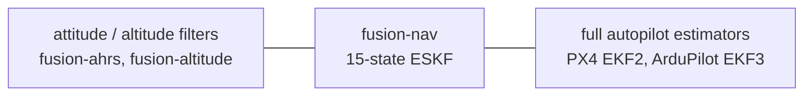

# Goals and Differentiators

> **Status: rationale, not specification.** This document records the positioning of
> `fusion-nav` relative to existing Rust crates and production autopilot estimators, and the
> decisions already made. What is built is [README.md](README.md); the mathematics is
> [EQUATIONS.md](EQUATIONS.md).

See [DESIGN.md](DESIGN.md) for the architecture and [EQUATIONS.md](EQUATIONS.md) for the
mathematics.

## Positioning

`fusion-nav` aims to be the **readable, bounded-cost 15-state navigation ESKF for embedded Rust**.

It is deliberately not a port of PX4 EKF2 or ArduPilot EKF3, and not a research toolbox.
It targets the case where a flight controller needs 3D position and velocity, running in a
fixed time budget on a microcontroller, with mathematics an engineer can audit by reading it.

Capability and cost increase left to right. These are alternatives to choose between, not stages
to progress through.

## Landscape

This section describes what each alternative is and why it is not this crate. Versions, dates
and download counts change faster than the positioning does, so they stay on crates.io and in
the repositories linked under [References](#references).

### Rust crates

| crate | what it is | why it is not this |
| ----- | ---------- | ------------------ |
| [`eskf`](https://crates.io/crates/eskf) | general-purpose navigation ESKF, the closest direct competitor | Unreleased for years, with work in its repository that never shipped. Fuses no magnetometer or barometer and has no innovation gating. |
| [`strapdown-rs`](https://github.com/jbrodovsky/strapdown-rs) | research and teaching toolbox with selectable ESKF, UKF and EKF, a GNSS-degradation simulator and datasets | `std` and desktop oriented, and states it is not a full INS. |
| [`ekf2`](https://docs.rs/ekf2) | FFI wrapper over PX4's C++ EKF2 | Needs a C++ toolchain and a heap allocator. |
| `adskalman`, `kfilter`, `minikalman`, `yakf` | generic Kalman filter math | No navigation model, and no frame or sensor semantics. |

### Production autopilot estimators

| estimator | state | notable characteristics |
| --------- | ----- | ----------------------- |
| PX4 EKF2 | 24: quaternion, velocity NED, position LLA, gyro bias, accelerometer bias, earth magnetic field NED, body magnetic field bias, wind NE, terrain | Delayed fusion horizon with an output complementary filter, fusion equations generated by SymForce, multiple filter instances |
| ArduPilot EKF3 | 24: quaternion (4 states rather than 3 attitude errors), 3-axis accelerometer bias, no gyro scale factors | One lane per IMU with affinity and lane switching, three in-flight-switchable source sets, GSF yaw estimator for compass-less operation |

### The gap

No Rust crate is an allocation-free, `f32`, fixed-size, `no_std`-native navigation ESKF fusing
GNSS, barometer, and magnetometer with innovation gating. `eskf` lacks the sensors and the gating,
`ekf2` requires a C++ toolchain and a heap, and `strapdown` targets researchers on a desktop.

### Why not revive `eskf`?

The obvious objection. `eskf` already exists, already supports `no_std`, and its repository
already contains the 15-state formulation that was never released.

Four reasons this is a new crate rather than a pull request.

* **Different target.** `eskf` is a general navigation filter observing position, velocity, and
  orientation from any source, such as GPS, LIDAR or visual odometry. `fusion-nav` targets a
  flight controller's specific sensor set and fuses magnetometer and barometer, which `eskf` does
  not.
* **Different guarantees.** Innovation gating, bounded execution time, and published timing on
  real hardware are not features that bolt onto an existing filter; they constrain its structure.
* **Maintenance reality.** Contributing means depending on a release cadence that has stalled,
  with repository work left unshipped.
* **API break.** Adding gating, typed frames, and fixed-size `f32` matrices changes essentially
  every signature. That is a new major version wearing an old name.

None of this is a criticism of `eskf`, which does what it set out to do. It is a different thing.

## Differentiators

Ranked by how defensible they are, which is not the same as how valuable. Differentiator 4 is
true by construction; differentiator 1 matters most and waits on measurement on target hardware
(#41).

Number 5 is missing on purpose: it was *ecosystem coherence*, and was dropped rather than
renumbered. See [Decisions](#ecosystem-coherence-dropped).

### 1. Verified embedded determinism

Publish measured worst-case execution time (cycle counts) and stack high-water marks per
`predict` and per measurement update, on a real STM32H7-class target.

No Rust navigation crate does this, so there is no way to tell from the outside whether one fits
in a 400 Hz control loop. PX4 and ArduPilot instrument their timing, with `perf_counter` and
scheduler task budgets respectively, but neither publishes per-function worst-case figures you
can design against before adopting.

### 2. Compile-time frames and units

Encode the navigation frame, body frame, and units in the type system so that mixing them is a
compile error rather than a flight anomaly.

Frame and unit confusion is the dominant bug class in navigation code. C++ can express this too,
with strong typedefs, templates, or a units library, so the claim is not that PX4 and ArduPilot
could not, but that they do not. Both are large, mature codebases where `float` is the lingua
franca and retrofitting types across the estimator is not worth the churn. A new crate pays that
cost once, at the start, and Rust makes it idiomatic rather than merely possible. That is the
honest answer to "why Rust".

**The boundary is where this pays off for someone coming from an existing autopilot.** A
`[f32; 4]` cannot carry the frame it is expressed in, so the commitment is not that a family of
crates agrees on one convention. It is that this crate converts at its own edge and names the
convention it expects, in the type where that is possible and in the doc comment where it is not.
The two conventions that matter most already agree with it, and `Attitude::body_to_ned` is where
that is stated and cited: seeding from PX4's `vehicle_attitude.q` or ArduPilot's
`get_quat_body_to_ned` converts nothing, because both publish
[the convention fixed here](EQUATIONS.md#states-and-measurements). Everything else converts
explicitly and names both frames while doing it: `Position::enu(..).to_ned()`,
`AngularRate::flu`, `Attitude::flu_to_enu` for a ROS attitude and `Attitude::flu_to_nwu` for a
Madgwick-family one. A quaternion takes no `From` impl at all, since `.into()` would claim
body-to-NED for whatever arrived.

### 3. Readable mathematics

PX4's fusion equations are SymForce-generated and effectively unauditable by hand.

`fusion-nav` should cite the source equation alongside each Jacobian and ship the derivation.
An estimator that can be checked by reading it is a real and unoccupied niche.

[EQUATIONS.md](EQUATIONS.md) is the mechanism: numbered equations and an explicit
equation-to-code mapping.

### 4. Pure Rust, single crate

No C++ toolchain, no bindgen, no allocator, no build script beyond the ordinary. `cargo add`
and it builds for a Cortex-M target. Direct contrast with `ekf2`.

MIT licensed, with a declared MSRV that is raised only in a minor version bump. Embedded
projects pin toolchains; a crate that floats its MSRV is a crate they cannot take.

### 6. Validation that can be inspected

Replayable log-driven regression tests against public datasets, a deterministic seeded
simulation, and no hardware required in CI.

Reporting gate decisions as a normalized test ratio rather than a raw normalized innovation
squared is part of this: it is the same quantity PX4 logs, so replaying a flight log and
comparing rejection behaviour against EKF2 is a like-for-like check.

Two gates, and they answer different questions. `data/manifest.txt` pins what real logs do, which
is self-consistency, because no PX4 log carries truth. `data/scenarios.txt` pins accuracy against
the simulator's analytic truth, and `data/bench.sh` asserts it in CI with no network and no PX4
tooling. Neither tests the covariance's own distributional promise, which is a fourth
question: see [three questions, three kinds of source](#three-questions-three-kinds-of-source) for
why they do not collapse and what a ratchet cannot see.

Trust in an estimator comes from reproducible numbers, not from documentation.

### 7. Configuration derived, not demanded

Do not ask the user for a value the system could measure. Ask only for what cannot be learned:
physical facts about their vehicle, and policy.

PX4 and ArduPilot each expose dozens of estimator parameters, and a large share of them describe
the hardware rather than the mission: sensor noise, bias stability, measurement noise per
source. Those are measurable quantities, and asking an integrator to hand-tune them transfers
work the machine can do onto the one person least equipped to do it. The result in practice is
that almost nobody tunes them: the defaults fly, which is a tacit admission that the numbers
could have been derived.

**The boundary matters more than the principle.** Derived is not adaptive. A value is measured at
a defined moment, reported to the caller, and overridable, never silently retuned in flight.
Runtime self-tuning would contradict differentiator 1, because a filter that changes its own
covariance growth has no worst-case timing or behaviour to publish, and it would contradict
[rejection handling](#rejection-handling-recover-by-default-opt-out-per-source), where what the
filter corrects on its own is fixed in advance and switched per source by the caller. Two
channels, then: what the static window can honestly measure, handed back by `initialize`; and
everything else derived offline from a replay log by a tool that prints a `Config` the user
reads and commits.

| value | derived from | where |
| ----- | ------------ | ----- |
| `α₀`, barometric reference | mean of the window's barometer samples or, for a start that leaves none, the first altitude read against the estimate; then estimated as the offset of (30′) | `initialize` or the first `fuse_baro_altitude` seeds it and the filter refines it |
| accelerometer and gyroscope white noise | sample variance over the static window | `initialize` |
| barometer measurement noise | sample variance over the static window | `initialize` |
| `max_predict_dt` | observed IMU interval | offline |
| gate thresholds | chi-square quantile for a chosen percentile and dimension | a constructor, not a number |
| `Timeouts` | observed per-source update intervals | offline recommendation only |
| GNSS `R` | the receiver; bounding it is the caller's (`PositionNoise::clamped`), and the replay harness fuses it raw (`r_policy=`) | per measurement |
| `gnss_correlation`, how long a GNSS position error persists | `τ = −T / ln ρ` from a replay log's `acf1_gnss_pos` and `acf1_gnss_hgt`, read with every fix fused as white | offline (#51); the corpus's medians until then |
| `baro_offset_walk`, the barometric offset's drift | a barometer's drift against GNSS height over a replay log | offline (#51); PX4's 0.13 until then |
| local gravity `γ` | the origin's latitude, by the WGS-84 gravity formula | the offline tool (#51); a constant in the filter, see the decision below |
| magnetic declination | a magnetic model, given the GNSS origin and date | optional, for its flash cost |

And what stays with the user, because no amount of data yields it:

* **Accelerometer bias**, which is not separable from tilt at rest and becomes observable only
  under motion with aiding.
* **Bias random walk**, which needs an Allan variance soak measured in hours: an offline tool,
  never a two-second window.
* **Magnetometer calibration**, a precondition this filter states rather than solves.
* **Policy**: what a `DeadReckoning` status should do to the vehicle.
* **The static window itself.** The filter can validate stillness; it cannot arrange it.

The window's noise estimates and everything the offline tool (#51) would print are commitments
rather than present facts; [README.md](README.md) says what is built. This is the differentiator
most likely to be judged on whether that tool gets written.

### Per-quantity validity, not one ladder

`Status` answers how bad the worst thing is. PX4 and ArduPilot both answer a different question,
per quantity: which output can I use? ArduPilot's `nav_filter_status` carries `attitude`,
`horiz_vel`, `vert_vel`, `horiz_pos_rel`, `horiz_pos_abs` and `vert_pos` as separate bits, and
PX4 publishes `xy_valid`, `z_valid`, `v_xy_valid`, `v_z_valid` and `heading_good_for_control`
alongside the estimate.

The single ladder cannot express what a coarse start produces: position as good as the receiver
the moment a fix is adopted, while attitude is still converging. It also masks: `Aligning`
outranks `Degraded`, so for as long as a start goes unresolved the aiding the filter is or is not
getting never reaches `Status` at all. Measured at #77, that cost a coarse start on `2c42096b` all
888 of its aiding transitions while its attitude prior was charged that window's worst sample.

**Decided:** keep `Status` as the one-glance summary and add `Validity` alongside it on the state,
six flags derived from the covariance against `Config::accuracy`. Horizontal and vertical
are separate because sources are. Validity also requires that the quantity was ever established,
since an untouched prior is tight and meaningless. Position and velocity are unestablished until
the first fix after a start the window did not show at rest, and heading until a magnetometer is
fused, which stillness never supplies.

`Config::accuracy` is deliberately the exception to [differentiator 7](#7-configuration-derived-not-demanded):
how accurate is good enough is a property of the mission, not of the hardware or the mathematics,
and no flight data settles it. Asking is correct here. It is also why it moves `Validity` and
nothing else: alignment is settled by two production estimators agreeing, so it is a constant.

`Eskf::predicted_validity` answers the arming question that neither `Status` nor `Validity` can:
whether each quantity will be good if the vehicle leaves the ground now, rather than whether it
is good while sitting still with half its states unobservable. ArduPilot's `pred_horiz_pos_rel`
is the same idea and PX4 has no equivalent, which makes it the one place the status model here is
ahead of both, and the projection widens that gap, since neither publishes one. A copy of `P` is
propagated `Accuracy::horizon` forward with nothing fusing and tested there, **or** the quantity
counts because a source constraining it is being accepted. The horizon is the one number in the
crate no data could settle, which is why it is configuration; see differentiator 7's boundary.

## Open design questions

Two gaps the core filter left: alignment, which the options below settle one at a time, and
measurement latency (#52).

### Measurement latency

GNSS measurements arrive 100–200 ms stale. PX4's delayed fusion horizon, a ring buffer of past
states plus an output complementary filter, exists specifically for this. Fusing stale GNSS
against the current state degrades the solution noticeably in flight.

Either implement a bounded state buffer or document the assumption explicitly. Handling this
cleanly at 15 states would itself be a differentiator.

### Alignment beyond the static window

Requiring a validated static interval before the filter will run restricts the launch envelope,
and that is not a limitation this crate wants. It excludes takeoff from a moving deck, roof or
boat, hand launches where the operator's tremor exceeds the gate, air drops and, most sharply,
any re-initialization at altitude, since there is no second static window before landing.

The physics is not symmetric, and it drives the options. **At rest**, gravity fixes tilt precisely
and yaw is unobservable without a magnetometer: MEMS gyroscopes cannot gyrocompass, Earth rate at
15°/h being far below their noise floor. **In motion**, that inverts. The accelerometer reads
specific force rather than gravity, so tilt is harder, while GNSS velocity says where the vehicle
is actually going, so yaw is easier. A moving launch is not less informed. It is differently
informed, and the current API cannot express that.

The deeper asymmetry is against the production estimators. PX4 and ArduPilot can afford sloppy
starts (ArduPilot aligns from a single un-averaged accelerometer sample) because they realign
continuously from aiding and from their bias states. A bad start is a transient they grow out of.
An estimator that establishes attitude only at `initialize` makes refusing a window permanent
rather than deferred. **That is what turns a stillness precondition into a launch restriction**,
and either half alone would be survivable. The options below are how `fusion-nav` stopped being
that estimator: it no longer refuses a usable window (2), it adopts the first heading (3), and
velocity fusion corrects tilt through the covariance from then on.

The options, in the order they are worth doing:

1. **Seeded initialization.** Take the estimate from whatever the application already has: a
   companion AHRS, a survey, the previous flight's saved state. No new mathematics, no new
   states, no hot-path cost; what it does need is the boundary work of
   [differentiator 2](#2-compile-time-frames-and-units), since a seed arrives in whatever
   convention its source uses. Built as `Eskf::initialize_from`; the barometric reference
   follows from the first altitude, read against the seeded height (#115). It covers the
   restart-at-altitude case and any vehicle already carrying an attitude source; it does nothing
   for a bare vehicle with no second source.

   Whether a seed counts as aligned is the covariance's answer, not a flag: a confident seed
   reports `Healthy` immediately, a vague one `Aligning`. One rule covers all three entry points.
2. **Coarse alignment and an `Aligning` status.** Initialize from whatever is available with a
   `P₀` inflated to match, let the filter run, and report that the attitude is not yet
   trustworthy. The missing concept was less any one algorithm than a way to say *running, but do
   not fly on my attitude yet*. Built: `initialize` does not refuse a short or moving
   window, `initialize_coarse` needs no window at all, and `Status::Aligning` is reported until
   `Eskf::is_aligned` says attitude uncertainty has come down to `ALIGNED_TILT` and
   `ALIGNED_HEADING`: PX4's 3° of tilt, and 30° of heading, for which neither estimator publishes
   a variance bar. Promotion is read from the covariance rather than run off a timer, and the
   bars are constants, so there is no new knob. Heading is the exception no covariance
   can settle: stillness never observes yaw, so a vehicle with no magnetometer stays `Aligning`
   however tight the prior. Options 5 and 6 are for that vehicle.
3. **Gate policy while aligning.** Less of a special case than it first appears. The innovation
   covariance `S = H P Hᵀ + R` already grows with `P`, so an honestly inflated coarse `P₀` makes
   the normalized test ratio self-scaling: [gate lockout](EQUATIONS.md#gate-lockout) is what an
   *overconfident* covariance causes, not a wide one. What genuinely needs handling is yaw, where
   a wide prior is not an honest wide prior: the three-component attitude error of equation (2)
   is a small-angle quantity, and a yaw error of a radian is not small, so the linearization is
   wrong in a way no variance expresses. The answer is a yaw **reset** when a heading source
   arrives rather than gradual correction, which is precisely why ArduPilot invented the GSF
   estimator in 6 rather than widening a prior. Built: `fuse_mag_heading` adopts the first
   heading after an unestablished start, `Fusion::Reset` once per quantity, and fuses every one
   after it.

   **And tilt can be left to the ordinary gate, which is what the data says.** The corpus
   answers half of it, and `data/manifest.txt` carries the counts: the gate turns down about one
   heading in a thousand. On `eb799954` those are single samples 1.1 rad out, each followed by an
   accepted heading; the rest are on `7ce66f0d`, a hand launch levelled 12° wrong whose heading
   was never established, where the failure is the levelling and not the gate. The tailsitter
   `285ee2e7` fuses every heading through 125° of tilt, so nothing is locked out at any tilt
   those vehicles reach. The simulator answers the half the corpus cannot, because only it starts
   badly on purpose: `moving_start` begins at 14.6° of pitch with a coarse attitude, and when
   (36′) landed (#39) it had none of its headings refused and recovered to 1.665° of tilt,
   against 5.294 with its magnetometer rows removed. No separate policy while aligning, and no
   widened gate.

   What that needed was not a gate change but an honest `R`. Leaving tilt to the ordinary gate
   is safe *because* a heading levelled by an uncertain attitude is priced for that uncertainty,
   equation (36′); without the term the same scenario read 2.653° of tilt and claimed an
   attitude it does not have on 840 quantity-epochs. The lesson generalizes past the
   magnetometer: a derived measurement whose derivation reads the state must carry the state's
   uncertainty, or the gate is judging it against a variance that describes something else.
4. **In-motion leveling.** Differentiate GNSS velocity for navigation-frame acceleration,
   subtract it from measured specific force, and recover gravity's direction while moving.
   Removes the stillness requirement for tilt outright. No new states; noisy under aggressive
   manoeuvring. The inputs are carried: the window takes GNSS velocity,
   `StaticSample::velocity`, and a moving window measures `ā_n` and reports it on
   `Coarse::NotStationary`. The attitude (5)–(7) commit is what rotates `ā_n` into body axes;
   (5′)'s subtraction is #59's.

   Whether finishing it is worth anything the corpus cannot say (measured at #86). Its one moving
   start, `cd7e0001`, is climbing at a steady 3.1 m/s when the window is taken: `ā_n` = 0.136 m s⁻²
   against about 0.10 m s⁻² of noise from differencing its receiver's reported σ_v of 0.07 m/s over
   1 s, so (5′) would subtract little more than noise. `2c42096b`'s window, while it started
   coarse, measured 0.14 m s⁻² against 0.39 of noise on a vehicle vibrating on the spot. On that
   window the specific force peaked 5.46 m s⁻² off gravity while the *averaged* specific force it
   levelled sat under a degree off plumb (roll 0.42°, pitch −0.89°). The tilt prior lost far more
   by charging that peak against that average than option 4 could have recovered here, and #77
   collected it. Judging option 4 itself needs a log that actually accelerates, which the
   simulator's `moving_start` is: a banked, climbing turn from the first sample, with truth beside
   it and a line in `data/scenarios.txt`. Reading option 4's verdict off it is #59's.
5. **Yaw from course over ground.** While moving, velocity direction is heading, nearly free.
   Works for fixed-wing and ground vehicles, not for a multirotor that crabs and hovers.
6. **An EKF-GSF yaw estimator.** A bank of small filters over yaw hypotheses weighted by GNSS
   velocity innovations. It is ArduPilot's invention, since ported into PX4, and the general
   answer to aligning yaw while moving without a magnetometer. Effective, and genuinely a second
   estimator inside a crate whose pitch is being small enough to read. Only if 4 and 5 prove
   insufficient.

Two API decisions shape the rest, and are worth settling early:

* **Each entry point reports which alignment it achieved; none takes a mode argument.** The
  window is what is optional, not the classification: `initialize` with a window, or
  `initialize_coarse` without one, and both answer with an `Alignment`. That is differentiator 7
  applied to alignment: the data already says what the launch was, so do not make the integrator
  classify it. **Settled**, and it is what decides where option 4's GNSS velocity goes: onto
  `StaticSample`, alongside the magnetometer and the barometer, rather than into a fourth entry
  point taking a moving window. A separate entry point would be the mode argument by another
  name, and the caller would have to know which launch it was having.
* **`Aligning` is not `Degraded`.** Degraded means aided and drifting; aligning means the attitude
  itself has not converged. Conflating them would mislead a controller in precisely the phase where
  the distinction matters most. **Settled**, with `Aligning` the more severe of the two. The cost
  is real and the corpus has measured it: `Aligning` masked all 888 of `2c42096b`'s aiding
  transitions, while it started coarse, for as long as its attitude prior stayed above the
  alignment bar. #77 brought that prior down to what the window supports, the start resolved 0.20 s
  in, and the transitions were reported. Which is the shape of the trade: the masking lasts exactly
  as long as a start takes to resolve, and that is a number the priors set.

  Leaving `Aligning` is **one-way**, and that is a second decision the corpus forced once `P`
  began to grow. Read live, the bar puts a filter back into `Aligning` whenever tilt uncertainty
  crosses the tilt bar: four `Healthy`/`Aligning` flaps in four seconds on the handled log,
  from a yaw prior rotating into the tilt axes rather than from anything degrading. So `Aligning`
  reports *a start that has not been resolved*, and attitude quality right now is `Validity::tilt`,
  which does fall back. PX4 and ArduPilot latch the same flag for the same reason.

  Nor does `Aligning` read the mission's bar, `Config::accuracy`. Whether the start has resolved
  is not a mission question, and while one number answered both, fixing the alignment knife edge
  meant widening a public promise about which outputs a controller may use (#95). Both
  estimators answer it with an internal constant, and so does this one.

Position and velocity were a related gap, and are closed. A static start defines the origin
as where the vehicle was and its velocity as zero, both true by construction; a coarse start can
claim neither, so the first GNSS fix after one is **adopted rather than fused**, as
`Fusion::Reset`, once per quantity. That is the exact limit of fusing against an infinitely
uncertain prior, taken exactly rather than approached with an invented variance, and it avoids
the alternative failure: a 0.1 m s⁻¹ velocity prior on a vehicle doing 18 m s⁻¹ gates out the fix
that would have corrected it.

The same adoption is what [rejection handling](#rejection-handling-recover-by-default-opt-out-per-source)
recovers through. The two differ in their trigger and are counted apart: a quantity **never
established** is adopted from its first measurement, since there is no estimate to step away from;
one that was known and has since been rejected for longer than `Config::recovery` allows is
adopted from the next one, and `SourceHealth::recovered` says so.

What remains for a bare vehicle with no second attitude source is options 4 and 5: a launch that
is moving and has nothing to seed from still starts coarse in **attitude** and stays that way
until aiding brings the uncertainty down.

## Decisions

Questions that were open and are now settled. Recorded here so the reasoning survives.

### Magnetometer without magnetic-field states

PX4 carries six magnetic states, earth field and body bias, because hard- and soft-iron errors
corrupt heading directly. `fusion-nav` carries none, and adding them would contradict the
non-goals below.

**Decided:** state the calibration requirement plainly and fuse magnetic **heading only**, as a
single scalar, rather than the three-axis field. Roll and pitch stay with gravity, where they are
well determined and where a field anomaly cannot reach them. A magnetometer disturbance can then
corrupt one state instead of three, and innovation gating has a one-dimensional quantity to gate.

Three-axis fusion remains documented for completeness, labelled as the liability it is. See
[magnetometer, heading only](EQUATIONS.md#magnetometer-heading-only).

The cost is that hard- and soft-iron calibration is the application's responsibility, and a badly
calibrated magnetometer produces a heading bias the filter cannot detect. That is a documented
precondition, not a silent failure.

### Barometric reference as an estimated offset

The barometer measures altitude above its own reference, and that reference drifts with weather,
ground effect and sensor warm-up. Both production estimators treat it as something to track
rather than something to fix. PX4 runs a dedicated bias estimator per height source, a one-state
filter fusing `measurement - altitude` with variance `measurement_var + P(z,z)`, seeded from a
low-passed barometer reading and reset whenever height resets, and it adds that estimator's
variance to the barometer's `R`
(`src/modules/ekf2/EKF/aid_sources/barometer/baro_height_control.cpp:79`, `:86` and `:112` at
`c4e4ef98e9`). ArduPilot slews a `baroHgtOffset` toward `baro + z` with a 0.1 gain clamped to
±5 m, and separately corrects its origin height with a filter that models baro drift rate
explicitly.

**Decided (#119):** `α₀` is estimated. Equation (30′) appends the error in it, `b`, to the error
state for the update and nowhere else, so it has a variance, a correlation with the 15 states,
and a correction every time a barometer and a GNSS height disagree, while `State`, `Covariance`
and `ErrorState` stay the 15-state estimate this crate is positioned on. Nothing reads `b` except
`Eskf::baro_reference`, which reports the current `α₀`. It walks at `Config::baro_offset_walk`,
PX4's 0.13 m s⁻¹/√Hz, whose doc comment cites the source.

**What the constant cost**, measured at #122. `baro_drift` is the baseline flown with the reference
walking 0.02 m/s, 3.7 m over 185 s. Held constant, `pos_v` was 2.053 m against `mission`'s 0.083,
`nees_pos` 257.52 and `in3s` 0.9389: metres out, reporting the uncertainty of a perfect sensor.
Estimated, it read 0.284 m, 1.19 and 0.9999. `static` went 2.04 to 1.02 in `nees_pos` with no
drift configured at all, and to only 1.92 with `b` estimated at `q_b = 0`, so what that line needed
was the walk rather than the estimate.

**What was measured against it** at #122. Three alternatives, each on a start the constant cannot
make: a start in motion, with `α₀` read from the estimate after the first fix (#115), as PX4 does
at `:79`. That reference inherits the estimate's height error, one number shared by every reading,
and on `moving_start`:

* **Constant, as #115 first wrote it:** `nees_pos` 112.59.
* **Constant, with its variance added to `R`** (PX4's `:86`): 14.58. N readings with a common
  error average `S` down as though their errors were independent, so no `R` holds it.
* **A consider state**, `b` carried in the covariance and never corrected: 1.035, the best of
  the three. It fails on the corpus's one drifting barometer. `2c42096b` is a grounded two-hour
  log whose barometer climbs about 12 m start to end, and a reference that cannot move rejects
  29310 of its readings.

A tracker outside the covariance, PX4's `:112`, was not built: on `2c42096b` EKF2's height climbs
the same 12 m, so it did not separate the drift on the data there is either.

The walk is the number the corpus argues. Estimated at `q_b = 0`, `2c42096b` rejects 3825 GNSS
heights instead, the estimate having settled on a barometer that then drifts away from the
receiver; at 0.02 it rejects 20, at 0.05 five, at 0.13 none, both sources accepted and `Healthy`
throughout.

**What it costs.** Height, wherever the barometer does not drift. The simulator's never does, and
there `mission`'s `pos_v` went 0.083 m to 0.249 at #122: the reference walks away from what the
barometer knew and GNSS height carries the low frequencies, as it does in PX4. A barometer
characterized as more stable than 0.13 m s⁻¹/√Hz is the reason to lower `baro_offset_walk`. An `α₀`
stepped on the ground by `set_baro_reference` remains available, and names its σ.

**Seeded from the estimate (#115).** Estimated, the reference read from the estimate after a
coarse start is seeded correlated with the height it was read against, `P_bb = P_DD + R_m` and
`P_xb = −P[:, D]`, and `moving_start` reads `nees_pos` 1.0877 against the 112.59 and 14.58 above.
`2c42096b`, then a coarse start, fused every barometer row after its first fix, where 35575 were
refused without the seed, with no GNSS height rejected and `status=Healthy`; at `q_b = 0` the
same run rejected 3825. `cd7e0001` is the coarse start that carries the seed. It covers every
start that leaves no reference, and `Config::baro_reference_from_estimate` turns it off. See
[barometric offset](EQUATIONS.md#barometric-offset).

### Correlated GNSS error as equivalent white noise

Equation (24) assumes each measurement's error is independent of the last, and no receiver in the
corpus satisfies it: every real log's GNSS position innovations are positively autocorrelated,
except the RTK receiver's, which alternate. A filter that fuses such fixes as white averages
down an error it cannot observe, and on `2c42096b` it held σ_pos_n under the receiver's own
`eph` at 4003 of 4614 fixes. Neither production estimator models it; both floor `R` and say so
with a constant.

**Decided (#117):** each fix is fused at the variance that makes a run of them carry what they
actually carry, equation (28′), `R_m (1 + ρ)/(1 − ρ)` with `ρ = exp(−Δt/τ)`, and gated on its own
`R_m`. `τ` is `Config::gnss_correlation`, per axis, a property of the receiver configured the way
`ImuNoise` is, defaulting to the corpus's medians of 4.2 s horizontal and 14 s vertical. The
covariance stays fifteen states: modelling the error as a Gauss–Markov state per axis would be
exact and would add three.

**What it bought**, on `gnss_correlated`, the simulator's receiver with that correlation: 50-seed
`anees_pos` 17.72 to 0.92, and `pos_h` 0.874 m to 0.600, `pos_v` 1.799 to 0.551, more accurate as
well as honest. On `2c42096b`, σ_pos_n under `eph` at 2133 fixes of 4614, median ratio 1.015
against 0.726; on `093e806a`, 35 lockouts to 26.

**What was measured against it.** A floor on `P` at each fix's variance, the invariant that the
filter may not know a quantity better than the only source constraining it: honest (`nees_pos`
1.02), and it raises the gain with the covariance, so the estimate follows each fix instead of
averaging (`pos_h` 0.874 m to 1.233 on `gnss_correlated`, `mission` 0.244 to 0.746). Floored
horizontally alone, `nees_pos` stayed at 22.1, the height carrying the fault. PX4's floor on `R`
sits below most corpus receivers' `eph` and moved neither scenario. The inflated `R` in the gate
as well as the gain passed innovations whose variance was up to 42 times what one fix supports: it took `093e806a` to one
recovery and `7ce66f0d` from 294 to 23, which read as a cure and was a gate that stopped looking.

**What it costs.** Accuracy wherever the receiver is white, which the simulator's is by
construction: `mission` `pos_h` 0.244 m to 0.327, `static` 0.272 to 0.630. And height moves onto
the barometer, which is still fused white while its own `acf1_` reads up to 0.95: `285ee2e7`'s
height sits 4 m from GNSS through a back-transition until the receiver is refused and adopted.
A receiver characterized as white is the reason to set `GnssCorrelation::WHITE`; the barometer,
magnetometer and GNSS velocity carrying the same treatment is the reason not to have to.

### Local gravity as a constant, derived offline

γ varies by about 0.5 % between the equator and the poles and falls roughly 3 µm s⁻² per metre of
altitude. At the equator the WGS-84 standard 9.80665 overstates it by about 0.03 m s⁻², which
enters (11) as a systematic vertical specific-force error rather than as noise. The accelerometer
bias state absorbs a constant offset, so the practical cost is a bias estimate wrong by the gravity
error and a vertical channel leaning on the barometer to hide it.

The filter already holds the geodetic origin, so the latitude is in hand, and differentiator 7 says
not to demand a number the system could compute. This is the case where that rule meets its own
boundary: *derived at a defined moment, reported, never silently retuned*. The origin is placed by
the first GNSS fix, which can arrive after propagation has begun, so deriving γ there would change
a propagation constant mid-flight.

**Decided:** `config::GRAVITY` stays the WGS-84 constant, and γ is derived where there is a defined
moment for it: the offline tool that prints a `Config` from a log (#51), reading the log's own
origin. The alternative considered and rejected was deriving it at origin placement only when the
origin precedes the first `predict`: defensible, but two code paths and two possible values of a
constant, for 0.03 m s⁻² at the extreme. A `Config` field was rejected outright as the thing
differentiator 7 exists to prevent.

The cost is that a vehicle flying far from 45° latitude carries a small constant gravity error
until someone runs the offline tool, and that the error shows up in the accelerometer bias estimate
rather than anywhere labelled gravity.

### Rejection handling: recover by default, opt out per source

Innovation gating protects against bad measurements but is self-sealing. When the filter itself
is wrong, correct measurements are rejected, and the filter locks itself out of the data that
would correct it while continuing to report a confident solution.

**Decided:** the filter recovers. A source whose measurements the gate has rejected for longer
than `Config::recovery` allows has the next one adopted rather than discarded. That is the same
`Fusion::Reset` a start takes for a quantity it never observed, counted in
`SourceHealth::recovered`, and each source has its own switch, with `None` turning it off. The
defaults are PX4's, and `Recovery`'s doc comment owns them, the source they are read from, and
the one place this filter departs from it.

It also reports. Per-source health (time since the last accepted measurement, consecutive
rejections, the dimensionless test ratio) rolls up into `Healthy` / `Degraded` /
`DeadReckoning` **on the state estimate itself**, not behind a separate accessor an integration
can neglect to call, and `reset_position_to` and `reset_velocity_to` stay for an application
that owns the decision.

This replaced "report, do not self-recover", and the reasons are worth keeping because each
could be argued back:

- **Lockout was measured, not argued.** It needs an overconfident `P`, and every corpus source is
  correlated while (24) fuses it as white (#117): on `2c42096b` `σ_pos_n` sat below the receiver's
  own `eph` at 3936 of 4604 fixes when #117 was opened. `4b473e91` then showed the whole sequence
  on real data: a 1.18 s logging dropout, a refused step, a state 25 m stale under a 7.6 m σ, and
  881 of the next 1154 fixes turned down until the log ended. With recovery it read 31 and ended
  `Healthy` (#143).
- **Report-and-stop handed every integrator the same loop.** The filter holds the timers, the
  rejected measurement, its `R` and the adoption path. An application wanting a working estimate,
  which is most of them, would write PX4's timeout-and-reset again and get it subtly wrong. A
  default that serves the minority owning a failsafe policy at the majority's cost is the wrong
  default, and that minority is served exactly as well by `Recovery::OFF`.
- **The library argument survives, narrowed.** The filter does not know the vehicle's failsafe
  policy, so it must not *prevent* the application from owning one. A per-source switch meets
  that; a blanket refusal to correct was more than it required.

What the old decision was protecting is still protected: a step a controller did not ask for is
announced on the returned `Fusion` and in `SourceHealth::adopted` and `recovered`, rather than
hidden. The switch is per source rather than one "auto" flag because the policies differ: an
application may accept a velocity step and not a position one.

**Recovery must not mask the covariance.** Where lockout comes from a `P` shrunk around
correlated noise, recovery removes the symptom and keeps the cause. So `recovered=` is pinned
beside the accuracy it may have bought, on every scenario in `data/scenarios.txt` and every log in
`data/manifest.txt`. `logging_dropout` is the scenario whose recovery is the point, and a corpus
log that recovers names in its entry the cause recovery does not remove. A scenario that needs
recovery to score well is a finding against the covariance, and ANEES is where the covariance
is judged: `logging_dropout` fails it, on 50 seeds, through the lockout its recovery ends.

`Fusion` is deliberately not `#[must_use]`, and the crate's own `basic.rs` was the evidence: it
discarded three of five outcomes with `let _ =` two lines under a comment advertising the lint.
Acceptance and rejection already reach a second channel: `Diagnostics` keeps the test ratio, the
counts and the timer per source, so the lint bought nothing there. What it did cover is the
refusals that move no timer and `Fusion::Reset`, so those gained counters of their own in #67:
`SourceHealth::refused`, `last_refusal` and `adopted`, plus `PropagationHealth` for the steps
`predict` turns away. `recovered` joined them in #116. The corpus made the case immediately:
the coarse log's barometer reads `never accepted`, exactly like a vehicle carrying no barometer,
and reported 35575 refusals with `NoReference` beside it until #115 gave a start in motion a
reference read from the estimate. `Propagation` and the `reset_*` outcomes keep the lint, having
no second channel at all.

See [gate lockout](EQUATIONS.md#gate-lockout) and
[measurement rejection](DESIGN.md#measurement-rejection).

### Ecosystem coherence, dropped

`fusion-ahrs`, `fusion-altitude` and `fusion-nav` were listed as differentiator 5: one family
sharing units, frames and sensor conventions, with "making NED the documented default across all
three" named as work still to be done. It was conceded there to be a commitment rather than a fact.

**Dropped.** Each crate should use the conventions that suit its own use case. `fusion-ahrs`
inherits NWU from upstream and serves attitude-only users who already have it; re-defaulting a
published crate to NED to serve the positioning of an unpublished one spends someone else's
compatibility on a claim nobody chooses an estimator for. The graduated-ladder diagram went with
it. `README.md`'s "which of these do I want" section stays, because that is user guidance rather
than a differentiator, and the siblings are still worth seeding from, like any other attitude
source.

What survives is the falsifiable half, and it points at the incumbents rather than the siblings:
boundary compatibility for integrators arriving from PX4 or ArduPilot, now part of
[differentiator 2](#2-compile-time-frames-and-units).

The numbering keeps its gap rather than closing up, because `AGENTS.md`, the issue backlog and
`data/manifest.txt` all cite differentiators by number, and renumbering would silently repoint
every one of those citations.

## What would falsify this positioning

Several differentiators are contingent on a landscape that can change. Worth re-surveying when
any of these happen, rather than discovering it in a forum thread.

| if this happens | what it costs |
| --------------- | ------------- |
| `ekf2` sheds its C++ dependency or ships a pure-Rust port | differentiator 4 largely goes; 24 states in Rust with no toolchain burden is a strong alternative |
| `strapdown-core` goes `no_std` and allocation-free | differentiators 1 and 4 narrow to timing evidence alone |
| someone publishes a typed-frames navigation crate | differentiator 2 goes, and it is the most distinctive one |
| `eskf` ships its 15-state version with gating | the gap argument weakens considerably |
| PX4 or ArduPilot publish per-function WCET | differentiator 1 stops being unique, though it stays true |

Differentiators 3 and 6, readable mathematics and inspectable validation, are the ones nobody
can take away by shipping code, because they are commitments about how the crate is documented
and tested rather than claims about what it does.

## Validation

Differentiator 6 depends on being able to show reproducible numbers. The constraint is that
very few public datasets carry barometer, magnetometer, GNSS, and IMU together on a flight
vehicle, which is exactly the `fusion-nav` sensor set.

### Three questions, three kinds of source

Validation asks three separate questions. A source answers one of them, sometimes two, never all
three, and collapsing them is how a benchmark comes to certify something it never tested.

**Is the filter self-consistent?** Innovation-based: a normalized test ratio against the gate
thresholds, and divergence from EKF2's own published solution on the same log. This needs no
truth, which is what makes the PX4 corpus usable at all: thousands of real flights carrying
exactly what a flight controller sees, and no reference trajectory anywhere in them. What such a
corpus can say is when the filter stopped vouching for its own attitude; what it cannot say is
whether that attitude was any good.

**How accurate is it?** Error-based: RMSE and NEES against a reference trajectory. This needs
truth, so it is the simulator's question and INSANE's, and neither displaces the corpus: synthetic
data cannot falsify a sensor model, and a clean RTK dataset does not present glitchy sensors.

**Was a rejection correct?** This needs truth *and* deliberately hostile measurements, which is a
third combination rather than a harder version of either. Consistency cannot answer it, because a
filter that has absorbed a bad fix looks perfectly consistent with it, and the clean-sky accuracy
sources never present the case. That is the whole reason UrbanNav is in the secondary table below
despite being a ground vehicle with no barometer and no magnetometer.

A fourth question sits underneath the second and is easy to mistake for it: **is the covariance
honest?** A ceiling on an error passes a filter that grew more accurate and more overconfident at
once, and a ratchet cannot tell those apart, because a number moving down is what both look like.
Answering it takes a distributional test, ANEES over N seeds against a chi-square bound, beside
the ceilings rather than instead of them. `data/anees.sh` is that test, in CI, and its first run
found two overconfidences no ceiling had: a harsh IMU whose accelerometer bias sits outside the
filter's prior, and the 0.2 s after a moving start's heading adoption (`data/anees.txt`).

### Primary sources

**[INSANE](https://www.aau.at/en/smart-systems-technologies/control-of-networked-systems/datasets/insane-dataset/)** (University of Klagenfurt) is the
accuracy benchmark. It is the only public dataset found that covers the full sensor set on a
UAV: three IMUs (900 Hz LSM9DS1, 200 Hz ICM20689 and BMI055), dual RTK GNSS, two magnetometers,
a barometer, a laser range finder, UWB, and motor telemetry, eighteen sensors in total. Ground
truth is centimeter and sub-degree outdoors from dual RTK, millimeter indoors from motion
capture, with fiducial markers bridging the two. Recorded on a 3 kg quadcopter across a motion
capture facility, a university campus, a model airfield, and Mars-analog desert terrain. Raw
unprocessed measurements with post-processing tools.

The data is licensed BSD-2-Clause **with commercial use excluded**, a rider that is not part of
BSD-2 and makes the license non-free despite the name. Two consequences, and the second is the
one that shapes the work. Redistribution is permitted, with the copyright notice, conditions and
disclaimer retained: that much is ordinary BSD-2, and the opposite of what the name "non-free"
suggests. But this crate is MIT, so bundling non-commercial data into it would hand every adopter
a restriction the crate does not otherwise carry. INSANE is therefore **fetched and never
committed**, pinned by checksum like the PX4 corpus and kept in a separate manifest with its terms
stated at the point of download. The CC BY 4.0 logs below can be redistributed and this cannot,
so the two must not share a default fetch.

Measured results are ours to publish: an RMSE or NEES figure is a fact about this filter, not a
copy of their data. Converted CSVs and trajectory plots are closer to derivative works and stay
out of the repository. And validating this crate against INSANE for a commercial product is
plausibly the commercial use the rider excludes, so an adopter doing that needs their own
arrangement with Klagenfurt; the benchmark here is for the crate and its readers.

**[PX4 Flight Review](https://review.px4.io/)** public logs are the regression and robustness
corpus. Thousands of real flights in ULog format containing exactly what a flight controller
sees (IMU, barometer, magnetometer, GNSS) together with EKF2's own state estimate and
innovations. There is no ground truth, so this is not an accuracy benchmark. Its value is that
replaying a log and comparing against EKF2's published solution catches divergence on genuinely
glitchy sensor data, and gives free coverage of GNSS dropouts, magnetic interference, and
barometer transients that a clean RTK dataset will not. ArduPilot `.bin` logs could serve the
same purpose, but no converter reads them, so the corpus is PX4's alone.

Public Flight Review logs are CC BY 4.0, so a pinned corpus can be redistributed with
attribution; unusually, the licence is not the obstacle here. `tools/ulog2replay.py` converts a
log into the replay format and `data/fetch.sh` pins it by checksum.

The two are complementary: INSANE answers how accurate, PX4 logs answer whether it survives
reality.

### Secondary sources

| dataset | provides | missing |
| ------- | -------- | ------- |
| [UrbanNav](https://github.com/IPNL-POLYU/UrbanNavDataset) (PolyU, Hong Kong and Tokyo) | GNSS including raw RINEX, IMU, LiDAR, camera; SPAN-CPT ground truth; rosbag. The best GNSS-degradation stress test: urban canyon and multipath | ground vehicle, no barometer or magnetometer |
| KITTI raw | OXTS RT3003 IMU and GPS, RTK ground truth, very well understood | automotive dynamics, no barometer or magnetometer |
| EuRoC MAV | MAV, 200 Hz IMU, Vicon and Leica ground truth; the standard VIO benchmark | no GNSS, indoor only |
| [MILUV](https://arxiv.org/html/2504.14376v1) | quadcopters with IMU, magnetometer, barometer, UWB, range finder | no GNSS, indoor |
| Google Smartphone Decimeter Challenge | raw GNSS with Android IMU, magnetometer and barometer; NovAtel SPAN ground truth; large volume | automotive, phone-grade IMU |
| [strapdown-data](https://github.com/jbrodovsky/strapdown-rs) | smartphone MEMS IMU and GNSS, aimed at this use case | phone-grade, limited dynamics |

### Plan

Simulation comes first, and is the only source already in the repository: `examples/simulate.rs`
writes seeded flights with analytic truth (`data/README.md`), so an equation stage is scorable the
day it lands rather than after a download, and `data/bench.sh` holds each scenario to a measured
ceiling in CI. It does not displace the four below, because synthetic data cannot falsify a
sensor model, and that is exactly what INSANE and the PX4 corpus are for. What it measures is only
as good as the error models in its own tables.

1. INSANE as the accuracy benchmark, the only source exercising all four sensors on a UAV with
   centimeter ground truth.
2. A dozen PX4 public logs as the regression corpus: cheap to add, catches divergence, and
   provides EKF2 as a side-by-side reference.
3. UrbanNav specifically for innovation-gating tests, since its GNSS is deliberately hostile.
4. Recordings from [ark-fpv-discovery](https://github.com/wboayue/ark-fpv-discovery) for the
   timing and stack figures. No public dataset can supply differentiator 1; those numbers have
   to come off the target hardware.

### Harness constraint

Convert every source into a single normalized intermediate format, timestamped CSV or a small
binary record, and keep the converters out of the test path. Replaying rosbag or ULog directly
would make the test suite depend on ROS or the PX4 tooling, which destroys the
no-hardware-no-toolchain CI property that makes the validation claim worth anything.

## Non-goals

Deliberately out of scope, to keep the filter small and its cost bounded:

* 24-state formulations
* multiple filter lanes and IMU affinity
* automatic sensor-source switching
* terrain, wind, and magnetic-field state estimation
* optical flow, visual odometry, range finder, airspeed fusion

`ekf2` already covers the "PX4 EKF2 in Rust" position. `fusion-nav` is the readable,
bounded-cost 15-state core instead.

## References

* [eskf on crates.io](https://crates.io/crates/eskf) and [nordmoen/eskf-rs](https://github.com/nordmoen/eskf-rs)
* [jbrodovsky/strapdown-rs](https://github.com/jbrodovsky/strapdown-rs)
* [ekf2 on docs.rs](https://docs.rs/ekf2/latest/ekf2/) and [rechenmaschine/ekf2-rs](https://github.com/rechenmaschine/ekf2-rs)
* [PX4 EKF2 tuning guide](https://docs.px4.io/main/en/advanced_config/tuning_the_ecl_ekf)
* [ArduPilot EKF3 affinity and lane switching](https://ardupilot.org/plane/docs/common-ek3-affinity-lane-switching.html)
* [ArduPilot EKF source selection](https://ardupilot.org/plane/docs/common-ekf-sources.html)
* [fusion-ahrs](https://crates.io/crates/fusion-ahrs)
* [INSANE dataset](https://www.aau.at/en/smart-systems-technologies/control-of-networked-systems/datasets/insane-dataset/) ([paper](https://arxiv.org/html/2210.09114))
* [PX4 Flight Review](https://review.px4.io/) and [flight log analysis](https://docs.px4.io/main/en/log/flight_log_analysis)
* [UrbanNav dataset](https://github.com/IPNL-POLYU/UrbanNavDataset)

*Landscape surveyed September 2026.*
