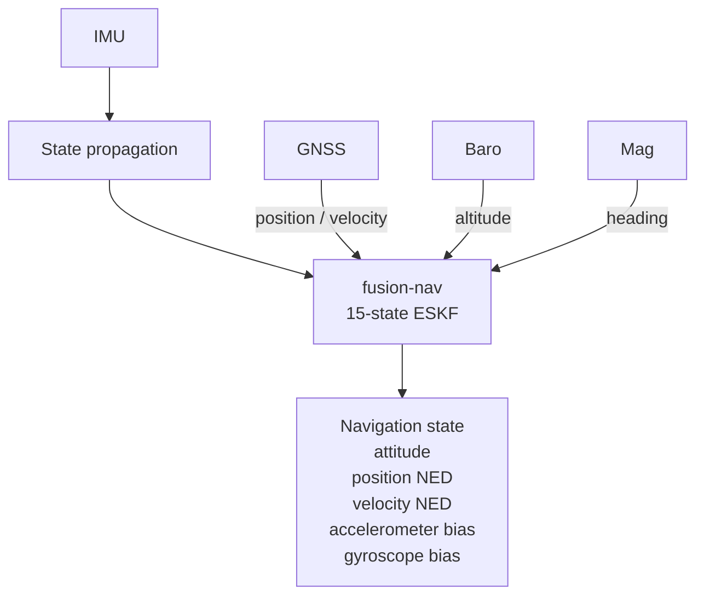
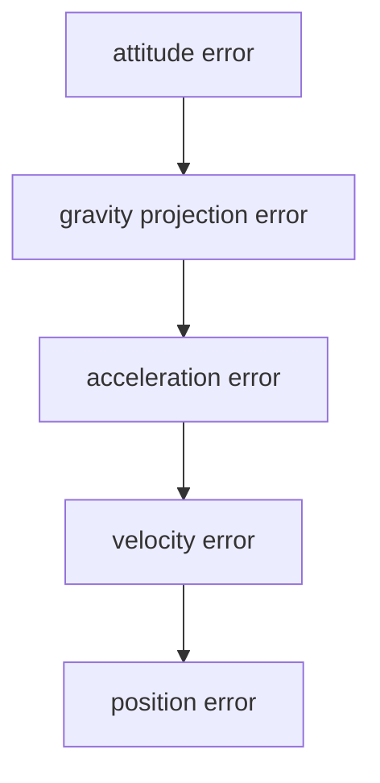
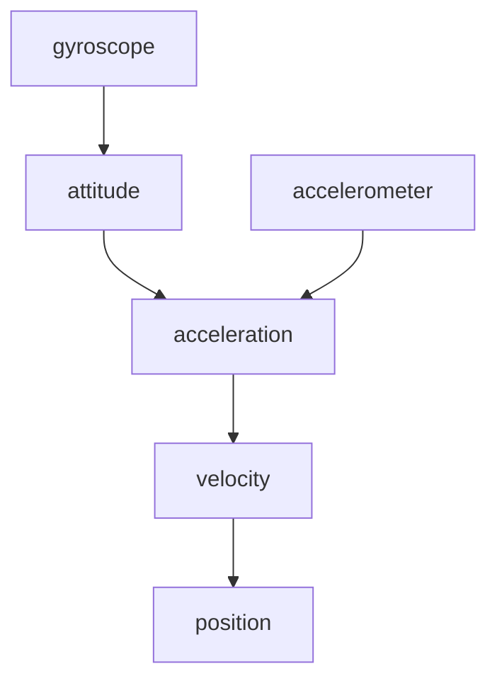
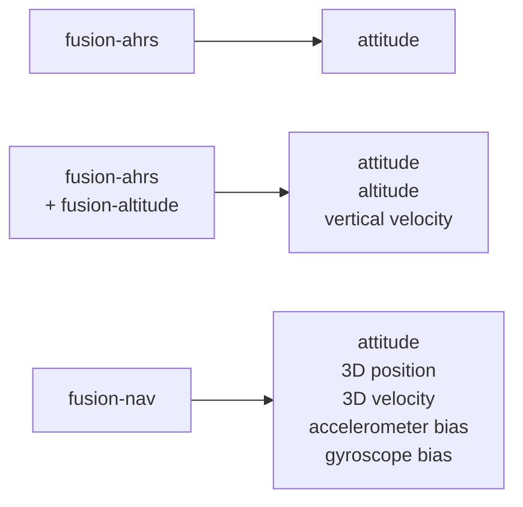
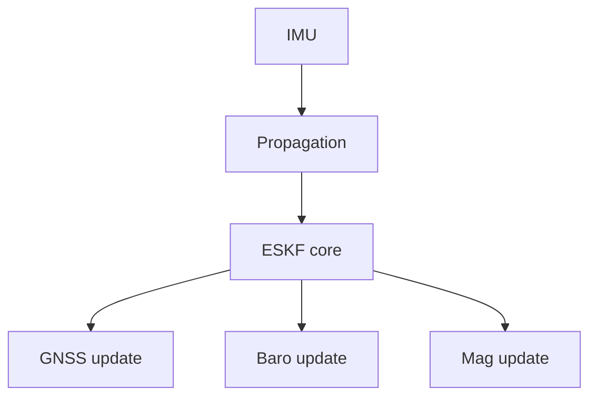
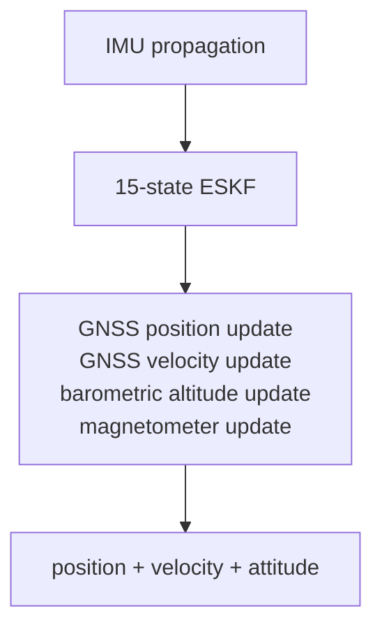

# fusion-nav

Embedded-first inertial navigation using a 15-state Error-State Kalman Filter (ESKF).

> **Status: design only.** This document describes the intended architecture and scope.
> No implementation exists yet, and the design is subject to change.

`fusion-nav` provides 3D attitude, velocity, and position estimation by fusing IMU measurements with external observations such as GNSS, barometric altitude, and magnetometer measurements.

The crate is designed for flight controllers, UAVs, robotics, and other embedded navigation applications.



## Goals

`fusion-nav` is intended to provide a middle ground between simple attitude/altitude filters and large flight-stack navigation estimators.

The primary goals are:

* 3D position and velocity estimation
* quaternion attitude estimation
* IMU bias estimation
* GNSS position and velocity fusion
* barometric altitude fusion
* magnetometer fusion
* innovation gating and measurement rejection
* deterministic execution
* allocation-free operation
* `no_std` support
* minimal dependencies
* suitability for embedded flight controllers

The initial implementation intentionally focuses on the core navigation problem rather than attempting to reproduce every feature of mature autopilot estimators such as PX4 EKF2.

## Error-State Kalman Filter

`fusion-nav` uses an Error-State Kalman Filter rather than representing the complete navigation state directly in the Kalman filter.

The nominal navigation state is

| nominal state       | dimension |
| ------------------- | --------- |
| position            | 3         |
| velocity            | 3         |
| attitude quaternion | 4         |
| accelerometer bias  | 3         |
| gyroscope bias      | 3         |
| **total**           | **16**    |

The corresponding error state is

| error state        | dimension |
| ------------------ | --------- |
| position error     | 3         |
| velocity error     | 3         |
| attitude error     | 3         |
| accelerometer bias | 3         |
| gyroscope bias     | 3         |
| **total**          | **15**    |

or

```text
δx = [δp, δv, δθ, δba, δbg]
```

The filter therefore maintains a `15 × 15` error covariance matrix while orientation is represented by a quaternion in the nominal state.

Using a three-dimensional attitude error avoids treating the four quaternion components as independent Kalman states and preserves the unit-quaternion constraint naturally.

## Why an ESKF?

Attitude, velocity, position, and IMU errors are strongly coupled in an inertial navigation system.

For example, a small attitude error causes gravity to be projected incorrectly into the navigation frame:



A unified ESKF models these relationships through its covariance.

External observations such as GNSS can therefore correct not only position and velocity, but also errors in attitude and estimated IMU biases.

## Coordinate System

The navigation frame is North-East-Down (NED).

```text
+x  North
+y  East
+z  Down
```

Positions and velocities are expressed in the navigation frame.

IMU measurements are expressed in the body frame and transformed into the navigation frame using the estimated attitude quaternion.

## State Propagation

The IMU drives the high-rate propagation step.

Gyroscope measurements propagate attitude:

```text
ω = ωmeasured - bg
```

Accelerometer measurements are bias corrected and rotated into the navigation frame:

```text
ab = ameasured - ba

an = R(q) ab + g
```

The resulting acceleration propagates velocity and position.

Conceptually:



The covariance is propagated alongside the nominal state using the linearized error-state dynamics.

## Measurement Updates

External sensors constrain IMU drift through independent measurement updates.

### GNSS Position

GNSS position observations correct the estimated navigation position.

```text
z = pGNSS
h(x) = p
```

### GNSS Velocity

GNSS velocity observations correct the estimated navigation velocity.

```text
z = vGNSS
h(x) = v
```

GNSS velocity is particularly useful because velocity errors otherwise accumulate rapidly from accelerometer and attitude errors.

### Barometric Altitude

Barometric altitude provides an independent vertical-position observation.

This constrains vertical drift between GNSS updates and can provide higher-rate vertical corrections than GNSS alone.

### Magnetometer

Magnetometer measurements provide heading information and constrain yaw drift caused by gyroscope bias.

Magnetometer fusion should include measurement validation so that temporary magnetic disturbances do not corrupt the navigation solution.

## Innovation Gating

Measurements should not automatically be accepted simply because they are available.

For each observation the filter computes the innovation

```text
y = z - h(x)
```

and innovation covariance

```text
S = HPHᵀ + R
```

The normalized innovation can then be used to reject measurements inconsistent with the current state estimate.

This provides a common mechanism for handling GNSS glitches, barometer transients, and magnetic interference.

## Relationship to Other Fusion Crates

`fusion-nav` complements the lightweight filters in the Fusion ecosystem.



### `fusion-ahrs`

Use `fusion-ahrs` when the primary requirement is attitude estimation.

It provides a substantially simpler and less computationally expensive solution than a full navigation ESKF.

### `fusion-altitude`

Use `fusion-altitude` with `fusion-ahrs` when attitude, altitude, and vertical velocity are sufficient.

This is well suited to stabilization and altitude-hold applications that do not require full navigation.

### `fusion-nav`

Use `fusion-nav` when the application requires 3D position or velocity estimation.

The ESKF owns its attitude estimate rather than consuming an attitude generated by `fusion-ahrs`. Attitude uncertainty is coupled to velocity and position uncertainty and therefore needs to remain part of the navigation estimator.

## Architecture

The filter is intentionally sensor-independent at its core.



Sensor drivers and hardware interfaces are outside the scope of the crate.

Applications provide measurements together with their associated uncertainty.

## Embedded Design

`fusion-nav` is intended to be suitable for microcontrollers used in flight-control applications.

The implementation should therefore favor:

* fixed-size matrices
* compile-time dimensions
* stack allocation
* no dynamic allocation
* deterministic execution time
* `no_std`
* explicit numerical types
* minimal dependencies

A 15-state filter requires a `15 × 15` covariance matrix containing 225 scalar values.

With `f32`, the covariance alone requires approximately 900 bytes.

This is small enough for modern STM32H7-class flight controllers while still providing a useful full inertial-navigation state.

## Initial Scope

The first version focuses on:



Features deliberately deferred include:

* wind estimation
* terrain estimation
* magnetic-field state estimation
* magnetometer bias states
* optical flow
* visual odometry
* range finder fusion
* airspeed fusion
* multiple simultaneous navigation filters
* automatic sensor-source switching

These can be added as concrete use cases require them.

## Design Philosophy

`fusion-nav` favors a small, understandable navigation estimator over a feature-complete autopilot navigation subsystem.

The filter should make the underlying mathematics visible rather than hiding it behind a large abstraction layer.

Where practical, equations in the implementation should correspond directly to the equations documented in the crate.

The intended result is an estimator that is:

* small enough to understand
* fast enough for embedded use
* complete enough for real navigation

## References

The architecture is informed by established error-state inertial-navigation literature and production UAV estimators, including PX4 EKF2.

PX4 is used as a reference for practical topics such as:

* IMU propagation
* covariance propagation
* sensor fusion
* innovation gating
* bias estimation
* estimator initialization
* numerical robustness

`fusion-nav` is an independent Rust implementation rather than a source-code port of PX4 EKF2.

The mathematical formulation should be based primarily on published inertial-navigation and error-state Kalman filter literature.

## License

Licensed under the MIT License.
