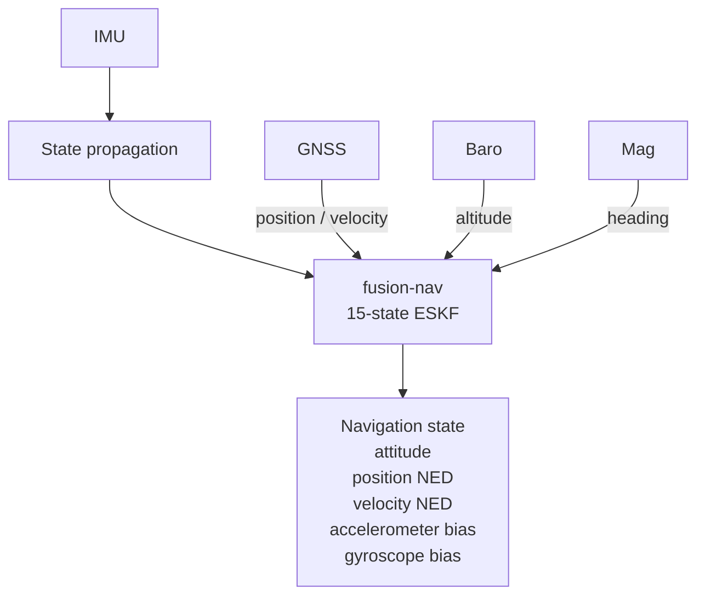
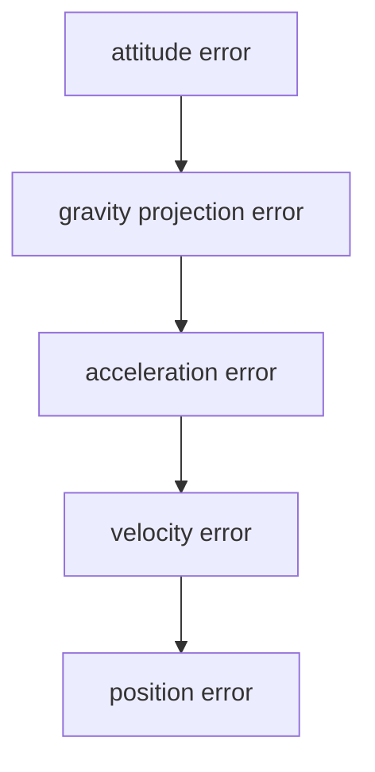
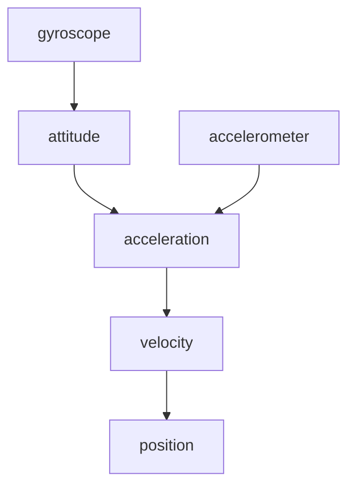
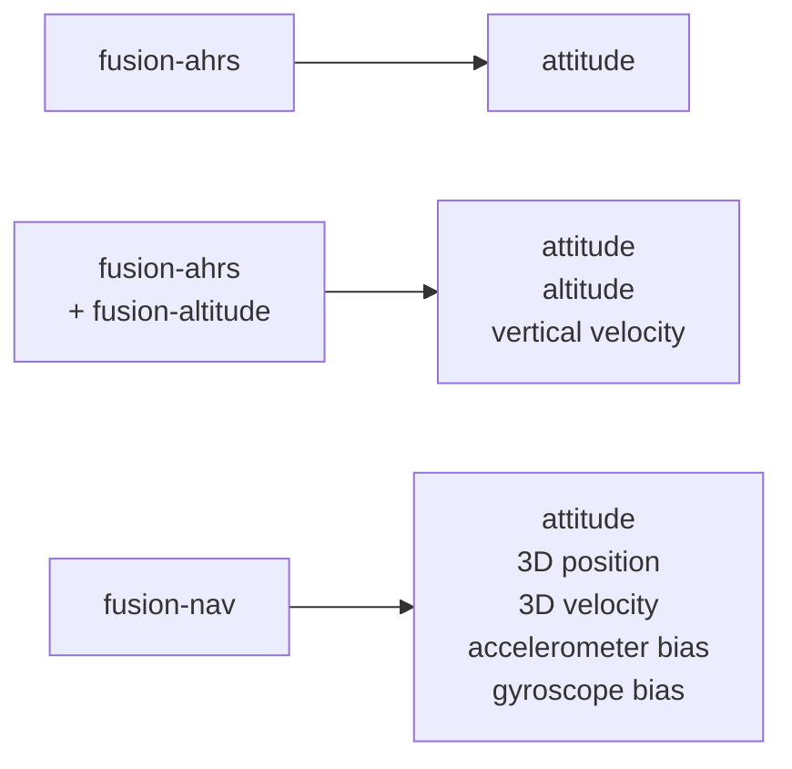
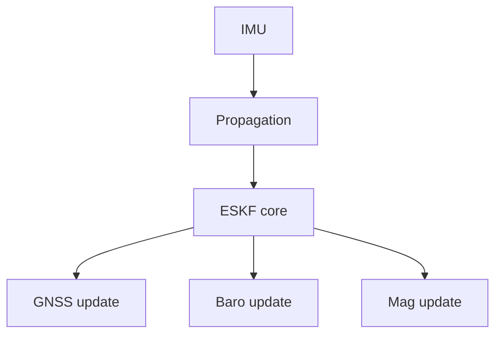
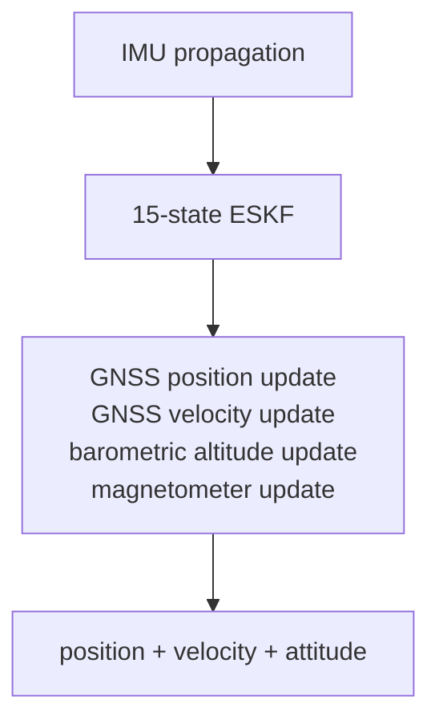

# fusion-nav

Embedded-first inertial navigation using a 15-state Error-State Kalman Filter (ESKF).

> **Status: API sketch.** The types and signatures in [API](#api) exist and compile; the
> estimation mathematics does not. `predict` propagates nothing and every `fuse_*` accepts
> unconditionally. The design is subject to change.

`fusion-nav` provides 3D attitude, velocity, and position estimation by fusing IMU measurements with external observations such as GNSS, barometric altitude, and magnetometer measurements.

The crate is designed for flight controllers, UAVs, robotics, and other embedded navigation applications.



## Goals

`fusion-nav` is intended to provide a middle ground between simple attitude/altitude filters and large flight-stack navigation estimators.

See [GOALS.md](GOALS.md) for how `fusion-nav` is positioned against existing Rust crates and production autopilot estimators, and for the open design questions.

See [EQUATIONS.md](EQUATIONS.md) for the full mathematical description and its mapping to the implementation.

The primary goals are:

* 3D position and velocity estimation
* quaternion attitude estimation
* IMU bias estimation
* GNSS position and velocity fusion
* barometric altitude fusion
* magnetometer fusion
* innovation gating and measurement rejection
* deterministic execution, with measured worst-case timing and stack usage published per operation
* navigation and body frames and units enforced at compile time
* allocation-free operation
* `no_std` support
* minimal dependencies
* suitability for embedded flight controllers

The initial implementation intentionally focuses on the core navigation problem rather than attempting to reproduce every feature of mature autopilot estimators such as PX4 EKF2.

## Error-State Kalman Filter

`fusion-nav` uses an Error-State Kalman Filter rather than representing the complete navigation state directly in the Kalman filter.

The nominal navigation state is

| nominal state       | dimension |
| ------------------- | --------- |
| position            | 3         |
| velocity            | 3         |
| attitude quaternion | 4         |
| accelerometer bias  | 3         |
| gyroscope bias      | 3         |
| **total**           | **16**    |

The corresponding error state is

| error state        | dimension |
| ------------------ | --------- |
| position error     | 3         |
| velocity error     | 3         |
| attitude error     | 3         |
| accelerometer bias | 3         |
| gyroscope bias     | 3         |
| **total**          | **15**    |

The filter therefore maintains a `15 × 15` error covariance matrix while orientation is represented by a quaternion in the nominal state.

Using a three-dimensional attitude error avoids treating the four quaternion components as independent Kalman states and preserves the unit-quaternion constraint naturally.

See [state definitions](EQUATIONS.md#state-definitions).

## Why an ESKF?

Attitude, velocity, position, and IMU errors are strongly coupled in an inertial navigation system.

For example, a small attitude error causes gravity to be projected incorrectly into the navigation frame:



A unified ESKF models these relationships through its covariance.

External observations such as GNSS can therefore correct not only position and velocity, but also errors in attitude and estimated IMU biases.

## Coordinate System

The navigation frame is North-East-Down (NED) and the body frame is Forward-Right-Down (FRD).

```text
navigation (NED)        body (FRD)
+x  North               +x  Forward
+y  East                +y  Right
+z  Down                +z  Down
```

Both frames are right-handed. Because down is positive, gravity has a **positive** z component in
the navigation frame, and a level, stationary accelerometer reads negative z.

Attitude is a unit quaternion rotating body to navigation, Hamilton convention, scalar first.

Positions and velocities are expressed in the navigation frame. IMU measurements are expressed in
the body frame and transformed into the navigation frame using the estimated attitude quaternion.

These conventions are fixed, not configurable. Applications working in ENU or NWU convert at the
boundary; the conversions are exact signed permutations. See [notation](EQUATIONS.md#frames).

## Initialization

The filter is initialized from a quasi-static interval: the vehicle stationary, with gravity the
only specific force.

Roll and pitch come from the averaged accelerometer, heading from the magnetometer levelled by
that roll and pitch, and gyroscope bias from the averaged gyroscope, which is observable at rest.
Accelerometer bias is not separable from attitude error at rest and starts at zero.

This is an operational requirement, not an implementation detail: the application must hold the
vehicle still and must validate that it was still, because initialization quality dominates
early-flight performance.

See [initialization](EQUATIONS.md#initialization).

## State Propagation

The IMU drives the high-rate propagation step.

Gyroscope measurements are bias corrected and propagate attitude.

Accelerometer measurements are bias corrected, rotated into the navigation frame, and gravity is added.

The resulting acceleration propagates velocity and position.

Conceptually:



The covariance is propagated alongside the nominal state using the linearized error-state dynamics.

See [nominal state propagation](EQUATIONS.md#nominal-state-propagation) and [covariance propagation](EQUATIONS.md#covariance-propagation).

## Measurement Updates

External sensors constrain IMU drift through independent measurement updates.

See [observation models](EQUATIONS.md#observation-models) for the measurement Jacobians.

### GNSS Position

GNSS position observations correct the estimated navigation position directly.

### GNSS Velocity

GNSS velocity observations correct the estimated navigation velocity directly.

GNSS velocity is particularly useful because velocity errors otherwise accumulate rapidly from accelerometer and attitude errors.

### Barometric Altitude

Barometric altitude provides an independent vertical-position observation.

This constrains vertical drift between GNSS updates and can provide higher-rate vertical corrections than GNSS alone.

The barometer reference is captured once at initialization and held as a constant. There is no
barometer bias state, so slow drift in that reference — weather, ground effect, sensor warm-up —
is not estimated and appears directly as vertical position error.

### Magnetometer

Magnetometer measurements constrain yaw drift caused by gyroscope bias.

Fusion is **heading only** by default: the field is reduced to a single scalar heading and fused
as one measurement, leaving roll and pitch to gravity where they are well determined. A magnetic
disturbance can then corrupt one state rather than three, and the innovation gate has a
one-dimensional quantity to act on.

Three-axis field fusion is documented for completeness but is not the default. `fusion-nav`
carries no magnetic-field or magnetometer-bias states, so hard- and soft-iron calibration is the
application's responsibility; an uncalibrated magnetometer produces a heading bias the filter
cannot detect.

See [magnetometer, heading only](EQUATIONS.md#magnetometer-heading-only).

## Innovation Gating

Measurements should not automatically be accepted simply because they are available.

For each observation the filter computes the innovation and its covariance, then uses the normalized innovation to reject measurements inconsistent with the current state estimate.

This provides a common mechanism for handling GNSS glitches, barometer transients, and magnetic interference.

Rejections are counted and exposed. A filter that silently discards every measurement looks
identical to one that is working.

See [innovation gating](EQUATIONS.md#innovation-gating).

### Measurement rejection

A single rejection needs no action — discarding an inconsistent measurement is what the gate is
for.

Sustained rejection is a different condition. Gating is self-sealing: if the filter itself is
wrong rather than the measurement, correct measurements become inconsistent with the state, all
of them are rejected, and the filter locks itself out of the data that would fix it. It then
dead-reckons on the IMU while still reporting a confident solution.

`fusion-nav` tracks, per source, the time since a measurement was last accepted and the number of
consecutive rejections. The aggregate is reported on the state estimate itself rather than behind
a separate call, so a solution cannot be consumed without its status:

* `Healthy` — every configured source is being fused
* `Degraded` — a source has timed out, others still aid the solution
* `DeadReckoning` — nothing is aiding; position and velocity drift without bound

Per-source detail — test ratios and time since last acceptance — is available from
`diagnostics()` for logging and tuning.

The filter does **not** recover on its own. Recovery policy belongs to the application, which is
the only layer that knows whether to reset states, degrade the flight mode, or alert the
operator. `reset_position_to()` and `reset_velocity_to()` exist so that `DeadReckoning` is
actionable rather than merely observable.

See [gate lockout](EQUATIONS.md#gate-lockout).

## Relationship to Other Fusion Crates

`fusion-nav` complements the lightweight filters in the Fusion ecosystem. See
[GOALS.md](GOALS.md) for the comparison against non-Fusion crates and production estimators.



### `fusion-ahrs`

Use `fusion-ahrs` when the primary requirement is attitude estimation.

It provides a substantially simpler and less computationally expensive solution than a full navigation ESKF.

### `fusion-altitude`

Use `fusion-altitude` with `fusion-ahrs` when attitude, altitude, and vertical velocity are sufficient.

This is well suited to stabilization and altitude-hold applications that do not require full navigation.

### `fusion-nav`

Use `fusion-nav` when the application requires 3D position or velocity estimation.

The ESKF owns its attitude estimate rather than consuming an attitude generated by `fusion-ahrs`. Attitude uncertainty is coupled to velocity and position uncertainty and therefore needs to remain part of the navigation estimator.

## Architecture

The filter is intentionally sensor-independent at its core.



Sensor drivers and hardware interfaces are outside the scope of the crate.

Applications provide measurements together with their associated uncertainty.

### API

The signatures below compile today; the mathematics behind them does not exist yet.
Three runnable programs exercise them: `cargo run --example basic` is the integration loop
on its own, `cargo run --example degradation` covers dropouts, per-source diagnostics,
and an application-driven reset, and `cargo run --example replay` reads a recorded flight
from CSV and writes the estimate back out as CSV — the normalized log format the
[validation harness](GOALS.md#harness-constraint) is built on.

```rust
use fusion_nav::prelude::*;

let mut filter = Eskf::new(Config::default());

// Quasi-static initialization from a window of stationary samples. Each `StaticSample`
// is an `ImuSample` plus an optional `MagField<Body>`; without the magnetometer, heading
// is unobserved and starts with an inflated yaw variance.
filter.initialize(&static_window)?;

// High-rate propagation. `dt` is explicit; the filter never reads a clock.
filter.predict(ImuSample { gyro, accel }, Seconds::from_secs(0.0025));

// Measurement updates. Each returns the gate outcome, carrying the test ratio
// so a rejection is diagnosable rather than a bare failure. `#[must_use]`, so
// discarding it is a warning.
let outcome = filter.fuse_gnss_position(position, PositionVariance::isotropic(1.5));
filter.fuse_gnss_velocity(velocity, VelocityVariance::isotropic(0.09));
filter.fuse_baro_altitude(Altitude::from_meters(60.0), AltitudeVariance::from_m2(4.0));
filter.fuse_mag_heading(field, HeadingVariance::from_rad2(0.05));

match outcome {
    Fusion::Accepted { test_ratio } => { /* fused; r <= 1 */ }
    Fusion::Rejected { test_ratio } => { /* gated out; r > 1, the state is unchanged */ }
    Fusion::NotInitialized => { /* no state to fuse against */ }
}

// The status travels with the estimate rather than behind a second call.
let s = filter.state();
match s.status {
    Status::Healthy => { /* every source that has been fused is still accepted */ }
    Status::Degraded => { /* a source has timed out; still aided */ }
    Status::DeadReckoning => { /* nothing is aiding — drift is unbounded */ }
}
// s.attitude, s.position, s.velocity, s.accel_bias, s.gyro_bias

let d = filter.diagnostics();  // per-source test ratio, time since last accepted, counts
let p = filter.covariance();   // 15 x 15, indexed by name: p.variance(ErrorState::AttitudeZ)

// Recovery is the application's policy, not the filter's.
filter.reset_position_to(fix, PositionVariance::isotropic(2.5));
```

`fusion_nav::prelude` carries the whole integration surface, since typed frames and units
mean a loop touches a dozen names. Everything in it is also exported at the crate root.

Frames appear in the types, so a `Position<Enu>` cannot be passed where NED is expected.
Units are named by every constructor rather than documented: `Position::from_meters`,
`AngularRate::from_rad_per_s`, `HeadingVariance::from_rad2`.

`Status` is a payload-free enum and `state()` stays small and `Copy`, so reading it in a
control loop costs nothing. Timing detail lives in `diagnostics()`, which is not on the hot path.

## Embedded Design

`fusion-nav` is intended to be suitable for microcontrollers used in flight-control applications.

The implementation should therefore favor:

* fixed-size matrices
* compile-time dimensions
* stack allocation
* no dynamic allocation
* deterministic execution time
* `no_std`
* explicit numerical types
* minimal dependencies

The only dependency is [`nalgebra`](https://crates.io/crates/nalgebra), built
`no_std` with its `libm` feature, which supplies the fixed-size matrix algebra and the
quaternion type. It fixes the MSRV at 1.89.

A 15-state filter requires a `15 × 15` covariance matrix containing 225 scalar values, which in
`f32` is 900 bytes.

The covariance is not the whole cost. A measurement update in Joseph form also needs the
transition matrix, the `(I − KH)` product, and at least one `15 × 15` temporary, each another
900 bytes, so the realistic working set is a few kilobytes rather than one. Peak stack usage
depends on how aggressively temporaries are reused, which is exactly why the intent is to
**measure and publish** the figure per operation rather than estimate it here.

A few kilobytes is still comfortable on an STM32H7-class flight controller while providing a full
inertial-navigation state.

## Initial Scope

The first version focuses on:



Features deliberately deferred include:

* wind estimation
* terrain estimation
* magnetic-field state estimation
* magnetometer bias states
* optical flow
* visual odometry
* range finder fusion
* airspeed fusion
* multiple simultaneous navigation filters
* automatic sensor-source switching

These can be added as concrete use cases require them.

## Limitations

Known and deliberate, stated here rather than discovered in flight.

* **Measurement latency is not modelled.** GNSS solutions arrive 100–200 ms stale and are fused as
  though they were simultaneous with the current state. PX4 solves this with a delayed fusion
  horizon and an output complementary filter; `fusion-nav` does not, and the resulting error grows
  with vehicle speed. This is the one open design question — see
  [measurement latency](GOALS.md#measurement-latency).
* **No barometer bias state.** Drift in the barometric reference becomes vertical position error.
* **No magnetic-field states.** Hard- and soft-iron calibration is the application's job.
* **Initialization requires a genuine static interval**, and the application must verify it.
* **Local tangent plane.** Position is Cartesian NED about a fixed origin, so accuracy degrades
  over ranges where Earth curvature matters. PX4 carries latitude and longitude for this reason.
* **The filter gates but does not self-recover.** On sustained rejection it reports
  `DeadReckoning` and stops there; the application must reset the affected states or degrade the
  flight mode. PX4 by contrast resets its states to the measurement after a 7 s horizontal or 5 s
  height fusion timeout, which are reasonable starting points for an integrator's own policy.

## Design Philosophy

`fusion-nav` favors a small, understandable navigation estimator over a feature-complete autopilot navigation subsystem.

The filter should make the underlying mathematics visible rather than hiding it behind a large abstraction layer.

Where practical, equations in the implementation should correspond directly to the equations documented in the crate. The
[equation-to-code mapping](EQUATIONS.md#equation-to-code-mapping) is the concrete form of that promise: every numbered
equation names the function that implements it.

The intended result is an estimator that is:

* small enough to understand
* fast enough for embedded use
* complete enough for real navigation

## References

The architecture is informed by established error-state inertial-navigation literature and production UAV estimators, including PX4 EKF2.

PX4 is used as a reference for practical topics such as:

* IMU propagation
* covariance propagation
* sensor fusion
* innovation gating
* bias estimation
* estimator initialization
* numerical robustness

`fusion-nav` is an independent Rust implementation rather than a source-code port of PX4 EKF2.

The mathematical formulation follows J. Solà, *Quaternion kinematics for the error-state Kalman
filter* ([arXiv:1711.02508](https://arxiv.org/abs/1711.02508)), which is the primary source for
the error-state formulation and its Jacobians. Full reference list in
[EQUATIONS.md](EQUATIONS.md#references).

## License

Licensed under the MIT License.
