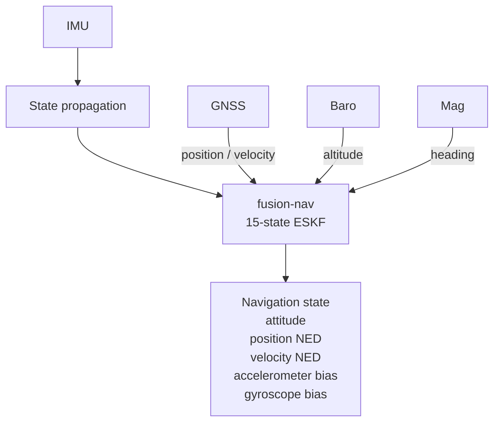
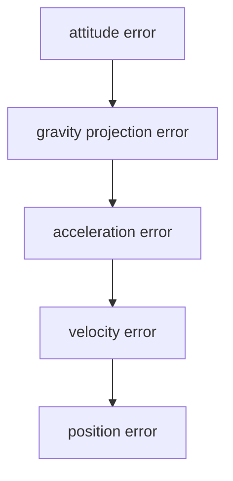
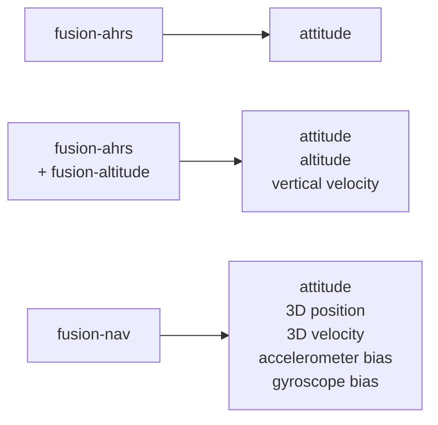

# fusion-nav

Embedded-first inertial navigation using a 15-state Error-State Kalman Filter (ESKF).

> **Status: API sketch.** The types and signatures below exist and compile; the estimation
> mathematics does not. `predict` propagates nothing and every `fuse_*` accepts
> unconditionally. The design is subject to change.

`fusion-nav` estimates 3D attitude, velocity, and position by fusing IMU measurements with GNSS,
barometric altitude, and magnetometer observations. It is `no_std`, allocation-free, and aimed at
flight controllers, UAVs, and other embedded navigation.



## Why an ESKF?

No single sensor gives you navigation. An IMU is fast and self-contained but integrating it drifts
without bound: a small gyroscope bias becomes an attitude error, and an accelerometer bias becomes
velocity error that grows linearly and position error that grows quadratically. GNSS is absolute
but slow, noisy, and sometimes absent. A barometer gives height only; a magnetometer gives heading
only and is easily disturbed.

The errors are also coupled. A small attitude error projects gravity into the wrong axis, and
that becomes acceleration, velocity, and position error:



A Kalman filter that carries all of these quantities together models that coupling through its
covariance, so a GNSS position fix corrects not only position but the attitude and IMU biases that
caused it to drift. The error-state form keeps attitude as a quaternion and estimates only a small
3-D correction to it, which avoids treating the quaternion's four components as independent. See
[DESIGN.md](DESIGN.md#error-state-kalman-filter).

### When you do not need one

`fusion-nav` complements the lighter Fusion filters:



* **attitude only** — `fusion-ahrs`, substantially simpler and cheaper.
* **attitude, altitude, vertical velocity** (stabilization, altitude hold) — `fusion-ahrs` with
  `fusion-altitude`.
* **3D position or velocity** — `fusion-nav`. It owns its attitude rather than consuming one from
  `fusion-ahrs`, because attitude uncertainty is coupled to velocity and position uncertainty.

[GOALS.md](GOALS.md) compares `fusion-nav` against other Rust crates and PX4 / ArduPilot.

## Quick start

```rust
use fusion_nav::prelude::*;

let mut filter = Eskf::new(Config::default());
let dt = Seconds::from_secs(0.0025); // 400 Hz IMU

// Initialize from a window of samples taken while the vehicle sits still. A short or
// moving window still starts the filter, as `Alignment::Coarse`.
if let Alignment::Coarse(_) = filter.initialize(&static_window, dt)? {
    /* running, but reports `Status::Aligning` until attitude converges */
}

loop {
    // High-rate propagation on every IMU sample. The outcome is #[must_use]: a refused
    // step leaves the state where it was.
    if !filter.predict(imu, dt).is_propagated() { /* log the gap */ }

    // Measurement updates whenever a sensor delivers, each with its own noise. Bound a
    // receiver's accuracy the way PX4 and ArduPilot do, and fuse only a real fix —
    // the first one places the navigation origin.
    let fix = Geodetic::from_degrees_e7(pvt.lat, pvt.lon, pvt.height_mm);
    let (eph, epv) = (pvt.h_acc_mm as f32 * 1e-3, pvt.v_acc_mm as f32 * 1e-3);
    let noise = PositionNoise::clamped(eph, epv, 0.5, 100.0);
    if !filter.fuse_gnss_geodetic(fix, noise).is_accepted() {
        /* diagnostics() has the detail */
    }

    // The estimate carries its own health.
    let s = filter.state();
    if s.validity.horizontal_position { /* use s.position */ }
}
```

`fusion_nav::prelude` carries the whole integration surface. Three runnable programs show it in
full:

```console
$ cargo run --example basic         # the integration loop on its own
$ cargo run --example degradation   # dropouts, diagnostics, an application-driven reset
$ cargo run --example replay        # a recorded flight in, the estimate out, as CSV
```

`replay` also runs real PX4 logs, and `cargo run --example simulate` generates seeded flights with
analytic ground truth to score against; see [data/README.md](data/README.md).

## Conventions

Fixed, not configurable. ENU and FLU input converts at the boundary, through constructors that
do it — `Position::enu(e, n, u).to_ned()`, `AngularRate::flu(..)` — so the exact signed
permutation is written once, in the crate.

```text
navigation (NED)        body (FRD)
+x  North               +x  Forward
+y  East                +y  Right
+z  Down                +z  Down
```

* Down is positive, so gravity has a **positive** z component in the navigation frame and a level,
  stationary accelerometer reads negative z.
* Attitude is a unit quaternion rotating body to navigation, Hamilton convention, scalar first.
  `Attitude`'s constructors name the convention they take; see [seeding an attitude](#seeding-an-attitude).
* Positions and velocities are in the navigation frame; IMU measurements in the body frame.

Frames are in the types, and constructors name them: `Position::ned(n, e, d)`,
`AngularRate::body(x, y, z)`. Passing a `Position<Enu>` where NED is expected is a compile error.
Units are SI and named only where a source commonly supplies something else:
`Radians::from_degrees`, `AngularRate::body_deg_per_s`, `Geodetic::from_degrees_e7`. Noise is
built `from_sigma` or `from_variance`, so a receiver's σ cannot arrive as a variance.
Components come out as plain numbers: `.x()`, `.to_array()`, or `.vector()` for `nalgebra`.

The filter never reads a clock. `dt` is an argument everywhere, including initialization.

## Initialization

The preferred start is a quasi-static window: the vehicle still, gravity the only specific force.
Each `StaticSample` is an `ImuSample` plus an optional magnetometer reading, barometer reading
and GNSS velocity. From the window the filter takes:

* **roll and pitch** from the averaged accelerometer
* **heading** from the magnetometer if the window carries one, levelled by that roll and
  pitch. Without one, heading is unobserved: stillness says nothing about the rotation about
  gravity. `validity.heading` is false and `Status` stays `Aligning` until the first
  `fuse_mag_heading` is accepted, however still the window was — `Initialization::sigma_yaw` is a
  prior on a yaw nobody measured, and the covariance alone cannot tell the two apart (the yaw
  value itself, and the reset that should replace it, are not yet built)
* **gyroscope bias** from the averaged gyroscope, observable at rest (accelerometer bias is not,
  and starts at zero)
* **the barometric reference** `α₀` — the altitude the barometer read at the origin. It is a
  constant, so a window with no barometer samples leaves altitudes with nothing to be relative
  to, and `fuse_baro_altitude` returns `Fusion::NoReference` for the whole flight.

A window taken **at rest** establishes `α₀`, including one too short to align an attitude from: a
vehicle sitting on the ground has an honest reference whatever the window length, and that altitude
is what zero will mean. A window taken in motion — a restart at altitude, most obviously — keeps the
reference the flight began with rather than calling its own altitude the ground.
`set_baro_reference(α₀)` names one instead, which is also how an `initialize_from` seed gets one; it
returns `false` for a value that is not a number.

A window that is short or moving is **not refused**. It gives a coarse start: attitude
uncertainty inflated to match the motion actually measured, and `Status::Aligning` until tilt
and heading are within `Config::accuracy`. A filter that will not start is worth less than one
that starts and says how much to trust it — refusing would rule out moving decks, hand launches,
and restarts at altitude.

`StaticSample::velocity` is what a moving window has that a still one does not need. Two GNSS
velocities in the window give `ā_n`, the vehicle's own acceleration, which is the part of the
specific force that is not gravity — and `Coarse::NotStationary` reports it beside the motion it
measured. Levelling with it, equation (5′), is not built: a coarse start still charges the whole
deviation to tilt.

| entry point | for |
| ----------- | --- |
| `initialize(window, dt)` | the usual case; `Alignment::Static` if the window was genuinely still, `Alignment::Coarse` with what it measured otherwise |
| `initialize_coarse(imu)` | no window at all — one sample of gravity, and the filter runs |
| `initialize_from(state, covariance)` | an estimate the application already holds: a companion AHRS such as `fusion-ahrs`, the last flight's saved state. [Seeding an attitude](#seeding-an-attitude) is where its convention gets named |

`alignment_of(window, dt)` reports what `initialize` would make of a window without touching the
filter, for an application that would rather wait for stillness than start coarsely.

A **seed** is checked where a window is not, because it crosses a boundary the filter does not
control — another estimator, or storage that may be stale. `initialize_from` returns
`InitError::NotFinite` for a NaN or an infinity, and `InitError::InvalidVariance` for a variance on
the covariance diagonal that is not strictly positive: the bar every `fuse_*` puts on `R`. Zero is
the one that arrives in practice, from a warm start whose diagonal was never populated, and it is
not a tight prior but a claim of perfect knowledge — nothing would ever correct that quantity, and
`validity()` would report it good immediately. A refused seed leaves the filter uninitialized
rather than poisoned.

After a coarse start the first GNSS position and first GNSS velocity are **adopted rather than
fused**, reported as `Fusion::Reset`. A vehicle that initialized while moving has no position or
velocity for the gate to judge a fix against. This happens once per quantity; everything after is
fused normally.

Stillness is still worth arranging where available: initialization quality dominates
early-flight performance. See [initialization](EQUATIONS.md#initialization).

### Seeding an attitude

A quaternion carries no frames, so `Attitude` has no `From<UnitQuaternion>` and every constructor
names the convention it takes. Nothing else in initialization is like this: a seed is the one input
with no residual to expose a wrong one.

| the source publishes | constructor |
| -------------------- | ----------- |
| body FRD to NED — PX4 `vehicle_attitude.q`, ArduPilot `get_quat_body_to_ned`, `fusion-ahrs` on `Convention::Ned` | `Attitude::body_to_ned(q)`, which converts nothing |
| NED to body FRD, the stored inverse | `Attitude::ned_to_body(q)` |
| body FLU to ENU — ROS REP 103 | `Attitude::flu_to_enu(q)` |
| body FLU to NWU — Madgwick-family, `fusion-ahrs` on its default | `Attitude::flu_to_nwu(q)` |

Where both frames differ the conversion is two-sided, `q_ned←frd = r_nav ⊗ q ⊗ r_body⁻¹`; rotating
only the navigation frame reports the same heading with the vehicle upside down, which a level
bench check agrees with. The constructors' rustdoc carries the conventions, their sources, and what
a wrong one costs.

## Running the filter

### Propagation

Call `predict(imu, dt)` on every IMU sample. The result is `#[must_use]`:

| `Propagation` | meaning |
| ------------- | ------- |
| `Propagated` | state advanced over the full `dt` |
| `StepTooLong { dt, limit }` | `dt` exceeded `Config::max_predict_dt`; state unchanged, but health timers advanced because the time really passed |
| `InvalidStep { dt }` | `dt` zero, negative, or NaN; nothing moved |
| `NotFinite` | the sample carried a NaN or an infinity; state unchanged, health timers advanced as above |
| `NotInitialized` | no state to propagate |

### Measurements

| method | measurement |
| ------ | ----------- |
| `fuse_gnss_geodetic(fix, noise)` | latitude, longitude, height; converted about the filter's origin |
| `fuse_gnss_position(position, noise)` | NED position about the filter's origin, for a caller that converts itself |
| `fuse_gnss_velocity(velocity, noise)` | NED velocity |
| `fuse_baro_altitude(altitude, noise)` | altitude, relative to `α₀` |
| `fuse_mag_heading(field, noise)` | body-frame field, fused as heading only |

The noise is an argument, not configuration, because the accuracy of a fix is a property of that
fix. Build it the way the source reports it: `PositionNoise::horizontal_vertical(eph, epv)` and
`VelocityNoise::from_speed_accuracy(sacc)` take a receiver's standard deviations, `from_variance`
takes a covariance diagonal as ROS carries it. Bound a receiver's figures first —
`PositionNoise::clamped(eph, epv, 0.5, 100.0)` and `VelocityNoise::clamped(sacc, sacc, 0.5, 50.0)` —
since neither production autopilot fuses one raw. Both floor it, against a receiver whose accuracy
stays small under multipath while the fix is metres wrong; ArduPilot also caps, and PX4 caps
horizontal position only while GNSS is its sole horizontal aid. Where an axis was not measured at
all — a two-dimensional fix, a solution with no vertical velocity — `horizontal_vertical` is the
constructor instead, since it leaves that axis' σ alone where `clamped` would cap it back into a
measurement. The magnetometer must already be calibrated for hard and soft iron.

Every measurement passes through an innovation gate first. The result carries the test ratio, so
a rejection is diagnosable. Reading it is optional: `diagnostics()` keeps the ratio, the counts
and the timer per source, and counts the refusals below with the reason for the latest one, so
nothing here is lost by discarding the return value. Read it where the response is per call —
a `Reset` steps the state, and a refusal says the measurement never reached the gate:

| `Fusion` | meaning |
| -------- | ------- |
| `Accepted { test_ratio }` | fused; ratio ≤ 1 |
| `Rejected { test_ratio }` | gated out; ratio > 1, state unchanged |
| `Reset` | adopted outright after a coarse start (once per quantity) |
| `NoReference` | barometer altitude with no `α₀` from initialization, or a geodetic fix that cannot place an origin |
| `NotFinite` | a NaN or infinity in the measurement or its noise; discarded |
| `InvalidNoise` | a zero or negative variance in the noise — no sensor has one, and `S` would be singular or worse; discarded |
| `NotInitialized` | no state to fuse against |

### The navigation origin

Position is NED meters about an origin the filter holds. The first `fuse_gnss_geodetic` places
it: under the current estimate after a static start or a seed, so nothing steps, and at the fix
itself after a coarse start, where the fix is adopted. Check the fix type first — a receiver
without a fix often reports latitude and longitude zero, and that would become the origin. `set_origin` names one instead, such as a
surveyed home; call it after initializing, since a static start clears it.

Read it back with `origin()`, and use it for anything else held in latitude and longitude — a
waypoint, a geofence — so it lands in the estimate's frame. `geodetic_position()` is the estimate
converted back.

## Health reporting

A single rejection needs no action — that is what the gate is for. Sustained rejection is
different: if the filter itself is wrong, correct measurements look inconsistent, all are
rejected, and the filter silently dead-reckons while looking confident. So health travels with
the estimate: `filter.state()` returns the solution together with its status and validity, and a
solution cannot be read without them.

### `Status` — how bad is the worst thing

| `Status` | meaning |
| -------- | ------- |
| `Healthy` | every source that has been fused is still accepted, and attitude has converged |
| `Aligning` | running and aided, but attitude has not converged — a coarse start still learning, or a heading no magnetometer has observed yet |
| `Degraded` | a source has timed out; others still aid the solution |
| `DeadReckoning` | nothing is aiding; position and velocity drift without bound |

When several apply the most severe wins, in the order `DeadReckoning` > `Aligning` > `Degraded` >
`Healthy`. Only sources that have ever been accepted count, so a vehicle with no GNSS is not
`Degraded` for lacking it.

### `validity` — which outputs can I use

`state().validity` has one flag per quantity: `tilt`, `heading`, `horizontal_position`,
`vertical_position`, `horizontal_velocity`, `vertical_velocity`. Each is the covariance measured
against `Config::accuracy`, plus the requirement that the quantity was ever established — a tight
prior on a number nobody set is not validity. A coarse start with an adopted GNSS fix has valid
position while its attitude is still `Aligning`; `Status` alone cannot say that. Heading is the
same rule applied to attitude: a vehicle with no magnetometer has valid `tilt` and never valid
`heading`, until one is fused.

`Config::accuracy` is the one group of numbers meant to be supplied rather than derived: a survey
platform and a racing quadrotor disagree about what "good enough" means.

### `predicted_validity` — will it be good if I take off now

On the ground, heading may be unobservable and GNSS may not have a fix yet, so `validity` says
no about a filter that would be navigating a second after takeoff. `predicted_validity()` answers
instead whether each quantity is valid now **or** a source that constrains it is currently being
accepted. Use it for arming checks. (ArduPilot's `pred_horiz_pos_rel` is the same idea.)

Tilt is the exception: no source aids it, only a static window establishes it today, so its
prediction is exactly its current value. After a coarse start `predicted_validity().tilt` stays
false however much GNSS is accepted.

### Detail

* `is_aligned()` — whether attitude has converged, on the same bar `Status::Aligning` uses: read
  from the covariance against `Config::accuracy`, so promotion is measured rather than timed.
* `diagnostics()` — per source: test ratio, time since last acceptance, consecutive rejections,
  and how many measurements were refused before the gate and why. A source that only ever refuses
  reads as "never accepted", like one that was never connected, and the refusal count is what
  tells them apart. Also carries what `predict` refused, which is not per source. For logging and
  tuning; not on the hot path.
* `covariance()` — the 15 × 15 covariance, indexed by name: `p.variance(ErrorState::AttitudeZ)`.
* `baro_reference()` — the `α₀` initialization fixed, if any.

## Recovery is the application's job

The filter gates but does **not** recover on its own. Only the application knows whether to
reset states, degrade the flight mode, or alert the operator. `reset_position_to(fix, noise)`
and `reset_velocity_to(fix, noise)` exist so that `DeadReckoning` is actionable. Both return
`false`, changing nothing, for a fix or a noise a `fuse_*` would have refused: a reset writes the
noise onto the covariance diagonal with no gate in the way. PX4 resets after 7 s of horizontal
dead reckoning or 5 s of failed height fusion (`reset_timeout_max` and `hgt_fusion_timeout_max`,
`src/modules/ekf2/EKF/common.h:515-517` at PX4 `c4e4ef98e9`), which are reasonable starting points
for an integrator's own policy. See [rejection handling](GOALS.md#rejection-handling-report-do-not-self-recover).

## The library cannot panic

Checked in CI, not remembered: `panic-check/run.sh` links the whole public API for
`thumbv7em-none-eabihf` and `thumbv6m-none-eabi` with fat LTO and fails if any reference to
`core::panicking` survives. That covers an `unwrap` and an `expect`, and equally a slice index
or a `nalgebra` matrix index nobody wrote down. On `thumbv6m` a panic is a `udf` instruction and
the vehicle is a brick, which is why bad input comes back as `Propagation::InvalidStep` or
`Fusion::InvalidNoise` rather than as an assertion.

It is a real link rather than a scan of the source, so it proves reachability rather than
absence of a keyword. `panic-check/src/main.rs` calls every entry point through
`core::hint::black_box`, and the script refuses to run if any `pub fn` in `src/` is missing from
it — a new entry point joins the gate or CI stops. A failure names the function that can panic,
not just the symbol it reached.

Two boundaries, both real:

* **`debug-assertions = false`**, the release default. Three `debug_assert!`s in `src/eskf.rs`
  restate a condition the lines above them just checked, and with assertions on they are panics
  like any other — the gate fails, by design. They are a test-time check on the crate's own
  reasoning, not a runtime guard, which is why they are `debug_assert!` and not `if`.
* **`opt-level = 3` or `"s"`.** At `"z"` and `1`, LLVM stops proving that `nalgebra`'s statically
  sized `Matrix3 * Vector3` indexes in bounds and leaves the check in as dead code, reached from
  `LocalOrigin::to_ned`. That is the optimizer giving up, not a path this crate can take, and
  gating it would put CI at the mercy of someone else's codegen.

The crate is also `#![forbid(unsafe_code)]`, `no_std`, and allocation-free.

## Limitations

Known and deliberate, stated here rather than discovered in flight.

* **Measurement latency is not modelled.** GNSS solutions arrive typically 100–200 ms stale and
  are fused as though current; the error grows with speed. PX4 fuses at a delayed horizon and
  propagates forward from it (`src/modules/ekf2/EKF/output_predictor/output_predictor.cpp`). See
  [measurement latency](GOALS.md#measurement-latency).
* **No barometer bias state.** Drift in the reference — weather, ground effect, warm-up — becomes
  vertical position error. See
  [barometric reference as a constant](GOALS.md#barometric-reference-as-a-constant).
* **No magnetic-field states.** Hard- and soft-iron calibration is the application's job; an
  uncalibrated magnetometer gives a heading bias the filter cannot detect.
* **Heading needs a magnetometer.** It is the only heading source the filter has, so a vehicle
  without one never leaves `Aligning` and never reports `validity.heading`, however good the rest
  of the estimate is. `Aligning` hides `Degraded`, so such a vehicle's source timeouts stop
  showing in `Status` too and have to be read from `diagnostics()`. Yaw from course over ground
  and a GSF yaw estimator are the answers, both unbuilt. See
  [alignment beyond the static window](GOALS.md#alignment-beyond-the-static-window).
* **In-motion alignment is coarse.** A moving start runs and reports `Aligning`, but full
  alignment of a bare vehicle in motion is not yet built; `initialize_from` covers a held
  estimate. See [alignment beyond the static window](GOALS.md#alignment-beyond-the-static-window).
* **Local tangent plane.** Position is Cartesian NED about a fixed origin. The geodetic
  conversion is exact at any range ([equation (43)](EQUATIONS.md#geodetic-origin)), but a plane
  leaves a curved Earth: `d` from the origin it sits `d²/2R` above the surface, 8 cm at 1 km and
  7.8 m at 10 km, so `-p_D` far out is not height and the barometer model has to correct for it.
* **No self-recovery**, by design — see above.

Features deliberately deferred (wind, terrain, optical flow, airspeed, ...) are listed in
[DESIGN.md](DESIGN.md#initial-scope).

## Further reading

* [DESIGN.md](DESIGN.md) — architecture, state definition, measurement models, gating, embedded
  budget, scope
* [EQUATIONS.md](EQUATIONS.md) — the mathematics, numbered, with an equation-to-code map
* [GOALS.md](GOALS.md) — positioning, differentiators, decisions, open questions
* [data/README.md](data/README.md) — the replay harness and PX4 log corpus

## License

Licensed under the MIT License.
