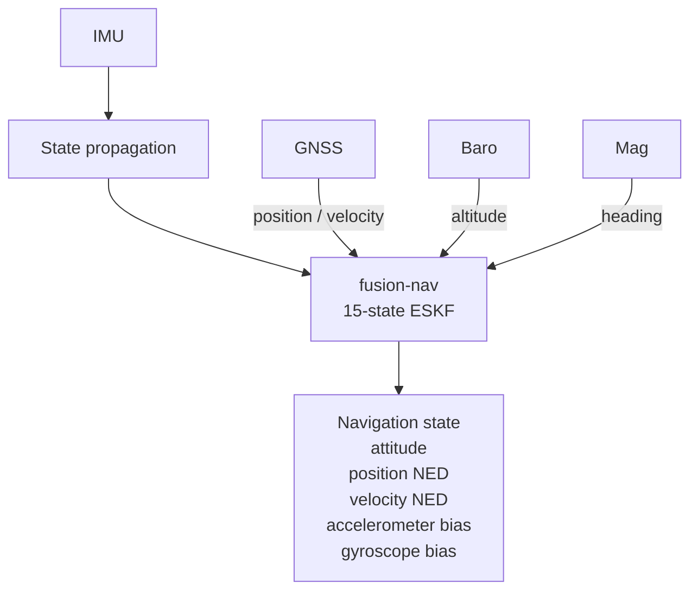
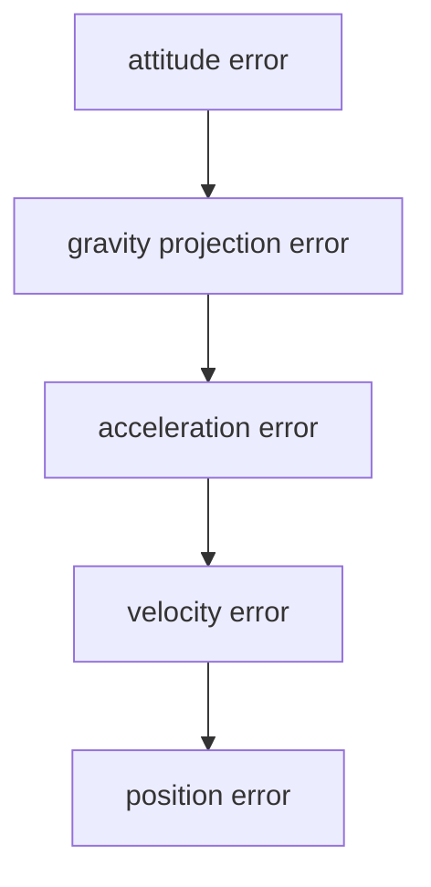
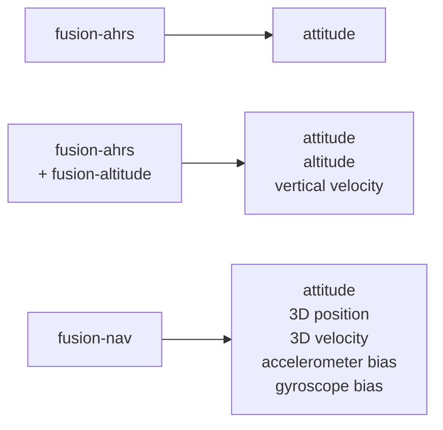

# fusion-nav

Embedded-first inertial navigation using a 15-state Error-State Kalman Filter (ESKF).

> **Status: API sketch.** The types and signatures below exist and compile; the estimation
> mathematics does not. `predict` propagates nothing and every `fuse_*` accepts
> unconditionally. The design is subject to change.

`fusion-nav` estimates 3D attitude, velocity, and position by fusing IMU measurements with GNSS,
barometric altitude, and magnetometer observations. It is `no_std`, allocation-free, and aimed at
flight controllers, UAVs, and other embedded navigation.



## Why an ESKF?

No single sensor gives you navigation. An IMU is fast and self-contained but integrating it drifts
without bound: a small gyroscope bias becomes an attitude error, and an accelerometer bias becomes
velocity error that grows linearly and position error that grows quadratically. GNSS is absolute
but slow, noisy, and sometimes absent. A barometer gives height only; a magnetometer gives heading
only and is easily disturbed.

The errors are also coupled. A small attitude error projects gravity into the wrong axis, and
that becomes acceleration, velocity, and position error:



A Kalman filter that carries all of these quantities together models that coupling through its
covariance, so a GNSS position fix corrects not only position but the attitude and IMU biases that
caused it to drift. The error-state form keeps attitude as a quaternion and estimates only a small
3-D correction to it, which avoids treating the quaternion's four components as independent. See
[DESIGN.md](DESIGN.md#error-state-kalman-filter).

### When you do not need one

`fusion-nav` complements the lighter filters in the Fusion ecosystem:



* **attitude only** — `fusion-ahrs`, substantially simpler and cheaper.
* **attitude, altitude, vertical velocity** (stabilization, altitude hold) — `fusion-ahrs` with
  `fusion-altitude`.
* **3D position or velocity** — `fusion-nav`. It owns its attitude rather than consuming one from
  `fusion-ahrs`, because attitude uncertainty is coupled to velocity and position uncertainty.

[GOALS.md](GOALS.md) compares `fusion-nav` against other Rust crates and PX4 / ArduPilot.

## Quick start

```rust
use fusion_nav::prelude::*;

let mut filter = Eskf::new(Config::default());
let dt = Seconds::from_secs(0.0025); // 400 Hz IMU

// Initialize from a window of samples taken while the vehicle sits still. A short or
// moving window still starts the filter, as `Alignment::Coarse`.
if let Alignment::Coarse(_) = filter.initialize(&static_window, dt)? {
    /* running, but reports `Status::Aligning` until attitude converges */
}

loop {
    // High-rate propagation on every IMU sample. The outcome is #[must_use]: a refused
    // step leaves the state where it was.
    if !filter.predict(imu, dt).is_propagated() { /* log the gap */ }

    // Measurement updates whenever a sensor delivers, each with its own variance.
    // A rejection carries its test ratio.
    // GNSS goes in as latitude and longitude: the filter holds the origin and converts.
    let fix = Geodetic::from_degrees_e7(pvt.lat, pvt.lon, pvt.height_mm);
    if !filter.fuse_gnss_geodetic(fix, PositionVariance::isotropic(1.5)).is_accepted() {
        /* diagnostics() has the detail */
    }

    // The estimate carries its own health.
    let s = filter.state();
    if s.validity.horizontal_position { /* use s.position */ }
}
```

`fusion_nav::prelude` carries the whole integration surface. Three runnable programs show it in
full:

```console
$ cargo run --example basic         # the integration loop on its own
$ cargo run --example degradation   # dropouts, diagnostics, an application-driven reset
$ cargo run --example replay        # a recorded flight in, the estimate out, as CSV
```

`replay` also runs real PX4 logs; see [data/README.md](data/README.md).

## Conventions

Fixed, not configurable. Applications in ENU or NWU convert at the boundary; the conversions are
exact signed permutations.

```text
navigation (NED)        body (FRD)
+x  North               +x  Forward
+y  East                +y  Right
+z  Down                +z  Down
```

* Down is positive, so gravity has a **positive** z component in the navigation frame and a level,
  stationary accelerometer reads negative z.
* Attitude is a unit quaternion rotating body to navigation, Hamilton convention, scalar first.
* Positions and velocities are in the navigation frame; IMU measurements in the body frame.

Frames are in the types, so passing a `Position<Enu>` where NED is expected is a compile error.
Units are named by every constructor: `Position::from_meters`, `AngularRate::from_rad_per_s`,
`HeadingVariance::from_rad2`.

The filter never reads a clock. `dt` is an argument everywhere, including initialization.

## Initialization

The preferred start is a quasi-static window: the vehicle still, gravity the only specific force.
Each `StaticSample` is an `ImuSample` plus an optional magnetometer and barometer reading. From
the window the filter takes:

* **roll and pitch** from the averaged accelerometer
* **heading** from the magnetometer if the window carries one, levelled by that roll and
  pitch. Without one, heading is unobserved and is meant to start with an inflated variance for
  the first magnetic heading to correct (not yet built)
* **gyroscope bias** from the averaged gyroscope, observable at rest (accelerometer bias is not,
  and starts at zero)
* **the barometric reference** `α₀` — the altitude the barometer read at the origin. It is a
  constant, so a window with no barometer samples leaves altitudes with nothing to be relative
  to, and `fuse_baro_altitude` returns `Fusion::NoReference` for the whole flight.

A window that is short or moving is **not refused**. It gives a coarse start: attitude
uncertainty inflated to match the motion actually measured, and `Status::Aligning` until tilt
and heading are within `Config::accuracy`. A filter that will not start is worth less than one
that starts and says how much to trust it — refusing would rule out moving decks, hand launches,
and restarts at altitude.

| entry point | for |
| ----------- | --- |
| `initialize(window, dt)` | the usual case; `Alignment::Static` if the window was genuinely still, `Alignment::Coarse` with what it measured otherwise |
| `initialize_coarse(imu)` | no window at all — one sample of gravity, and the filter runs |
| `initialize_from(state, covariance)` | an estimate the application already holds: a companion AHRS, the last flight's saved state |

`alignment_of(window, dt)` reports what `initialize` would make of a window without touching the
filter, for an application that would rather wait for stillness than start coarsely.

After a coarse start the first GNSS position and first GNSS velocity are **adopted rather than
fused**, reported as `Fusion::Reset`. A vehicle that initialized while moving has no position or
velocity for the gate to judge a fix against. This happens once per quantity; everything after is
fused normally.

Stillness is still worth arranging where available: initialization quality dominates
early-flight performance. See [initialization](EQUATIONS.md#initialization).

## Running the filter

### Propagation

Call `predict(imu, dt)` on every IMU sample. The result is `#[must_use]`:

| `Propagation` | meaning |
| ------------- | ------- |
| `Propagated` | state advanced over the full `dt` |
| `StepTooLong { dt, limit }` | `dt` exceeded `Config::max_predict_dt`; state unchanged, but health timers advanced because the time really passed |
| `InvalidStep { dt }` | zero, negative, or NaN; nothing moved |
| `NotInitialized` | no state to propagate |

### Measurements

| method | measurement |
| ------ | ----------- |
| `fuse_gnss_geodetic(fix, variance)` | latitude, longitude, height; converted about the filter's origin |
| `fuse_gnss_position(position, variance)` | NED position about the filter's origin, for a caller that converts itself |
| `fuse_gnss_velocity(velocity, variance)` | NED velocity |
| `fuse_baro_altitude(altitude, variance)` | altitude, relative to `α₀` |
| `fuse_mag_heading(field, variance)` | body-frame field, fused as heading only |

The variance is an argument, not configuration, because the accuracy of a fix is a property of
that fix. Where a GNSS receiver supplies it (`eph`, `epv`, speed accuracy), floor it: PX4 and
ArduPilot both clamp from 0.5 m rather than fusing raw values. The magnetometer must already be
calibrated for hard and soft iron.

Every measurement passes through an innovation gate first. The `#[must_use]` result carries the
test ratio, so a rejection is diagnosable:

| `Fusion` | meaning |
| -------- | ------- |
| `Accepted { test_ratio }` | fused; ratio ≤ 1 |
| `Rejected { test_ratio }` | gated out; ratio > 1, state unchanged |
| `Reset` | adopted outright after a coarse start (once per quantity) |
| `NoReference` | barometer altitude with no `α₀` from initialization, or a geodetic fix that cannot place an origin |
| `NotInitialized` | no state to fuse against |

### The navigation origin

Position is NED meters about an origin the filter holds. The first `fuse_gnss_geodetic` places
it: under the current estimate after a static start or a seed, so nothing steps, and at the fix
itself after a coarse start, where the fix is adopted. `set_origin` names one instead, such as a
surveyed home; call it after initializing, since a static start clears it.

Read it back with `origin()`, and use it for anything else held in latitude and longitude — a
waypoint, a geofence — so it lands in the estimate's frame. `geodetic_position()` is the estimate
converted back.

## Health reporting

A single rejection needs no action — that is what the gate is for. Sustained rejection is
different: if the filter itself is wrong, correct measurements look inconsistent, all are
rejected, and the filter silently dead-reckons while looking confident. So health travels with
the estimate: `filter.state()` returns the solution together with its status and validity, and a
solution cannot be read without them.

### `Status` — how bad is the worst thing

| `Status` | meaning |
| -------- | ------- |
| `Healthy` | every source that has been fused is still accepted, and attitude has converged |
| `Aligning` | running and aided, but attitude has not converged — a coarse start still learning |
| `Degraded` | a source has timed out; others still aid the solution |
| `DeadReckoning` | nothing is aiding; position and velocity drift without bound |

When several apply the most severe wins, in the order `DeadReckoning` > `Aligning` > `Degraded` >
`Healthy`. Only sources that have ever been accepted count, so a vehicle with no GNSS is not
`Degraded` for lacking it.

### `validity` — which outputs can I use

`state().validity` has one flag per quantity: `tilt`, `heading`, `horizontal_position`,
`vertical_position`, `horizontal_velocity`, `vertical_velocity`. Each is the covariance measured
against `Config::accuracy`, plus the requirement that the quantity was ever established — a tight
prior on a number nobody set is not validity. A coarse start with an adopted GNSS fix has valid
position while its attitude is still `Aligning`; `Status` alone cannot say that.

`Config::accuracy` is the one group of numbers meant to be supplied rather than derived: a survey
platform and a racing quadrotor disagree about what "good enough" means.

### `predicted_validity` — will it be good if I take off now

On the ground, heading may be unobservable and GNSS may not have a fix yet, so `validity` says
no about a filter that would be navigating a second after takeoff. `predicted_validity()` answers
instead whether each quantity is valid now **or** a source that constrains it is currently being
accepted. Use it for arming checks. (ArduPilot's `pred_horiz_pos_rel` is the same idea.)

Tilt is the exception: no source aids it, only a static window establishes it today, so its
prediction is exactly its current value. After a coarse start `predicted_validity().tilt` stays
false however much GNSS is accepted.

### Detail

* `diagnostics()` — per source: test ratio, time since last acceptance, consecutive rejections.
  For logging and tuning; not on the hot path.
* `covariance()` — the 15 × 15 covariance, indexed by name: `p.variance(ErrorState::AttitudeZ)`.
* `baro_reference()` — the `α₀` initialization fixed, if any.

## Recovery is the application's job

The filter gates but does **not** recover on its own. Only the application knows whether to
reset states, degrade the flight mode, or alert the operator. `reset_position_to(fix, variance)`
and `reset_velocity_to(fix, variance)` exist so that `DeadReckoning` is actionable. PX4 resets
after a 7 s horizontal or 5 s height fusion timeout, which are reasonable starting points for an
integrator's own policy. See [rejection handling](GOALS.md#rejection-handling-report-do-not-self-recover).

## Limitations

Known and deliberate, stated here rather than discovered in flight.

* **Measurement latency is not modelled.** GNSS solutions arrive 100–200 ms stale and are fused
  as though current; the error grows with speed. PX4 uses a delayed fusion horizon. See
  [measurement latency](GOALS.md#measurement-latency).
* **No barometer bias state.** Drift in the reference — weather, ground effect, warm-up — becomes
  vertical position error. See
  [barometric reference as a constant](GOALS.md#barometric-reference-as-a-constant).
* **No magnetic-field states.** Hard- and soft-iron calibration is the application's job; an
  uncalibrated magnetometer gives a heading bias the filter cannot detect.
* **In-motion alignment is coarse.** A moving start runs and reports `Aligning`, but full
  alignment of a bare vehicle in motion is not yet built; `initialize_from` covers a held
  estimate. See [alignment beyond the static window](GOALS.md#alignment-beyond-the-static-window).
* **Local tangent plane.** Position is Cartesian NED about a fixed origin, converted by a
  first-order expansion ([equation (43)](EQUATIONS.md#geodetic-origin)), so accuracy degrades
  over ranges where Earth curvature matters: about 0.2 m at 1 km by 1 km, 17 m at 10 km by 10 km.
* **No self-recovery**, by design — see above.

Features deliberately deferred (wind, terrain, optical flow, airspeed, ...) are listed in
[DESIGN.md](DESIGN.md#initial-scope).

## Further reading

* [DESIGN.md](DESIGN.md) — architecture, state definition, measurement models, gating, embedded
  budget, scope
* [EQUATIONS.md](EQUATIONS.md) — the mathematics, numbered, with an equation-to-code map
* [GOALS.md](GOALS.md) — positioning, differentiators, decisions, open questions
* [data/README.md](data/README.md) — the replay harness and PX4 log corpus

## License

Licensed under the MIT License.
