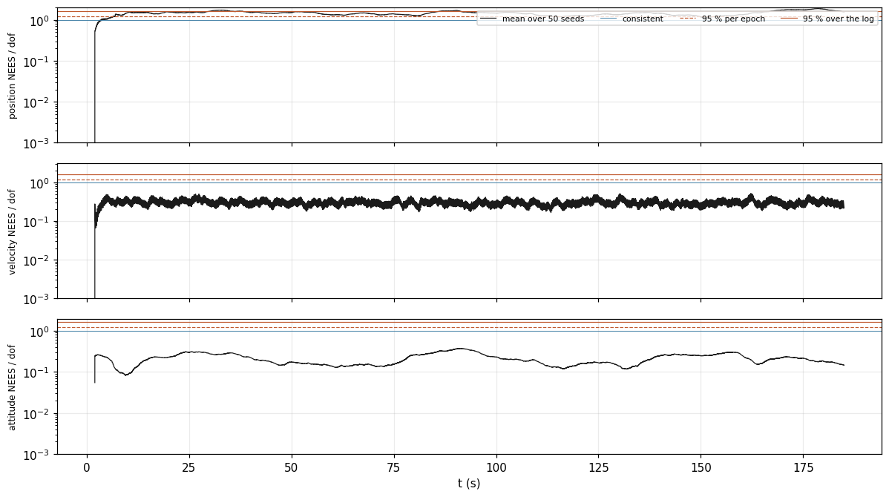

<!-- Generated from validation/src/VALIDATION.md by tools/validation.sh; edit that, not this. -->
# Validation

**Should you trust this filter?** On simulated flights, where the true answer is known, it holds
horizontal position to 0.292 m RMS on the baseline flight. Its estimate of its
own error is usually larger than the real error, which is the safe direction. The exceptions,
where it claims more accuracy than it has, are named below. On real PX4 flights, where nothing
is known exactly, it mostly agrees with EKF2, the estimator PX4 flies, and each place the two
disagree is shown with its cause, or marked as not yet explained.

Generated by `tools/validation.sh` at `579dc95`; every figure on this page is from that build, and `tools/validation.sh --check` re-derives them.

## How to read these pages

- **Error** is the true value minus the filter's estimate. **RMS** is its root mean square over
  a flight: a typical size, where the **max** is the single worst moment.
- **The band.** Besides its estimate, the filter reports how uncertain it is (its covariance).
  The figures draw that as a grey band of three standard deviations (±3σ) either side of zero.
  An error inside the band is one the filter admitted to; an error outside it is one the filter
  did not see coming.
- **Pessimistic** means the band is wider than the errors need, and **overconfident** means it
  is narrower. Pessimistic costs some usefulness. Overconfident is the dangerous one, because
  an application trusts a number it should not.
- **EKF2** is PX4's own estimator. It is not the truth; on real flights nothing is, so the
  [EKF2 page](validation/ekf2.md) measures agreement, never accuracy.

Four questions, a page each, because each needs different evidence
([GOALS.md, three questions, three kinds of source](GOALS.md#three-questions-three-kinds-of-source)).

## [Accuracy](validation/accuracy.md): how close is it, when the truth is known?

14 simulated flights, scored against their exact trajectories. On the baseline
flight: horizontal position 0.292 m RMS, height 0.171 m,
velocity 0.138 m/s, tilt 0.330° and heading
0.289°.

Position error, truth minus estimate, on navigation axes, inside the filter's own +/-3 sigma on the same axis. Both come from one row of <code>replay.error.csv</code>, the error vector every <code>score</code> key reads. The vertical range is set by the error and the band's typical width, so where the band leaves the frame it is wider than drawn. Background shading is <code>Status</code>: amber Aligning, yellow Degraded, red DeadReckoning.

## [Honesty](validation/honesty.md): when it says "within a metre", is it?

Tested over 50 flights of each simulated scenario. The filter is pessimistic
everywhere except where sensor errors persist longer than it assumes (#51).

NEES per degree of freedom at each epoch, averaged over 50 seeds of this scenario by <code>tools/anees.py</code>, against the chi-square bounds <code>data/anees.sh</code> gates: the dashed line is the per-epoch 95 % bound <code>over_</code> counts, the solid one the family-wise bound <code>any_</code> counts. Log scale; 1 is a covariance that describes its error exactly, and below it is underconfident.

## [Robustness](validation/robustness.md): what happens when a sensor fails?

A GNSS outage, a magnetic disturbance, a gap in the log and a drifting barometer. In each, the
error stays inside the band and the filter's status reports the problem. GNSS fixes that arrive
late are placed at the moment they describe, and cost nothing.

Position error, truth minus estimate, on navigation axes, inside the filter's own +/-3 sigma on the same axis. Both come from one row of <code>replay.error.csv</code>, the error vector every <code>score</code> key reads. The vertical range is set by the error and the band's typical width, so where the band leaves the frame it is wider than drawn. Background shading is <code>Status</code>: amber Aligning, yellow Degraded, red DeadReckoning.

## [Agreement with EKF2](validation/ekf2.md): on real flights, does it match PX4?

13 public PX4 flight logs, from quadrotors to fixed-wing and VTOL aircraft.
On the log with the most precise receiver (RTK), position agrees to
0.1301 m RMS north, velocity to
0.04822 m/s RMS north and tilt to
0.2420°. The largest disagreement is a hand-launched aircraft
whose attitude this filter gets wrong at startup, a known gap (#59).

Estimate, EKF2's own solution where the log carries one, and the raw GNSS fixes the filter was offered. EKF2's track is in this filter's frame, reprojected from PX4's by the converter, where the reference header says so; two corpus logs report no origin, and there it stays at its own. Every track here is sampled at a uniform stride, so each point is a position that was actually held &mdash; the min/max envelope the time series use pairs two columns from different epochs and draws a path nobody travelled.

## Where the numbers come from

Nothing on these pages is typed by hand. Every number is copied from the output of a tool in
this repository, and every figure is drawn from the run it describes, named by scenario and
seed or by log. `tools/validation.sh` regenerates all of it, and
`tools/validation.sh --check` fails if any page differs from what a fresh run produces.
