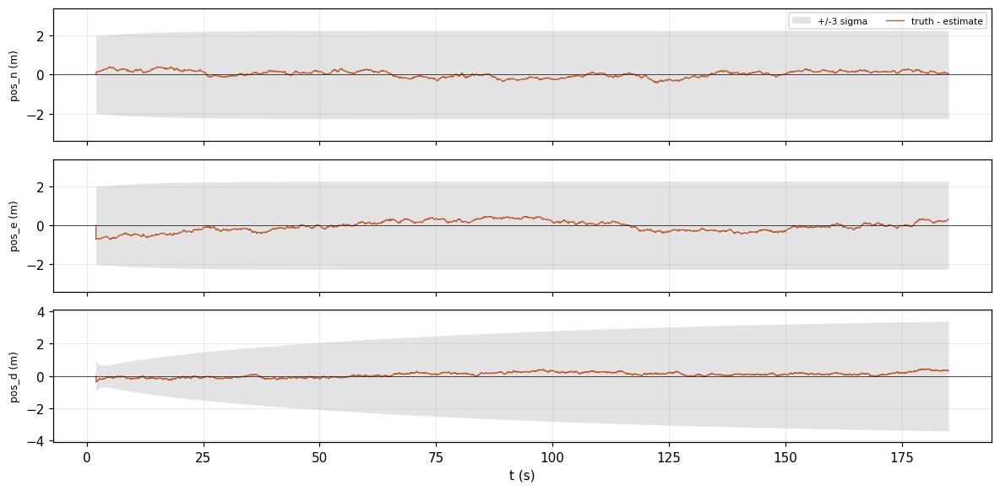
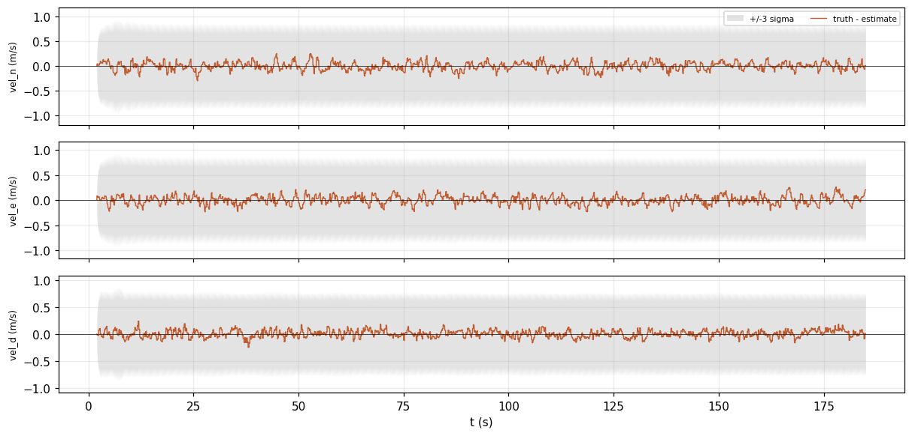
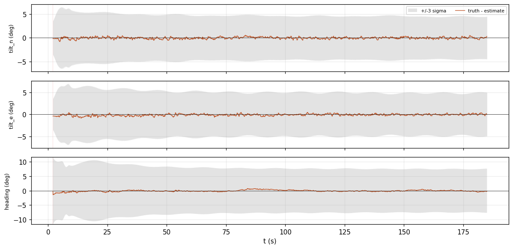
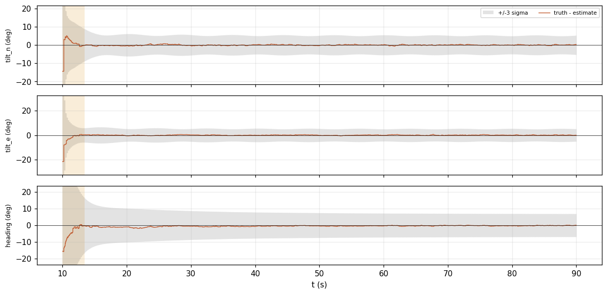

<!-- Generated from validation/src/accuracy.md by tools/validation.sh; edit that, not this. -->
# Accuracy against truth

**How close does the estimate get when the true answer is known?** On the baseline simulated
flight, horizontal position is off by 0.292 m RMS and never by more than
0.767 m. Tilt is off by 0.330° RMS and heading by
0.289°. These are simulated flights, because no real log carries the true
trajectory, so they show how the filter handles the errors the simulator models, not every
error a real vehicle has.

Generated by `tools/validation.sh` at `73d91a2`; every figure on this page is from that build, and `tools/validation.sh --check` re-derives them.

## Where the truth comes from

A simulator (`examples/simulate.rs`) flies each scenario along a trajectory defined by
equations, so the true position, velocity and attitude are known exactly at every instant. It
writes the sensor readings a vehicle on that path would produce, with noise, and the filter is
run on those readings alone. The simulator's noise is deliberately different from what the
filter is tuned for; a filter scored against its own assumptions would learn nothing.

Each scenario exists to test one thing no other scenario covers:

- `static`: 60 s sitting on the ground.
- `mission`: the **baseline**. 5 s still, then a 180 s circuit with turns and climbs.
- `moving_start`: a different flight, in the air and turning from the first sample.
- The rest (`harsh_imu`, `gnss_outage`, `baro_drift`, `gnss_latency`, `correlated`,
  `mag_disturbance`, `logging_dropout`): the baseline circuit with one thing changed, each
  described below.
- `flight`: 14 s at 50 Hz, with sensors appearing and dropping out. It is the log CI replays.

## Every scenario

| run | seed | `pos_h` | `pos_h_max` | `pos_v` | `vel` | `tilt` | `yaw` |
|---|---|---|---|---|---|---|---|
| `static` | 1 | 0.516 | 0.922 | 0.346 | 0.140 | 0.524 | 0.632 |
| `mission` | 2 | 0.292 | 0.767 | 0.171 | 0.138 | 0.330 | 0.289 |
| `harsh_imu` | 2 | 0.293 | 0.774 | 0.169 | 0.143 | 0.828 | 0.803 |
| `gnss_outage` | 2 | 1.634 | 10.964 | 0.098 | 0.210 | 0.338 | 0.325 |
| `moving_start` | 4 | 0.359 | 0.695 | 0.606 | 0.145 | 1.555 | 1.458 |
| `baro_drift` | 2 | 0.292 | 0.767 | 0.918 | 0.139 | 0.329 | 0.288 |
| `gnss_latency` | 2 | 0.295 | 0.789 | 0.158 | 0.144 | 0.338 | 0.291 |
| `correlated` | 2 | 1.152 | 2.390 | 1.143 | 0.231 | 0.700 | 2.306 |
| `mag_disturbance` | 2 | 0.292 | 0.767 | 0.171 | 0.138 | 0.332 | 0.309 |
| `gnss_heading` | 2 | 0.292 | 0.767 | 0.171 | 0.138 | 0.329 | 0.273 |
| `no_mag` | 3 | 0.243 | 0.560 | 0.209 | 0.139 | 0.730 | 6.623 |
| `logging_dropout` | 2 | 0.293 | 2.733 | 0.151 | 0.141 | 0.406 | 0.393 |
| `flight` | 8 | 1.779 | 4.392 | 0.306 | 0.524 | 0.589 | 7.960 |

Columns: `pos_h` is horizontal position error and `pos_v` height error, in metres. `pos_h_max`
is the worst horizontal error at any moment. `vel` is velocity error in m/s. `tilt` is the
error in roll and pitch together, and `yaw` the error in heading, both in degrees. All are RMS
over the whole flight except `pos_h_max`. `seed` names the simulated flight, so anyone can
regenerate exactly this one.

Every departure from the baseline costs something, and what it costs is what the scenario is
for. Against `mission`:

- `harsh_imu` flies a poorly mounted, vibrating IMU. Attitude suffers:
  0.828° of tilt against 0.330°, while position barely
  moves.
- `gnss_outage` loses GNSS for 20 s, and position drifts to 10.964 m
  at worst. With nothing to correct it, the filter is integrating acceleration, and the
  [robustness page](robustness.md#gnss-outage) shows the drift staying inside the band.
- `moving_start` starts in the air, turning, with no still moment to level from. That costs
  attitude at the start; [below](#a-start-in-motion), it converges.
- `baro_drift` has a barometer whose zero drifts. Height suffers:
  0.918 m RMS against 0.171 m, and the filter reports it
  ([robustness](robustness.md#a-drifting-barometer)).
- `gnss_latency` delivers every GNSS fix 150 ms late, and the filter uses each at the moment it
  describes. Position is 0.295 m RMS against 0.292 m,
  and the filter is honest about it ([honesty](honesty.md#fixes-that-arrive-late)).
- `correlated` makes every sensor's errors change more slowly than the filter assumes. Heading
  suffers most, 2.306° against 0.289°, and the filter is
  overconfident about position (#51).
- `mag_disturbance` gives the magnetometer a 30° error for 10 s. The filter refuses those
  readings, so heading barely suffers: 0.309° against
  0.289°.
- `logging_dropout` loses 1.2 s of the log in a turn. The worst horizontal error,
  2.733 m against 0.767 m, is at the end of
  the gap.

## The baseline, over time

How to read these figures: the orange line is the error, true value minus estimate, at every
moment. The grey band is ±3σ, three standard deviations of the uncertainty the filter reported
at that moment. While the line stays inside the band, the filter's error is one it admitted to.

Position error, truth minus estimate, on navigation axes, inside the filter's own +/-3 sigma on the same axis. Both come from one row of <code>replay.error.csv</code>, the error vector every <code>score</code> key reads. The vertical range is set by the error and the band's typical width, so where the band leaves the frame it is wider than drawn. Background shading is <code>Status</code>: amber Aligning, yellow Degraded, red DeadReckoning.

Velocity error, truth minus estimate, on navigation axes, inside the filter's own +/-3 sigma on the same axis. Both come from one row of <code>replay.error.csv</code>, the error vector every <code>score</code> key reads. The vertical range is set by the error and the band's typical width, so where the band leaves the frame it is wider than drawn. Background shading is <code>Status</code>: amber Aligning, yellow Degraded, red DeadReckoning.

Attitude error, truth minus estimate, on navigation axes, inside the filter's own +/-3 sigma on the same axis. Both come from one row of <code>replay.error.csv</code>, the error vector every <code>score</code> key reads. The vertical range is set by the error and the band's typical width, so where the band leaves the frame it is wider than drawn. Background shading is <code>Status</code>: amber Aligning, yellow Degraded, red DeadReckoning.

The band is much wider than the error. That means the filter is pessimistic about these
flights, which is the safe direction but not free. The
[honesty page](honesty.md#pessimistic-by-design-of-the-test) explains why and measures it.

## A start in motion

`moving_start` is in the air and turning from the first sample, so the filter has no still
moment to find which way is down. It starts from a rough guess, takes its first GNSS fix and
magnetometer heading as they are, and corrects from there. Over the whole flight, including
that start, tilt is off by 1.555° RMS and heading by
1.458°.

Attitude error, truth minus estimate, on navigation axes, inside the filter's own +/-3 sigma on the same axis. Both come from one row of <code>replay.error.csv</code>, the error vector every <code>score</code> key reads. The vertical range is set by the error and the band's typical width, so where the band leaves the frame it is wider than drawn. Background shading is <code>Status</code>: amber Aligning, yellow Degraded, red DeadReckoning.

## What this page cannot say

A simulator models only the errors it was written with: no vibration spectrum of a real frame,
no GNSS reflections off buildings, no clock drift between sensors. Real ground truth will come
from the INSANE dataset (#9). Its licence allows publishing summary numbers here, but not
trajectory plots.

## Details

Every run on this page is the one CI checks (`data/bench.sh`), at the seed pinned in
`data/scenarios.txt`. Every number is copied from the `score` line that
`examples/replay.rs` printed for it. The error is `truth ⊖ estimate` in the error state of
`EQUATIONS.md` (2), computed in one place (`error_state`). Attitude is split into tilt, about the
two horizontal axes, and heading, about down, the same way the filter's `Validity` reports it.
The figures are drawn by `tools/replay_report.py` from the run's `<out>.error.csv`, which holds
the same error beside the filter's σ on the same axis.
