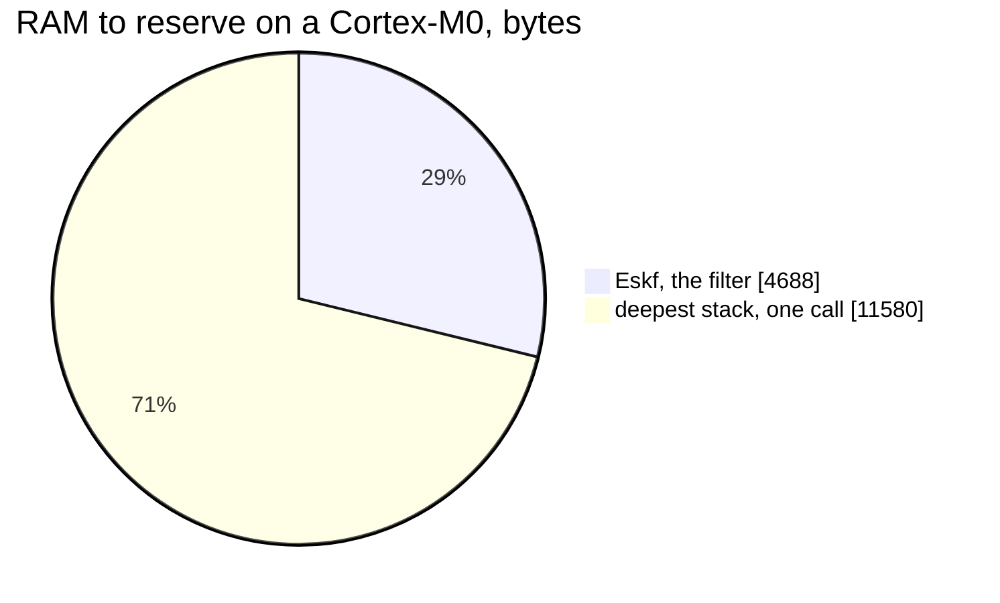
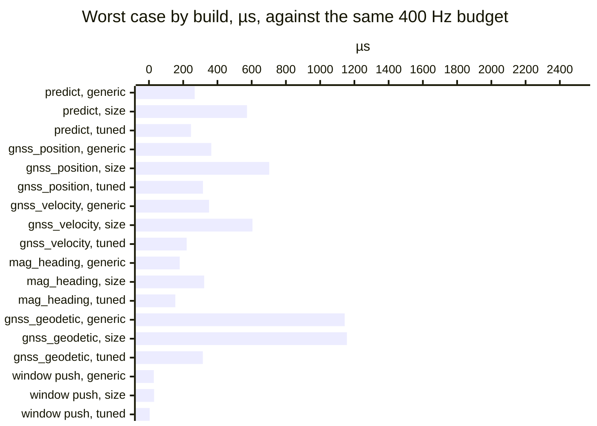
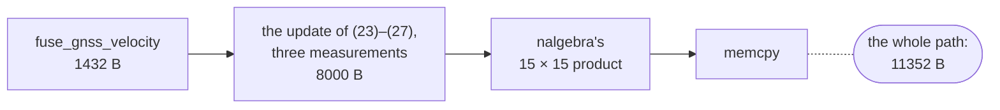

<!-- Generated from validation/src/cost.md by tools/validation.sh; edit that, not this. -->
# Cost on a target

**Does it fit?** On a 400 MHz Cortex-M7, an IMU step takes at most
279.8 µs (120.7 µs on
average) and a GNSS position update at most 368.7 µs,
against the 2500 µs of a 400 Hz loop. The first geodetic fix, which places the origin and happens
once, takes 1143.6 µs,
and 314.7 µs in a build for the M7's
double-precision FPU.

The filter is one struct, `Eskf`, and allocates nothing. Its stack, not its state, is what to plan
RAM around: the deepest call is a GNSS velocity update through the 15 × 15 covariance product.

| at a glance | Cortex-M0 (`thumbv6m`) | Cortex-M4/M7 (`thumbv7em`) |
| --- | --- | --- |
| RAM the filter holds, bytes | 4688 | 4688 |
| deepest stack, bytes, upper bound | 11580 | 11352 |
| flash for the whole API, `opt-level = "s"`, bytes | 127134 | 133924 |
| worst IMU step, µs | not timed | 279.8 |
| worst GNSS position update, µs | not timed | 368.7 |
| worst GNSS velocity update, µs | not timed | 352.7 |

On an M7, build with `-C target-cpu=cortex-m7` ([Which build to ship](#which-build-to-ship)).

Every call's worst case against the 400 Hz budget, which is the axis's end. Each call's longer bar is
its worst, the shorter one in front of it its mean:

```mermaid
xychart-beta horizontal
    title "Worst and mean per call on a 400 MHz Cortex-M7, µs"
    x-axis ["predict", "fuse_gnss_position", "fuse_gnss_geodetic", "fuse_gnss_velocity", "fuse_baro_altitude", "fuse_mag_heading", "fuse_gnss_heading", "fuse_course", "fuse_stationary", "predicted_validity", "initialize", "StaticWindow::push", "state"]
    y-axis "µs" 0 --> 2500
    bar [279.8, 368.7, 1143.6, 352.7, 175.7, 180.3, 188.2, 164.9, 176.3, 77.0, 148.3, 28.5, 5.0]
    bar [120.7, 344.3, 305.3, 305.4, 159.0, 160.5, 169.0, 150.6, 175.1, 75.8, 120.1, 13.0, 4.0]
```

The RAM to reserve on a Cortex-M0: the filter, held for its whole life, and the deepest stack,
held during one call:

Every figure on this page but the board's is pinned exactly in `data/footprint.txt`, and CI fails
on any move. The board's are pinned in `data/onboard.txt` ([How it is measured](#how-it-is-measured)).

## Time on a Cortex-M7

An ARK FPV flight controller, an STM32H743: a Cortex-M7 at 400 MHz, instruction and data caches
on, the filter and the stack in DTCM. Built `rustc_1.99.0-nightly_(7608eb7b0_2026-08-05)` at
`b45f5a8ad4`, `opt-level = 3` with no LTO, the
profile the stack frames below are measured in, for the generic `thumbv7em-none-eabihf` target: a
single-precision FPU, `f64` in library calls, flush-to-zero off.

The calls are every call the replay harness makes into the filter on the thirteen corpus logs and
`hover_outage`, the `state()` it reads each epoch included, plus a trace built to reach the paths
the corpus does not. Every figure is of the arithmetic the host ran, bit for bit.

| entry point | worst, µs | mean, µs | worst, cold caches, µs | calls | calls with a denormal input |
| --- | --- | --- | --- | --- | --- |
| `predict` | 279.8 | 120.7 | 280.2 | 3447657 | 0 |
| `fuse_gnss_position` | 368.7 | 344.3 | 370.5 | 74123 | 0 |
| `fuse_gnss_geodetic` | 1143.6 | 305.3 | 1140.6 | 100 | 0 |
| `fuse_gnss_velocity` | 352.7 | 305.4 | 353.5 | 74222 | 0 |
| `fuse_baro_altitude` | 175.7 | 159.0 | 174.4 | 111222 | 0 |
| `fuse_mag_heading` | 180.3 | 160.5 | 179.5 | 87124 | 0 |
| `fuse_gnss_heading` | 188.2 | 169.0 | 188.6 | 629 | 0 |
| `fuse_course` | 164.9 | 150.6 | 166.5 | 19 | 0 |
| `fuse_stationary` | 176.3 | 175.1 | 175.5 | 10 | 0 |
| `state` | 5.0 | 4.0 | 5.5 | 3434537 | 0 |
| `predicted_validity` | 77.0 | 75.8 | 77.5 | 15 | 0 |
| `initialize` | 148.3 | 120.1 | 149.7 | 16 | 0 |
| `initialize_coarse` | 53.1 | 53.1 | 54.6 | 1 | 0 |
| `initialize_from` | 22.9 | 22.7 | 23.6 | 2 | 0 |
| `StaticWindow::push` | 28.5 | 13.0 | 31.6 | 9673 | 0 |

The worst is over every call on every trace. Cold and warm differ only in fetching the code and
its constants from flash: the filter and the stack sit in DTCM, which no cache covers, so the two
are within the spread of one another and cold can read the lower.

### Worst paths

The `paths` trace (`onboard/examples/paths.rs`) reaches on purpose what the corpus does not.
Placing the origin on the first geodetic fix is `f64` work, a library call on this FPU.

| path | worst, µs | calls |
| --- | --- | --- |
| the first geodetic fix, which places the origin | 1143.6 | 1 |
| every source at the oldest age the history holds | 377.7 | 6 |
| a velocity 30 m/s out, rejected until adopted | 352.2 | 3320 |
| a position 100 m out, rejected until adopted | 350.3 | 3280 |
| a 10 s coast, then a hold | 267.3 | 1 |
| a 6.4 s coast, then a hold on the same step | 265.1 | 1 |
| an unaided step and a hold | 260.4 | 10 |
| a magnetic heading half a circle out | 260.3 | 3780 |
| `predicted_validity` over a 6.4 s horizon | 77.0 | 1 |
| a heading of 3e38 rad, `fmodf`'s longest reduction | 12.7 | 1 |

A coast is (22′) in one exact step, so a gap costs what a step does at any length. The 3e38 rad
heading is there to bound `wrap_pi`'s reduction rather than to be slow
([How it is measured](#how-it-is-measured)).

### Which build to ship

On an M7, `-C target-cpu=cortex-m7`. Three builds, compared on the traces all three ran
(`093e806a,4b473e91,a299e722,cd7e0001,paths`), so the generic build's worst here can sit under its worst
over every trace above. Worst case, µs:

| entry point | generic: `opt-level = 3` | size: `opt-level = "s"`, fat LTO | tuned: `-C target-cpu=cortex-m7` |
| --- | --- | --- | --- |
| `predict` | 267.3 | 572.6 | 245.5 |
| `fuse_gnss_position` | 364.0 | 702.4 | 315.5 |
| `fuse_gnss_velocity` | 351.1 | 604.6 | 220.2 |
| `fuse_mag_heading` | 179.7 | 322.5 | 154.1 |
| `fuse_gnss_geodetic` | 1143.6 | 1156.3 | 314.7 |
| `StaticWindow::push` | 28.5 | 30.0 | 4.4 |

The same table drawn, each entry point's three builds side by side, in the table's order:

The size build inlines the entry points into the dispatcher under fat LTO, and the deepest stack
beneath it is 13012 bytes. The update paths compute no
`f64`, so what the tuned build gains there is scheduling for the M7's pipeline; a start's window
and a geodetic fix gain its double-precision FPU as well. The mean GNSS velocity update is
308.7 µs generic and
208.1 µs tuned.

## Memory

| type | `thumbv6m`, bytes | `thumbv7em`, bytes |
| --- | --- | --- |
| `Eskf`, the filter | 4688 | 4688 |
| of which the state history of (23′) | 1544 | 1544 |
| of which the covariance `P` | 900 | 900 |
| of which `Diagnostics` | 1160 | 1160 |
| of which the yaw estimator of (45)–(52) | 456 | 456 |
| of which the barometric offset of (30′) | 64 | 64 |
| `State`, the estimate `state()` returns | 72 | 72 |
| `Config` | 268 | 268 |
| `StaticWindow`, at any rate and length | 912 | 912 |
| `StaticSample` | 80 | 80 |
| `Startup`, a start worked out and checked before it commits, on a start's stack | 1088 | 1088 |

The rest of `Eskf`, beyond the parts named, is its `Config`, the nominal state, the origin, the
position hold, the clock and its flags.

## Stack

The deepest stack a call into each entry point takes, in bytes, before the caller's frames. The
walk is an upper bound over every path the code has; the painted stack is a lower bound, the
deepest the calls made on the board reached. Every painted figure is under its walk.

| entry point | walked, `thumbv6m` | walked, `thumbv7em` | painted on the M7 |
| --- | --- | --- | --- |
| `predict` | 10812 | 10640 | 10588 |
| `fuse_gnss_position` | 10812 | 10600 | 10548 |
| `fuse_gnss_geodetic` | 11148 | 10928 | 10876 |
| `fuse_gnss_velocity` | 11580 | 11352 | 11300 |
| `fuse_baro_altitude` | 9652 | 9416 | 9364 |
| `fuse_mag_heading` | 9756 | 9504 | 9452 |
| `fuse_gnss_heading` | 9892 | 9640 | 9588 |
| `fuse_course` | 9908 | 9648 | 9596 |
| `fuse_stationary` | 11484 | 11264 | 11212 |
| `predicted_validity` | 7068 | 6712 | 6660 |
| `initialize` | 5476 | 5312 | 5120 |
| `initialize_coarse` | 6212 | 6048 | 5856 |
| `initialize_from` | 3024 | 2896 | 2844 |
| `state` | — | — | 336 |
| `StaticWindow::push` | — | — | 548 |
| **the deepest of them** | **11580** | **11352** | |

The deepest path on `thumbv7em`, with each frame the pins name:

On `thumbv6m` the product calls the soft-float multiply instead of `memcpy`.
`tools/footprint.py --path` prints any entry point's path, frame by frame.

Each entry point's own frame, and the frames beneath it that set its depth

| function | `thumbv6m`, bytes | `thumbv7em`, bytes |
| --- | --- | --- |
| `predict` | 80 | 72 |
| `propagate_or_coast`, the step it calls | 2168 | 2160 |
| `hold_if_unaided`, the hold it calls beside the step | 1304 | 1304 |
| `YawEstimator::predict`, the yaw estimator it steps beside both | 256 | 152 |
| `fuse_gnss_position` | 1384 | 1336 |
| `fuse_gnss_geodetic` | 336 | 328 |
| `fuse_gnss_velocity` | 1456 | 1432 |
| `fuse_baro_altitude` | 1264 | 1256 |
| `fuse_mag_heading` | 120 | 104 |
| `fuse_gnss_heading` | 248 | 248 |
| `fuse_course` | 256 | 256 |
| `fuse_stationary` | 1360 | 1344 |
| `predicted_validity` | 984 | 944 |
| `initialize` | 2224 | 2216 |
| `initialize_coarse` | 3504 | 3488 |
| `initialize_from` | 1928 | 1856 |
| beneath the three heading entry points: the heading update they share | 1264 | 1240 |
| beneath `fuse_gnss_velocity`: the update of (23)–(27), three measurements | 8120 | 8000 |
| beneath `fuse_gnss_position` (and so a geodetic fix): two, the horizontal pair | 7424 | 7344 |
| beneath `fuse_gnss_position`'s height, `fuse_baro_altitude` and the heading update: one | 6384 | 6240 |
| beside the update: the observation formed at the measurement's time, (23′) | 1464 | 1440 |
| beside the update: committing its result, or handing it to an adoption | 1112 | 1064 |
| beside the update: adopting a position, from `fuse_gnss_position` | 1976 | 1992 |
| beside the update: adopting a velocity, from `fuse_gnss_velocity` | 1904 | 1896 |
| beneath the update: the attitude reset of (41) | 456 | 448 |
| beneath the update: the injection of (39)–(40) | 168 | 88 |
| beneath `predict`: one sample, (9)–(22) | 1648 | 1440 |
| beneath that: the covariance step of (22) | 2832 | 2760 |
| beneath that and the reset of (41): symmetry, (42) | 128 | 8 |
| beneath `predict`, across a gap: the coast of (22′) | 1096 | 1080 |
| beneath `predicted_validity` and a coast: (22′), the covariance carried in one exact step | 4080 | 3848 |
| beneath `initialize` and `initialize_coarse`: the initial covariance | 1120 | 1080 |

## Flash

| bytes | M0, `opt-level = 3` | M0, `opt-level = "s"` | M4/M7, `opt-level = 3` | M4/M7, `opt-level = "s"` |
| --- | --- | --- | --- | --- |
| `.text` | 188746 | 127134 | 208692 | 133924 |
| of which `libm` | 19532 | 11196 | 20752 | 12620 |
| of which `compiler_builtins` | 10334 | 11630 | 7674 | 9096 |
| of which `nalgebra`, out of line | 15486 | 2130 | 3956 | 924 |
| `.rodata` | 4455 | 4535 | 4599 | 4679 |

`compiler_builtins` is software floating point on `thumbv6m`; on `thumbv7em` it is the `f64`
arithmetic a single-precision FPU lacks, beside `memcpy`, 64-bit division and `fmodf` on both.
Most of what `nalgebra` costs is not in its row: its generics are inlined into the filter's
functions and counted there.

## How it is measured

The two targets are `thumbv6m-none-eabi` (Cortex-M0 and M0+, no FPU, so every float operation
is a library call) and `thumbv7em-none-eabihf` (Cortex-M4 and M7 with a single-precision FPU).

- **Sizes** are `size_of` each type on the target, at any `opt-level`.
- **Stack** is each function's own frame at `opt-level = 3`, read from the compiler
  (`-Zemit-stack-sizes`), and the deepest path beneath each entry point: its frame plus its
  deepest callee's, walked call by call through the library's relocations, down into `nalgebra`,
  `libm`, `core` and `compiler_builtins`. Every frame on a path is the compiler's, except
  `compiler_builtins`' hand-written division routines, which are read from their pushes. A
  call through a function pointer counts as deep as the deepest function whose address the
  entry point's code takes, directly or through the data it reads. For a generic function the
  figure is its largest instance.
- **Not in the stack figures:** the caller's own frames, and the 32 bytes a Cortex-M stacks on
  an exception (104 with the M4F's floating-point context). The frames are the library build's,
  and an application built with LTO can inline them differently.
- **Flash** is a bare-metal binary (`panic-check/`) that calls the whole public API, linked
  with fat LTO. An application reaching fewer entry points links less.
- **Time and painted stack** are measured on the board: every call a replay makes, timed, and
  the stack beneath the call into the entry point painted. No M0 board was timed.

Every figure but the board's is pinned exactly in `data/footprint.txt`, which CI measures on
`nightly-2026-08-06` with `tools/footprint.sh` and fails on any move, growth or shrinkage.
The board's are pinned in `data/onboard.txt`, measured at the commit their build line names; CI
has no board, so it checks only that this page shows them.

On the board (`onboard/`, #41), the calls are written down on the host and made again. Each is
timed alone by the cycle counter, interrupts masked, net of the
40 cycles the timing itself takes. After every call the
board checks its outcome and a digest against the host's (the state, the covariance, the clock,
the barometric reference and every source's counters), and refuses the run on any difference.
*Cold* invalidates both caches before each call; a firmware placing `Eskf` in cacheable memory is
not measured here.

`wrap_pi`'s reduction, `x % 2π` as the filter links it, takes at most
248 cycles on the angles the filter forms itself, inside
(−4π, 4π), and at most 654 across every exponent an `f32` has, at
four mantissas each
([DESIGN.md, "Execution time bounded by constants"](../DESIGN.md#execution-time-bounded-by-constants)).

Why each function has the form it has, and what the forms not taken would have cost, is in
[DESIGN.md, "Measured cost, by function"](../DESIGN.md#measured-cost-by-function), together with
host timings, which are taken on one machine and pinned nowhere.
