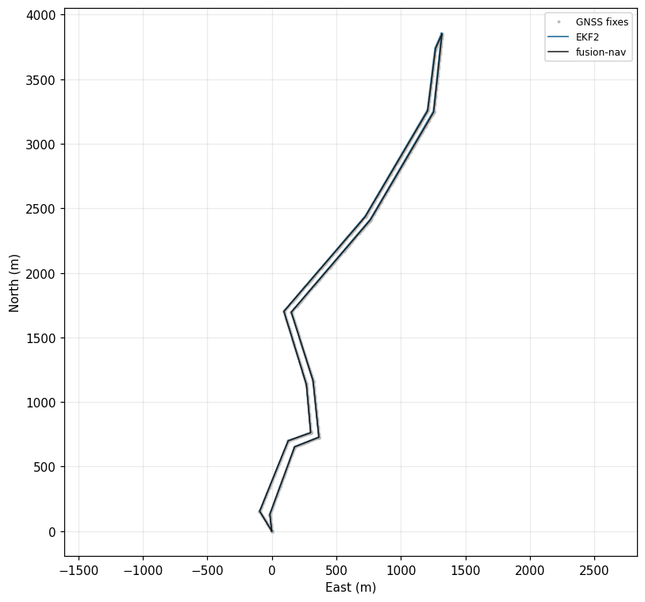
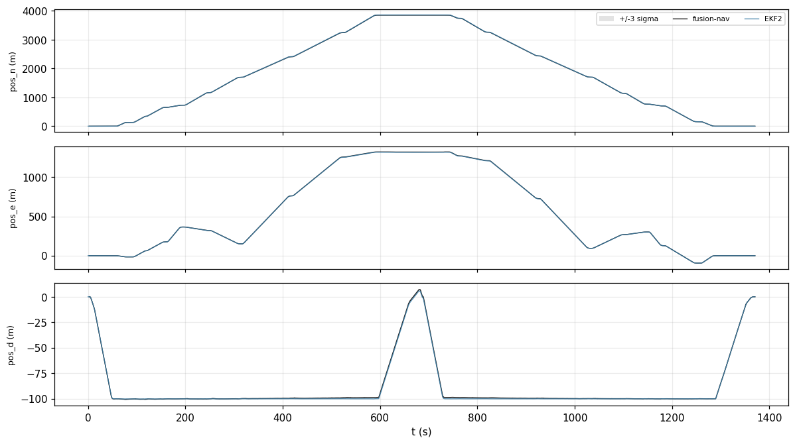
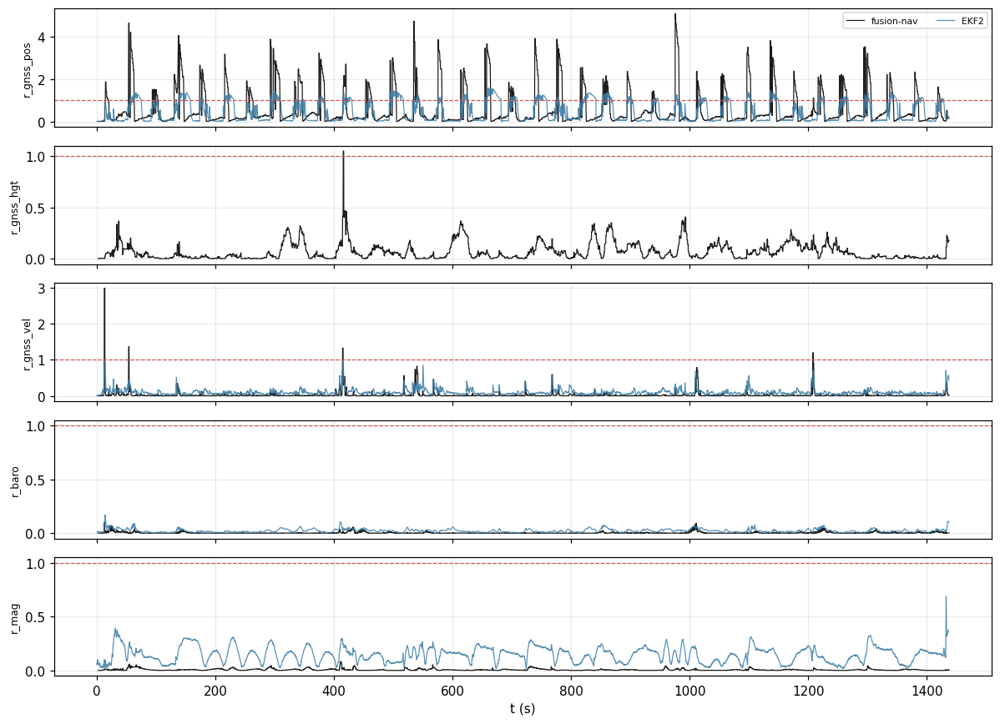
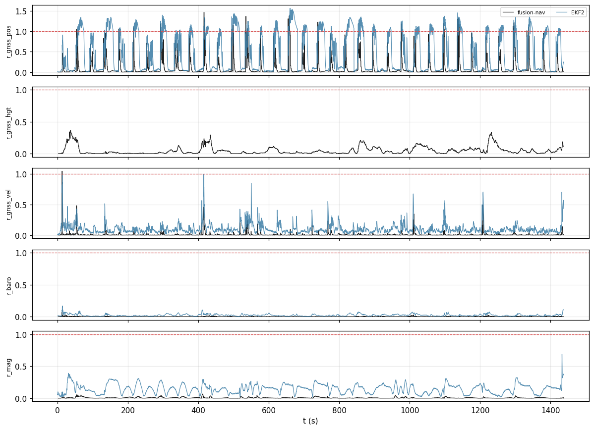
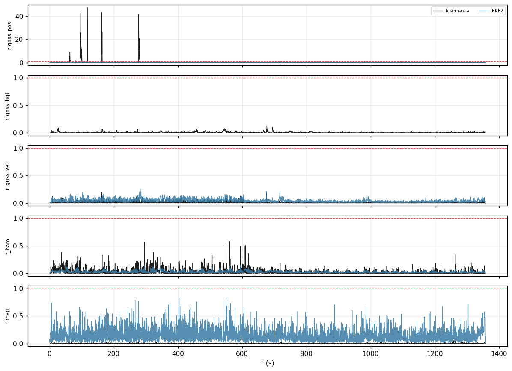
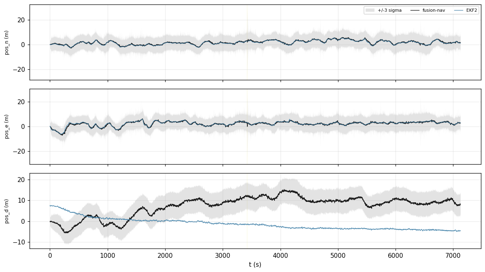
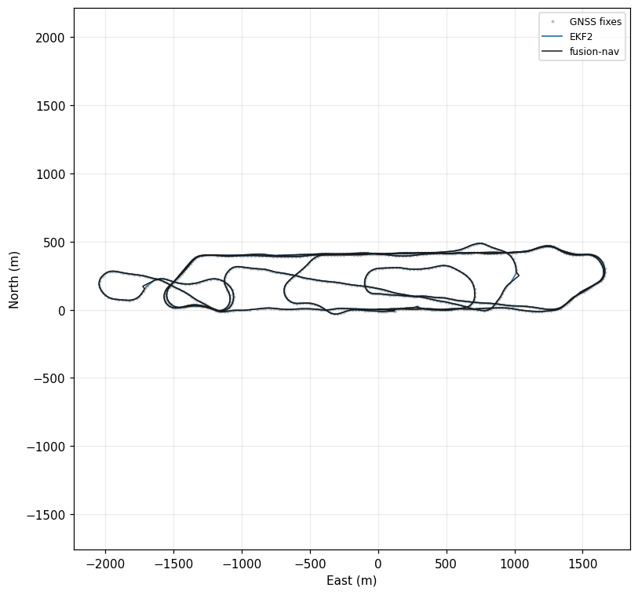
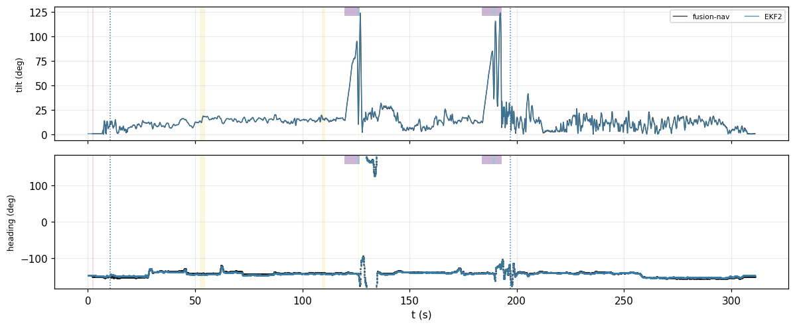
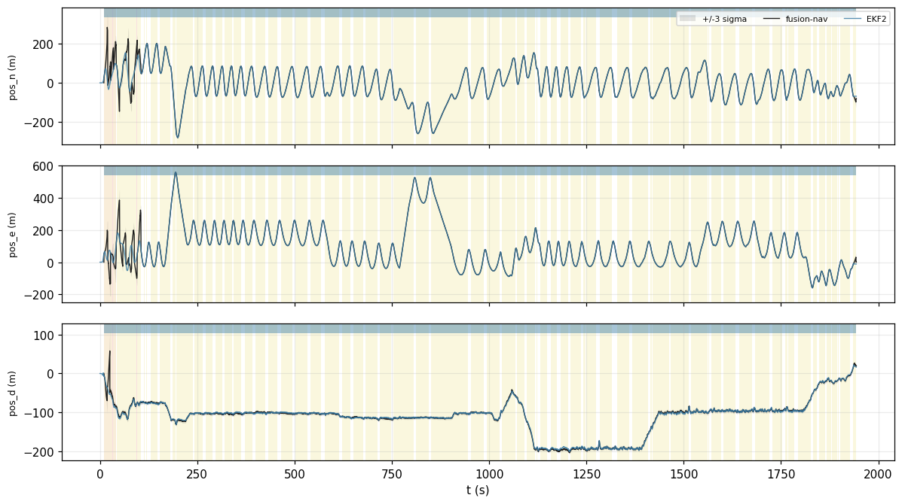

<!-- Generated from validation/src/ekf2.md by tools/validation.sh; edit that, not this. -->
# Agreement with EKF2

**On real flights, does it agree with the estimator PX4 flies?** Mostly, and closely. On the log
with the most precise receiver (RTK), position agrees to 0.08330 m
RMS north, velocity to 0.04160 m/s RMS north and tilt to
0.3291° RMS. Where the two differ, the log usually shows why: a
receiver that overstates its accuracy, a hand launch this filter levels wrong, and a barometer
the two filters trust differently.

Generated by `tools/validation.sh` at `2dfcabf`; every figure on this page is from that build, and `tools/validation.sh --check` re-derives them.

**EKF2 is not the truth.** Real flight logs carry no true trajectory, so every number here is a
distance between two estimators fed the same sensor data. It measures agreement, never
accuracy, and a difference is a finding to explain, not a mistake by either side. Accuracy is
measured on the [accuracy page](accuracy.md), against simulation.

The logs are public, from [PX4 Flight Review](https://review.px4.io) under CC BY 4.0. Each is
pinned by checksum in `data/manifest.txt`, beside a note on what the log is and what it tests.

## How the comparison is made

Each log carries EKF2's own solution, recorded in flight. This filter is run on the same sensor
data twice, differing only in how much it trusts the GNSS receiver:

- **`raw`**: exactly as much as the receiver claims. This is this filter's default.
- **`px4`**: never more than EKF2 would. EKF2 applies minimum noise levels (floors) to what the
  receiver reports, set by the parameters in the log. With the same floors, the remaining
  difference is between the filters rather than their trust in the receiver.

## Every log

Replayed `raw`:

| run | `pos_n_rms` | `pos_e_rms` | `pos_d_rms` | `vel_n_rms` | `tilt_diff_rms` | `heading_diff_med` | `rej_s_gnss_pos` | `rej_s_gnss_pos_ekf2` |
|---|---|---|---|---|---|---|---|---|
| `3949f175/raw` | 0.04495 | 0.03032 | 0.4535 | 0.06739 | 0.4958 | 19.58 | 0.000 | 0.000 |
| `f16771dd/raw` | none | none | none | 0.4931 | 0.9216 | 169.6 | none | 0.000 |
| `a299e722/raw` | 5.822 | 16.39 | 2.607 | 1.238 | 3.177 | 0.8911 | 7.002 | 0.000 |
| `7592c9b2/raw` | none | none | none | 0.07548 | 0.2519 | 0.4745 | none | 0.000 |
| `2c42096b/raw` | 0.2950 | 0.3559 | 11.13 | 0.09167 | 0.3638 | 0.5662 | 0.000 | 0.000 |
| `89a498ce/raw` | 0.08330 | 0.02933 | 0.1057 | 0.04160 | 0.3291 | 0.7624 | 0.000 | 0.000 |
| `eb799954/raw` | 0.2749 | 0.2520 | 0.8808 | 0.09795 | 0.5019 | 4.690 | 0.000 | 0.000 |
| `cd7e0001/raw` | 0.9892 | 0.5537 | 1.628 | 0.08542 | 0.4490 | 0.3793 | 0.000 | 0.000 |
| `285ee2e7/raw` | 0.5891 | 0.9176 | 1.549 | 0.09983 | 0.5490 | 0.6484 | 5.800 | 0.000 |
| `4b473e91/raw` | 0.2521 | 0.2589 | 1.094 | 0.1383 | 0.4864 | 2.661 | 0.000 | 0.000 |
| `7ce66f0d/raw` | 16.21 | 22.27 | 4.158 | 4.360 | 3.606 | 1.553 | 89.81 | 0.000 |
| `093e806a/raw` | 1.413 | 1.081 | 0.8631 | 0.1733 | 0.5664 | 1.607 | 275.4 | 304.9 |
| `2b2ad123/raw` | 0.1152 | 0.09770 | 0.1051 | 0.05512 | 0.4015 | 1.142 | 16.52 | 0.000 |

Replayed `px4`:

| run | `pos_n_rms` | `pos_e_rms` | `pos_d_rms` | `vel_n_rms` | `tilt_diff_rms` | `heading_diff_med` | `rej_s_gnss_pos` | `rej_s_gnss_pos_ekf2` |
|---|---|---|---|---|---|---|---|---|
| `3949f175/px4` | 0.04499 | 0.03033 | 0.4425 | 0.06740 | 0.4946 | 19.58 | 0.000 | 0.000 |
| `f16771dd/px4` | none | none | none | 0.4931 | 0.9216 | 169.6 | none | 0.000 |
| `a299e722/px4` | 0.5436 | 0.3325 | 1.199 | 0.3760 | 2.119 | 0.8433 | 0.000 | 0.000 |
| `7592c9b2/px4` | none | none | none | 0.07548 | 0.2519 | 0.4745 | none | 0.000 |
| `2c42096b/px4` | 0.2932 | 0.3536 | 11.11 | 0.09168 | 0.2714 | 0.4404 | 0.000 | 0.000 |
| `89a498ce/px4` | 0.09253 | 0.04825 | 0.9781 | 0.02851 | 0.1636 | 0.6808 | 0.000 | 0.000 |
| `eb799954/px4` | 0.1167 | 0.1012 | 1.351 | 0.1015 | 0.4037 | 4.870 | 0.000 | 0.000 |
| `cd7e0001/px4` | 0.7904 | 0.3266 | 1.096 | 0.07755 | 0.4171 | 1.219 | 0.000 | 0.000 |
| `285ee2e7/px4` | 0.2730 | 0.5017 | 2.306 | 0.06288 | 0.3408 | 0.6421 | 0.000 | 0.000 |
| `4b473e91/px4` | 0.1899 | 0.2161 | 0.8771 | 0.1378 | 0.5634 | 3.173 | 0.000 | 0.000 |
| `7ce66f0d/px4` | 16.40 | 18.86 | 2.729 | 4.977 | 3.249 | 1.465 | 89.80 | 0.000 |
| `093e806a/px4` | 1.237 | 0.9393 | 1.039 | 0.1402 | 0.4460 | 1.522 | 0.000 | 304.9 |
| `2b2ad123/px4` | 0.08885 | 0.09281 | 0.8674 | 0.04467 | 0.3631 | 1.234 | 0.000 | 0.000 |

Columns, each a difference between EKF2 and this filter:
- `pos_n_rms`, `pos_e_rms` and `pos_d_rms`: position north, east and down, in meters RMS, with
  EKF2's position converted into this filter's frame.
- `vel_n_rms`: velocity north, in m/s RMS.
- `tilt_diff_rms`: tilt, in degrees RMS.
- `heading_diff_med`: heading, the median difference in degrees.
- `rej_s_gnss_pos` and `rej_s_gnss_pos_ekf2`: how many seconds this filter and EKF2 each spent
  refusing GNSS positions as implausible.

`none` means the log cannot answer, because EKF2 reported no origin or had no GNSS.
`data/README.md`, "Agreement with EKF2", defines each statistic exactly.

Some rows are explained by the log, not by either filter:

- `f16771dd` has no GNSS, and EKF2 used no magnetometer on it either, so EKF2's heading drifted
  with nothing to correct it. The 169.6° is that drift
  against this filter's magnetometer heading.
- `7592c9b2` was flown with LPE, an older PX4 estimator, not EKF2, and reports no position.
- `3949f175` is a simulation (PX4 SITL) whose magnetic declination setting does not match the
  field its simulator generated. It is kept for its log format.
- `a299e722` has a receiver whose velocities contradict its own positions. Trusting it fully,
  this filter refuses many of its velocities and the two estimates drift apart, until its
  positions are refused too and adopted back. With EKF2's floors they stay together: east
  position differs by 0.3325 m RMS against
  16.39 m. It is also the one log with a dual-antenna receiver, whose heading
  both estimators fuse; their headings differ by a median of
  0.8433°.

The sections below look closer at the logs that each test something the others do not, ending
with the one where this filter clearly does worse.

## The precise receiver: `89a498ce`

A quadrotor mission with an RTK receiver, flying 4069.8 m out at up to
10.3 m/s. The two agree closely on everything: position to
0.08330 m RMS north and 0.02933 m east,
both following the same centimeter fixes.

Comparing positions needs the two filters in one frame. PX4 measures its local north and east on
a sphere, while this filter uses the exact tangent plane of the WGS 84 ellipsoid, and the two
differ by about 0.2 % of the distance from the origin, so EKF2's position is converted into this
filter's frame before any figure here is computed.

Estimate, EKF2's own solution where the log carries one, and the raw GNSS fixes the filter was offered. EKF2's track is in this filter's frame, reprojected from PX4's by the converter, where the reference header says so; two corpus logs report no origin, and there it stays at its own. Every track here is sampled at a uniform stride, so each point is a position that was actually held &mdash; the min/max envelope the time series use pairs two columns from different epochs and draws a path nobody traveled.

Position NED, with the filter's own +/-3 sigma band. Background shading is <code>Status</code>: amber Aligning, yellow Degraded, red DeadReckoning. The strip along the top of each panel is the vehicle's flight regime from the reference: blue fixed-wing, purple transition, and unshaded for multicopter or a regime the log does not name. This log reads <code>mc</code>.

## A receiver that overstates its accuracy: `093e806a`

A fixed-wing aircraft flying 1137.1 m out at up to
24.1 m/s. Its receiver claims sub-meter accuracy, but its own
velocities contradict its positions. How long each filter spent refusing its positions:

- this filter, trusting the receiver fully (`raw`): 275.4 s;
- this filter, with EKF2's floors (`px4`): 0.000 s;
- EKF2: 304.9 s.

How much the receiver is trusted explains most of the difference. Under EKF2's floors this
filter refuses nothing, and it also reads the receiver's timing differently: it dates each fix by
the receiver's own clock and drops a fix the autopilot published twice, where EKF2 dates each fix
by when it arrived and fuses the repeats. Whether that is the rest of EKF2's refusals is
consistent with these figures and not shown by them.

Gate test ratios, this filter against EKF2's aggregate ones. Both publish <code>r = &epsilon; / &gamma;</code>, so the red line at 1 is each filter's own gate and the two compare without knowing either's thresholds or dimensions &mdash; the like-for-like check GOALS.md differentiator 6 names. They are not the same statistic underneath: EKF2's are aggregates over its own aiding, and its height ratio includes a barometer this filter may not be fusing.

Gate test ratios, this filter against EKF2's aggregate ones. Both publish <code>r = &epsilon; / &gamma;</code>, so the red line at 1 is each filter's own gate and the two compare without knowing either's thresholds or dimensions &mdash; the like-for-like check GOALS.md differentiator 6 names. They are not the same statistic underneath: EKF2's are aggregates over its own aiding, and its height ratio includes a barometer this filter may not be fusing.

## A receiver that jumps: `2b2ad123`

A quadrotor with a second RTK receiver, flying 5130.2 m out at up to
10.6 m/s. The receiver reports centimeter accuracy on every fix,
yet its position now and then runs one or two tenths of a second off its own velocity, for
seconds at a time: at 10 m/s, a meter or two along the track and nothing across it, before it
comes back. Trusting the receiver fully, this filter refuses
118 fixes, and every one is such a fix or the receiver's
return from one. Some refuse the offset fix itself, and those refusals can be seen to be right:
a step that reverts within seconds was never the vehicle moving. The others are the cost of
trusting the receiver: where an offset was small enough to pass the gate the filter followed it,
then refused the receiver's return until the two met again. With EKF2's
floors it refuses 0, and EKF2 refuses none. Over the
whole flight the two filters agree to
0.1152 m RMS north.

Gate test ratios, this filter against EKF2's aggregate ones. Both publish <code>r = &epsilon; / &gamma;</code>, so the red line at 1 is each filter's own gate and the two compare without knowing either's thresholds or dimensions &mdash; the like-for-like check GOALS.md differentiator 6 names. They are not the same statistic underneath: EKF2's are aggregates over its own aiding, and its height ratio includes a barometer this filter may not be fusing.

## Two ideas of height: `2c42096b`

Not a flight: a vehicle vibrating on the ground for two hours with poor GNSS reception, moving
at most 6.3 m. Its numbers show behavior, not accuracy. EKF2 was
set to take its height from the barometer (its log records the height reference as
`baro`). This filter uses the barometer and GNSS
height together, and trusts GNSS for slow changes. The barometer drifts over the two hours, so
the two heights move apart. From the average of the first minute to the average of the last,
EKF2's height changes by 11.97 m and this filter's by
-7.984 m (up is positive). With no true height, nothing here says
which is right. Horizontally the two agree to 0.2950 m RMS north.

Position NED, with the filter's own +/-3 sigma band. Background shading is <code>Status</code>: amber Aligning, yellow Degraded, red DeadReckoning. The strip along the top of each panel is the vehicle's flight regime from the reference: blue fixed-wing, purple transition, and unshaded for multicopter or a regime the log does not name. This log reads <code>mc</code>.

## Gaps in the log at 30 m/s: `4b473e91`

A VTOL aircraft that hovers, transitions and cruises 2055.4 m out at
up to 31.2 m/s. Its log loses the IMU
8 times, each gap too long to integrate as one step. This filter
carries its velocity through each gap and accepts the next GNSS fix, and the two tracks stay
together through the cruise (0.2589 m RMS east).

Estimate, EKF2's own solution where the log carries one, and the raw GNSS fixes the filter was offered. EKF2's track is in this filter's frame, reprojected from PX4's by the converter, where the reference header says so; two corpus logs report no origin, and there it stays at its own. Every track here is sampled at a uniform stride, so each point is a position that was actually held &mdash; the min/max envelope the time series use pairs two columns from different epochs and draws a path nobody traveled.

## Past the vertical: `285ee2e7`

A tailsitter, which flies forward pitched through 90°, reaching
125.3° of tilt. The two filters' tilt agrees to
0.5490° RMS through the transitions between hover and forward
flight.

Tilt, the angle between body down and navigation down, and heading, the rotation about navigation down that remains &mdash; the split <code>Validity</code> reports attitude in, derived from each file's quaternion (truth's from its Euler angles). Unlike roll and yaw both stay separate at 90&deg; of pitch; heading is left undrawn past 170&deg; of tilt, where the split is singular. No sigma band: the published sigmas are body-axis, and only near level do they pass for tilt and heading (#131). Background shading is <code>Status</code>: amber Aligning, yellow Degraded, red DeadReckoning. The strip along the top of each panel is the vehicle's flight regime from the reference: blue fixed-wing, purple transition, and unshaded for multicopter or a regime the log does not name. This log reads <code>fw</code>, <code>mc</code>, <code>to_fw</code>, <code>to_mc</code>. Blue dotted verticals are EKF2's own <code>quat_reset_counter</code> changing &mdash; a step across one of those is an event in their filter, not divergence from this one.

## Where this filter loses: `7ce66f0d`

A flying wing launched by hand. This filter finds which way is down by averaging the
accelerometer over its first moments, which only works when the vehicle is still. Here those
moments are the throw, so it starts with the wrong tilt. For the first minutes its position
swings away from EKF2's and from the GNSS fixes, and it resets itself to a fix
27 times over the flight. After that the positions track each
other, but the filter reports `Degraded` for most of the flight and ends there
(Degraded). Over the whole log, position differs from EKF2's by
22.27 m RMS east and tilt by
3.606° RMS, and this filter spends
89.81 s refusing GNSS positions where EKF2 spends
0.000 s.

This is a loss with a known cause. Starting while moving needs the vehicle's own acceleration
taken out of that first average, which is equation (5′), in-motion leveling, and #59.

Position NED, with the filter's own +/-3 sigma band. Background shading is <code>Status</code>: amber Aligning, yellow Degraded, red DeadReckoning. The strip along the top of each panel is the vehicle's flight regime from the reference: blue fixed-wing, purple transition, and unshaded for multicopter or a regime the log does not name. This log reads <code>fw</code>.
