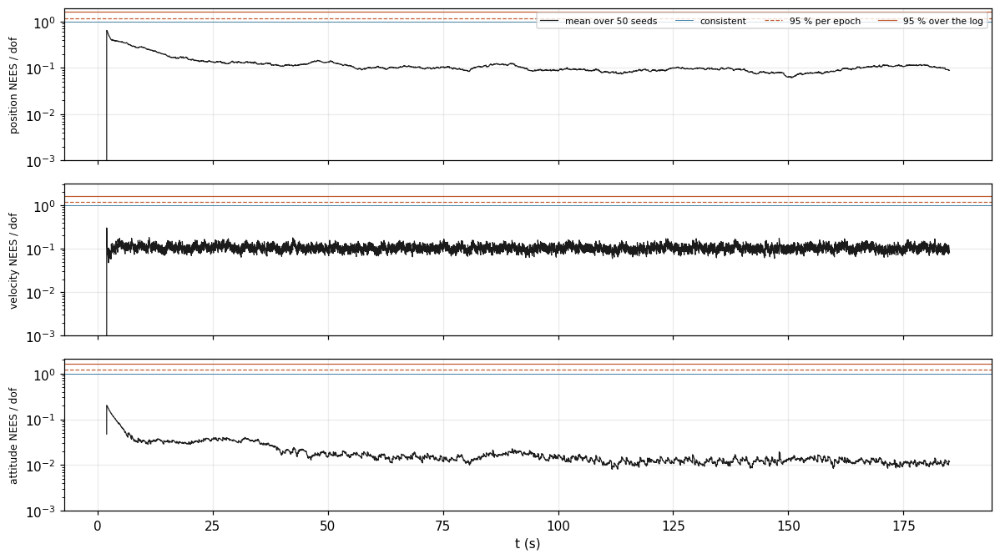
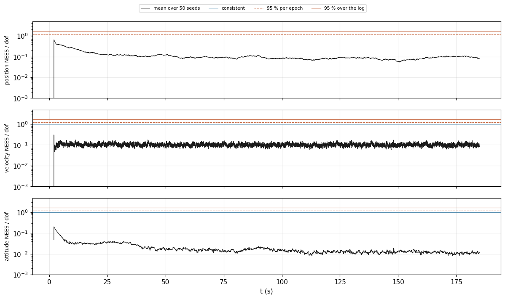

<!-- Generated from validation/src/honesty.md by tools/validation.sh; edit that, not this. -->
# Honesty of the reported uncertainty

**When the filter says "I'm within a metre", is it?** Yes, with room to spare, on every
simulated scenario except `gnss_latency` and `correlated`. On the baseline flight, the fraction of checks where the
true value sat inside the filter's ±3σ band was 1.0000, where 1 is every check.
In those two scenarios the filter claims more accuracy than it has: when GNSS fixes arrive late, and when
sensor errors persist longer than it assumes. This page shows both.

Generated by `tools/validation.sh` at `21e6a39`; every figure on this page is from that build, and `tools/validation.sh --check` re-derives them.

## Why this is its own question

Besides each estimate, the filter reports how uncertain it is, and an application acts on that
report. The filter's `Validity` flags, which tell an application whether a position or a heading
is usable, are read from it. A filter can be accurate and still report the wrong uncertainty,
and if it reports too little, a position gets used when it should not be. The
[accuracy page](accuracy.md) cannot see this: a filter that became more accurate and more
overconfident at the same time would pass it.

## How it is measured

Two tests, both against the simulator's known truth:

- **Within 3σ** (`in3s`): at every moment and on every quantity the filter estimates, is the
  real error inside three standard deviations of the reported uncertainty? The figure is the
  fraction of those checks that pass. An honest filter passes about 99.7 % of them.
- **NEES** (normalized estimation error squared): the size of the real error measured in units
  of the reported uncertainty, for position, velocity and attitude. It reads 1 on average when
  the reported uncertainty is exactly right, below 1 when the filter is pessimistic, and above 1
  when it is overconfident.

One flight can be lucky or unlucky, so the deciding test flies every scenario
50 times with different random noise (seeds 1 to 50) and
averages NEES across those flights at every moment. That average is **ANEES**. CI fails if it
crosses a statistical bound that an honest filter stays under 95 % of the time
(`data/anees.sh`).

## One flight each

The same flights the [accuracy page](accuracy.md) scores.

| run | seed | `in3s` | `nees_pos` | `nees_vel` | `nees_att` | `false_valid` |
|---|---|---|---|---|---|---|
| `static` | 1 | 1.0000 | 0.3291 | 0.1072 | 0.0376 | 0 |
| `mission` | 2 | 1.0000 | 0.0896 | 0.1043 | 0.0164 | 0 |
| `harsh_imu` | 2 | 1.0000 | 0.0902 | 0.1106 | 0.1045 | 0 |
| `gnss_outage` | 2 | 1.0000 | 0.2080 | 0.0950 | 0.0165 | 0 |
| `moving_start` | 4 | 1.0000 | 0.1539 | 0.1075 | 0.0334 | 0 |
| `baro_drift` | 2 | 1.0000 | 0.4413 | 0.1046 | 0.0163 | 0 |
| `gnss_latency` | 2 | 0.9652 | 4.0574 | 1.1109 | 0.0639 | 280 |
| `correlated` | 2 | 0.9982 | 1.7157 | 0.2884 | 0.2372 | 0 |
| `mag_disturbance` | 2 | 1.0000 | 0.0896 | 0.1043 | 0.0168 | 0 |
| `logging_dropout` | 2 | 1.0000 | 0.0844 | 0.1049 | 0.0185 | 0 |
| `flight` | 8 | 1.0000 | 0.1167 | 0.0858 | 0.1051 | 0 |

Columns: `in3s` is the fraction of checks inside ±3σ. `nees_pos`, `nees_vel` and `nees_att` are
NEES for position, velocity and attitude, averaged over the flight. `false_valid` counts moments
where the filter told the application a quantity was usable while its real error was worse than
the configured accuracy. It is the count that matters most to an integrator, because it is where
an application would act on a wrong answer.

## Over 50 flights each

| run | `anees_pos` | `anees_vel` | `anees_att` | `any_pos` | `any_vel` | `any_att` |
|---|---|---|---|---|---|---|
| `static` | 0.1684 | 0.1041 | 0.0368 | 0 | 0 | 0 |
| `mission` | 0.1184 | 0.1029 | 0.0195 | 0 | 0 | 0 |
| `harsh_imu` | 0.1184 | 0.1078 | 0.1180 | 0 | 0 | 0 |
| `gnss_outage` | 0.1420 | 0.0945 | 0.0187 | 0 | 0 | 0 |
| `moving_start` | 0.2826 | 0.1102 | 0.0286 | 0 | 0 | 0 |
| `baro_drift` | 0.3929 | 0.1030 | 0.0195 | 0 | 0 | 0 |
| `gnss_latency` | 4.0577 | 1.0864 | 0.0666 | 31589 | 6426 | 0 |
| `correlated` | 1.4498 | 0.2966 | 0.2064 | 5197 | 0 | 0 |
| `mag_disturbance` | 0.1184 | 0.1031 | 0.0327 | 0 | 0 | 0 |
| `logging_dropout` | 0.1147 | 0.1040 | 0.0219 | 0 | 0 | 0 |
| `flight` | 0.2210 | 0.0933 | 0.1333 | 0 | 0 | 0 |

Columns: `anees_pos`, `anees_vel` and `anees_att` are ANEES averaged over the flight. `any_pos`,
`any_vel` and `any_att` count moments where ANEES crossed a strict bound
(1.6376 on the baseline), set so that an honest filter would cross it
anywhere in the flight at most 5 % of the time. A count above zero means the filter was
overconfident at those moments.

### Pessimistic, by design of the test

On the baseline, position ANEES is 0.1184, well under 1: the filter
believes its error is larger than it is. That is expected here. The simulated IMU is one to two
orders of magnitude quieter than the noise the filter is configured for, on purpose, so that the
filter is not scored against its own assumptions. For that reason CI fails only on
overconfidence, never on pessimism.

In these figures the solid line is ANEES at each moment, on a log scale. Below the thin line
at 1 the filter is pessimistic; above the dashed line it is overconfident at that moment; above
the upper solid line it is overconfident beyond chance.

NEES per degree of freedom at each epoch, averaged over 50 seeds of this scenario by <code>tools/anees.py</code>, against the chi-square bounds <code>data/anees.sh</code> gates: the dashed line is the per-epoch 95 % bound <code>over_</code> counts, the solid one the family-wise bound <code>any_</code> counts. Log scale; 1 is a covariance that describes its error exactly, and below it is underconfident.

### Overconfident: fixes that arrive late

In `gnss_latency` every GNSS fix arrives 150 ms after the moment it describes, and the filter
uses it as if it were current. The resulting position error depends on how fast the vehicle is
moving, and the filter's model has no way to represent that, so it reports less uncertainty than
it has for most of the flight. Position ANEES is 4.0577, over the
strict bound at 31589 of 36600 moments.
Whether the filter gains a model for delayed measurements, or documents the limit, is #52.

NEES per degree of freedom at each epoch, averaged over 50 seeds of this scenario by <code>tools/anees.py</code>, against the chi-square bounds <code>data/anees.sh</code> gates: the dashed line is the per-epoch 95 % bound <code>over_</code> counts, the solid one the family-wise bound <code>any_</code> counts. Log scale; 1 is a covariance that describes its error exactly, and below it is underconfident.

### Overconfident: errors that persist

In `correlated`, each sensor's error changes slowly, like a real GNSS receiver's that drifts
over seconds, and more slowly than the filter assumes. The filter compensates for slowly
changing errors by treating each measurement as noisier than reported, by an amount set by an
assumed correlation time (`Config::correlation`, equation (24′)). Here the errors last longer
than assumed, so the compensation is too small. Position ANEES is
1.4498, over the strict bound at 5197 moments.
Measuring each sensor's correlation time, instead of assuming a typical one, is #51.

NEES per degree of freedom at each epoch, averaged over 50 seeds of this scenario by <code>tools/anees.py</code>, against the chi-square bounds <code>data/anees.sh</code> gates: the dashed line is the per-epoch 95 % bound <code>over_</code> counts, the solid one the family-wise bound <code>any_</code> counts. Log scale; 1 is a covariance that describes its error exactly, and below it is underconfident.

## What this page cannot say

The real PX4 logs have no truth, so on them the reported uncertainty can only be checked
against the filter's own predictions: whether each new measurement falls as far from the
prediction as the filter expected (the `nis_` values in `data/manifest.txt`). That is a weaker
test, and it is not repeated here.
