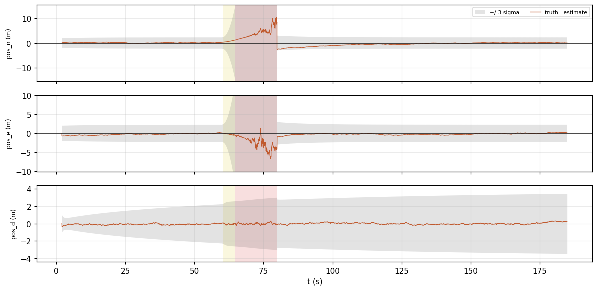
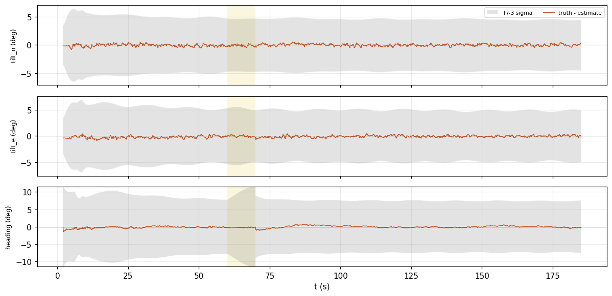
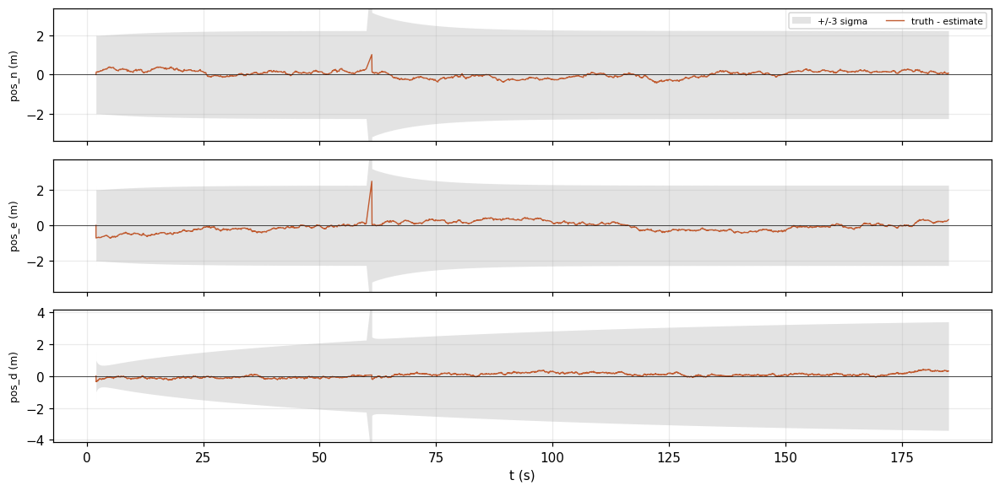
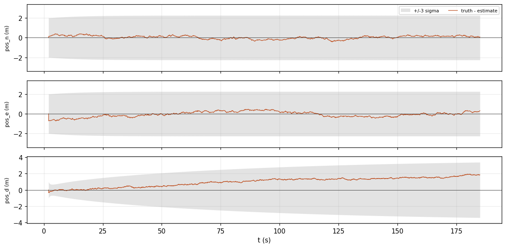
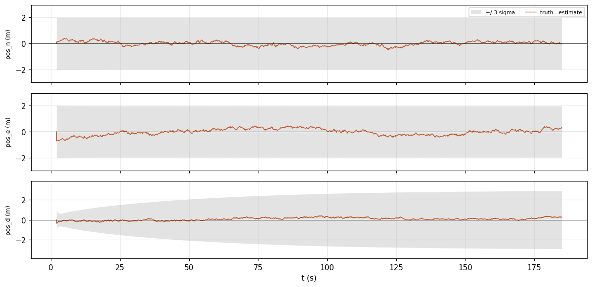

<!-- Generated from validation/src/robustness.md by tools/validation.sh; edit that, not this. -->
# Robustness to faults

**What happens when a sensor lies or goes quiet?** In each simulated fault below, the error
stays inside the band of uncertainty the filter reports. During the fault the filter either
widens that band or refuses the bad measurements, and its `Status` reports that something is
wrong. GNSS fixes that arrive late are a fault it absorbs rather than reports: each is used at
the moment it describes. On a real city drive with truth, the filter takes every fix an honest
receiver gives it, and **fails** against a receiver that stays wrong for a minute at a time
while claiming to be right: [GNSS in a city](#gnss-in-a-city).

Generated by `tools/validation.sh` at `00c5b72`; every figure on this page is from that build, and `tools/validation.sh --check` re-derives them.

## How to read these figures

Each scenario is the baseline `mission` circuit with one fault added. The orange line is the
error, true value minus estimate; the gray band is ±3σ of the uncertainty the filter reported.
While the line stays inside the band, the filter knew how wrong it might be. The background
shows the filter's `Status`, its one-word summary of its own health: yellow for `Degraded`,
amber while it is still aligning at the start, red for `DeadReckoning`. The whole-flight numbers
for every scenario are on the [accuracy page](accuracy.md#every-scenario).

## GNSS outage

GNSS disappears from 60 s to 80 s. With nothing to correct it, the filter estimates position by
integrating acceleration twice, so the error grows: to 8.987 m at
worst, against 0.811 m on the baseline. The band grows faster than the
error, and when GNSS returns the first fix is accepted, not rejected, because the filter's
reported uncertainty covered where it had drifted.

`Status` reads `Degraded` a fraction of a second into the gap, once GNSS has missed two and a half
of its own updates, and `DeadReckoning` five seconds in, although the barometer and magnetometer
are still working: they hold height and heading, and nothing holds horizontal position. The
filter's per-quantity `Validity` flags say the same thing per output.

Position error, truth minus estimate, on navigation axes, inside the filter's own +/-3 sigma on the same axis. Both come from one row of <code>replay.error.csv</code>, the error vector every <code>score</code> key reads. The vertical range is set by the error and the band's typical width, so where the band leaves the frame it is wider than drawn. Background shading is <code>Status</code>: amber Aligning, yellow Degraded, red DeadReckoning.

## A magnetic disturbance

From 60 s to 70 s the magnetometer reads a heading 30° wrong, as it might next to steel or a
power line. The filter refuses 200 of those readings, so
heading over the whole flight is off by 0.445° RMS, against
0.402° on the baseline. While readings are refused, the gyroscopes hold the
heading and the band widens a little, until the magnetometer agrees again.

Attitude error, truth minus estimate, on navigation axes, inside the filter's own +/-3 sigma on the same axis. Both come from one row of <code>replay.error.csv</code>, the error vector every <code>score</code> key reads. The vertical range is set by the error and the band's typical width, so where the band leaves the frame it is wider than drawn. Background shading is <code>Status</code>: amber Aligning, yellow Degraded, red DeadReckoning.

## A gap in the log at speed

1.2 s of IMU data is lost from 60 s, in the middle of a turn, as when a flight controller's SD
card stalls. The filter cannot integrate a step that long from a single sample, so it assumes
the vehicle kept its velocity through the gap and widens its uncertainty to allow for turning
and accelerating it could not see. The first GNSS fix after the gap falls inside that wider band
and is accepted. The worst horizontal error is 2.684 m, and the
number of times the filter had to reset itself to a fix is
0.

Position error, truth minus estimate, on navigation axes, inside the filter's own +/-3 sigma on the same axis. Both come from one row of <code>replay.error.csv</code>, the error vector every <code>score</code> key reads. The vertical range is set by the error and the band's typical width, so where the band leaves the frame it is wider than drawn. Background shading is <code>Status</code>: amber Aligning, yellow Degraded, red DeadReckoning.

## A drifting barometer

The barometer's zero drifts by 2 cm/s for the whole flight, as it does with temperature or
weather. The filter estimates that drift as it flies, and relies on GNSS for the slow changes in
height. Height is off by 1.122 m RMS where the baseline reads
0.172 m, and the filter's reported uncertainty covers it (position NEES
0.4953, where under 1 means not overconfident; see the
[honesty page](honesty.md)). A filter
that trusts the barometer's zero does much worse on both counts. Why the drift is estimated,
and what the alternatives measured, is in
[GOALS.md, "Barometric reference as an estimated offset"](../GOALS.md#barometric-reference-as-an-estimated-offset).

Position error, truth minus estimate, on navigation axes, inside the filter's own +/-3 sigma on the same axis. Both come from one row of <code>replay.error.csv</code>, the error vector every <code>score</code> key reads. The vertical range is set by the error and the band's typical width, so where the band leaves the frame it is wider than drawn. Background shading is <code>Status</code>: amber Aligning, yellow Degraded, red DeadReckoning.

## GNSS fixes 150 ms late

Every GNSS fix describes where the vehicle was 150 ms before it arrives. Used as if it described
the present, a fix would be wrong by the distance flown in that time. The filter is told when each
fix was taken and compares it with where it estimated the vehicle was at that moment, so the
delay costs nothing: position is off by 0.327 m RMS against
0.325 m on the baseline. The filter called a quantity usable while its real
error was worse than the configured accuracy at 0 moments.
The [honesty page](honesty.md#fixes-that-arrive-late) shows the same across many flights.

Position error, truth minus estimate, on navigation axes, inside the filter's own +/-3 sigma on the same axis. Both come from one row of <code>replay.error.csv</code>, the error vector every <code>score</code> key reads. The vertical range is set by the error and the band's typical width, so where the band leaves the frame it is wider than drawn. Background shading is <code>Status</code>: amber Aligning, yellow Degraded, red DeadReckoning.

## GNSS in a city

**Does the filter refuse the fixes it should, and only those?** The simulated faults above are
our own idea of a bad fix. [UrbanNav](https://github.com/IPNL-POLYU/UrbanNavDataset)'s
Medium-Urban-1 is a real one: a car driven for about thirteen minutes through the high-rise
streets of Tsim Sha Tsui, Hong Kong, where signals reflect off buildings, with a survey-grade
reference system aboard to say where the car really was. Two ordinary receivers rode along,
and each is replayed on its own, with the car's own low-cost IMU. There is no barometer or
magnetometer in this data, so heading comes from the direction of travel.

A fix is counted as **bad** when it is further from the truth than the receiver's own stated
accuracy could explain, by the same test the filter's gate applies at its default threshold,
as if the filter's estimate were perfect. The filter never sees that verdict; it is how the
page scores what the filter did.

**The honest receiver.** A dual-frequency u-blox F9P with differential corrections has
0 bad fixes out of
654, and the filter refuses
0 of the good ones: at road speed, through
turns, it takes every fix a receiver is right about. Its worst moment is not a bad fix but no
fix at all. The receiver stopped reporting for about two minutes, and the filter dead reckoned
on its IMU for 126.45 s, reaching
2024.261 m of error, and its reported uncertainty grew with it
(position NEES 1.0164 over the drive, where near 1 is honest).

Every run here is a car's configuration, with the position hold off. The hold assumes a vehicle
that stays where aiding stopped, which a hovering multirotor does and a car does not. Under the
default hold the F9P's gap reads 123.775 m RMS rather than
334.166, but its position NEES is
32.0072: the covariance narrows around a place the car has
driven away from
([GOALS.md, "Holding tilt without aiding"](../GOALS.md#holding-tilt-without-aiding)).

**The hostile receiver.** A single-frequency u-blox M8T reports an accuracy of 5 to 25 m while
it is tens to hundreds of meters out, for a minute at a time.
338 of its 517
fixes are bad, and **the filter does not survive it**. It refuses only
28 of the bad fixes and, having followed the
rest, refuses 59 good ones. Its position is off
by 254.749 m RMS, its heading by 88.361°, and
its reported uncertainty does not cover either (position NEES
569.6724, where near 1 is honest).

This is the failure an innovation gate cannot prevent on its own. A gate asks whether a fix
agrees with the estimate; a receiver that is wrong the same way for many seconds moves the
estimate a little with each fix it is allowed, until the wrong fixes agree and the right ones
do not. Once that has happened the filter is locked out, refusing the fixes that would correct
it. It recovers by taking a fix after a long run of refusals: for position,
12 of those runs were mostly good
fixes, a lockout ended, and 4 were mostly
bad ones. Replayed without recovery, the filter refuses
418 of the
517 fixes and its position is off by
407.554 m RMS, which is why recovery is on by default
([GOALS.md, "Rejection handling"](../GOALS.md#rejection-handling-recover-by-default-opt-out-per-source)).

Under PX4's floor on the receiver's stated accuracy the picture is the same: the M8T's position
is off by 253.697 m RMS and the F9P refuses
0 good fixes.

UrbanNav states no license, so its data is fetched for measurement and nothing drawn from it,
no plot and no converted file, is published here: these are scalars about this filter. Using
the dataset for anything else, such as validating a commercial product, needs the maintainers'
permission.

## What this page cannot say

Every simulated fault here is one at a time, on one flight each. The city drive is one drive,
one vehicle and two receivers: it shows the gate failing against a receiver that lies
persistently, and says nothing yet about how often a real receiver does. The real PX4 logs
contain faults too, including a logging gap at 30 m/s, but have no truth; they are on the
[EKF2 page](ekf2.md), where the question is agreement.
