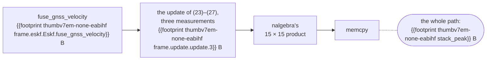

# Cost on a target

**Does it fit?** On a 400 MHz Cortex-M7, an IMU step takes at most
{{onboard primary/warm/bound predict.max_us}} µs ({{onboard primary/warm/bound predict.mean_us}} µs on
average) and a GNSS position update at most {{onboard primary/warm/bound fuse_gnss_position.max_us}} µs,
against the 2500 µs of a 400 Hz loop. The first geodetic fix, which places the origin and happens
once, takes {{onboard primary/warm/paths label.fuse_gnss_geodetic_the_first_fix_places_the_origin.max_us}} µs,
and {{onboard fp64/warm/common fuse_gnss_geodetic.max_us}} µs in a build for the M7's
double-precision FPU.

The filter is one struct, `Eskf`, and allocates nothing. Its stack, not its state, is what to plan
RAM around: the deepest call is a GNSS velocity update through the 15 × 15 covariance product.

| at a glance | Cortex-M0 (`thumbv6m`) | Cortex-M4/M7 (`thumbv7em`) |
| --- | --- | --- |
| RAM the filter holds, bytes | {{footprint thumbv6m-none-eabi size.eskf.Eskf}} | {{footprint thumbv7em-none-eabihf size.eskf.Eskf}} |
| deepest stack, bytes, upper bound | {{footprint thumbv6m-none-eabi stack_peak}} | {{footprint thumbv7em-none-eabihf stack_peak}} |
| flash for the whole API, `opt-level = "s"`, bytes | {{footprint thumbv6m-none-eabi text.s}} | {{footprint thumbv7em-none-eabihf text.s}} |
| worst IMU step, µs | not timed | {{onboard primary/warm/bound predict.max_us}} |
| worst GNSS position update, µs | not timed | {{onboard primary/warm/bound fuse_gnss_position.max_us}} |
| worst GNSS velocity update, µs | not timed | {{onboard primary/warm/bound fuse_gnss_velocity.max_us}} |

On an M7, build with `-C target-cpu=cortex-m7` ([Which build to ship](#which-build-to-ship)).

Every call's worst case against the 400 Hz budget, which is the axis's end. Each call's longer bar is
its worst, the shorter one in front of it its mean:

```mermaid
xychart-beta horizontal
    title "Worst and mean per call on a 400 MHz Cortex-M7, µs"
    x-axis ["predict", "fuse_gnss_position", "fuse_gnss_geodetic", "fuse_gnss_velocity", "fuse_baro_altitude", "fuse_mag_heading", "fuse_gnss_heading", "fuse_course", "fuse_stationary", "predicted_validity", "initialize", "StaticWindow::push", "state"]
    y-axis "µs" 0 --> 2500
    bar [{{onboard primary/warm/bound predict.max_us}}, {{onboard primary/warm/bound fuse_gnss_position.max_us}}, {{onboard primary/warm/bound fuse_gnss_geodetic.max_us}}, {{onboard primary/warm/bound fuse_gnss_velocity.max_us}}, {{onboard primary/warm/bound fuse_baro_altitude.max_us}}, {{onboard primary/warm/bound fuse_mag_heading.max_us}}, {{onboard primary/warm/bound fuse_gnss_heading.max_us}}, {{onboard primary/warm/bound fuse_course.max_us}}, {{onboard primary/warm/bound fuse_stationary.max_us}}, {{onboard primary/warm/bound predicted_validity.max_us}}, {{onboard primary/warm/bound initialize.max_us}}, {{onboard primary/warm/bound window_push.max_us}}, {{onboard primary/warm/bound state.max_us}}]
    bar [{{onboard primary/warm/bound predict.mean_us}}, {{onboard primary/warm/bound fuse_gnss_position.mean_us}}, {{onboard primary/warm/bound fuse_gnss_geodetic.mean_us}}, {{onboard primary/warm/bound fuse_gnss_velocity.mean_us}}, {{onboard primary/warm/bound fuse_baro_altitude.mean_us}}, {{onboard primary/warm/bound fuse_mag_heading.mean_us}}, {{onboard primary/warm/bound fuse_gnss_heading.mean_us}}, {{onboard primary/warm/bound fuse_course.mean_us}}, {{onboard primary/warm/bound fuse_stationary.mean_us}}, {{onboard primary/warm/bound predicted_validity.mean_us}}, {{onboard primary/warm/bound initialize.mean_us}}, {{onboard primary/warm/bound window_push.mean_us}}, {{onboard primary/warm/bound state.mean_us}}]
```

The RAM to reserve on a Cortex-M0: the filter, held for its whole life, and the deepest stack,
held during one call:


Every figure on this page but the board's is pinned exactly in `data/footprint.txt`, and CI fails
on any move. The board's are pinned in `data/onboard.txt` ([How it is measured](#how-it-is-measured)).

## Time on a Cortex-M7

An ARK FPV flight controller, an STM32H743: a Cortex-M7 at 400 MHz, instruction and data caches
on, the filter and the stack in DTCM. Built `{{onboard primary/warm rustc}}` at
`{{onboard primary/warm commit}}`, `opt-level = {{onboard primary/warm opt}}` with no LTO, the
profile the stack frames below are measured in, for the generic `thumbv7em-none-eabihf` target: a
{{onboard primary/warm fpu}}-precision FPU, `f64` in library calls, flush-to-zero off.

The calls are every call the replay harness makes into the filter on the thirteen corpus logs and
`hover_outage`, the `state()` it reads each epoch included, plus a trace built to reach the paths
the corpus does not. Every figure is of the arithmetic the host ran, bit for bit.

| entry point | worst, µs | mean, µs | worst, cold caches, µs | calls | calls with a denormal input |
| --- | --- | --- | --- | --- | --- |
| `predict` | {{onboard primary/warm/bound predict.max_us}} | {{onboard primary/warm/bound predict.mean_us}} | {{onboard primary/cold/bound predict.max_us}} | {{onboard primary/warm/bound predict.n}} | {{onboard primary/warm/bound predict.denormal}} |
| `fuse_gnss_position` | {{onboard primary/warm/bound fuse_gnss_position.max_us}} | {{onboard primary/warm/bound fuse_gnss_position.mean_us}} | {{onboard primary/cold/bound fuse_gnss_position.max_us}} | {{onboard primary/warm/bound fuse_gnss_position.n}} | {{onboard primary/warm/bound fuse_gnss_position.denormal}} |
| `fuse_gnss_geodetic` | {{onboard primary/warm/bound fuse_gnss_geodetic.max_us}} | {{onboard primary/warm/bound fuse_gnss_geodetic.mean_us}} | {{onboard primary/cold/bound fuse_gnss_geodetic.max_us}} | {{onboard primary/warm/bound fuse_gnss_geodetic.n}} | {{onboard primary/warm/bound fuse_gnss_geodetic.denormal}} |
| `fuse_gnss_velocity` | {{onboard primary/warm/bound fuse_gnss_velocity.max_us}} | {{onboard primary/warm/bound fuse_gnss_velocity.mean_us}} | {{onboard primary/cold/bound fuse_gnss_velocity.max_us}} | {{onboard primary/warm/bound fuse_gnss_velocity.n}} | {{onboard primary/warm/bound fuse_gnss_velocity.denormal}} |
| `fuse_baro_altitude` | {{onboard primary/warm/bound fuse_baro_altitude.max_us}} | {{onboard primary/warm/bound fuse_baro_altitude.mean_us}} | {{onboard primary/cold/bound fuse_baro_altitude.max_us}} | {{onboard primary/warm/bound fuse_baro_altitude.n}} | {{onboard primary/warm/bound fuse_baro_altitude.denormal}} |
| `fuse_mag_heading` | {{onboard primary/warm/bound fuse_mag_heading.max_us}} | {{onboard primary/warm/bound fuse_mag_heading.mean_us}} | {{onboard primary/cold/bound fuse_mag_heading.max_us}} | {{onboard primary/warm/bound fuse_mag_heading.n}} | {{onboard primary/warm/bound fuse_mag_heading.denormal}} |
| `fuse_gnss_heading` | {{onboard primary/warm/bound fuse_gnss_heading.max_us}} | {{onboard primary/warm/bound fuse_gnss_heading.mean_us}} | {{onboard primary/cold/bound fuse_gnss_heading.max_us}} | {{onboard primary/warm/bound fuse_gnss_heading.n}} | {{onboard primary/warm/bound fuse_gnss_heading.denormal}} |
| `fuse_course` | {{onboard primary/warm/bound fuse_course.max_us}} | {{onboard primary/warm/bound fuse_course.mean_us}} | {{onboard primary/cold/bound fuse_course.max_us}} | {{onboard primary/warm/bound fuse_course.n}} | {{onboard primary/warm/bound fuse_course.denormal}} |
| `fuse_stationary` | {{onboard primary/warm/bound fuse_stationary.max_us}} | {{onboard primary/warm/bound fuse_stationary.mean_us}} | {{onboard primary/cold/bound fuse_stationary.max_us}} | {{onboard primary/warm/bound fuse_stationary.n}} | {{onboard primary/warm/bound fuse_stationary.denormal}} |
| `state` | {{onboard primary/warm/bound state.max_us}} | {{onboard primary/warm/bound state.mean_us}} | {{onboard primary/cold/bound state.max_us}} | {{onboard primary/warm/bound state.n}} | {{onboard primary/warm/bound state.denormal}} |
| `predicted_validity` | {{onboard primary/warm/bound predicted_validity.max_us}} | {{onboard primary/warm/bound predicted_validity.mean_us}} | {{onboard primary/cold/bound predicted_validity.max_us}} | {{onboard primary/warm/bound predicted_validity.n}} | {{onboard primary/warm/bound predicted_validity.denormal}} |
| `initialize` | {{onboard primary/warm/bound initialize.max_us}} | {{onboard primary/warm/bound initialize.mean_us}} | {{onboard primary/cold/bound initialize.max_us}} | {{onboard primary/warm/bound initialize.n}} | {{onboard primary/warm/bound initialize.denormal}} |
| `initialize_coarse` | {{onboard primary/warm/bound initialize_coarse.max_us}} | {{onboard primary/warm/bound initialize_coarse.mean_us}} | {{onboard primary/cold/bound initialize_coarse.max_us}} | {{onboard primary/warm/bound initialize_coarse.n}} | {{onboard primary/warm/bound initialize_coarse.denormal}} |
| `initialize_from` | {{onboard primary/warm/bound initialize_from.max_us}} | {{onboard primary/warm/bound initialize_from.mean_us}} | {{onboard primary/cold/bound initialize_from.max_us}} | {{onboard primary/warm/bound initialize_from.n}} | {{onboard primary/warm/bound initialize_from.denormal}} |
| `StaticWindow::push` | {{onboard primary/warm/bound window_push.max_us}} | {{onboard primary/warm/bound window_push.mean_us}} | {{onboard primary/cold/bound window_push.max_us}} | {{onboard primary/warm/bound window_push.n}} | {{onboard primary/warm/bound window_push.denormal}} |

The worst is over every call on every trace. Cold and warm differ only in fetching the code and
its constants from flash: the filter and the stack sit in DTCM, which no cache covers, so the two
are within the spread of one another and cold can read the lower.

### Worst paths

The `paths` trace (`onboard/examples/paths.rs`) reaches on purpose what the corpus does not.
Placing the origin on the first geodetic fix is `f64` work, a library call on this FPU.

| path | worst, µs | calls |
| --- | --- | --- |
| the first geodetic fix, which places the origin | {{onboard primary/warm/paths label.fuse_gnss_geodetic_the_first_fix_places_the_origin.max_us}} | {{onboard primary/warm/paths label.fuse_gnss_geodetic_the_first_fix_places_the_origin.n}} |
| every source at the oldest age the history holds | {{onboard primary/warm/paths label.oldest_age_the_history_holds.max_us}} | {{onboard primary/warm/paths label.oldest_age_the_history_holds.n}} |
| a velocity 30 m/s out, rejected until adopted | {{onboard primary/warm/paths label.recovery_gnss_velocity_30_m_s_out.max_us}} | {{onboard primary/warm/paths label.recovery_gnss_velocity_30_m_s_out.n}} |
| a position 100 m out, rejected until adopted | {{onboard primary/warm/paths label.recovery_gnss_position_100_m_out.max_us}} | {{onboard primary/warm/paths label.recovery_gnss_position_100_m_out.n}} |
| a 10 s coast, then a hold | {{onboard primary/warm/paths label.predict_coast_of_10_s_and_a_hold.max_us}} | {{onboard primary/warm/paths label.predict_coast_of_10_s_and_a_hold.n}} |
| a 6.4 s coast, then a hold on the same step | {{onboard primary/warm/paths label.predict_coast_of_6_4_s_and_a_hold.max_us}} | {{onboard primary/warm/paths label.predict_coast_of_6_4_s_and_a_hold.n}} |
| an unaided step and a hold | {{onboard primary/warm/paths label.predict_unaided_a_step_and_a_hold.max_us}} | {{onboard primary/warm/paths label.predict_unaided_a_step_and_a_hold.n}} |
| a magnetic heading half a circle out | {{onboard primary/warm/paths label.recovery_magnetic_heading_half_a_circle_out.max_us}} | {{onboard primary/warm/paths label.recovery_magnetic_heading_half_a_circle_out.n}} |
| `predicted_validity` over a 6.4 s horizon | {{onboard primary/warm/paths label.predicted_validity_a_6_4_s_horizon.max_us}} | {{onboard primary/warm/paths label.predicted_validity_a_6_4_s_horizon.n}} |
| a heading of 3e38 rad, `fmodf`'s longest reduction | {{onboard primary/warm/paths label.fuse_gnss_heading_3e38_rad_fmodf_s_longest_reduction.max_us}} | {{onboard primary/warm/paths label.fuse_gnss_heading_3e38_rad_fmodf_s_longest_reduction.n}} |

A coast is (22′) in one exact step, so a gap costs what a step does at any length. The 3e38 rad
heading is there to bound `wrap_pi`'s reduction rather than to be slow
([How it is measured](#how-it-is-measured)).

### Which build to ship

On an M7, `-C target-cpu=cortex-m7`. Three builds, compared on the traces all three ran
(`{{onboard primary/warm/common runs}}`), so the generic build's worst here can sit under its worst
over every trace above. Worst case, µs:

| entry point | generic: `opt-level = 3` | size: `opt-level = "s"`, fat LTO | tuned: `-C target-cpu=cortex-m7` |
| --- | --- | --- | --- |
| `predict` | {{onboard primary/warm/common predict.max_us}} | {{onboard shipped/warm/common predict.max_us}} | {{onboard fp64/warm/common predict.max_us}} |
| `fuse_gnss_position` | {{onboard primary/warm/common fuse_gnss_position.max_us}} | {{onboard shipped/warm/common fuse_gnss_position.max_us}} | {{onboard fp64/warm/common fuse_gnss_position.max_us}} |
| `fuse_gnss_velocity` | {{onboard primary/warm/common fuse_gnss_velocity.max_us}} | {{onboard shipped/warm/common fuse_gnss_velocity.max_us}} | {{onboard fp64/warm/common fuse_gnss_velocity.max_us}} |
| `fuse_mag_heading` | {{onboard primary/warm/common fuse_mag_heading.max_us}} | {{onboard shipped/warm/common fuse_mag_heading.max_us}} | {{onboard fp64/warm/common fuse_mag_heading.max_us}} |
| `fuse_gnss_geodetic` | {{onboard primary/warm/common fuse_gnss_geodetic.max_us}} | {{onboard shipped/warm/common fuse_gnss_geodetic.max_us}} | {{onboard fp64/warm/common fuse_gnss_geodetic.max_us}} |
| `StaticWindow::push` | {{onboard primary/warm/common window_push.max_us}} | {{onboard shipped/warm/common window_push.max_us}} | {{onboard fp64/warm/common window_push.max_us}} |

The same table drawn, each entry point's three builds side by side, in the table's order:

```mermaid
xychart-beta horizontal
    title "Worst case by build, µs, against the same 400 Hz budget"
    x-axis ["predict, generic", "predict, size", "predict, tuned", "gnss_position, generic", "gnss_position, size", "gnss_position, tuned", "gnss_velocity, generic", "gnss_velocity, size", "gnss_velocity, tuned", "mag_heading, generic", "mag_heading, size", "mag_heading, tuned", "gnss_geodetic, generic", "gnss_geodetic, size", "gnss_geodetic, tuned", "window push, generic", "window push, size", "window push, tuned"]
    y-axis "µs" 0 --> 2500
    bar [{{onboard primary/warm/common predict.max_us}}, {{onboard shipped/warm/common predict.max_us}}, {{onboard fp64/warm/common predict.max_us}}, {{onboard primary/warm/common fuse_gnss_position.max_us}}, {{onboard shipped/warm/common fuse_gnss_position.max_us}}, {{onboard fp64/warm/common fuse_gnss_position.max_us}}, {{onboard primary/warm/common fuse_gnss_velocity.max_us}}, {{onboard shipped/warm/common fuse_gnss_velocity.max_us}}, {{onboard fp64/warm/common fuse_gnss_velocity.max_us}}, {{onboard primary/warm/common fuse_mag_heading.max_us}}, {{onboard shipped/warm/common fuse_mag_heading.max_us}}, {{onboard fp64/warm/common fuse_mag_heading.max_us}}, {{onboard primary/warm/common fuse_gnss_geodetic.max_us}}, {{onboard shipped/warm/common fuse_gnss_geodetic.max_us}}, {{onboard fp64/warm/common fuse_gnss_geodetic.max_us}}, {{onboard primary/warm/common window_push.max_us}}, {{onboard shipped/warm/common window_push.max_us}}, {{onboard fp64/warm/common window_push.max_us}}]
```

The size build inlines the entry points into the dispatcher under fat LTO, and the deepest stack
beneath it is {{onboard shipped/warm/common stack_raw_max}} bytes. The update paths compute no
`f64`, so what the tuned build gains there is scheduling for the M7's pipeline; a start's window
and a geodetic fix gain its double-precision FPU as well. The mean GNSS velocity update is
{{onboard primary/warm/common fuse_gnss_velocity.mean_us}} µs generic and
{{onboard fp64/warm/common fuse_gnss_velocity.mean_us}} µs tuned.

## Memory

| type | `thumbv6m`, bytes | `thumbv7em`, bytes |
| --- | --- | --- |
| `Eskf`, the filter | {{footprint thumbv6m-none-eabi size.eskf.Eskf}} | {{footprint thumbv7em-none-eabihf size.eskf.Eskf}} |
| of which the state history of (23′) | {{footprint thumbv6m-none-eabi size.history.History}} | {{footprint thumbv7em-none-eabihf size.history.History}} |
| of which the covariance `P` | {{footprint thumbv6m-none-eabi size.state.Covariance}} | {{footprint thumbv7em-none-eabihf size.state.Covariance}} |
| of which `Diagnostics` | {{footprint thumbv6m-none-eabi size.health.Diagnostics}} | {{footprint thumbv7em-none-eabihf size.health.Diagnostics}} |
| of which the yaw estimator of (45)–(52) | {{footprint thumbv6m-none-eabi size.gsf.YawEstimator}} | {{footprint thumbv7em-none-eabihf size.gsf.YawEstimator}} |
| of which the barometric offset of (30′) | {{footprint thumbv6m-none-eabi size.state.Offset}} | {{footprint thumbv7em-none-eabihf size.state.Offset}} |
| `State`, the estimate `state()` returns | {{footprint thumbv6m-none-eabi size.state.State}} | {{footprint thumbv7em-none-eabihf size.state.State}} |
| `Config` | {{footprint thumbv6m-none-eabi size.config.Config}} | {{footprint thumbv7em-none-eabihf size.config.Config}} |
| `StaticWindow`, at any rate and length | {{footprint thumbv6m-none-eabi size.init.StaticWindow}} | {{footprint thumbv7em-none-eabihf size.init.StaticWindow}} |
| `StaticSample` | {{footprint thumbv6m-none-eabi size.init.StaticSample}} | {{footprint thumbv7em-none-eabihf size.init.StaticSample}} |
| `Startup`, a start worked out and checked before it commits, on a start's stack | {{footprint thumbv6m-none-eabi size.eskf.start.Startup}} | {{footprint thumbv7em-none-eabihf size.eskf.start.Startup}} |

The rest of `Eskf`, beyond the parts named, is its `Config`, the nominal state, the origin, the
position hold, the clock and its flags.

## Stack

The deepest stack a call into each entry point takes, in bytes, before the caller's frames. The
walk is an upper bound over every path the code has; the painted stack is a lower bound, the
deepest the calls made on the board reached. Every painted figure is under its walk.

| entry point | walked, `thumbv6m` | walked, `thumbv7em` | painted on the M7 |
| --- | --- | --- | --- |
| `predict` | {{footprint thumbv6m-none-eabi chain.eskf.Eskf.predict}} | {{footprint thumbv7em-none-eabihf chain.eskf.Eskf.predict}} | {{onboard primary/warm/bound predict.stack}} |
| `fuse_gnss_position` | {{footprint thumbv6m-none-eabi chain.eskf.Eskf.fuse_gnss_position}} | {{footprint thumbv7em-none-eabihf chain.eskf.Eskf.fuse_gnss_position}} | {{onboard primary/warm/bound fuse_gnss_position.stack}} |
| `fuse_gnss_geodetic` | {{footprint thumbv6m-none-eabi chain.eskf.Eskf.fuse_gnss_geodetic}} | {{footprint thumbv7em-none-eabihf chain.eskf.Eskf.fuse_gnss_geodetic}} | {{onboard primary/warm/bound fuse_gnss_geodetic.stack}} |
| `fuse_gnss_velocity` | {{footprint thumbv6m-none-eabi chain.eskf.Eskf.fuse_gnss_velocity}} | {{footprint thumbv7em-none-eabihf chain.eskf.Eskf.fuse_gnss_velocity}} | {{onboard primary/warm/bound fuse_gnss_velocity.stack}} |
| `fuse_baro_altitude` | {{footprint thumbv6m-none-eabi chain.eskf.Eskf.fuse_baro_altitude}} | {{footprint thumbv7em-none-eabihf chain.eskf.Eskf.fuse_baro_altitude}} | {{onboard primary/warm/bound fuse_baro_altitude.stack}} |
| `fuse_mag_heading` | {{footprint thumbv6m-none-eabi chain.eskf.Eskf.fuse_mag_heading}} | {{footprint thumbv7em-none-eabihf chain.eskf.Eskf.fuse_mag_heading}} | {{onboard primary/warm/bound fuse_mag_heading.stack}} |
| `fuse_gnss_heading` | {{footprint thumbv6m-none-eabi chain.eskf.Eskf.fuse_gnss_heading}} | {{footprint thumbv7em-none-eabihf chain.eskf.Eskf.fuse_gnss_heading}} | {{onboard primary/warm/bound fuse_gnss_heading.stack}} |
| `fuse_course` | {{footprint thumbv6m-none-eabi chain.eskf.Eskf.fuse_course}} | {{footprint thumbv7em-none-eabihf chain.eskf.Eskf.fuse_course}} | {{onboard primary/warm/bound fuse_course.stack}} |
| `fuse_stationary` | {{footprint thumbv6m-none-eabi chain.eskf.Eskf.fuse_stationary}} | {{footprint thumbv7em-none-eabihf chain.eskf.Eskf.fuse_stationary}} | {{onboard primary/warm/bound fuse_stationary.stack}} |
| `predicted_validity` | {{footprint thumbv6m-none-eabi chain.eskf.Eskf.predicted_validity}} | {{footprint thumbv7em-none-eabihf chain.eskf.Eskf.predicted_validity}} | {{onboard primary/warm/bound predicted_validity.stack}} |
| `initialize` | {{footprint thumbv6m-none-eabi chain.eskf.Eskf.initialize}} | {{footprint thumbv7em-none-eabihf chain.eskf.Eskf.initialize}} | {{onboard primary/warm/bound initialize.stack}} |
| `initialize_coarse` | {{footprint thumbv6m-none-eabi chain.eskf.Eskf.initialize_coarse}} | {{footprint thumbv7em-none-eabihf chain.eskf.Eskf.initialize_coarse}} | {{onboard primary/warm/bound initialize_coarse.stack}} |
| `initialize_from` | {{footprint thumbv6m-none-eabi chain.eskf.Eskf.initialize_from}} | {{footprint thumbv7em-none-eabihf chain.eskf.Eskf.initialize_from}} | {{onboard primary/warm/bound initialize_from.stack}} |
| `state` | — | — | {{onboard primary/warm/bound state.stack}} |
| `StaticWindow::push` | — | — | {{onboard primary/warm/bound window_push.stack}} |
| **the deepest of them** | **{{footprint thumbv6m-none-eabi stack_peak}}** | **{{footprint thumbv7em-none-eabihf stack_peak}}** | |

The deepest path on `thumbv7em`, with each frame the pins name:



On `thumbv6m` the product calls the soft-float multiply instead of `memcpy`.
`tools/footprint.py --path` prints any entry point's path, frame by frame.

<details>
<summary>Each entry point's own frame, and the frames beneath it that set its depth</summary>

| function | `thumbv6m`, bytes | `thumbv7em`, bytes |
| --- | --- | --- |
| `predict` | {{footprint thumbv6m-none-eabi frame.eskf.Eskf.predict}} | {{footprint thumbv7em-none-eabihf frame.eskf.Eskf.predict}} |
| `propagate_or_coast`, the step it calls | {{footprint thumbv6m-none-eabi frame.eskf.Eskf.propagate_or_coast}} | {{footprint thumbv7em-none-eabihf frame.eskf.Eskf.propagate_or_coast}} |
| `hold_if_unaided`, the hold it calls beside the step | {{footprint thumbv6m-none-eabi frame.eskf.Eskf.hold_if_unaided}} | {{footprint thumbv7em-none-eabihf frame.eskf.Eskf.hold_if_unaided}} |
| `YawEstimator::predict`, the yaw estimator it steps beside both | {{footprint thumbv6m-none-eabi frame.gsf.YawEstimator.predict}} | {{footprint thumbv7em-none-eabihf frame.gsf.YawEstimator.predict}} |
| `fuse_gnss_position` | {{footprint thumbv6m-none-eabi frame.eskf.Eskf.fuse_gnss_position}} | {{footprint thumbv7em-none-eabihf frame.eskf.Eskf.fuse_gnss_position}} |
| `fuse_gnss_geodetic` | {{footprint thumbv6m-none-eabi frame.eskf.Eskf.fuse_gnss_geodetic}} | {{footprint thumbv7em-none-eabihf frame.eskf.Eskf.fuse_gnss_geodetic}} |
| `fuse_gnss_velocity` | {{footprint thumbv6m-none-eabi frame.eskf.Eskf.fuse_gnss_velocity}} | {{footprint thumbv7em-none-eabihf frame.eskf.Eskf.fuse_gnss_velocity}} |
| `fuse_baro_altitude` | {{footprint thumbv6m-none-eabi frame.eskf.Eskf.fuse_baro_altitude}} | {{footprint thumbv7em-none-eabihf frame.eskf.Eskf.fuse_baro_altitude}} |
| `fuse_mag_heading` | {{footprint thumbv6m-none-eabi frame.eskf.Eskf.fuse_mag_heading}} | {{footprint thumbv7em-none-eabihf frame.eskf.Eskf.fuse_mag_heading}} |
| `fuse_gnss_heading` | {{footprint thumbv6m-none-eabi frame.eskf.Eskf.fuse_gnss_heading}} | {{footprint thumbv7em-none-eabihf frame.eskf.Eskf.fuse_gnss_heading}} |
| `fuse_course` | {{footprint thumbv6m-none-eabi frame.eskf.Eskf.fuse_course}} | {{footprint thumbv7em-none-eabihf frame.eskf.Eskf.fuse_course}} |
| `fuse_stationary` | {{footprint thumbv6m-none-eabi frame.eskf.Eskf.fuse_stationary}} | {{footprint thumbv7em-none-eabihf frame.eskf.Eskf.fuse_stationary}} |
| `predicted_validity` | {{footprint thumbv6m-none-eabi frame.eskf.Eskf.predicted_validity}} | {{footprint thumbv7em-none-eabihf frame.eskf.Eskf.predicted_validity}} |
| `initialize` | {{footprint thumbv6m-none-eabi frame.eskf.Eskf.initialize}} | {{footprint thumbv7em-none-eabihf frame.eskf.Eskf.initialize}} |
| `initialize_coarse` | {{footprint thumbv6m-none-eabi frame.eskf.Eskf.initialize_coarse}} | {{footprint thumbv7em-none-eabihf frame.eskf.Eskf.initialize_coarse}} |
| `initialize_from` | {{footprint thumbv6m-none-eabi frame.eskf.Eskf.initialize_from}} | {{footprint thumbv7em-none-eabihf frame.eskf.Eskf.initialize_from}} |
| beneath the three heading entry points: the heading update they share | {{footprint thumbv6m-none-eabi frame.eskf.Eskf.fuse_heading}} | {{footprint thumbv7em-none-eabihf frame.eskf.Eskf.fuse_heading}} |
| beneath `fuse_gnss_velocity`: the update of (23)–(27), three measurements | {{footprint thumbv6m-none-eabi frame.update.update.3}} | {{footprint thumbv7em-none-eabihf frame.update.update.3}} |
| beneath `fuse_gnss_position` (and so a geodetic fix): two, the horizontal pair | {{footprint thumbv6m-none-eabi frame.update.update.2}} | {{footprint thumbv7em-none-eabihf frame.update.update.2}} |
| beneath `fuse_gnss_position`'s height, `fuse_baro_altitude` and the heading update: one | {{footprint thumbv6m-none-eabi frame.update.update.1}} | {{footprint thumbv7em-none-eabihf frame.update.update.1}} |
| beside the update: the observation formed at the measurement's time, (23′) | {{footprint thumbv6m-none-eabi frame.eskf.Eskf.observe.3}} | {{footprint thumbv7em-none-eabihf frame.eskf.Eskf.observe.3}} |
| beside the update: committing its result, or handing it to an adoption | {{footprint thumbv6m-none-eabi frame.eskf.Eskf.apply_or_recover}} | {{footprint thumbv7em-none-eabihf frame.eskf.Eskf.apply_or_recover}} |
| beside the update: adopting a position, from `fuse_gnss_position` | {{footprint thumbv6m-none-eabi frame.eskf.Eskf.adopt_position.3}} | {{footprint thumbv7em-none-eabihf frame.eskf.Eskf.adopt_position.3}} |
| beside the update: adopting a velocity, from `fuse_gnss_velocity` | {{footprint thumbv6m-none-eabi frame.eskf.Eskf.adopt_velocity}} | {{footprint thumbv7em-none-eabihf frame.eskf.Eskf.adopt_velocity}} |
| beneath the update: the attitude reset of (41) | {{footprint thumbv6m-none-eabi frame.update.reparameterize}} | {{footprint thumbv7em-none-eabihf frame.update.reparameterize}} |
| beneath the update: the injection of (39)–(40) | {{footprint thumbv6m-none-eabi frame.update.inject}} | {{footprint thumbv7em-none-eabihf frame.update.inject}} |
| beneath `predict`: one sample, (9)–(22) | {{footprint thumbv6m-none-eabi frame.propagate.propagate}} | {{footprint thumbv7em-none-eabihf frame.propagate.propagate}} |
| beneath that: the covariance step of (22) | {{footprint thumbv6m-none-eabi frame.propagate.propagate_covariance}} | {{footprint thumbv7em-none-eabihf frame.propagate.propagate_covariance}} |
| beneath that and the reset of (41): symmetry, (42) | {{footprint thumbv6m-none-eabi frame.math.enforce_symmetry.15}} | {{footprint thumbv7em-none-eabihf frame.math.enforce_symmetry.15}} |
| beneath `predict`, across a gap: the coast of (22′) | {{footprint thumbv6m-none-eabi frame.propagate.coast}} | {{footprint thumbv7em-none-eabihf frame.propagate.coast}} |
| beneath `predicted_validity` and a coast: (22′), the covariance carried in one exact step | {{footprint thumbv6m-none-eabi frame.propagate.unaccelerated_growth}} | {{footprint thumbv7em-none-eabihf frame.propagate.unaccelerated_growth}} |
| beneath `initialize` and `initialize_coarse`: the initial covariance | {{footprint thumbv6m-none-eabi frame.init.initial_covariance}} | {{footprint thumbv7em-none-eabihf frame.init.initial_covariance}} |

</details>

## Flash

| bytes | M0, `opt-level = 3` | M0, `opt-level = "s"` | M4/M7, `opt-level = 3` | M4/M7, `opt-level = "s"` |
| --- | --- | --- | --- | --- |
| `.text` | {{footprint thumbv6m-none-eabi text.3}} | {{footprint thumbv6m-none-eabi text.s}} | {{footprint thumbv7em-none-eabihf text.3}} | {{footprint thumbv7em-none-eabihf text.s}} |
| of which `libm` | {{footprint thumbv6m-none-eabi text_libm.3}} | {{footprint thumbv6m-none-eabi text_libm.s}} | {{footprint thumbv7em-none-eabihf text_libm.3}} | {{footprint thumbv7em-none-eabihf text_libm.s}} |
| of which `compiler_builtins` | {{footprint thumbv6m-none-eabi text_compiler_builtins.3}} | {{footprint thumbv6m-none-eabi text_compiler_builtins.s}} | {{footprint thumbv7em-none-eabihf text_compiler_builtins.3}} | {{footprint thumbv7em-none-eabihf text_compiler_builtins.s}} |
| of which `nalgebra`, out of line | {{footprint thumbv6m-none-eabi text_nalgebra.3}} | {{footprint thumbv6m-none-eabi text_nalgebra.s}} | {{footprint thumbv7em-none-eabihf text_nalgebra.3}} | {{footprint thumbv7em-none-eabihf text_nalgebra.s}} |
| `.rodata` | {{footprint thumbv6m-none-eabi rodata.3}} | {{footprint thumbv6m-none-eabi rodata.s}} | {{footprint thumbv7em-none-eabihf rodata.3}} | {{footprint thumbv7em-none-eabihf rodata.s}} |

`compiler_builtins` is software floating point on `thumbv6m`; on `thumbv7em` it is the `f64`
arithmetic a single-precision FPU lacks, beside `memcpy`, 64-bit division and `fmodf` on both.
Most of what `nalgebra` costs is not in its row: its generics are inlined into the filter's
functions and counted there.

## How it is measured

The two targets are `thumbv6m-none-eabi` (Cortex-M0 and M0+, no FPU, so every float operation
is a library call) and `thumbv7em-none-eabihf` (Cortex-M4 and M7 with a single-precision FPU).

- **Sizes** are `size_of` each type on the target, at any `opt-level`.
- **Stack** is each function's own frame at `opt-level = 3`, read from the compiler
  (`-Zemit-stack-sizes`), and the deepest path beneath each entry point: its frame plus its
  deepest callee's, walked call by call through the library's relocations, down into `nalgebra`,
  `libm`, `core` and `compiler_builtins`. Every frame on a path is the compiler's, except
  `compiler_builtins`' hand-written division routines, which are read from their pushes. A
  call through a function pointer counts as deep as the deepest function whose address the
  entry point's code takes, directly or through the data it reads. For a generic function the
  figure is its largest instance.
- **Not in the stack figures:** the caller's own frames, and the 32 bytes a Cortex-M stacks on
  an exception (104 with the M4F's floating-point context). The frames are the library build's,
  and an application built with LTO can inline them differently.
- **Flash** is a bare-metal binary (`panic-check/`) that calls the whole public API, linked
  with fat LTO. An application reaching fewer entry points links less.
- **Time and painted stack** are measured on the board: every call a replay makes, timed, and
  the stack beneath the call into the entry point painted. No M0 board was timed.

Every figure but the board's is pinned exactly in `data/footprint.txt`, which CI measures on
`{{footprint toolchain}}` with `tools/footprint.sh` and fails on any move, growth or shrinkage.
The board's are pinned in `data/onboard.txt`, measured at the commit their build line names; CI
has no board, so it checks only that this page shows them.

On the board (`onboard/`, #41), the calls are written down on the host and made again. Each is
timed alone by the cycle counter, interrupts masked, net of the
{{onboard primary/warm/bound nop_cycles}} cycles the timing itself takes. After every call the
board checks its outcome and a digest against the host's (the state, the covariance, the clock,
the barometric reference and every source's counters), and refuses the run on any difference.
*Cold* invalidates both caches before each call; a firmware placing `Eskf` in cacheable memory is
not measured here.

`wrap_pi`'s reduction, `x % 2π` as the filter links it, takes at most
{{onboard primary/warm/fmodf filter_range}} cycles on the angles the filter forms itself, inside
(−4π, 4π), and at most {{onboard primary/warm/fmodf max}} across every exponent an `f32` has, at
four mantissas each
([DESIGN.md, "Execution time bounded by constants"](../DESIGN.md#execution-time-bounded-by-constants)).

Why each function has the form it has, and what the forms not taken would have cost, is in
[DESIGN.md, "Measured cost, by function"](../DESIGN.md#measured-cost-by-function), together with
host timings, which are taken on one machine and pinned nowhere.
